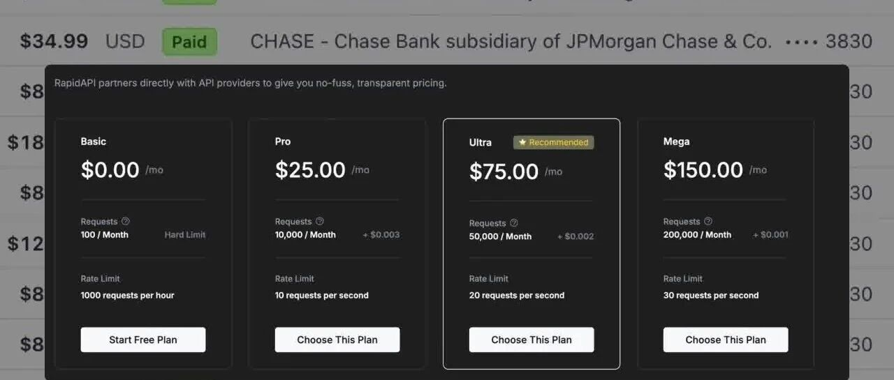
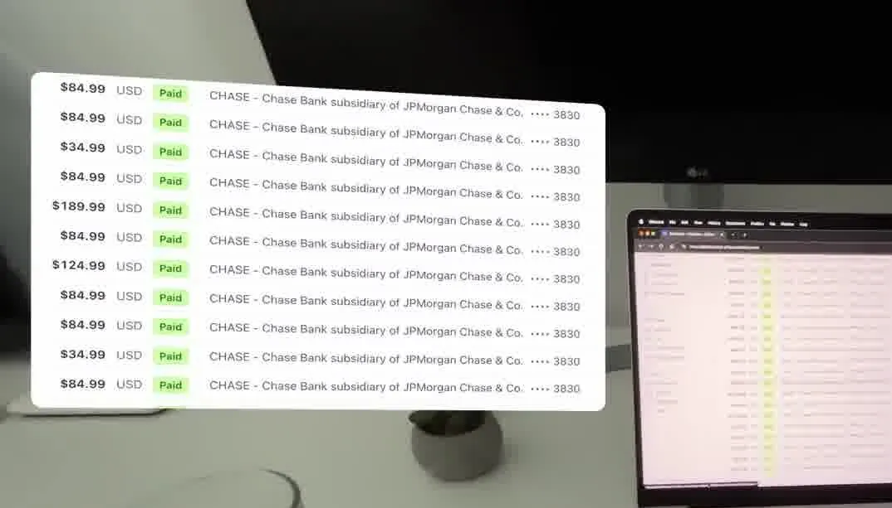
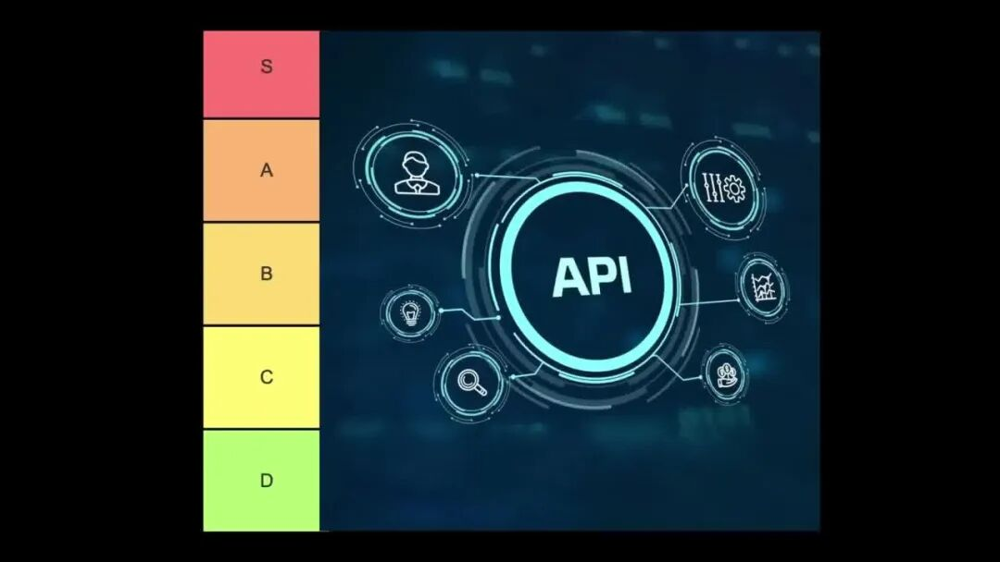
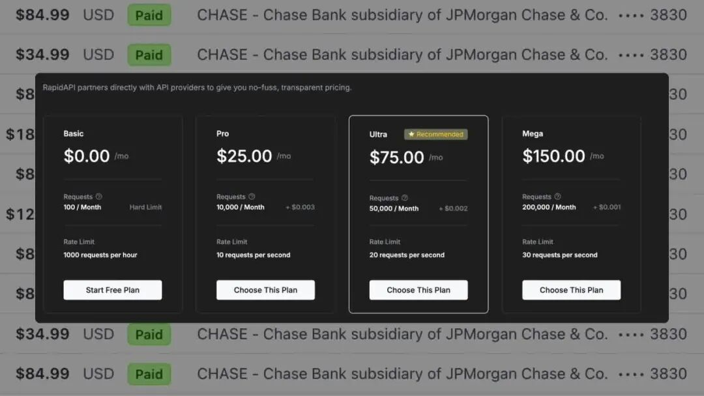
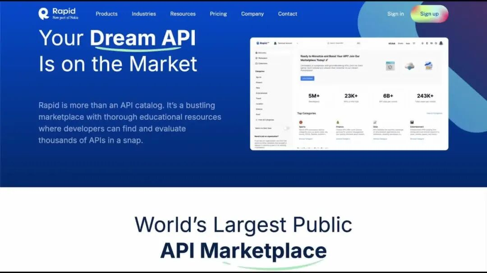
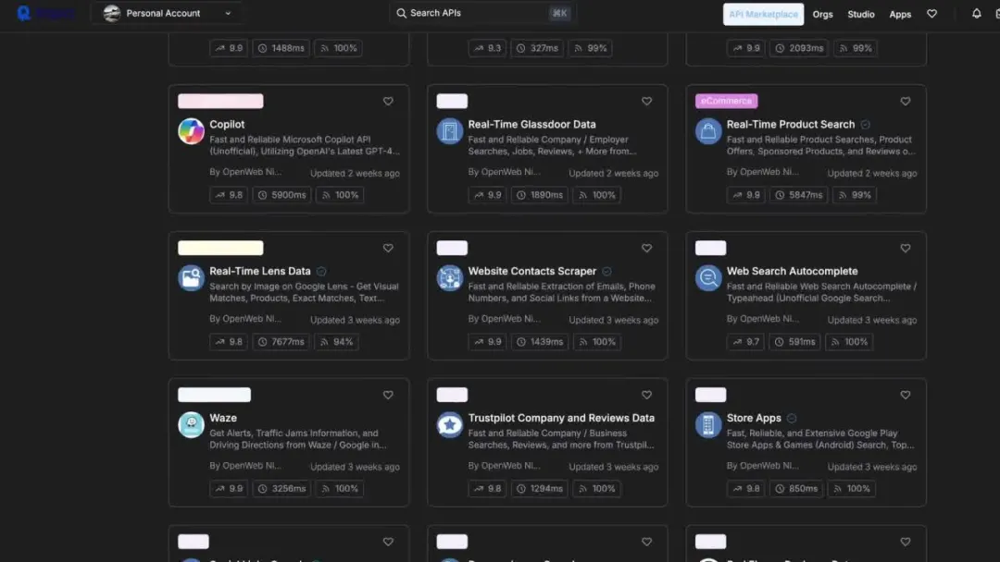

# 周末写的小项目，每月赚得比996工资还高，程序员的被动收入玩法！

5BASE 以网为生 *2026年2月25日 20:18*

程序员Andy习惯性点开Stripe后台，盯着上面的数字看了几秒才反应过来。那个他周末随手写的，现在基本不用管的小项目，每个月赚的钱居然比他正职朝九晚五的工资还高。

很多程序员觉得自己收入不错，过得挺好，说实话和其他行业比，他们的薪资确实不算低。但问题在于，程序员还是在用时间换钱，一天就24小时，能卖的时间本来就有上限。

更糟的是现在就业市场环境很差，招聘需求少，新人连面试机会都拿不到，裁员还在持续发生，就算他们有个稳定的工作，薪资涨幅也不如以前了。

Andy找到的答案就是把自己的收入和时间解绑。作为程序员其实也有一个优势和幸运，他们会做的东西可以无限放大，写一次代码，能让一百万个人用，不需要投资人，不需要雇员工，不用是什么商业天才。

现在能把编程技能变现的方式有很多，做手机应用、SaaS工具、浏览器插件都行，但是有一个模式不用花太多精力，就能让程序员拿到稳定的重复性收入：就是做API。

现在大多数应用都不是独立运行的，都需要数据，天气数据、体育比分、商品列表、股价、翻译服务等等。获取这些数据最快最简单的方式就是调用API，公司根本不想重复造轮子，如果已经有现成的API能提供他们需要的数据，他们绝对愿意花钱用，尤其是能帮他们省下更贵的开发时间的话。

程序员就可以做那个提供API的人，只要他们做的API能解决某个具体的实用问题，部署好之后，只要有人调用它，他们就能一直赚钱。Andy去年做了好几个这类API，有些只花了他几天时间就做完了，现在这些项目每个月能给他带来六千多美元的被动收入。

不用做营销，不用冷推销，Andy只是把它们上传到Rapid API这类平台，靠平台自带的流量就能卖出去，根本不用他操心。

很多人对这件事有误解，觉得得做个什么革命性的东西才行，完全不用。他见过的还有他自己做的持续获得高收入的API都很简单，只专心做好一件事，比如返回食物的卡路里信息，或者做货币转换，或者分析新闻标题。根本不用做多么有原创性的东西，有用就行。

Andy觉得这里的秘诀就是选一个有需求的细分领域，把接口做简洁，文档写得清晰易懂，就这么简单。

选一个正在上升期的好赛道，把API的接口设计对，设定一个既能让他们赚钱，对公司来说又划算的价格。这不只是写代码的事，他们得知道怎么把自己的产品摆到合适的位置，让别人愿意花钱买。

其实代码真正的力量，是他们不再把它只当成上班用的技能，而是把它当成一个杠杆工具，一台赚钱机器的时候才显现出来的。

他们不用一下子就全身心投入，也不用马上辞职，但是只要有一个做好了的API，就完全有可能改变他们的财务状况。周末抽几个小时做做看，说不定一个月之后，他们醒来就能看到Stripe的到账通知。程序员或者懂编程的都可以尝试一下。

P.s. 即使不是专业的程序员，普通人利用无代码平台其实也可以制作API的，我个人无编程经验也利用Coze平台制作过api插件，反正能达到自己的要求，没有上架出售。另外，还有一个方向就是利用现成的API制作工具网站，通过订阅或者广告变现，下篇文章再写。

作者提示: 个人观点，仅供参考

继续滑动看下一个

以网为生

向上滑动看下一个

以网为生