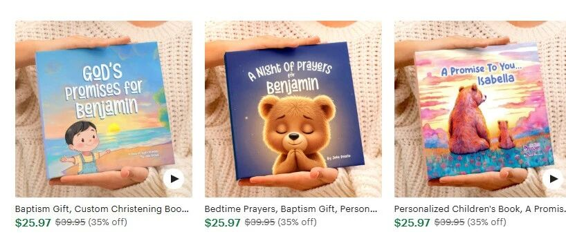
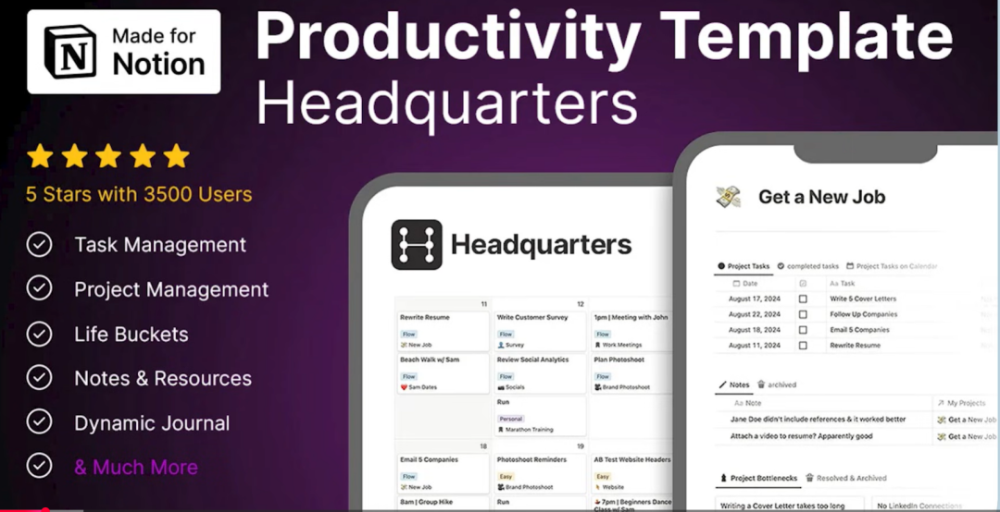
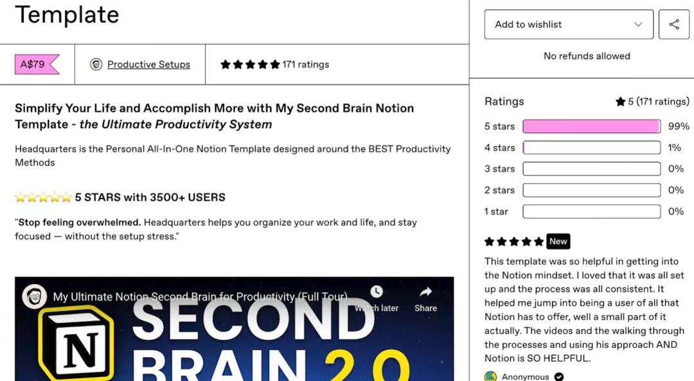
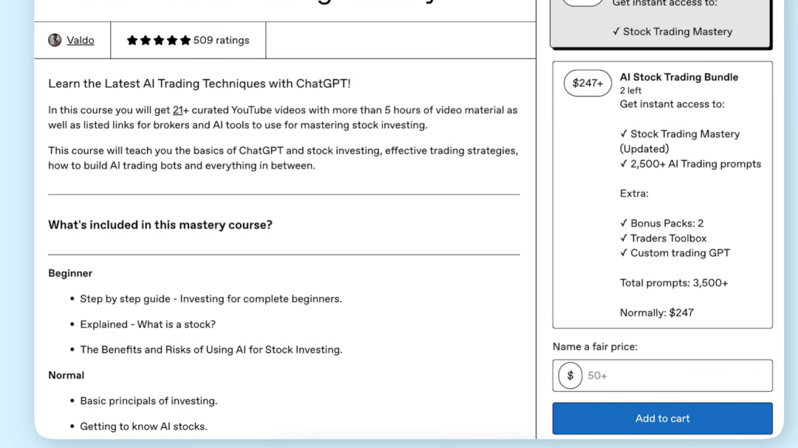
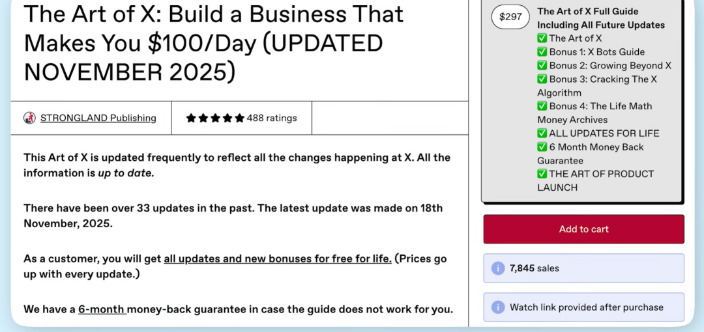
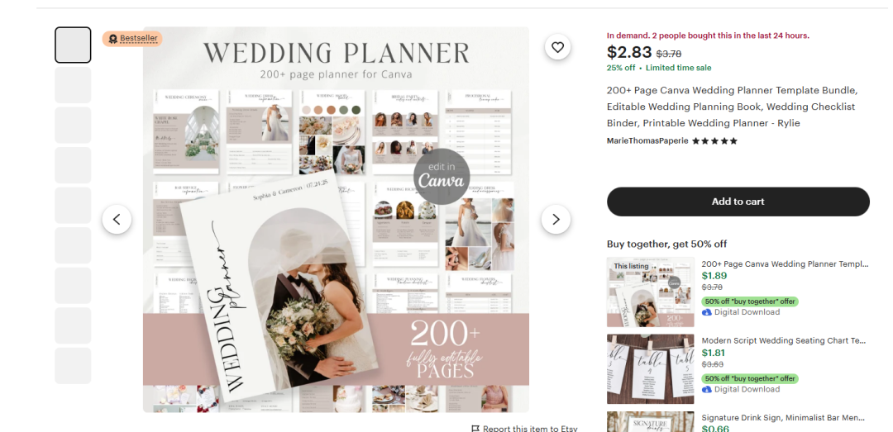
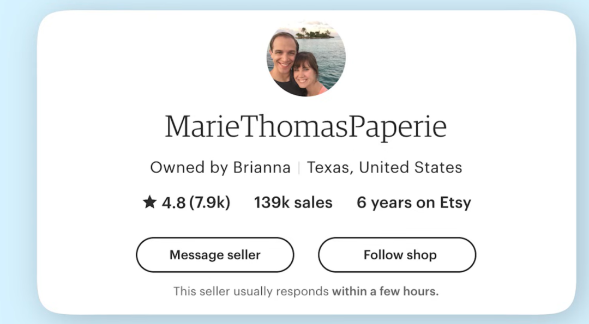
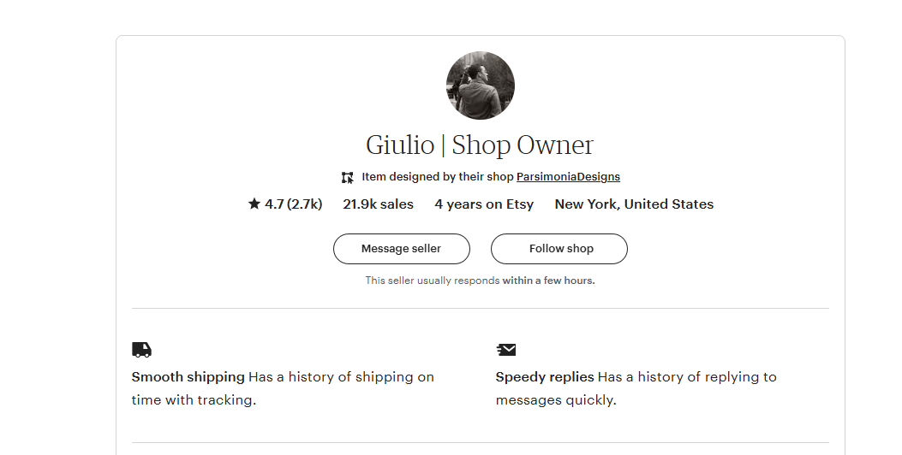
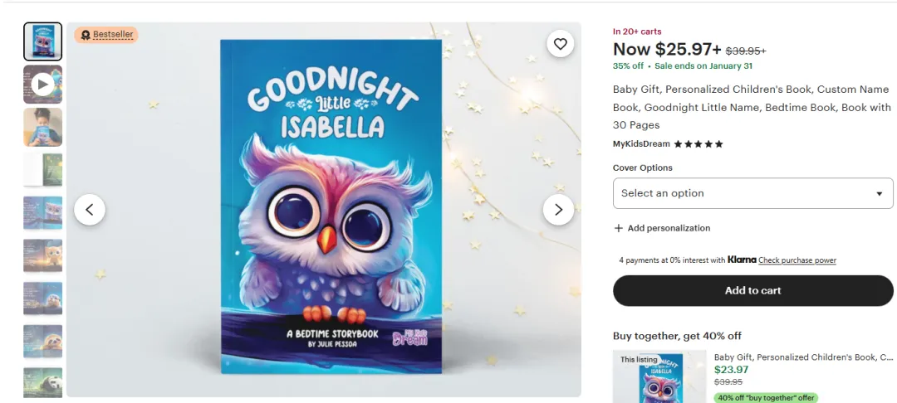
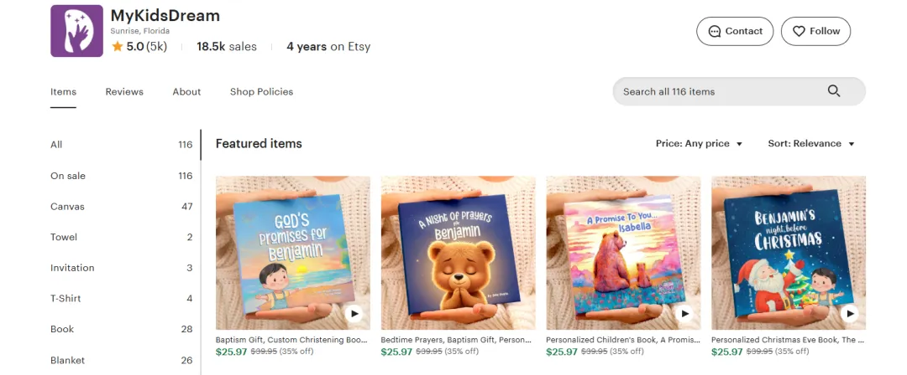

# 5种超赚钱的虚拟产品，你也能立即开卖！

原创 5BASE 以网为生 *2026年1月11日 10:00*

无需复杂的团队或高昂的成本，利用 Notion、AI 工具和 Canva，个人玩家也能创造出惊人的被动收入。本文为你拆解 5 种适合新手、已被验证具有百万级收益潜力的数字产品。

### 1\. Notion 效率模板

Notion完全免费，容易上手，能用它创建财务追踪器、系统模板等各种超酷的效率管理模板。有个叫productive setups的人创建了模板，有171条评价，售价79美元。有3500多个用户，算下来，仅这一个效率模板就赚了276500美元。

你能看到相关视频、评价、描述和截图等。还有个叫OS的人也卖很多Notion模板，有个“第二大脑6.0版本”，售价80美元，追加销售90美元，有178条评价说明大概有1000单销量，因为不是每个买家都会留评价。就算往少了说，按500单，每单80美元算，也有40000美元。这只是他50个模板中的一个，你想想他总共赚了多少。

### 2\. AI 提示词（Prompt）包

这个做起来特别容易，不需要特别技能。你完全可以用AI来创建AI提示包，这是最容易创作的产品之一，一天就能从0到有做出产品，还能当天开卖。有个叫Waldo的人，他的股票交易精通模板有509条评价，这也是个提示模板，售价50美元，追加销售247美元。他这款产品销售额算下来大概有366000美元，只这一个AI提示包就赚这么多。

看看他的个人主页，能发现他还有很多提示包，有的有500、900、200条评价，售价超700美元。还有落地包、SEO助推器等数字产品，都是提示包，销量超千次，有的产品售价700美元。把他所有产品销量加起来，仅靠AI创建AI提示包，销售额轻松突破100万美元。

### 3\. 极简迷你课程

第三种产品是迷你课程。你可能觉得做课程得有团队，还得有视频课程等，成本很高。其实没那么复杂，不用录制视频，也不用一对一辅导，直接把课程内容写出来就行。每个课程模块用卡片展示，再配上解释说明。这些完全可以用AI和ChatGPT自动完成，你不需要有相关经验。在Gumroad上有个叫Strong Land Publishing的人，他的课程有488条评价，售价297美元，销售额算下来有2329000美元。想想，一个迷你课程就能赚这么多，这就是数字产品的魅力和杠杆作用。

### 4\. Canva 设计模板

 

Canva是免费的开源工具，可以用来设计海报、横幅、婚礼请柬等。有个用Canva模板做的婚礼策划书，200页，涵盖婚礼规划、配色方案、服装选择、清单等所有和婚礼相关的内容，售价3美元。虽然单价低，但销量有139000笔，乘以3美元就是400000美元左右。

用Canva可探索的方向很多，不只是婚礼策划书。如果你玩Instagram，看到很多相关帖子或内容，也能做Instagram轮播或故事模板。有个包含800个Instagram帖子和故事的模板，你只需编辑文字就能发布，有互动故事模板、Canva博主模板、商业教练视频模板等。

这个模板原价15美元，现在七折，卖4.5美元，销量21000笔，收入大概84000美元。

### 5\. AI 儿童电子书

这是最容易创作、也很好玩的产品。有很多这类电子书，其实就是儿童故事书。有视频预览，能看到不同类型的电子书，像涂色页、虚构故事、儿歌、营养工作表，还有数学和科学的教育资源。你可以尽情发挥创意。所有图片都是AI生成的，故事也能让ChatGPT来写，用Gemini免费生成图片。有本《晚安，小伊莎贝拉》，打七折后卖27美元，是个故事书，五星好评，销量超18000笔，仅卖这一本简单的儿童故事电子书就收入486000美元。

你要是想做这类电子书，可以用Canva，免费又好用，还有儿童故事的内置模板，也能从Gemini的Nano Banana生成，再让ChatGPT写故事。利用AI做出产品，现在就开始卖。

以上就是我推荐的5种数字产品品类。你要是想要所有产品完整清单，可以给公众号发送关键词：数字产品，即可自动回复下载地址。

继续滑动看下一个

以网为生

向上滑动看下一个

以网为生
