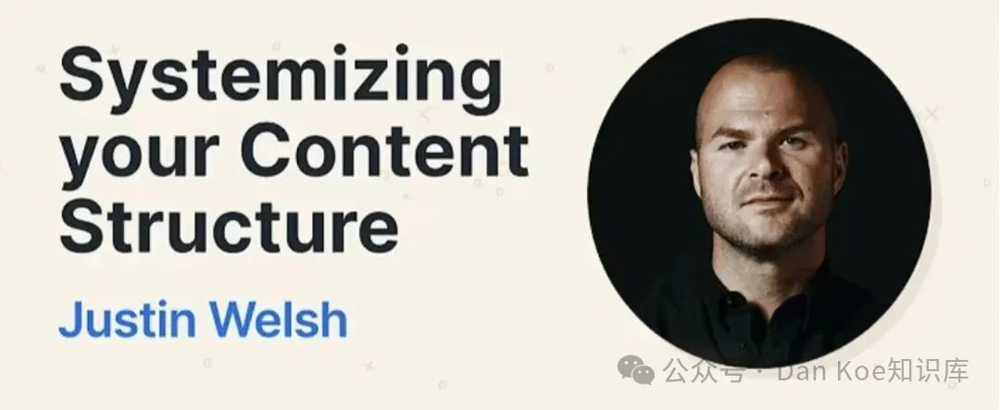
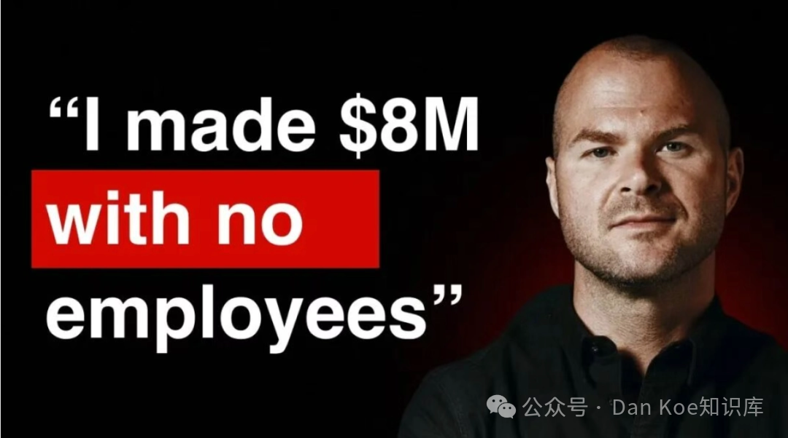
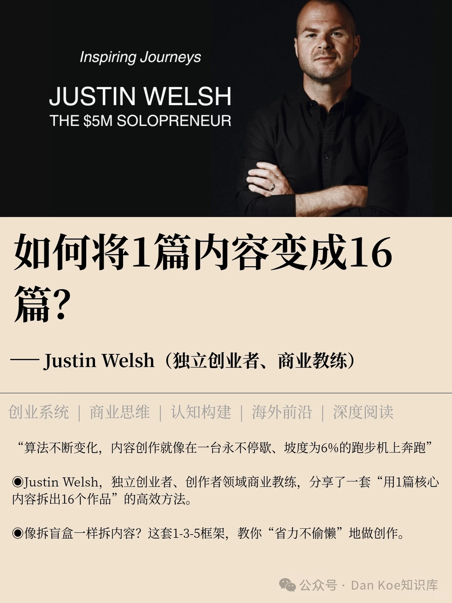

# 油管大神Justin Welsh：一人公司如何靠“内容系统”，实现每天工作2小时，年入170万美元

小遇 *2026年4月16日 10:03*

只靠内容创作，一个人创业能做到百万美元营收吗？

很多人会觉得这是天方夜谭 —— 要么需要团队支撑，要么得靠资本加持，单枪匹马做内容，撑死只能赚点零花钱。

但 Justin Welsh 用实际行动打破了这个认知：他每天只工作 5 小时，不融资、不扩张、不招一个员工， 6 年时间累计营收突破 1200 万美元， LinkedIn+X 双平台粉丝超 150 万，活成了 “ 一人公司 ” 的天花板。

如果你也想做超级个体（ OPC ），不想被职场内耗，不想为了赚钱透支自己，那 Justin Welsh 的玩法，你一定要吃透 —— 他没有什么天赋异禀，只是把商业思维搬进了内容创作，把 “ 靠灵感输出 ” 变成了 “ 拼乐高式 ” 的工业化生产，普通人照抄也能落地。

在此之前， Justin Welsh 是医疗 SaaS 公司的高管，手下管着 150 人的团队，风光无限。但长期的高压工作，让他在 2018 年突发重度惊恐发作，直接被送进了医院。

躺在病床上的那段时间，他终于想通了一个扎心的真相：在固定的组织结构里，无论你多努力，本质上都是在 “ 卖时间换钱 ” ，永远逃不过被消耗的命运。

出院后，他果断辞职，放弃了传统创业的老路，选择做一家 “ 极致精简 ” 的一人公司 —— 没有员工、没有复杂的运营流程，月运营成本不到 700 美元，所有精力都聚焦在 “ 内容 ” 上。

而他能实现营收翻倍、时间自由的核心，就在于一套被验证过的内容系统，这也是我花 1 个月拆解他的课程「 Content OS 」后，最核心的收获。

这套系统不止是简单的内容方法论，更是能直接复制的盈利模型，核心就两个模块，解决了创作者最头疼的 “ 写什么 ” 和 “ 怎么发 ” 的问题。

01 选题矩阵：告别灵感内耗，让爆款可复制

对创作者来说，最耗时、最内耗的环节，一定是选题。很多人花几个小时想选题，写出来的内容却无人问津；还有些人过度思考，纠结哪个选题更好，最后反而一事无成。

其实，内容能不能成为爆款， 70% 在选题阶段就已经注定了 —— 而 Justin Welsh 的做法，简单又粗暴，直接把选题做成了 “ 可查询、可迭代 ” 的矩阵模型。

这个选题矩阵（ The Matrix ）的逻辑很简单： X 轴是你最擅长的 3 个专业话题， Y 轴是 3 种固定的内容结构（个人故事、干货拆解、工具清单），两者结合，就能得到 9 个固定的选题方向，彻底告别 “ 无内容可写 ” 的焦虑。

Justin Welsh 自己选择的 3 个核心话题，分别是 SaaS 销售、 LinkedIn 增长和一人公司，精准聚焦垂直领域，不贪多、不杂乱。

更关键的是，这个矩阵不是固定不变的，而是可以持续迭代升级的 —— 他每周会固定花 1 小时搜集素材，翻同行的内容、看平台热门帖子、回顾自己数据最好的作品，把优质选题补充到矩阵里，让选题越来越精准。

这套矩阵的真正价值，从来不是 “ 省时间 ” ，而是让你每次创作都不用从零开始。就像踩在巨人的肩膀上，每次都能站在上一次的结果上往上走，用得越久，选题越准，爆款的概率就越高，慢慢就能达到自己原本难以企及的高度。

02 Hub & Spoke ：一鱼多吃，实现内容效率最大化

做 IP 的另一个大坑，就是很多人执着于 “ 质量大于数量 ” ，尤其是新人，总想着 “ 写一篇火一篇 ” ，花几天时间打磨一篇内容，发出去后没流量就彻底泄气。

但 Justin Welsh 是个商业化思维刻在骨子里的人，这种无法产生复利、效率极低的事情，他坚决不做。

他的核心逻辑是：极致效率 + 复利效应，写 1 篇内容，拆成 6~15 条分发，实现 “ 一鱼多吃 ” ，这就是他的 Hub & Spoke （中心与轮辐）模型。

其中， Hub （核心母本）是每周写 1 篇深度长文，这是内容的核心价值所在 —— 粉丝关注你，本质上是奔着你的 “ 高价值 ” 来的，如果你长期只输出平均水平的内容，甚至用 AI 敷衍了事，迟早会失去粉丝的信任。而 Spoke （切片分发），就是把这篇长文拆成多种风格，适配不同平台的传播逻辑，实现曝光最大化。

具体拆解可以分为 6 个维度，简单好操作：

故事版：分享自己的亲身经历，比如当初如何摆脱选题焦虑，引发情绪共鸣；

观察版：提炼用户的核心痛点，拆解痛点背后的原因，戳中用户需求；

连载版：拆成 280 字符的短帖，适合 Threads 等平台，引导用户追更；

反常识版：分享行业内的反直觉洞察，体现专业度，吸引精准粉丝；

对比版：对比自己 3 年前和现在的变化，传递成长感，增强说服力；

清单版：总结 5 个可直接落地的方法，降低用户行动门槛，提升收藏转发率。

很多人都知道，长文输出耗时耗力，而短内容又缺乏价值感， Hub & Spoke 模型刚好解决了这个矛盾，实现了 “ 价值与效率 ” 的平衡 —— 这也是我对比了国内外众多内容方法后，最终选择复刻这套系统的核心原因。

03 比 “ 知道 ” 更重要的，是 “ 做到 ”

看到这里，很多人可能会觉得： “ 这套系统我懂了，只要照着做，就能赚钱了。 ” 其实我当初也是这么想的，但实际操作后才发现，差距很大 ——“ 知道 ” 和 “ 做到 ” 之间，隔着一道无法逾越的鸿沟。

普通创作者和赚钱的超级个体，最大的区别不在于 “ 会不会做内容 ” ，而在于思维：普通创作者只追爆款、贪流量，而商业思维的核心，是追求 “ 确定性＞稳定性＞爆发性 ” 。

这也是为什么很多人内容做得不错，却始终赚不到钱，最后只能无奈回归职场 —— 他们只看到了表面的流量，却忽略了底层的商业逻辑。

那么，普通人如何真正跑通这套内容系统，不用每天耗在创作上，也能稳定产出高质量内容？

我用 AI 找到了答案 —— 下一篇，我会完整拆解我是如何用 AI 复刻这套 Content OS 系统，实现每天 30 分钟稳定产出高质量内容，轻松兼顾效率与价值的。敬请期待下篇！

其实做内容这件事，表面上比的是谁写得好，底层上比的是谁的系统更稳。你不需要成为下一个 Justin Welsh ，你只需要拥有一套适合自己的内容系统，再用 AI 帮你落地执行，就能摆脱内耗，实现时间自由和财富自由。

目前，我正在搭建一个免费社群，专门交流「 AI 系统 × 个人 IP 」，里面会定期分享最新玩法、系统迭代过程，还有一群同频的超级个体一起交流成长，感兴趣的可以关注，一起解锁内容赚钱的新路径。

继续滑动看下一个

Dan Koe知识库

向上滑动看下一个
