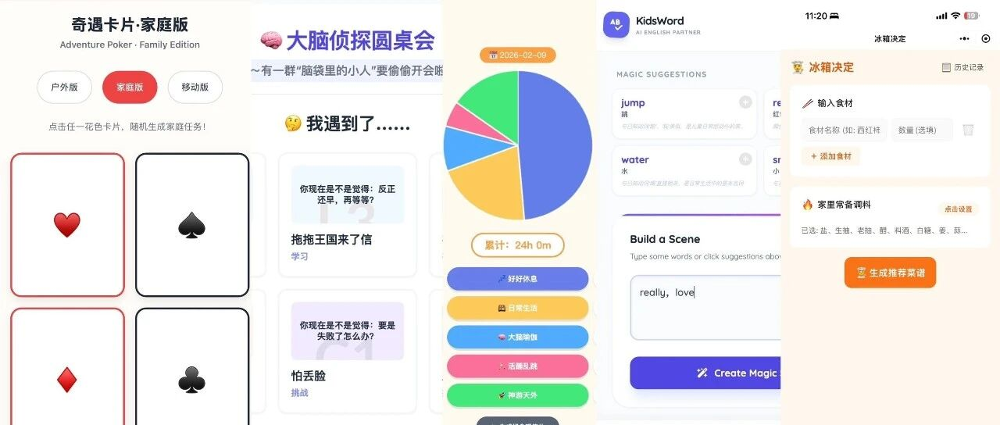
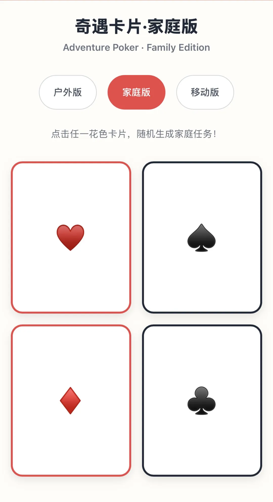
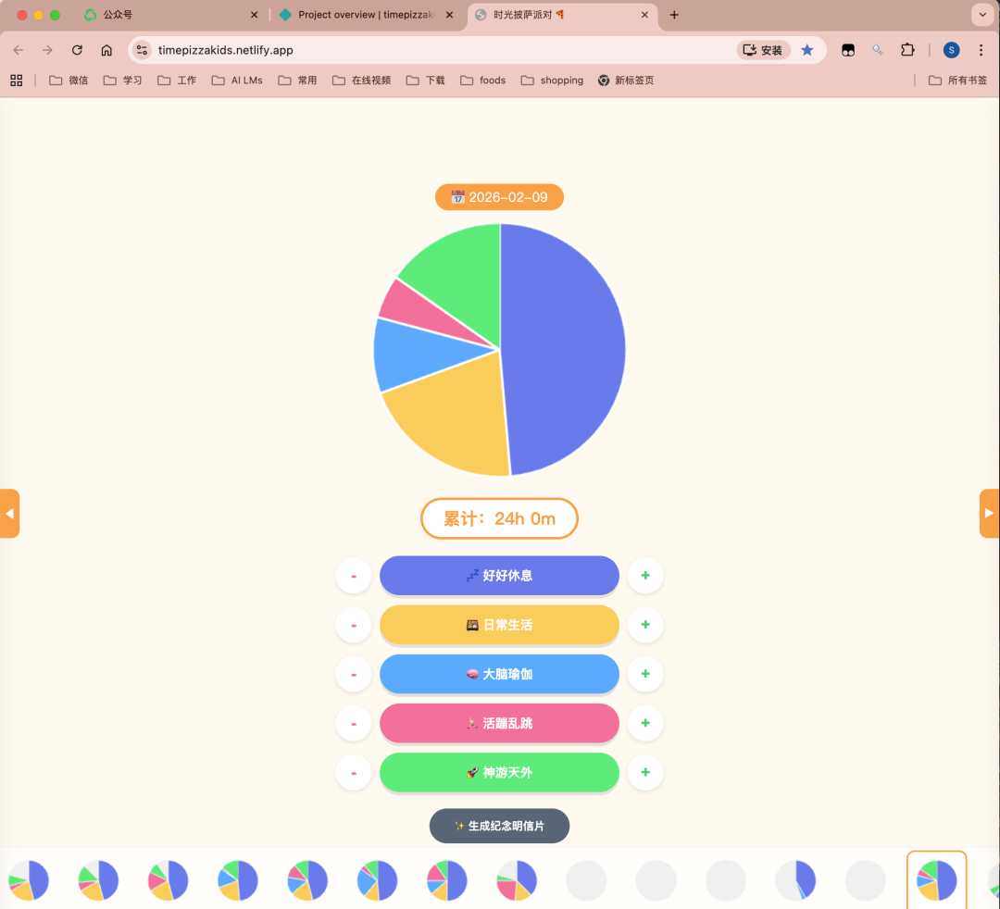
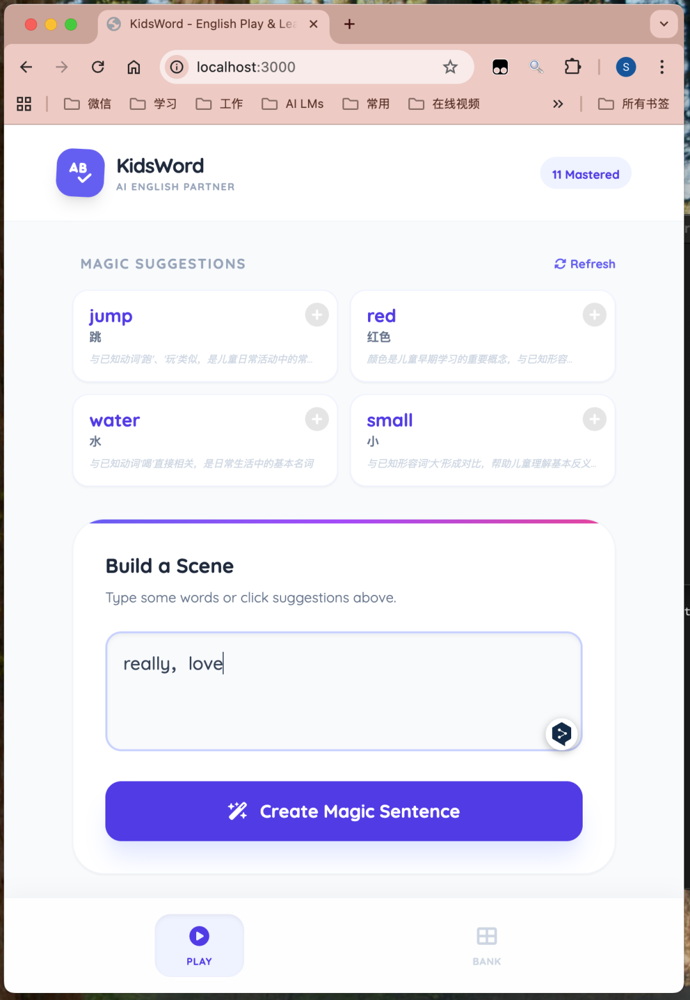
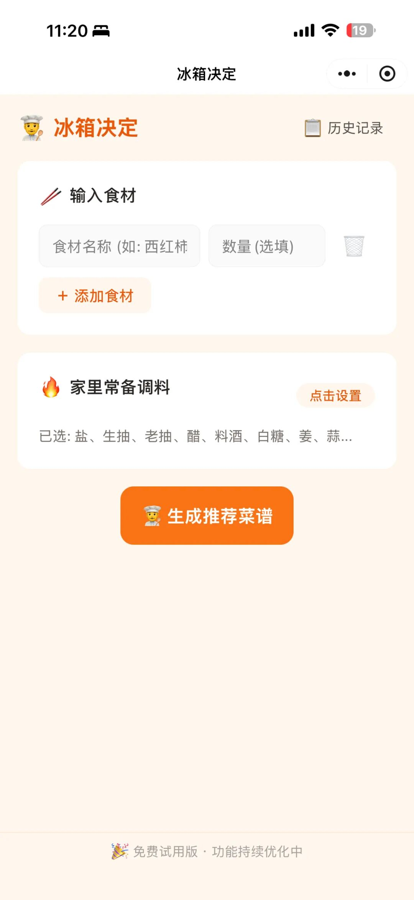
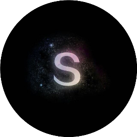

# 我，不懂代码，全职妈妈，却做出了5个App。

原创 s顏竹 颜竹的植物园 *2026年4月15日 12:01*

我之前一直认为：一个全职妈妈的成长，是需要慢慢回到“现实世界”。

重新工作、重新学习、重新证明自己。

但后来我发现，也许不完全是这样。

那天，我突然问AI一句：“这个东西，适合做成App吗？我没有任何代码背景。甚至连App怎么做出来”的基本逻辑都不懂。”

AI回答我：可以。

就是这一个“可以”，我走进了我从来没想过要走进的世界。

我开始做第一版。

不用学编程，也没有漫长的准备，直接把我的想法输入给AI，我打的是中文汉字，看着它啪嗒啪嗒生成的，却是一行一行代码，然后它自己搭结构、做页面、理逻辑。（这是它说的，因为我根本不知道它写代码的顺序和逻辑是什么，完全不知道它在干嘛，我只是坐在电脑前等结果。）

我负责想，它负责实现。

慢慢地，我完成了第一个App。

然后第二个。

第三个。

第四个。

第五个。

后来我才发现，做了几个App不是重点，重点是：我做的，不仅仅是App。我在用App表达，我的思考、我对世界的理解、我对世界的期待。

我从来都不是一个擅长使用文字的人，但在这条路上，我找到了更“我”的表达方式。

这，是属于我的产品逻辑。

我也开始学会逆向理解自己的思维：一个想法出现 → 怎么拆解 → 如何表达 → 变成什么样的工具（我的能力可以做出来的地步）

这种能力，不是学来的，是做出来的。

我才意识到一件事：虽然我没有学习技术，但我一直在学习——重新认识自己。

在这个过程中，有很多让我意外的变化：

我没有因为我不专业就退缩。

也没有因为我不懂就停下来。

更没有因为“我只是一个妈妈”就觉得自己不用做。

我只是一次次地问：“我的想法，实现了吗？”然后继续往前走。

我开始理解所谓的 self-growth，不是简单的“我要变得更好”。而是我可以不被“我是谁”限制，我开始创造属于自己的语言。全职妈妈也好，没有技术背景也好，不懂代码也好——这些是标签，还是边界？对我来说，它们只是背景。

回头看，这一切的起点其实很简单：不是技术，不是计划，也不是职业转型，更不是对自己的任何期待，不是任何雄心壮志。

只是一个念头：“我能不能试着把这个想法做出来？”

以及一个回答：“可以。”

有时候，人生的新路，不是规划出来的，是一个“可以”打开的。我还能做几个App，做成什么样子，谁知道呢？

 喜欢作者

继续滑动看下一个

颜竹的植物园

向上滑动看下一个

颜竹的植物园
