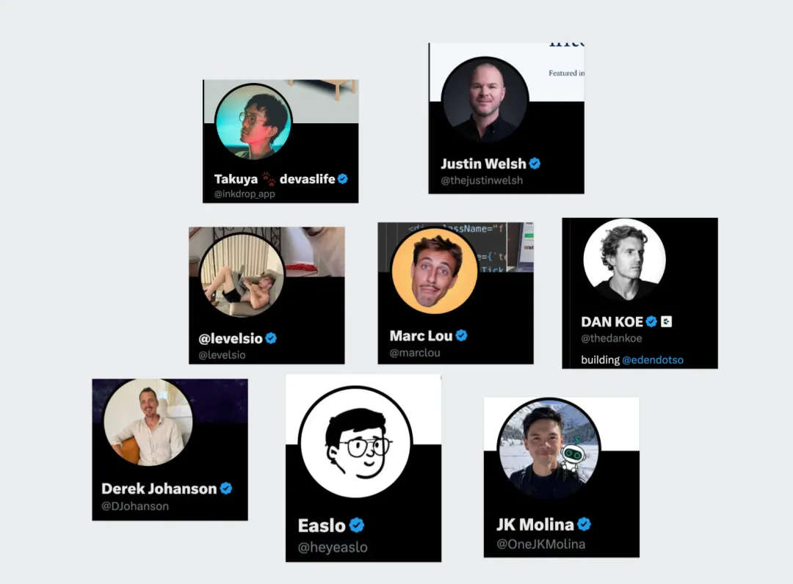
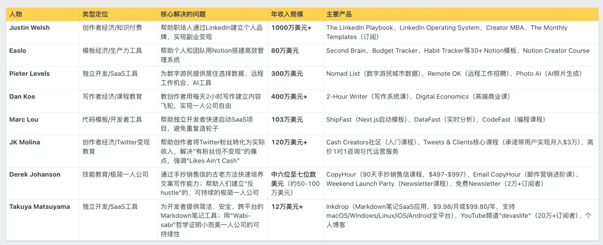
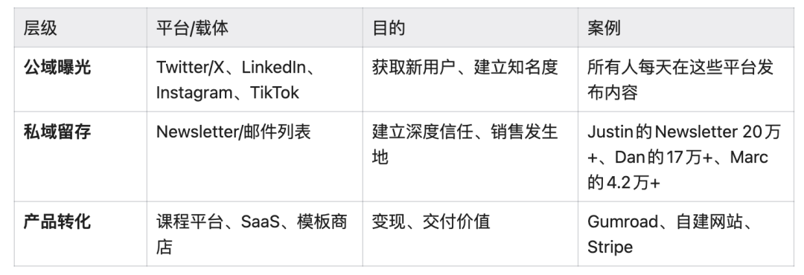
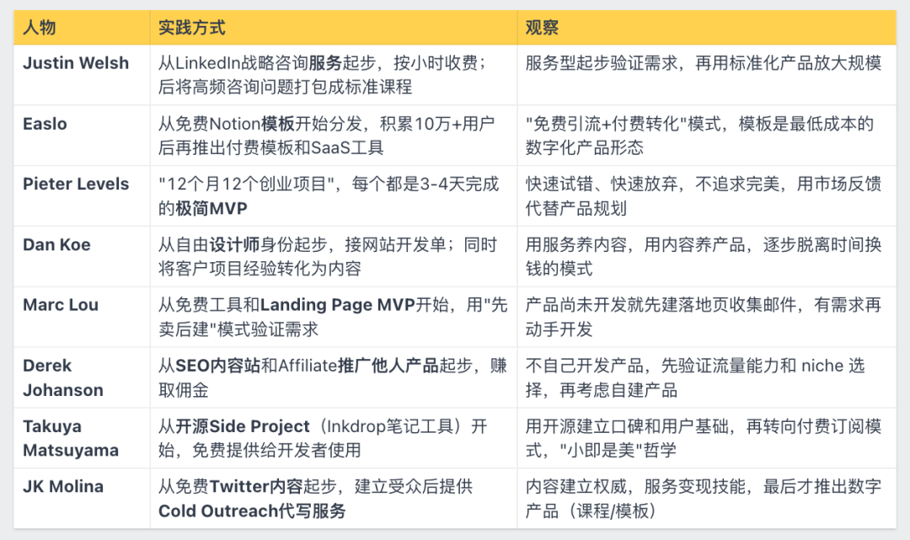
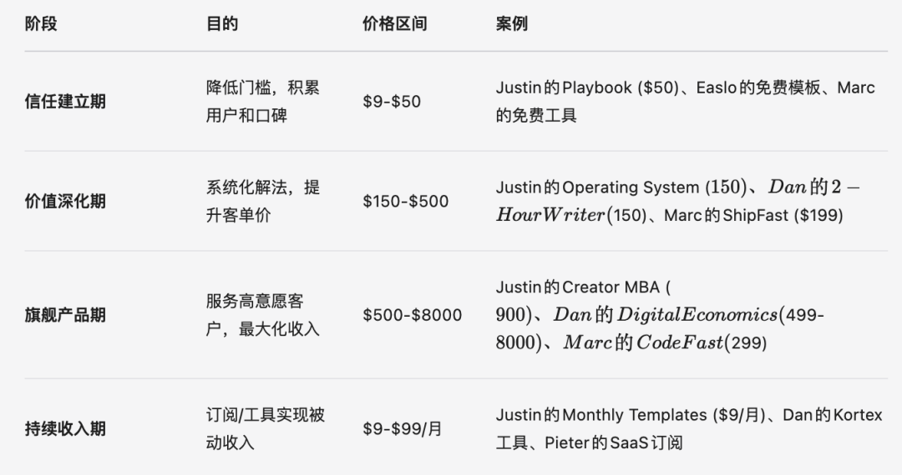
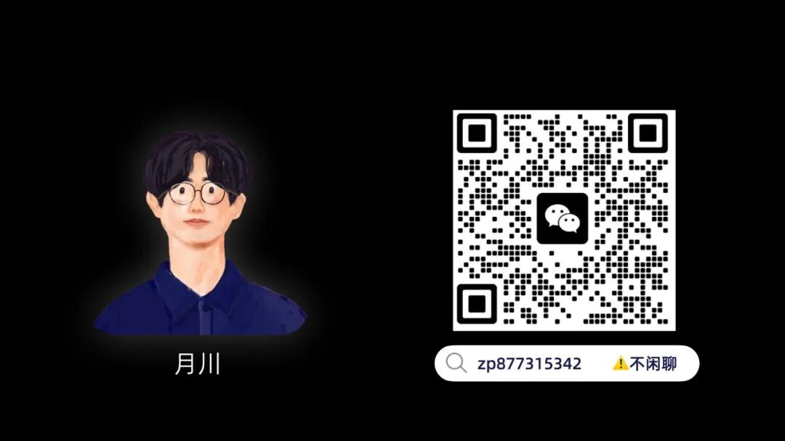

# 深入研究8位顶尖的一人公司案例后，我发现了指引走向个体自由的共通点

原创 月川 *2026年2月28日 22:59*

让我先快速对他们的情况做一个梳理概览：

名字、定位、核心解决的问题、年收入规模、以及主要产品是什么。

他们其中包括知识付费，独立开发者等。

\*排名不分先后顺序

如果你愿意可以直接在X上搜索他们的名字，来快速找到他们的社交账号，进一步深入认识他们。

之所以深入研究他们，不仅是他们在一人公司道路上取得的成绩，更重要的是他们大都很慷慨的分享他们自身的经历，供后来者学习。

此外，虽然商业的底层都有相通之处，但是在自己实践当中又发现不能完全照搬传统的商业逻辑，

而是要进行因地制宜，

深入分析这些人，就能发现一人公司的一些共通的商业逻辑。

我发现，市场才是最好的老师，在市场里摸爬滚打的前辈就是最好的模仿对象。

而且我发现，全球顶尖的一人公司之间都有这样那样互惠互利的情况存在，

这也是我认为未来的一大趋势，个人极简的情况下保持与不同的人弱链接关系，形成一个有机的互惠互利网络。

构成一人公司闭环的核心，我认为只有两块：产品、销售。

构建产品，然后销售出去，在这之上，需要管理个人心力状态、做事的节奏、准则等等。

稻盛和夫在活法里分享到：心想事成”是宇宙的法则。

而一人公司的本质我认为就是自我的修行，解决了自己的问题，外部自然而然就会取得逐步增长的结果。

这在他们身上都有强烈的体现，我会在后面进行分享，首先，我从销售（流量获客）、产品构建开始，

在流量获客方面的共通经验：

这一部分放在第一，是因为作为一人公司应该尽早开始在社交媒体上构建自己的声音，

产品的构建核心是要基于需求，而需求只能从用户中来，而发声，是捕捉潜在用户的关键，

Justin Welsh分享说我先开始发出“噪音”，感受市场给我的反馈，在“噪音”里面寻找信号，然后基于信号深入挖掘下去，也是同样的点。

1\. 公开构建（building in public)，建立长期价值资产：信任

Pieter Levels、Marc Lou、Justin Welsh都采用了这一策略：

\- 分享收入数据

\- 分享失败经历

\- 分享开发过程

\- 分享决策逻辑

本质上都是在做一件事：建立信任。

没有信任，就没有销售。信任的建立需要持续、真实、有价值的内容输出。

他们基本都构建起了相似的流量漏斗：

公域引流 → 私域留存 → 产品转化

Newsletter/邮件列表的私域平台可以理解为微信公众号、微信好友/朋友圈。

2\. 在持续输出之下，是内容创作系统的支撑

所有人都建立了高效的内容生产系统：

Justin Welsh：Newsletter（大致对比为微信文章） → 拆分为16篇社交内容

Dan Koe：每天2小时写作 → 一篇Newsletter → 转化为视频、播客、推文、Instagram帖子

Pieter Levels：Build in Public → 分享开发过程、收入数据、失败经历

Marc Lou：Twitter threads（一个主题多篇帖子） + YouTube视频 + Newsletter互相引流

Easlo：Twitter生产力内容 + Instagram视觉内容 + TikTok短视频

不把内容创作当成"每次从零开始"。建立系统，让一次深度创作能支撑一周甚至更长时间的多平台分发。

3\. 长期主义是唯一的捷径

Justin Welsh：6年创作5000+篇内容

Dan Koe：从2019年到2024年，5年时间

Pieter Levels：10年时间建立Twitter受众

Marc Lou：20多个失败产品后才成功

没有一夜成名，只有长期积累。

在构建个人产品方面的共通经验：

1\. 核心原则：解决你正在为自己解决的问题

这是几个人共同遵循的第一性原理：

Justin Welsh：发现自己在LinkedIn上的方法有效，于是教别人

Easlo：自己用Notion管理知识，于是做成模板卖给别人

Pieter Levels：自己是数字游民，于是做了Nomad List解决找居住地的问题

Dan Koe：自己每天2小时写作很高效，于是教别人这套系统

Marc Lou：自己每次开发项目都重复搭建基础设施，于是做成ShipFast模板

Derek：自己想要学习优秀的销售文案，于是手抄，然后教别人

Takuya：找不到满意的Markdown工具于是自己做，然后卖出去

JK Molina：收入太低需要变现于是自己先做到月入3万，然后教别人。

价值点：当你开始重视发生在自己身上的问题时，你天然知道痛点在哪、什么功能真正重要、什么可以砍掉。这避免了"假想需求"的陷阱。

我在这篇的自我总结里，也共鸣了这个点：

> 但是，到底要更新什么内容呢？
>
>
>
> 从解决自己的问题开始更新，
>
>
>
> 因为将我所遇到的问题，后面乘以1000个人，都会遇到同样的问题，
>
>
>
> 这个数字不夸张，甚至小了，
>
>
>
> 所以，我开始基于斯坦福人生设计理论对我的帮助，来进行内容创作。
>
> 月川，公众号：月川Moonstream [靠AI+自媒体变现，我对纳瓦尔理念的实践与反思](https://mp.weixin.qq.com/s/ickmxe0cqaCo0ihsYX5VbQ)

### 2\. 产品演进路径，从简单开始：低价入门 → 高价旗舰 → 订阅/工具

基本上他们都是从"非产品"形态起步

咨询、设计服务、内容、免费模板、开源项目，只有Marc Lou是直接从产品思维出发，但用的也是极简MVP。

"先验证，后规模化"是共识

没有人一开始就投入大量资源开发复杂产品，都是用最小成本验证需求真实存在。

服务→内容→产品的进化路径

Justin Welsh、Dan Koe、Marc Lou等人都经历了"先服务后产品"的阶段：

先通过咨询/自由职业了解客户真实痛点

发现重复性问题后，将其标准化为产品

用产品服务更多人，摆脱时间束缚

所有人都遵循了相似的阶梯式产品策略：

3\. 最小可行性方案思维（MVP）的体现

不把时间浪费在"完美产品"上。快速发布、快速失败、快速学习。市场反馈比自己的假设更重要。

Justin Welsh：咨询服务起步，将重复回答录制成课，用可复用知识封装替代时间售卖

Easlo：免费模板探测需求，验证市场后再推付费产品，模板即最低成本MVP

Pieter Levels：3-4天做粗糙原型扔市场，12个月12个项目，反馈比完美更重要

Dan Koe：推文测试想法，高互动内容才打包成课，单条帖子就是MVP

Marc Lou：先建落地页收邮箱预售，有付费意向再开发，营销即验证

Derek Johanson：先推广他人产品测流量能力，验证 niche 后才考虑自建产品

Takuya Matsuyama：开源核心功能建立社区，用GitHub反馈迭代，再推付费增值

JK Molina：免费内容建立权威，验证受众需求后，才推出服务和数字产品

4\. 围绕核心用户群的生态化

成功的人都不止做一个产品，而是围绕同一批用户做产品矩阵，

也就是先解决他们的第一个问题，接着用户会告诉他们更多的问题，进而进一步提供解决方案，不断围绕着同一批用户做深做透。

获取一个新客户的成本远高于让老客户复购。一旦建立了信任，围绕同一批人的相邻需求持续推出产品，是可持续的增长方式。

Justin Welsh：围绕LinkedIn销售人群，从免费内容到高价社群，用户从学习者变贡献者

Easlo：效率工具爱好者生态，从模板到SaaS再到创作者平台，产品变平台

Pieter Levels：数字游民生活方式基建，多子产品覆盖工作、住宿、社交全场景

Dan Koe：创作者变现全链路，从内容技巧到商业模式，陪伴用户从新手到高阶

Marc Lou：独立开发者文化社群，工具+公开创业数据，共建创业生活方式

Derek Johanson：SEO创业者生态，免费教程到Affiliate再到自有产品，完整变现链路

Takuya Matsuyama：开发者知识管理生态，开源社区打底，商业版服务团队，双层结构

JK Molina：B2B销售专业网络，内容建立权威，服务解决问题，社群沉淀人脉

他们反映出的一人公司理念：

读到此，我相信你也能感受到他们在做事上的一些共通性，我觉得有几下几点很值得学习，

动机：向内求与时间主权

一人公司的终极目标不是无休止做大，而是夺回时间控制权。

痛点即资产： 放弃外部调研，只解决自己的真实需求，顺便把解决方案卖给别人。

反内卷： 搞钱是为了自由。

明确自己想要的形态：是靠工具躺赚的“系统化”，还是赚够就歇的“极简主义”，亦或是拒绝扩张的“小而美”。

增长：建立系统，拒绝线性努力

赚钱效率取决于杠杆率，个人体力有上限，系统没有。

系统 > 努力： 停止重复造轮子，把精力花在搭建自动运转的业务流上。

内容复利： 抛弃“每次从零创作”。将内容进行拆解、分发，让昨天的产出在明天继续获客。

速度 > 完美： 把产品当测试。别闭门造车，用最简原型快速上线，用真实市场数据指导迭代。

销售：信任是唯一的货币

信息过载时代，最高级的销售就是“不销售”。

透明即护城河： 放弃过度包装。通过“公开构建（Build in Public）”分享过程与失败，去建立最真实的人与人链接。

变现：阶梯交付与价格筛选

不要指望用单一产品吃透所有人。

设计价值阶梯： 构建“免费引流 → 低价破冰 → 核心系统 → 深度服务”的产品漏斗，顺着信任深度持续变现。

涨价即防御： 涨价不仅为利润，更是为了过滤低意愿、高消耗的边缘客户，只服务核心受众。

心态：通透的长期主义

Justin 6年创作5000+篇内容，Dan5年积累，Pieter10年建受众

失败的概念变为“数据”概念： 没有真正的失败，每一次碰壁只是在排除错误选项，在增加成长数据。

我们要以年为单位去考虑自己在一人公司道路上的探索，只要动机是自己想要的，那只管坚持。

---

我的故事：

---

你好，我是月川，很高兴认识你。

在AI时代，我决定做一家一人公司，一人公司由几块组成：

1\. 个人产品化系统

2\. 销售系统

3\. 个人公司化运营系统

在这里我会分享个人商业化、生活与成长的相关内容。

前行道路，与有缘人共勉。

继续滑动看下一个

月川Moonstream

向上滑动看下一个
