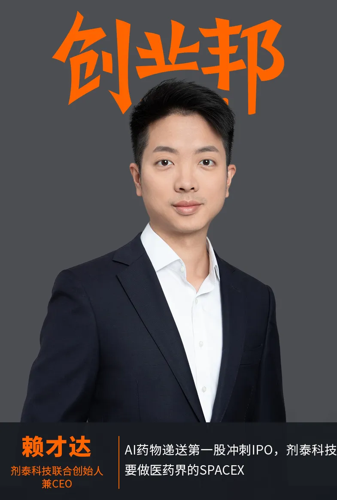
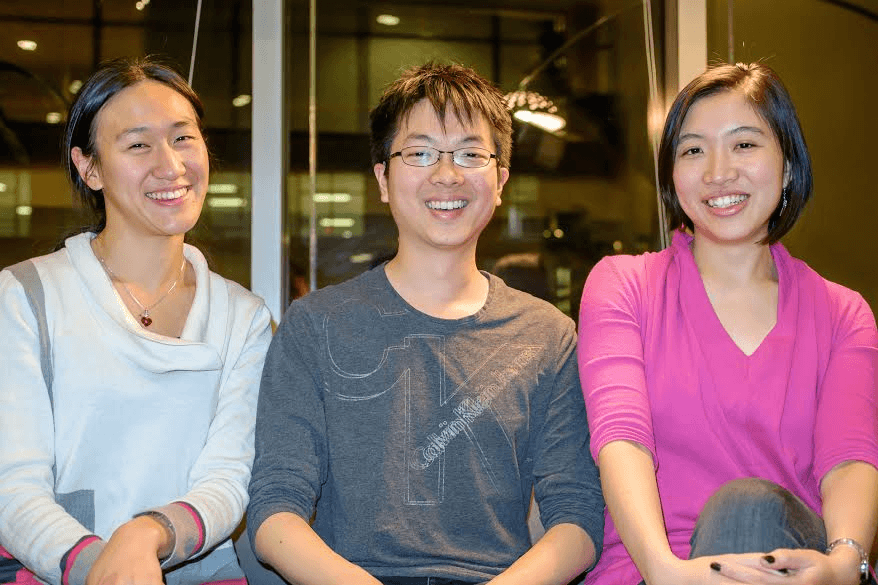
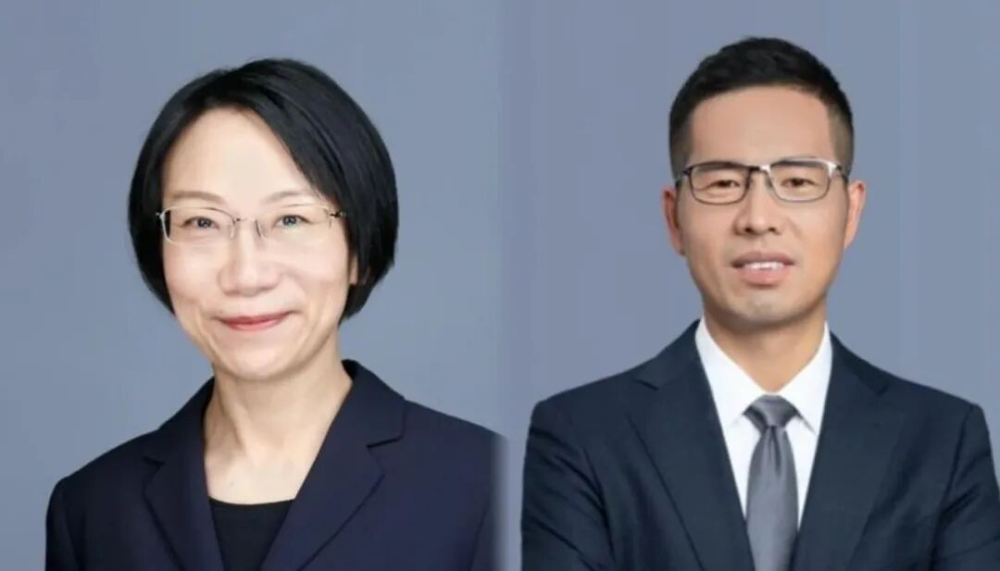
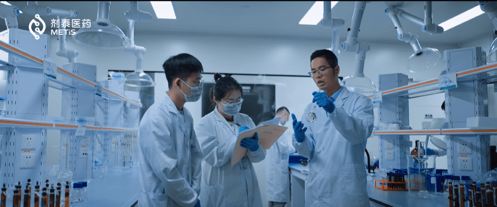
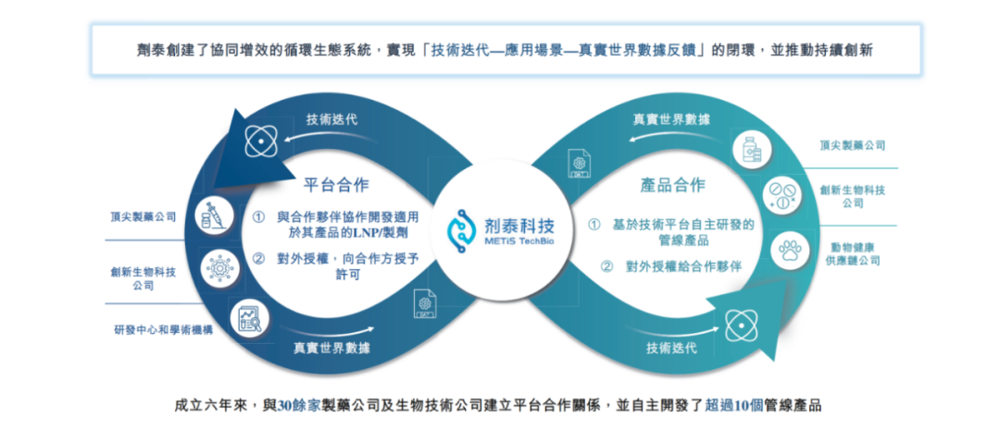
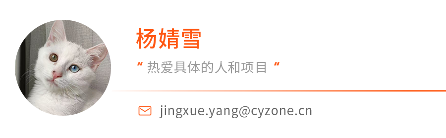
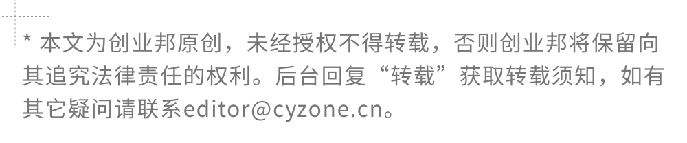

# AI药物递送第一股冲刺IPO，剂泰科技要做医药界的SpaceX

原创 杨婧雪 *2026年4月20日 11:28*

 

「IPO全观察」栏目聚焦首次公开募股公司，报道企业家创业经历与成功故事，剖析公司商业模式和经营业绩，并揭秘VC、CVC等各方资本力量对公司的投资加持。

作者丨杨婧雪

编辑丨刘恒涛

头图丨剂泰科技

4月19日晚，AI药物递送第一股剂泰科技在披露易发布聆讯后招股书，即将以18C特专科技公司上市。

资料显示，剂泰科技成立于2020年，仅用6年时间就推进港股上市，无论在国内还是国际，这都是“超速度”。这一切，除了公司准确、清晰的战略之外，还基于AI的迅速发展，剂泰科技基本没有走弯路。

剂泰科技拥有全球首个AI纳米递送平台NanoForge，依托超1000万种多元结构脂质库，可实现8大器官或组织的靶向递送，将开发靶向LNP或小分子剂型的平均时间缩短至2-3个月，覆盖材料设计、制剂组装、序列优化、体内靶向递送等端到端的环节。

不久前，剂泰科技研发出国内首款由AI赋能完成临床三期的制剂创新药物MTS-004，有望填补国内PBA（假性延髓情绪失控，俗称“强哭强笑”）药物空白，并在临床试验中对患者吞咽困难实现明确改善，未来在渐冻症、阿尔茨海默症、帕金森症等疾病导致的吞咽困难问题具有潜在的应用前景。这款产品从立项到三期成功只用了38个月。

行业数据显示，2025 年，中国创新药出海授权规模已突破1356亿美元，同比大增超1.6倍，占全球近半份额，首次超越美国成为全球第一。而正是大分子创新药撑起了这个史诗级爆发的台柱子。

“中国大分子出海的市场带来的产值，已经和电动车出海旗鼓相当。”剂泰科技联合创始人兼CEO赖才达说，剂泰科技做的，就是大分子药物的递送，类似建设一座微观世界的AI纳米火箭工厂。

剂泰科技要做制药界的SpaceX。

钻透医药行业链路

锁定AI+药物递送

赖才达是台湾人，本科毕业于台湾大学化工系，凭借国际科展金牌头奖，他进入麻省理工学院硕博连读。

当时MIT创业氛围很浓，赖才达在上学期间就开始第一次创业尝试，在联合创办的净水科技公司AquaFresco担任CTO，用结晶的技术做节水，能将生活用水节省90%，这在当时是很大的技术突破。但赖才达发现，在美国水实在不值钱，市场的支付意愿很弱。

当时的AquaFresco创始团队（中为赖才达）

这是在2013年前后，在硅谷，赖才达认识了“丰叔”——后来创办峰瑞资本的李丰，一同认识的，还有后来峰瑞资本的合伙人马睿。李丰没看上这个项目，但却看上了这个人。

“他说我相信你这个人，但是你一定要选一个TAM（Total Addressable Market，指总体市场规模）大于10亿美金的项目，不管你做什么东西，只要TAM超过10亿美金，我就盲投。”赖才达说，对方这个承诺，最终让后来成立的峰瑞资本领投了剂泰科技天使轮投资。

“那个时候我就发现，不是说你的产品做好了、技术做好了，一个企业就成了。”赖才达说，他在晶泰科技短暂待了一段时间，决心再次出来创业。

在创业之前，赖才达意识到自己要补一补商业的功课，但是又不想去读MBA，他决定加入麦肯锡。

在麦肯锡波士顿办公室一位合伙人的终面上，赖才达讲了自己之前做的节水项目，也提到了未来准备做AI制药，坦诚自己不会待太久，一定会出来创业。赖才达讲完，这位合伙人给他倒了一杯威士忌，说我一定让你进来，因为你会是改变行业的人之一，将来会是麦肯锡的客户。

在麦肯锡，赖才达接受了系统性的商业训练，学会财务规划、模型搭建、以及核心的战略思考与问题拆解，也借此机会深度接触了大型药企对AI制药的看法。

赖才达回忆，2017年左右，大药企对AI制药是不太认可的。当时美国第一批AI制药公司临床阶段暴露了很多问题，也使得行业里对AI制药充满质疑，就连赖才达在MIT的博士导师也不看好AI制药。

但是，赖才达有一种直觉，AI在未来一定有所作为。

当时，AIphaGo先后战胜了韩国围棋冠军‌李世石‌九段和中国围棋冠军‌柯洁‌九段。赖才达认为，制药虽然很科学，但从某种意义上说，靠的也是老师傅的经验和手感，“这跟下围棋很像，都是基于一套规则，短短几年时间，AI下围棋赢了人类，也许药也是一样。”

随后，2017年谷歌Deepmind团队还启动一个项目——AlphaFold，专门用于预测蛋白质三维结构。

这些变化，都让赖才达产生一种直觉：一定要参与到AI的机会之中。

而且，这个时候，赖才达也有了志同道合的伙伴。

在MIT期间的创业大赛，赖才达就结识了晶泰科技的创始团队，并以早期高管身份加入，担任执行COO，推动平台与干湿实验结合，在晶泰科技与辉瑞的合作中发挥重要作用。晶泰科技2024年6月在港交所上市，成为“AI制药第一股”。

在晶泰科技，赖才达认识了后来的合伙人陈红敏院士。陈红敏当时担任晶泰科技的科学顾问，她是美国工程院首位华人女院士，也是MIT校友，师从美中五院院士MIT校聘教授“药物递送之父”Bob Langer，2023年入选DPI全球AI药物发现专家100人。她曾亲自推动过两款纳米药物在美国成功上市，完整经历过从实验室到产业化的全过程。

剂泰科技另外两位创始团队成员：联合创始人兼研发总负责人、美国工程院院士 陈红敏院士（左） 联合创始人兼首席运营官 王文首博士（右）

赖才达用麦肯锡的方法，从靶点发现一路到临床实验，甚至包含商业化，把医药的价值链，做了完整的策略布局。这其中，AI可以做什么，还缺什么平台，竞争对手大概需要多少年，能做出什么成果，都做了完整的战略。经过分析，他认为，药物递送是最快能落地的方向。

“我们当时考虑的，并不是AI能做什么，而是未来的医药长什么样子，然后恰恰这个问题是非常适合用AI去做颠覆性的解决。”赖才达说。

当时，整个医药行业都在做蛋白口袋与小分子结合的方向。赖才达和陈红敏，却一致看好大分子药，觉得大分子药有更广阔的成药空间。

“大分子可以直接把细胞内不同的代码修好，达到治疗的效果。”赖才达表示，小分子是间接影响分子构型，可成药靶点约为500个，而大分子可以直接“编程”，可成药靶点达到5000-10000个。

大分子药物的递送，就变得非常关键。

“药物在体内没有GPS，怎么精准到达肝脏、肺部、肿瘤组织，本身就是一个黑盒子，很适合AI数据驱动、量化计算的机制去预测。”赖才达表示。

“我们当时看到，以后的药，是火箭加卫星的组合。用火箭精准地把卫星送到病灶，把疾病细胞编写成一个健康的细胞，这个是我们当时的初衷跟理念。”赖才达说。

在波士顿类似北京西北旺区域的一家星巴克，赖才达和陈红敏在一张餐巾纸上，画出了AI+药物递送的最初框架。

考虑到国内有完整 、快速、成本可控的生物医药供应链，能快速产出大量高质量实验数据，赖才达选择回国，2021年，剂泰科技落地杭州。

三年试错

打磨AI纳米递送平台

剂泰科技有全球首个AI纳米递送平台NanoForgeAI，依托超1000万种结构脂质库，可实现8大器官或组织的靶向递送，将开发靶向LNP或小分子剂型的平均时间缩短至2-3个月，覆盖材料设计、制剂组装、序列优化、体内靶向递送等端到端全链路。

整个搭建过程，耗时三年，赖才达和团队经历了大量试错和方向调整。

因为大分子药物递送本是一片无人区，赖才达和团队面临“三无”的境地：没有数据、没有算法，没有模型。

最开始，赖才达想直接用公开数据库训练模型，结果发现公开数据质量参差不齐，针对性很弱，根本支撑不了精准递送的研发需求，只能从零开始自建数据平台，从小鼠、大鼠到猴子，再到人体临床样本，一步步完成跨物种的数据转化和验证，积累起独特的数据壁垒。

同样，在载体的选择上，赖才达和团队也要大量试错。

剂泰科技实验室

2021-2022年，团队集中做了大量实验试错，最终确定以脂质纳米粒（LNP） 作为主攻方向。这一选择也和行业趋势一致，目前脂质纳米颗粒已经成为药物递送领域的主流载体。

2022年，随着ChatGPT出世引爆的AI浪潮，加速了剂泰科技的发展。剂泰科技把自有实验数据、垂域专用算法、全球科研文献知识整合到行业专用大模型之中。这个模型可以自主调度不同算法、快速解读文献、分析高维度实验信息，大幅降低了生物、化学、计算机跨学科沟通的成本，让整体研发速度明显提升。

2025年9月，剂泰科技推出全球首个AI纳米递送平台NanoForge，平台由三大核心模块构成，分别解决不同环节的关键问题。

第一个模块是AiTEM（AI小分子制剂设计平台），解决的是AI+多尺度模拟小分子制剂创新的问题。

AiTEM把已经存在的材料进行高效拼接和组合，相当于用现成的乐高积木，快速搭出不同的制剂结构，用来优化小分子药物的稳定性、吸收效率和成药性。这是平台最早落地、也是最成熟的能力，为后续更复杂的递送设计打下基础。

第二个模块是AiLNP（AI核酸递送系统设计平台），是剂泰科技最核心的技术壁垒。

AiLNP不再局限于使用现有材料，而是用AI从头设计全新的纳米脂质颗粒（LNP）材料。这些纳米脂质体可以实现对肝脏、肌肉、心脏、肿瘤组织、淋巴系统等不同器官和组织的精准靶向，相当于给递送“火箭”定制专用的导航系统，让药物在指定病灶部位释放，大幅降低了对正常组织的伤害和影响。

第三个模块是AiRNA（AI mRNA序列设计平台）。解决了载体“火箭”问题后，还要优化药物“卫星”，AiRNA平台专门对mRNA序列进行设计和优化，提升序列的表达效率、稳定性和安全性，让药物进入细胞之后，能更高效地发挥治疗作用。

三大模块组合，形成了剂泰从载体设计、核酸序列优化，到体内递送、药效释放的全链路能力，是业内首个AI赋能端到端药物递送平台。

以患者需求为核心

极速打造首款AI赋能制剂创新药

基于AI纳米递送平台NanoForge，剂泰能够赋能药物研发效率加快，打破传统模式下的“双十定律”，即一款新药开发，需要10年和10亿美金。从立项到PCC临床前候选化合物，剂泰科技将这一过程最快缩短至约11个月。

据招股书，剂泰科技拥有超过10种管线产品，其中包括数种处于发现阶段的候选产品、4种临床前候选产品、3种临床阶段产品、1种pre-NDA产品及2种动物保健产品。截止4月17日，公司已备案专利申请共计217项，获授专利52项。

“科学家创业，要从好奇心驱动，转向战略驱动。我们所有管线项目的起点，都是患者真正需要什么。”赖才达说。

其中，进展最快的是MTS-004，这是全球第一款AI赋能完成临床三期的制剂创新药物。其针对的是假性延髓情绪失控引发的吞咽困难，可覆盖渐冻症、卒中、阿尔茨海默症、帕金森症等大量患者。国内有大约1300万相关患者，长期面临无药可治的局面，患者和家属都承受着巨大痛苦。

剂泰科技和北京大学第三医院神经内科主任樊东升教授合作，从临床痛点倒推药物设计。剂泰科技用算法从2万个候选方案中筛选出200个，再通过高通量实验快速初筛，仅仅用3个月就完成制剂开发，从立项到三期临床试验完成只用了38个月。这款药也得到了蔡磊及渐冻症患者群体的关注和支持，很多患者主动参与临床实验。

剂泰科技重点推进的MTS-201，也是瞄准减重代谢药物市场的空白。

当前主流的注射类肽类减重药效果明确，但停药率极高。“一年停药率达到65%，两年更是高达85%，这是巨大的市场空白。”赖才达表示，以上同类减重药的核心痛点有两个：一是注射不方便，二是恶心、呕吐、腹泻等胃肠道不良反应明显。

MTS-201是一种新型口服给药、全身暴露量极低且具有局部作用的Takeda G蛋白偶联受体5(TGR5)激动剂，具备同类首创机制，可协同促进多种内源性肽的分泌，在保证减重效果的同时，大幅降低副作用，目标是做成每天口服片剂的生活方式药物。目前，MTS-201管线已经在澳大利亚进行I期临床试验阶段。

肿瘤、自身免疫疾病也是剂泰自研管线的重点布局方向。

MTS-105是一款有望成为同类首创的mRNA治疗药物，可用于治疗肝癌及其他伴有肝转移的晚期实体瘤。

依托LNP精准递送能力，剂泰可以把大分子药物用“特洛伊木马”的策略直接递送到实体瘤内部，突破肿瘤微环境形成的屏障，解决常规抗体药物“进不去、杀不死”的问题。目前，针对肝细胞癌的MTS-105管线已进入IIT阶段并获得FDA孤儿药资格认定，临床前研究成果成功发表在《自然》子刊，有望成为全球首款mRNA编码TCE实体瘤疗法。

技术平台+自研管线

双轮驱动全球化布局

商业模式上，剂泰科技采用平台技术合作+自研管线IP授权双轮驱动。

“剂泰就是制药界的SpaceX，SpaceX 不会帮NASA单独定制一枚火箭，我们也不会为某一家药企单独定制递送系统。我们把通用型、可复用的递送平台做好，药企直接‘搭乘’我们的系统送药上市。”赖才达表示，这也是公司内部定义的DaaS（Delivery as a Service递送即服务）模式。

剂泰科技搭建平台技术合作+自研管线IP授权双轮驱动的模式

这种模式下，剂泰的收入由两部分构成。

第一部分是平台技术授权与合作收入。药企使用剂泰科技的NanoForge纳米递送平台，剂泰科技收取首付款+研发里程碑付款+未来销售提成。这部分收入的特点是前期一次性回款、后期长期现金流，一旦药企药物上市，会变成持续的 “现金牛”。目前剂泰科技已签订的平台合作订单总金额达到数十亿美元。

第二部分是自研药物管线授权与转让收入。剂泰科技利用 AI 平台快速自研药物管线，可以选择将早期管线授权给大中型药企，收取高额首付款与后续里程碑款；也可以选择自留管线，自主推进到上市，获得更大商业回报。2025 年 9 月，剂泰科技管线MTS-004已实现授权，首付款高达1亿元人民币。MTS-004在PBA这个适应症的总里程碑达18.45亿元，另外还有潜在高达1亿元人民币的潜在适应症拓展里程碑付款。与此同时，剂泰科技已签订的平台合作中单个靶点合约金额高达1.09亿美元，双轮驱动商业模式已初步得到市场验证。

从财务表现来看，剂泰科技仍处于生物科技企业典型的高投入成长阶段。

招股书显示，2025年度剂泰科技营收达1.05亿元，2024年为150万元，2023年为930万元，2025年同比增长近70倍。毛利率从2024年的55.5%提升至2025年的98.2%。年内亏损从2024年的4.99亿元收窄至3.92亿元，经调整亏损净额从2023年的3.47亿元逐年降至2025年的1.8亿元。截至2025年12月31日，剂泰科技持有的现金及现金等价物，定期存款及以公允价值计量的金融资产合计11.3亿元人民币。

在早期开拓市场时，赖才达和团队主要依靠学术会议、行业研讨会，先和大药企的一线科学家沟通，用平台技术亮点打动对方，再逐步推进深度合作。

为进一步拓展全球市场，剂泰科技在美国设立研发中心和子公司，并邀请原 Arcturus总裁担任CBO，强化海外商务拓展能力。同时，剂泰在北京与杭州建立双中心研发体系，由此形成中国研发、全球合作、全球临床的全球化布局。

“杭州靠近长三角医药供应链，实验速度快、配套完善，承担主要实验和产业化落地工作；北京靠近清华、北大、国家纳米中心等科研机构，便于招募顶尖材料科学家。”赖才达表示，两地互补，兼顾研发效率和科研资源。目前，剂泰科技研发团队由100多名科学家和技术人员组成，其中大多数人拥有硕士或更高学位（包括约40名博士学位持有人），汇集了纳米材料、化学、生物、物理、计算科学及医学等多学科专长，支持综合及创新驱动的研究平台。

在赖才达的设想中，未来3到5年，剂泰科技要持续把递送平台的壁垒做深做厚，巩固在AI递送领域的领先位置。

这个目标，源于他的偶像企业——Alnylam公司和拜恩泰科（BioNTech），这两家公司都是以递送驱动。药物创新正从靶点时代迈入递送时代，药物递送已成为推动大分子生物制药创新和发展的“命门”。从Alnylam凭借Gal-Nac递送技术实现小核酸肝脏递送的商业化突破，到ADC药物利用抗体偶联而达成杀伤肿瘤小分子药物的靶向递送，药物递送系统的战略价值与商业化前景已得到全球验证。

“因为递送研发有很大壁垒，大药企并不会自己研发，才会有可能与大药企合作。”赖才达表示，公司的核心能力还是AI纳米递送平台，他和剂泰的终极目标是成为全球的“递送之王”。

赖才达表示，这还需要很长时间，“我们愿意用十几年，把AI纳米递送这件事做到极致，真正改变新药研发的规则。”

 

继续滑动看下一个

创业邦

向上滑动看下一个
