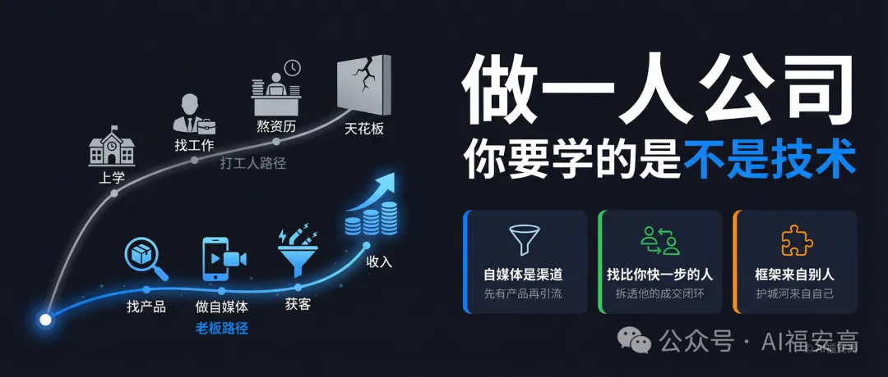

# 做一人公司，首先你要学的是做自媒体，不是学技术。

原创 AI福安高 *2026年3月19日 15:38*

大多数人第一反应：不对吧，技术都没有，拿什么单干？

这个反应本身，就说明你走的还是 **打工人的逻辑** 。

你身边有没有这种人，或者你自己也是这种人——技术扎实，干活认真，兢兢业业干了很多年，收入涨了一点，但如果让你想象他（或者你自己）要是自己当老板的样子—— **感觉永远差那么点感觉** ，不知道差在哪。

这篇文章说清楚，看完相信你也能成为老板。

一、你走的那条路，从设计之初就不是通向老板的

想做老板，别从员工开始，从老板开始。你用二十年爬到高层，公司用两周找到替代你的人，理由只有一个——你太贵了，有人比你年轻，比你便宜，比你听话。

为什么这么简单的道理，正常人只需要花时间想一下就能想通，但是为什么大部分人还是会选择既定的路径？

是因为从来没有人允许你停下来想。学校没有，父母没有，身边的人也没有。那这篇文章你就更需要认真、带着思考读完！

我们先来想想大家从小到大被灌输的那套路径。

**学校** 教你听话、考高分、拿文凭。 **父母** 说找份稳定工作，别瞎折腾。 **身边的人** ，大部分也在走同一条路——上学、找工作、熬资历、往上爬。没有人跟你聊怎么找客户，没有人告诉你怎么定价，因为他们自己也没做过。

这套体系没有错，它有它的逻辑。人口基数大，需要有人进工厂，需要有人进公司执行，需要有人把事情做好。学校批量输出的，本来就是这个体系里 **合格的执行者** ，这是它的目标，也是它的设计。

但 **老板，不是这套体系培养出来的。**

史蒂芬·柯维在《高效能人士的七个习惯》里说过一句话，很扎心： **许多人拼命埋头苦干，到头来却发现，追求成功的梯子搭错了墙。**

大多数人学完技术出来，想一步一步往上爬，爬到有一天能自己出来单干。但真正的做法是反过来的—— **你要先站到老板的位置上想问题，再往回推你需要什么。** 老板不需要自己会剪辑、会设计、会写文案，他需要知道怎么找到会这些的人，或者怎么用工具把这些事搞定。梯子要先靠对墙，再往上爬，不然爬得越高，离目标越远。

管理学之父彼得·德鲁克说过一句话： **效率是"以正确的方式做事"，效能是"做正确的事"。** 大多数人用一生的时间，把事情做得越来越正确，却从来没有停下来问：我做的这件事，方向对吗？

老板需要的那套东西，跟学校教的完全是两回事。德鲁克还有一句话说得很透： **企业只有两件事要做，一个是营销，一个是创新。** 翻译成普通人的语言就是：我有什么能卖，卖给谁，怎么让人找到我。

这三件事， **学校教不了，父母不知道** ，身边的人，如果你是个普通人，你周围大概率也没有人真正做成过这件事、又愿意认真教你的。

所以大多数想做一人公司的人，还是本能地走打工人那条路——先把技术练好，等准备好了再说。但那个 **"准备好了"，永远不会来。** 因为你练的那套能力，解决的是"怎么把事做好"，而老板需要解决的，是"做什么才值钱"。这是两道完全不同的题。

技术，是打工人的核心竞争力——让别人用得顺手。
找到客户，让别人付钱，是老板的核心竞争力。
练哪个，决定你走向哪里。

二、自媒体不是你的作品展示台，是你唯一的获客渠道

先说一个前提。做一人公司，你不能靠卖时间赚钱——那叫自由职业。真正的一人公司，需要找到能放大你产出的杠杆。对于普通人而言，目前最主流的2个杠杆：一是AI，放大执行效率；二是自媒体，解决获客成本。这篇文章重点讲自媒体这条。关于一人公司到底是什么、有哪些形态、真正的门槛在哪里，可以去看我上一篇的完整拆解。

好，回到我们今天要讲的自媒体，很多人做自媒体的心态：先发内容，等涨粉，等有了粉丝再想变现。

发了三个月，涨了几百粉， **没有任何收入** ，然后开始怀疑自己是不是不适合做自媒体，是不是选错了赛道，是不是要去学个新技能。

不是赛道的问题，是 **顺序搞反了** 。

**自媒体的本质是渠道** ——让潜在客户发现你、了解你、信任你、从你这里买东西的通道。但如果你还没有能卖的东西，这条通道通向哪里？通向数字，通向平台的活跃度数据，通向一个对你的收入 **没有任何意义** 的粉丝量。

没有产品，你的内容做得再好，本质上是在 **帮平台打工** 。你的内容吸引来了用户，平台数据好看了，你得到的，是那一点虚荣感和持续消耗的时间。

正确的顺序只有一个： **先找到能卖的产品，再用自媒体把人引进来。**

抖音影视解说刚火那两年，我就是这么干的。用影视制作的专业背景切入， **300块一单** ，配音剪辑文案全包，一条一条私信那些刚起号的小账号。没有先研究怎么做内容，没有先打磨个人品牌，是先找到有人愿意买单的东西，再用自媒体让更多人找到我。

那段时间给了我一个很清醒的认知： **渠道是工具，产品才是目的。** 顺序搞反了，越努力，离收入越远。

三、找产品，别死盯大V，去找比你快一步的普通人

说到找产品方向，大多数人的本能反应是：去看头部大V卖什么，研究他们的逻辑，然后照着干。

这个思路本身没错，但 **对象选错了** 。

粉丝百万的人，他的产品能卖出去，背后是什么？是多年沉淀下来的 **信任** ，是无数次迭代跑通的 **成交路径** ，是完全不同体量的 **流量基础** 。你现在一样都没有。你照着他的产品形态、定价策略、内容风格去做，就像刚拿驾照的人要去跑F1——方向不是不对，是你连油门刹车的配合都还没摸清楚，上去就死。

真正应该盯的，是 **比你快一步的普通人** 。

同一个赛道，粉丝量和你差不多甚至比你还少，但 **已经在卖东西，已经有人买单** ——这种人。他不是大V，他没有光环，但他跑通了一个最小的真实闭环。这个闭环，比任何课程和方法论都值钱，因为它是市场用 **真金白银验证过的** 。

找到这种人，把三件事拆透：

① 内容结构

开头怎么钩住人，不跳走？中间用什么方式建立信任，让人觉得"这个人靠谱"？结尾在哪个位置引导成交，用的是什么动作——是私信、是链接、还是评论区留言？哪种内容互动最高，为什么是那一类？

② 产品设计

他在卖什么？一次性交付、课程内容、还是长期陪跑？客户付了钱，拿到手的到底是什么——是文档、是咨询、是实操辅导？颗粒度细到什么程度？

③ 定价逻辑

他卖多少钱？横向对比同赛道里其他人，这个定价是高位还是低位？高价的人靠什么让人觉得值，低价的人做了什么取舍？这个赛道，普通人能接受的价格区间大概在哪里，边界在哪？

这三件事拆清楚，你就有了真实的市场情报——什么东西有人要，什么价格有人付，什么内容逻辑能跑通。这不是靠感觉猜出来的，是别人用时间和试错帮你验证过的。

四、学，不是抄表面，是把别人验证过的路，装进你自己的真实里

说到这里必须说清楚一件事：你学的 **不是别人的内容，是底下的逻辑** 。

他用什么结构钩住人——你学这个结构。他把一个模糊的能力打包成一次清晰的具体交付——你也这么干。他定价 **999元市场接受了、复购出现了** ——你知道这个区间在这个赛道是安全的。这些是可以学的，也值得学。

但他的经历，他踩过的坑，他客户说的那些真实的话，他内容里那个独特的视角——这些东西 **假不了，也不该假** 。读者感受得到，客户更感受得到。一旦你的内容全是别人的支架，没有自己真实的东西在里面，读起来就像一篇从网上复制下来的模板， **没有体温** 。

我做影视解说外包那三个月，把成交路径跑通了，也把外包供应链搭起来了——找北方低GDP城市有专业录音室的大学生，一单成本 **120到150，我收300，每单净赚180** 。结构是清晰的，逻辑是跑通的。但做着做着我发现，这件事里 **没有任何属于我的东西** ，我是个信息差中介，一旦这个差价消失，什么都没了。主动放弃，不是因为做不下去，是因为知道这条路的尽头在哪。

**别人的框架给你路，你自己真实的东西给你护城河。** 两者都要有，缺一个，都走不远。

你学的不是别人卖什么，是别人为什么能卖出去。
前者是在复制结果，后者是在理解规律。
理解了规律，你才能在自己的处境里用。

亚马逊创始人贝索斯有一句话，我一直记得：我唯一可能后悔的事，是从未去尝试。

很多人一直在研究，一直在准备，一直觉得还不到时候。但市场不等你准备好。那个比你快一步的普通人，他也没有准备好，他只是先动了。

做一人公司，入口是自媒体，不是技术。自媒体的前提是有东西卖，有东西卖的前提是找到有人买单的方向。这个方向，不需要你从零发明，去找比你快一步的普通人，拆透他，然后把你自己真实的东西装进去。

就这一步，先走出去。

作者提示: 个人观点，仅供参考

继续滑动看下一个

AI福安高

向上滑动看下一个
