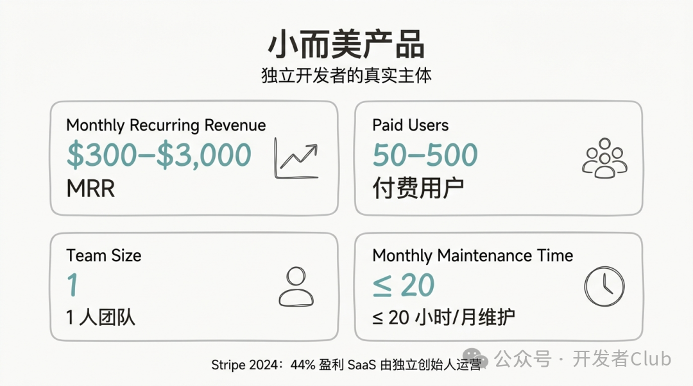
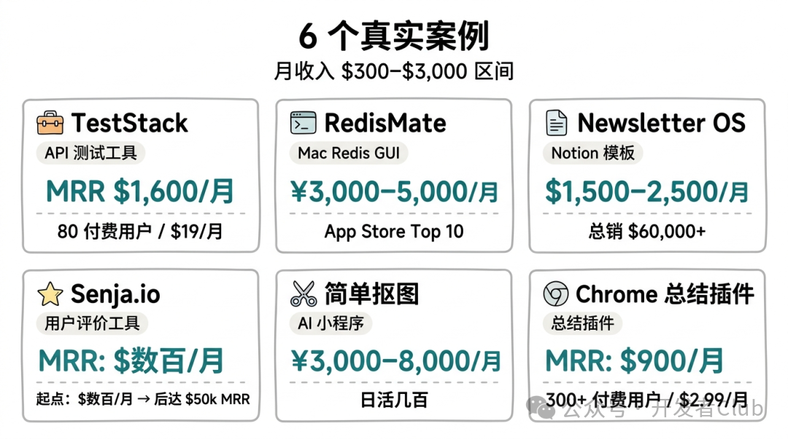
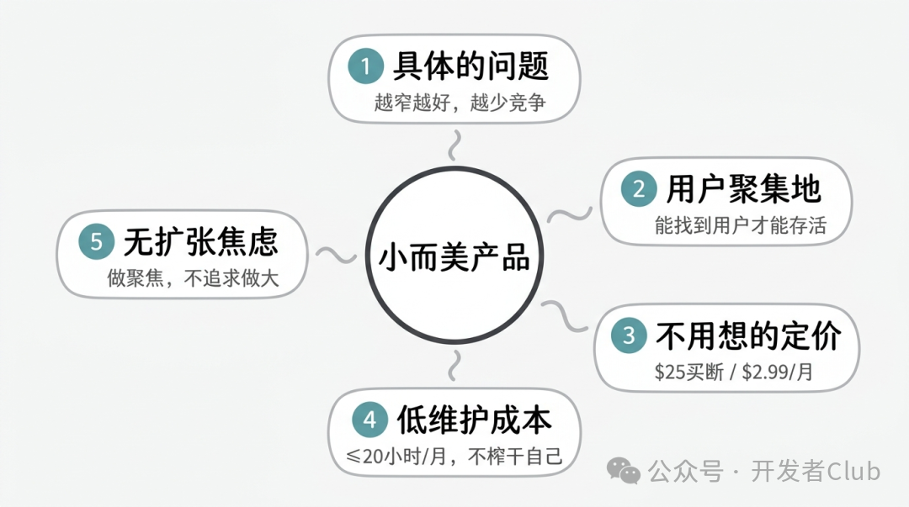
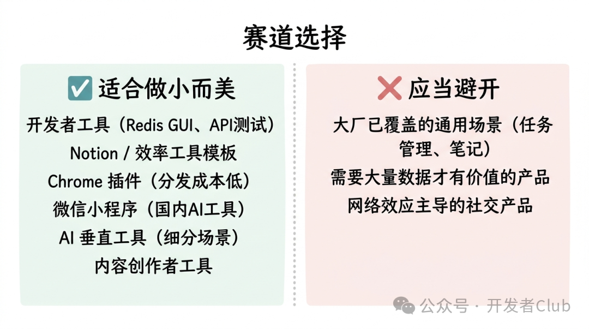
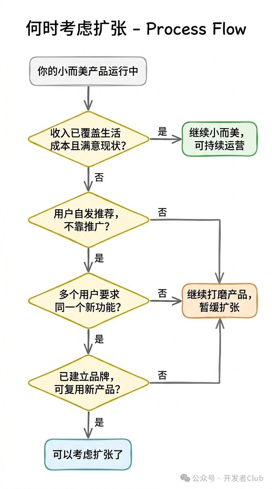
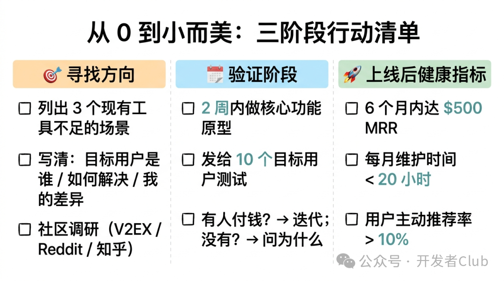

# 独立开发者小而美产品案例：比「月入万元」更有参考价值的真实故事

原创 devclub *2026年3月26日 09:09*

独立开发者内容里，最多的两种故事：

一种是「月入 $10k」的成功学叙事，听起来很激励，但远得像另一个世界。

另一种是失败复盘，读完只有焦虑。

**中间地带的故事反而最稀缺** ——那些月收入 $300-$2,000 的小产品，用几百个真实付费用户活着，不够「成功」到上热搜，但足够让创始人有尊严地继续做下去。

这类「小而美」产品，才是大多数独立开发者更现实的参照。

我们收集了 6 个真实的小而美产品案例，拆解它们共同的特征——以及你可以从中复制什么。

## 目录

- 一、什么是「小而美」产品
- 二、六个真实案例
- 三、小而美产品的共同特征
- 四、哪些赛道适合做小而美
- 五、小而美的天花板：什么时候该扩张
- 六、行动清单

## 一、什么是「小而美」产品

**定义** ：

- MRR（月经常性收入）在 $300-$3,000 之间
- 付费用户数 50-500 人
- 创始人 1 人（或 1+兼职）
- 运维成本低，每月花在维护上的时间不超过 10-20 小时
- 产品功能聚焦，不追求大而全

**为什么这个阶段值得单独讨论？**

Stripe 2024 年的独立创始人报告显示，超过 44% 的盈利 SaaS 产品由独立创始人运营。其中，绝大多数的规模都在「小而美」区间，而不是 $10k MRR 以上。

这个阶段的产品才是独立开发者生态的真实主体。

## 二、六个真实案例

### 案例 1：TestStack — 开发者测试工具

**背景** ：自由职业开发者 Joel Marty，利用业余时间开发了一个帮助小团队管理 API 测试的工具。

**数字** ：

- 上线后 5 个月达到 $1,600/月 MRR
- 每月维护成本 < $100
- 付费用户：~80 人
- 定价：$19/月

**为什么成功** ：
解决了一个非常具体的痛点——小团队没有预算买 Postman 的企业版，但免费版功能不够。TestStack 精准卡在这个空档里，定价也让人觉得「值这个钱」。

**可复制的点** ：
不是做「更好的测试工具」，而是做「更便宜的、适合小团队的测试工具」。定位越具体，竞争越少。

---

### 案例 2：RedisMate — Mac 端 Redis 管理工具

**背景** ：国内独立开发者，裸辞后做的第一个产品，Mac App Store 上架。

**数字** （来自少数派实测报道）：

- 上线 5 天冲到国区 Mac App Store 开发工具类 Top 10
- 第一个月有实际付费用户
- 上线初期 MRR 约 ¥3,000-5,000

**为什么成功** ：

1. 赛道选择精准——Redis 是开发者日常工具，有刚需
2. Mac 原生应用，比竞品（多是跨平台 Electron 应用）性能好
3. 上线就有 UI，不是命令行工具，降低了使用门槛

**可复制的点** ：
用户已经在用某个工具，但那个工具在某个细分场景体验差——做一个体验更好的「本地替代」，不需要发明新需求，只需要做得更好一点。

---

### 案例 3：Newsletter OS — Notion 模板

**背景** ：内容创作者 Janel Loi，用 Notion 做了一套管理邮件通讯的模板系统，在 Gumroad 上出售。

**数字** ：

- 定价：$25（买断）
- 总销售额：$60,000+（截至 2024 年）
- 月均收入：$1,500-2,500

**为什么成功** ：

1. 解决了「如何高效管理通讯内容日历」的真实痛点
2. 门槛极低——买了就能用，不需要学习新工具
3. 目标用户（通讯创作者）集中且活跃，社区推广效果好

**可复制的点** ：
模板产品是独立开发者最被低估的赛道。开发成本极低（甚至 0 代码），如果解决了真实问题，转化率远高于 SaaS 产品。

---

### 案例 4：Senja.io — 用户评价收集工具

**背景** ：Wilson Wilson 和 Olly Meakings 两人团队，做了一个帮助产品收集和展示用户评价（Testimonial）的工具。

**成长轨迹** ：

- 2024 年 5 月：$30k MRR
- 2024 年 10 月：$50k MRR
- 2025 年：$1M ARR（突破了小而美范围）

**这个案例的起点才是关键** ：Senja 在第一年，是一个月收入几百美元的「小工具」——两个人花业余时间维护，解决了一个真实但被忽视的问题（产品网站上的用户评价难以管理和展示）。

**可复制的点** ：
小而美不是终点，是起点。先把一件小事做好，积累真实用户和口碑，再考虑扩展。

---

### 案例 5：简单抠图 — 国内 AI 图片处理小程序

**背景** ：国内独立开发者，基于 AI 图像分割技术做了一个微信小程序，功能单一：一键抠图。

**数字** （来自 CSDN 报道的类似案例）：

- 通过广告 + 会员模式变现
- 稳定后月收入 ¥3,000-8,000
- 日活用户：几百人

**为什么成功** ：

1. 功能极其聚焦——只做一件事，做好
2. 微信生态天然有流量入口
3. AI 技术降低了开发门槛，个人开发者可以快速实现

**可复制的点** ：
把一个「以前需要专业软件」的功能，用 AI 做成「5 秒完成」的小程序，对非技术用户吸引力极强。

---

### 案例 6：Chrome 插件 — 网页内容总结工具

**背景** ：一位国内开发者利用 ChatGPT API，做了一个一键总结网页内容的 Chrome 插件，最初免费，后来转付费。

**数字** ：

- 免费阶段：3,000+ 安装量
- 付费转化后：300+ 付费订阅用户
- MRR：约 $900（$2.99/月定价）

**为什么成功** ：
用免费阶段积累了真实用户和使用数据，转付费时已经有明确的用户证明产品有价值。

**可复制的点** ：
Chrome 插件的分发成本极低（插件商店本身有流量），先免费积累用户，再转付费，是一种低风险的验证路径。

## 三、小而美产品的共同特征

分析以上 6 个案例，找到了 5 个共同特征：

### 特征 1：解决一个非常具体的问题

不是「帮助用户提高效率」，而是「帮助 Redis 用户在 Mac 上有更好的 GUI 管理体验」。

越具体的问题，越少竞争，越容易找到精准用户。

### 特征 2：目标用户有明确聚集地

Redis 用户在 GitHub、Stack Overflow；通讯创作者在 Twitter 和 Creator 社区；Chrome 用户在 ProductHunt 和 Reddit。

能找到用户，产品才能存活。

### 特征 3：定价在用户「不用想就能接受」的区间

- 一次性 $25：不需要算 ROI，直接买
- $2.99/月：比一杯咖啡便宜，不用想

小而美产品的定价要让用户感觉「这个价格我不需要研究，直接付」。

### 特征 4：开发和维护成本极低

案例里的产品，月维护时间都在 10-20 小时以内。这是「小而美」可持续的关键——不会把创始人榨干。

### 特征 5：没有追求「做大」的焦虑

这些创始人做产品的出发点，不是「我要做下一个 Notion」，而是「我要解决这个具体问题，赚够支撑我继续做的钱」。

心态不同，做出来的产品也不同。

## 四、哪些赛道适合做小而美

根据案例分析和 2025 年市场数据，以下赛道最适合个人开发者做小而美产品：

| 赛道 | 为什么适合 | 例子 |
| --- | --- | --- |
| **开发者工具** | 用户会付费，反馈直接，口碑传播快 | Redis GUI、API 测试工具 |
| **Notion / 效率工具模板** | 开发成本极低，用户需求明确 | 项目管理模板、通讯日历 |
| **Chrome 插件** | 分发成本低，可免费积累用户 | 页面总结、截图工具 |
| **微信小程序（国内）** | 微信生态流量入口，AI 功能好做 | 抠图、图片压缩、格式转换 |
| **AI 垂直工具** | 用 API 快速实现，聚焦细分场景 | 特定行业的文案生成、数据分析 |
| **内容创作者工具** | 创作者愿意为效率付费，社区传播快 | 社媒排期、素材管理 |

**避开的赛道** ：

- 大厂已经覆盖的通用场景（任务管理、笔记应用）
- 需要大量数据才能有价值的产品（推荐算法、搜索引擎）
- 网络效应主导的产品（社交产品需要大量用户才有价值）

## 五、小而美的天花板：什么时候该扩张

「小而美」不是终点，但也不是所有人都需要扩张。

**不需要扩张的情况** ：

- 收入已经覆盖生活成本，你对现状满意
- 扩张需要雇人，但你更享受独自工作
- 产品已经达到市场天花板，继续投入 ROI 很低

**值得考虑扩张的信号** ：

- 用户自发推荐，增长不需要推广
- 收到用户希望加功能的需求，而且多个用户在要同一件事
- 你已经建立了可信的品牌，新产品可以复用

Senja 的例子说明：小而美可以成长为大产品——前提是基础打得好，用户真实有价值，而不是靠营销堆出来的虚假增长。

## 六、行动清单

### 🎯 寻找产品方向

- \[ \] 在你熟悉的领域，列出 3 个「现有工具做得不够好」的场景
- \[ \] 每个场景写一句话：「目标用户是谁、他们现在怎么解决这个问题、我的方案怎么做得更好」
- \[ \] 在相关社区（V2EX、Reddit、知乎）搜索用户在抱怨什么

### 📅 验证阶段

- \[ \] 用 2 周时间做一个核心功能可运行的原型
- \[ \] 发给 10 个目标用户，看有没有人愿意为它付钱
- \[ \] 如果有人付钱：继续迭代；如果没有：问清楚为什么

### 🚀 上线后的健康指标

- \[ \] 6 个月内达到 $500 MRR（如果没达到，认真评估方向）
- \[ \] 每月维护时间 < 20 小时（如果超过，考虑自动化）
- \[ \] 用户主动推荐率 > 10%（NPS 正向）

## 总结

小而美产品的核心逻辑，不是「做小」，而是「做聚焦」。

聚焦一个问题，聚焦一类用户，聚焦一个场景——在这个聚焦里把体验做到最好，让用户愿意付钱、愿意推荐。

**这 6 个案例的共同结论** ：

1. 具体胜于宽泛——越窄的赛道，越容易成为第一
2. 模板和插件被低估——不一定非要做 SaaS
3. 免费积累用户，再转付费，是最低风险的验证路径
4. 维护成本低的产品才可持续——不能把自己榨干
5. 小而美不丢人——$1,000 MRR 的产品也是真实的商业成功

---

## 互动话题

你见过或用过哪些让你觉得「这个定位太准了」的小工具？欢迎在评论区推荐，说说它解决了什么问题、定价怎么样。

*<End/>*

*点击下方，关注 **「开发者Club」** 公众号*

请长按二维码，添加 **「开发者Club」** 微信，拉你进 **开发者交流群** 共同进步！

关注开发，更关注开发者！

好文章，点个赞❤️

继续滑动看下一个

开发者Club

向上滑动看下一个