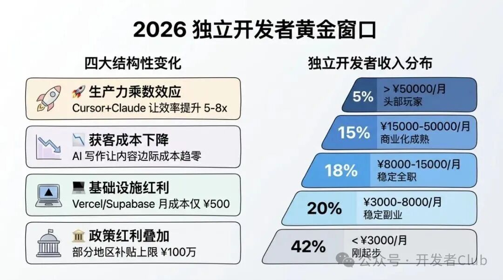
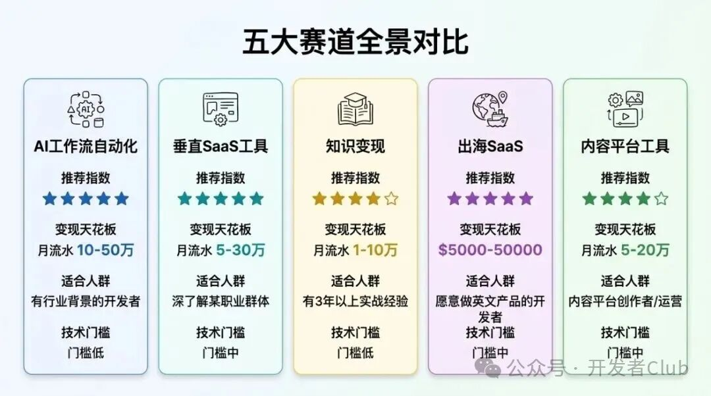
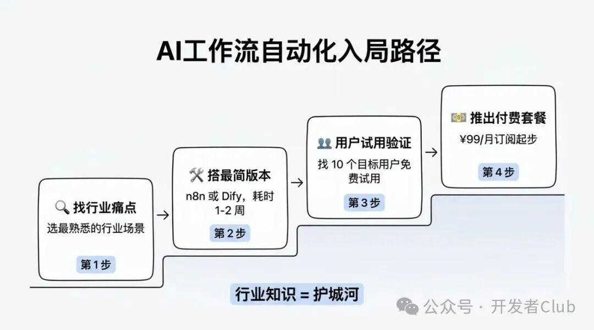
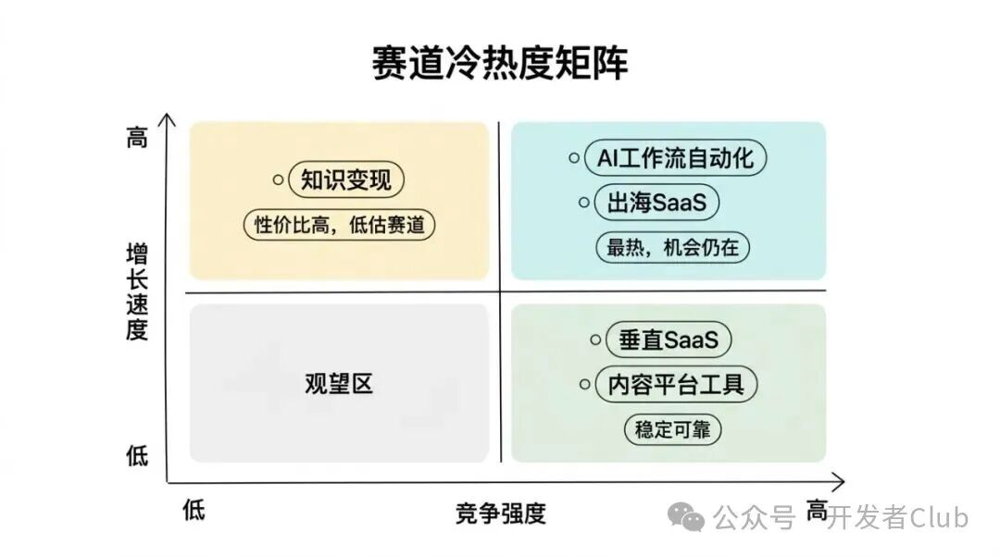
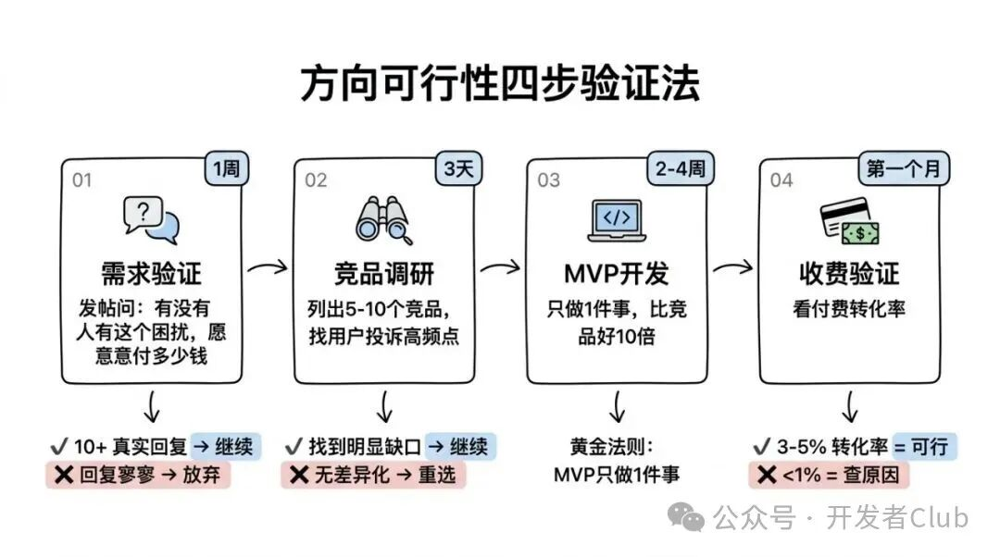
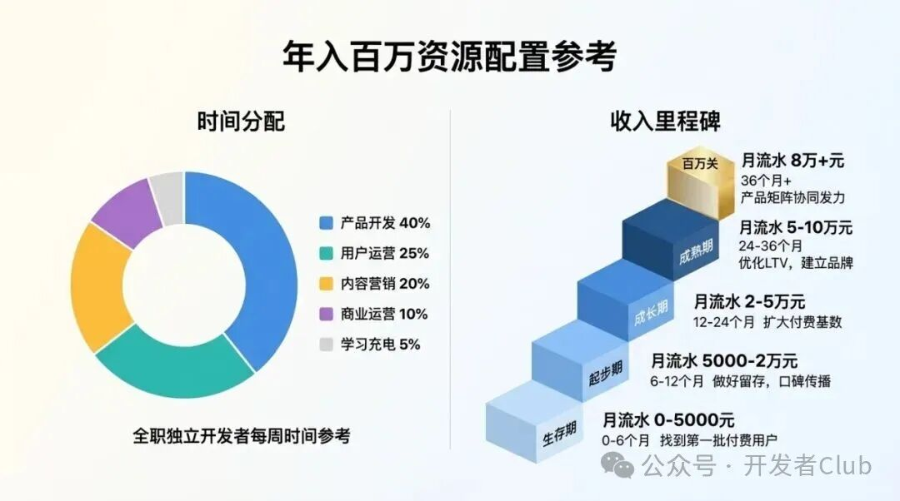

# 一人公司年入百万不是神话：2026 年最值得入局的独立开发赛道盘点

原创 devclub *2026年4月2日 11:11*

2026 年，一个人、一台电脑、一年挣 100 万，正在从「偶尔有人做到」变成「越来越多人做到」。不是因为风口来了，而是因为 AI 工具彻底改变了个人开发者的生产力上限。本文盘点 5 条最具潜力的赛道，带数据、带案例、带入局路径——帮你找到属于自己的那一条。

## 一、临界点：为什么 2026 年是一人公司的黄金窗口

去年有个词在独立开发者圈子里反复出现： **临界点** 。

2024 年，一个独立开发者用 AI 工具一年挣 100 万人民币，还是新闻。2025 年，这类故事开始密集出现在 V2EX、Indie Hackers、小红书上。到 2026 年，社区里已经有人在讨论「怎么从 100 万做到 500 万」。

这不是幸存者偏差，背后有结构性变化：

**生产力乘数效应** 。2024 年，Cursor + Claude 组合让一个开发者的编码效率提升 2-3 倍。2025 年底，Vibe Coding 工作流成熟后，这个倍数变成了 5-8 倍。一个人可以同时维护 3-5 个产品，而不是以前的 1-2 个。

**获客成本下降** 。AI 写作工具让内容营销的边际成本接近零。一个人每周产出 10 篇高质量技术文章，放在 2020 年需要 3 个人的内容团队。现在，一个开发者自己就能做到。

**基础设施红利** 。Vercel、Supabase、Stripe、Cloudflare R2——这些 SaaS 基础设施的存在，让独立开发者可以用极低的固定成本支撑数千用户的产品。月流水 10 万元的产品，服务器成本可能只需要 500 元。

**政策红利叠加** 。江苏、北京、杭州等地已陆续出台对个人开发者的创业补贴政策，部分地区对优质独立产品的补贴上限达到 100 万元人民币。这在以前是不可想象的。

根据 2025 年底一份覆盖 1200+ 名独立开发者的问卷调查，收入分布如下：

| 月收入区间 | 占比 | 代表群体 |
| --- | --- | --- |
| < ¥3000 | 42% | 刚起步，兼职探索 |
| ¥3000-8000 | 20% | 稳定副业，部分全职 |
| ¥8000-15000 | 18% | 稳定全职，覆盖成本 |
| ¥15000-50000 | 15% | 商业化成熟，有规模 |
| \> ¥50000 | 5% | 头部玩家，产品矩阵 |

前 20% 的独立开发者，年收入已经超过 100 万人民币。而这个比例还在持续提升。

**核心问题来了：那些做到的人，都在什么赛道？**

## 二、五条最值得入局的赛道

### 赛道 1：AI 工作流自动化（推荐指数 ⭐⭐⭐⭐⭐）

**赛道本质** ：企业和个人每天有大量重复性工作——数据整理、内容生成、邮件分类、报告汇总。用 AI + 自动化工具把这些流程打包成 SaaS 产品，卖给愿意付钱省时间的用户。

**为什么现在是窗口期** ：
企业数字化转型正在从「要不要用 AI」变成「怎么用好 AI」。但大多数企业没有技术能力自己搭建 AI 工作流，他们需要的是一个开箱即用的工具，而不是自己去调 OpenAI API。这个需求缺口，独立开发者完全可以填上。

**案例 1：小明的合同审查 SaaS**

北京的独立开发者「小明」（化名），律师事务所出身，2025 年 3 月用 3 周时间开发了一个合同风险审查工具。核心功能：上传合同 PDF，AI 自动标注高风险条款，生成修改建议。

定价：个人版 ¥199/月，企业版 ¥1999/月。上线 6 个月，订阅用户 800+，月流水突破 15 万元。

他成功的关键不是技术有多厉害——用的都是 Claude API + Next.js，任何开发者都会做——而是他懂行业。律所里什么条款是高风险的，他比 AI 更清楚。这个领域知识壁垒，让竞品很难追上他。

**适合人群** ：有行业背景的开发者（医疗、法律、财务、HR 都是好方向）。技术门槛不高，但行业理解是护城河。

**推荐工具** ：

- **n8n** （开源自动化平台，可私有部署，国内访问稳定）
- **Make** （原 Integromat，功能强大，月费 $9 起）
- **Dify** （国产 AI 应用开发平台，中文文档完善）

**入局路径** ：

1. 选一个你最熟悉的行业场景，找到「每周重复 5 次以上」的痛点
2. 用 n8n 或 Dify 搭一个最简版本（1-2 周）
3. 找 10 个目标用户免费试用，收集反馈
4. 根据反馈优化，推出 ¥99/月的订阅套餐

**变现天花板** ：月流水 10-50 万，核心是选好垂直行业。

### 赛道 2：垂直 SaaS 工具（推荐指数 ⭐⭐⭐⭐⭐）

**赛道本质** ：针对特定职业群体或使用场景，做一个功能专注、用起来顺手的小工具。不需要做 Notion 那样的通用平台，只需要解决一个群体的一个具体问题。

**为什么有机会** ：大厂的产品需要服务所有人，必然在某些场景下体验平庸。垂直工具可以把一件事做到极致，这是大厂做不到的。

**案例 2：字幕精修工具「SubCut」**

上海的独立开发者阿壁（@abicoder，V2EX 常见面孔）2024 年底开发了一个专门给视频博主用的字幕精修工具。核心功能：自动识别字幕 → AI 纠错同音错别字 → 一键调整字幕样式风格。

这个需求看起来很小——但视频博主每个月可能需要处理几十小时的字幕。市面上的 AI 工具识别准确率不够，总有错别字需要手动改。SubCut 专门解决这个痛点。

定价：¥29/月，¥249/年。上线 4 个月，付费用户 2000+，年费用户为主，月均流水约 5 万元。「我没想到这么小的工具能有这么多人付钱，但视频博主真的需要这个。」他在 V2EX 的帖子里写道。

**案例 3：Marc Lou 的产品矩阵策略**

Marc Lou 是法国独立开发者，月收入超过 $10 万美元，产品矩阵中最著名的是 ShipFast（Next.js 项目模板）。他的打法是：识别开发者社区的高频痛点 → 用 2 周时间开发 MVP → 在 Product Hunt 首发 → 付费内容营销养活流量。

他的每个产品定价在 $49-299 之间，一次性付费为主。核心优势是他对开发者社区的深度理解——他的用户就是和他一样的独立开发者。

**适合人群** ：对某个职业群体（设计师、程序员、博主、教师……）有深入了解，能识别「他们天天在用但体验很差」的场景。

**推荐工具** ：

- **Cursor** + **Next.js 14** （快速开发 Web 工具，技术栈成熟）
- **Supabase** （后端数据库 + 认证，免费起步，按量付费）
- **Lemon Squeezy** / **Paddle** （国际化支付，支持 VAT 合规）

**入局路径** ：

1. 在你最熟悉的 1 个群体里，找 3-5 个「现有工具都不好用」的痛点
2. 选最有人愿意付钱的那个，做 2 周 MVP
3. 在目标群体聚集的平台发帖（小红书、知乎、专业论坛）
4. 定价从 ¥29/月起，先把第一批 100 个用户搞到再说

**变现天花板** ：月流水 5-30 万，关键是选好垂直赛道和定价策略。

### 赛道 3：知识变现与信息产品（推荐指数 ⭐⭐⭐⭐）

**赛道本质** ：把你在某个领域积累的知识，打包成课程、电子书、模板包、Notion 数据库、Prompt 包等信息产品，一次生产、多次销售。

**为什么 AI 改变了这条赛道** ：AI 工具让内容生产效率提升了 3-5 倍，让独立开发者可以同时维护多个知识产品线。更重要的是，AI 生成内容泛滥之后， **有真实经验背书的知识更值钱了** ，而不是更不值钱。

**案例 4：Prompt 工程师的变现之路**

成都开发者「云雀」2024 年开始系统整理自己写 AI Prompt 的经验，做成了一套「程序员专用 Prompt 模板库」，包含 300+ 个场景化 Prompt，覆盖代码审查、架构设计、技术文档等场景。

在小红书发了 30 篇分享帖之后，流量起来了。目前在爱发电上以 ¥99 单次购买、¥299/年订阅的形式销售，月收入约 2 万元。

她说：「我没有靠 AI 生成 Prompt，所有模板都是我自己用过测试过的。这是和其他竞品的最大差别——用户买了真的好用。」

**常见知识产品形式** ：

| 形式 | 适合内容 | 定价区间 | 制作周期 |
| --- | --- | --- | --- |
| 电子书/PDF | 方法论、经验总结 | ¥39-199 | 2-4 周 |
| 视频课程 | 技能教学、实战操作 | ¥99-999 | 1-3 个月 |
| 模板包 | Notion、Figma、代码模板 | ¥29-99 | 1-2 周 |
| 订阅通讯 | 行业情报、策略分享 | ¥99-299/年 | 持续更新 |
| 社群+内容 | 知识社区、学习圈子 | ¥299-999/年 | 持续运营 |

**适合人群** ：在某个领域有 3 年以上实战经验，愿意分享的开发者。技术门槛低，比拼的是知识积累和内容质量。

**推荐平台（国内）** ：

- **爱发电** ：最友好的知识付费平台，抽成低，支持订阅和单次付费
- **小报童** ：订阅制为主，适合周期性更新内容
- **微信生态** ：公众号 + 小程序 + 视频号，适合有粉丝基础的创作者

**变现天花板** ：月流水 1-10 万，弹性较大。上限取决于影响力。

### 赛道 4：出海 SaaS（推荐指数 ⭐⭐⭐⭐⭐）

**赛道本质** ：用中国工程师的成本优势，服务欧美中小企业和个人用户，用美元计价。同等功能的产品，美国用户的付费意愿是国内用户的 3-5 倍。

**为什么强烈推荐** ：2025 年出海的门槛已经大幅降低。Wyoming LLC 注册约 $100-200、Mercury 银行账户免费开通、Stripe 支持中国开发者接入——技术和合规障碍基本消除了。

**案例 5：社媒内容工具「TweetHelper」**

广州开发者小徐（Twitter: @xiao\_xu\_dev）2024 年底开发了一个帮 Twitter/X 用户优化推文内容的小工具：粘贴草稿 → AI 分析内容质量 → 给出改进建议和最佳发布时间。面向英语用户，定价 $9/月。

上线 3 个月，付费用户 600 名，月收入 $5400（约 ¥39000），服务器成本约 $200/月。

他的核心打法： **Product Hunt 首发** + **Reddit 社区推广** （在 r/Twitter、r/SocialMediaMarketing 等社区发真诚帖子，不打广告）。

他说：「我在国内根本没有这类产品的市场——大家不用 Twitter。但海外需求很真实。我就是帮他们解决了一个很小的问题。」

**出海的核心数据对比** ：

| 指标 | 国内市场 | 海外市场 |
| --- | --- | --- |
| 用户付费意愿 | ¥29-99/月 | $9-29/月（¥65-210） |
| 竞争烈度 | 高（赛道拥挤） | 中（细分市场空间大） |
| 退款率 | 较高 | 较低（信用卡文化） |
| 用户留存 | 中等 | 较高 |
| 推广成本 | 高（信息流投放贵） | 低（Reddit/HN 免费） |

**出海入门路径** ：

1. 注册 Wyoming LLC（推荐 Northwest Registered Agent，约 $100/年）
2. 开 Mercury 银行账户（免费，1-2 周审核）
3. 接入 Stripe（支持 LLC 主体收款）
4. 产品用英语开发，Landing Page 用 Vercel 部署
5. Product Hunt 首发 + Reddit 推广起量

**推荐工具** ：

- **Vercel** （前端部署，免费额度够用）
- **Stripe** （国际支付首选）
- **Resend** （邮件服务，开发者友好）

**变现天花板** ：月流水 $5000-50000 美元，上限很高，取决于产品力。

### 赛道 5：内容平台辅助工具（推荐指数 ⭐⭐⭐⭐）

**赛道本质** ：微信、小红书、抖音、B 站的内容创作者每天需要大量辅助工具——爆款标题生成、数据分析、竞品监控、批量发布、素材管理……这些工具有稳定的国内需求，且创作者付费意愿高。

**为什么是好赛道** ：国内内容创作经济体量巨大。2025 年小红书月活用户超过 4 亿，B 站 UP 主超过 400 万，微信公众号运营者数百万。他们都在寻找提升效率的工具。这个市场在国内，本土化优势明显，出海做不了这块。

**案例 6：小红书数据分析工具**

北京开发者阿强（知乎：@强叔聊工具）2025 年初开发了一款小红书笔记数据分析工具，功能包括：竞品笔记数据对比、爆款标题关键词分析、最佳发布时间推荐、粉丝增长趋势分析。

定价：¥99/月，¥799/年。主要用户群是电商商家、MCN 机构、个人博主。上线 5 个月，付费用户 1500+，月流水约 13 万元。

「我自己就是小红书用户，知道大家最想知道什么数据。那些不存在于小红书官方后台的数据，就是我产品的切入点。」

**国内内容工具常见方向** ：

- **爆款文案生成** ：针对特定平台风格的 AI 写作工具
- **数据监控分析** ：竞品监控、粉丝分析、内容表现追踪
- **批量内容管理** ：多平台发布、素材库管理、日程排期
- **素材创作辅助** ：封面图生成、视频脚本、字幕制作

**适合人群** ：本身是某个内容平台的创作者或运营，理解用户需求。技术门槛中等。

**推荐工具** ：

- **微信开发者工具** （开发小程序，触达微信生态用户）
- **腾讯云函数** （Serverless 架构，成本低）
- **微信支付 / 支付宝** （国内收款必备）

**变现天花板** ：月流水 5-20 万，稳定性好。

## 三、2026 年的入局时机判断

### 赛道冷热度矩阵

**最热但机会仍在** ：AI 工作流自动化、出海 SaaS
这两个赛道已经很热，但因为市场足够大、细分方向足够多，仍有大量空白点。关键是选好垂直场景，不要做通用工具。

**稳定可靠的选择** ：垂直 SaaS、内容工具
竞争烈度中等，需求稳定，适合稳扎稳打的开发者。

**性价比高的低估方向** ：知识变现
很多开发者觉得「知识产品没技术含量」就忽视了这条路，但它的入门门槛最低、试错成本最小，非常适合刚开始独立开发的人用来验证自己的方向感。

## 四、如何判断一个具体方向值不值得做

很多开发者的困境不是「不知道有哪些赛道」，而是「不知道自己选的那个具体方向是否可行」。这里给一个 4 步验证框架：

### 第一步：需求验证（1 周）

**目标** ：确认有人愿意付钱解决这个问题。

**做法** ：

- 在目标用户聚集的平台发一个帖子，描述你想解决的问题，问「有没有人有这个困扰，愿意付多少钱解决」
- 如果有 10 个以上真实回复表示有需求，进入下一步
- 如果回复寥寥，这个方向先放弃

**工具** ：小红书、知乎问答、V2EX、Reddit（针对海外方向）

### 第二步：竞品调研（3 天）

**目标** ：确认市场存在但竞品有明显缺口。

**做法** ：

- 搜索现有解决方案，列出 5-10 个竞品
- 真正使用它们，找出用户评论里最高频的投诉点
- 如果投诉集中在「功能 A 太弱/体验太差/价格太贵」，你的切入点就是这里

**工具** ：App Store 评论、Product Hunt 评论、Google Play 评论

### 第三步：MVP 开发（2-4 周）

**目标** ：做出刚好能验证核心价值的最简版本。

**黄金法则** ：MVP 只做 1 件事，把那 1 件事做到比竞品好 10 倍。其他功能都可以等有用户了再加。

**工具** ：Cursor + Next.js + Supabase 组合，开发速度最快。

### 第四步：收费验证（第一个月）

**目标** ：看有没有人愿意付钱。

**判断标准** ：

- 100 个访问者 → 应该有 3-5 个付费（3-5% 转化率是基准）
- 如果付费率低于 1%，回去查问题：定价太高？核心功能没做到位？目标用户没找准？

## 五、一个人做到百万的资源配置建议

假设你已经确定了赛道，下面是年收入 100 万（月均 8.3 万元）的资源配置参考：

### 时间分配（全职情况下）

| 时间块 | 占比 | 具体内容 |
| --- | --- | --- |
| 产品开发 | 40% | 新功能、Bug 修复、性能优化 |
| 用户运营 | 25% | 社群维护、客服、收集反馈 |
| 内容营销 | 20% | 写文章、发帖、社媒更新 |
| 商业运营 | 10% | 分析数据、优化定价、发票财务 |
| 学习充电 | 5% | 关注竞品、技术学习 |

### 工具栈（月均成本 ¥1500-2500）

| 工具 | 用途 | 月费 |
| --- | --- | --- |
| Cursor Pro | AI 编程 | $20（≈¥145） |
| Claude Pro | AI 辅助 | $20（≈¥145） |
| Vercel Pro | 部署托管 | $20（≈¥145） |
| Supabase Pro | 数据库 | $25（≈¥180） |
| Cloudflare | CDN + 存储 | $5-20（≈¥40-145） |
| 腾讯云服务器 | 国内备用 | ¥100-300 |
| 运营分析工具 | 数据追踪 | ¥100-500 |
| **合计** |  | **约 ¥855-1560/月** |

### 收入里程碑参考

| 阶段 | 月流水 | 通常时间 | 核心任务 |
| --- | --- | --- | --- |
| 生存期 | 0-5000 | 0-6 个月 | 找到第一批付费用户 |
| 起步期 | 5000-20000 | 6-12 个月 | 做好留存，口碑传播 |
| 成长期 | 20000-50000 | 12-24 个月 | 扩大付费基数，探索产品矩阵 |
| 成熟期 | 50000-100000 | 24-36 个月 | 优化 LTV，建立品牌 |
| 百万关 | 80000+ | 36 个月+ | 产品矩阵协同发力 |

## 六、避坑指南

### ⚠️ 误区一：同时开多个赛道

初期最常见的致命错误。很多开发者看到 Marc Lou 有 5 个产品，就觉得自己也要做产品矩阵。但 Marc Lou 现在的多产品是从第一个成功产品演化来的，不是从第一天就多线作战。

**正确做法** ：在第一个产品做到月流水 2 万以上之前，专注做好一个。

### ⚠️ 误区二：过早做技术复杂度

「先把基础架构搭好」是工程师的本能，但对独立开发来说是陷阱。你的第一版产品，用最简单的技术就够了。没有用户的时候，架构复杂度等于浪费时间。

**正确做法** ：用最熟悉的技术栈快速出 MVP，哪怕某些部分很「土」。

### ⚠️ 误区三：把定价当成最后考虑的问题

很多开发者做完产品才想定价，随手写了个数字。定价决定了你的用户画像和产品定位，应该在开发之前就想清楚。

**正确做法** ：定价从需求调研阶段就开始验证。在帖子里直接问「如果有这个功能，你愿意付多少钱」，比上线后再测试定价效率高 10 倍。

### ⚠️ 误区四：忽视留存，只看增长

月流水增长可能是假象——如果流失率高，用户只是前仆后继地来了又走。真正健康的产品应该是：每个月的老用户留存率在 80% 以上，新用户只是锦上添花。

**正确做法** ：在用户增长到 100 人之前，先搞清楚为什么前 50 个用户在继续用，或者为什么不再用。

## 七、总结与行动清单

### 🎯 2026 年独立开发的核心判断

1. **AI 工具已经把生产力门槛打穿了** ——一个人可以干 3-5 个人的活，年入百万的技术障碍不再是问题。
2. **真正的门槛变成了：选准赛道 + 耐得住寂寞** ——市场判断力和执行力，而不是技术能力，决定上限。
3. **出海是性价比最高的方向** ——美元定价 + 低成本 + 大市场，是结构性机会，不是偶然现象。
4. **不要等风口，要等自己准备好** ——赛道选得再好，产品不好用，用户不会买单。

### ✅ 立即可做的 3 件事

1. \[ \] **本周** ：在你最熟悉的用户群体里，找出 3 个「现有工具都没做好」的痛点（耗时 2-3 小时，难度：低）
2. \[ \] **本月** ：选一个痛点，发一篇帖子做需求验证，看有没有人回应愿意付钱（耗时 1 天，难度：低）
3. \[ \] **本季度** ：如果验证有需求，用 Cursor + Next.js + Supabase 做出 MVP 并定价上线（耗时 2-4 周，难度：中）

*<End/>*

*点击下方，关注 **「开发者Club」** 公众号*

请长按二维码，添加 **「开发者Club」** 微信，拉你进 **开发者交流群** 共同进步！

关注开发，更关注开发者！

好文章，点个赞❤️

继续滑动看下一个

开发者Club

向上滑动看下一个