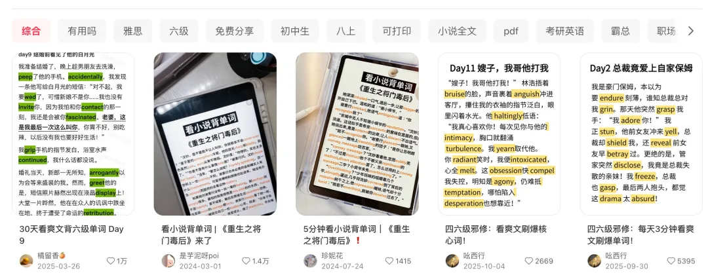
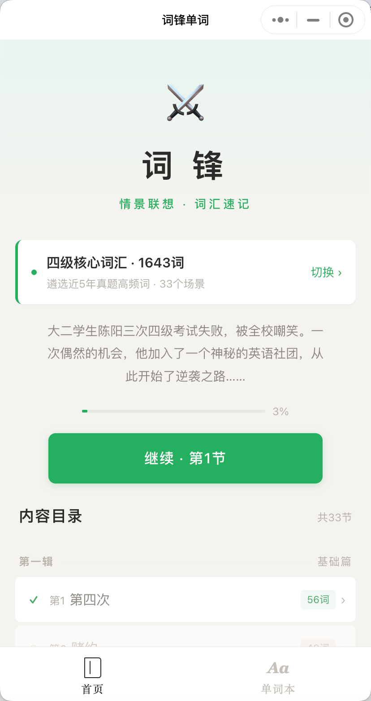
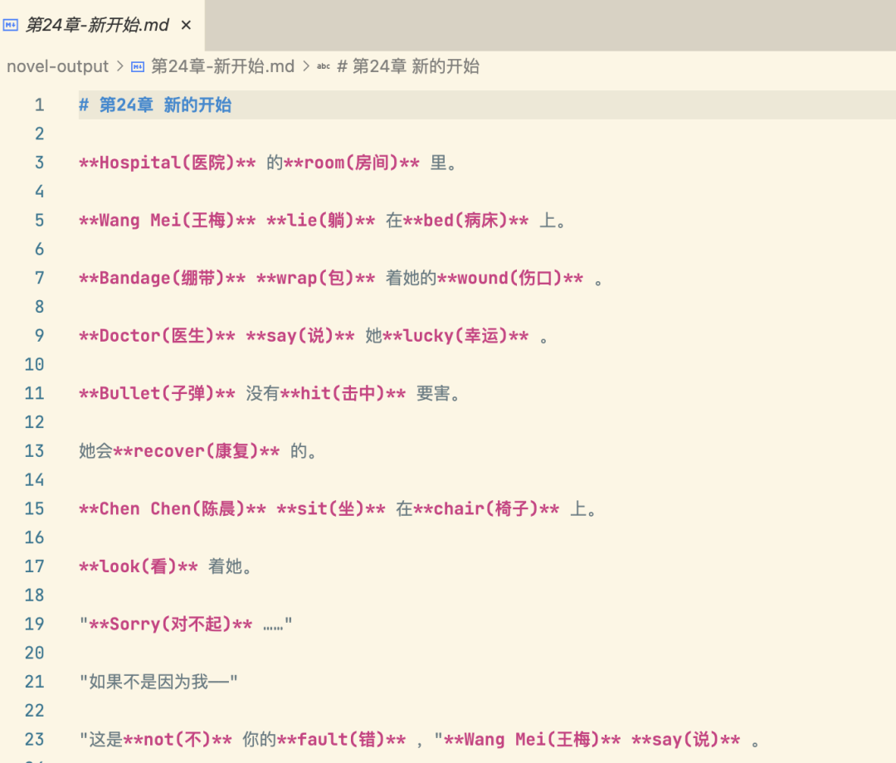
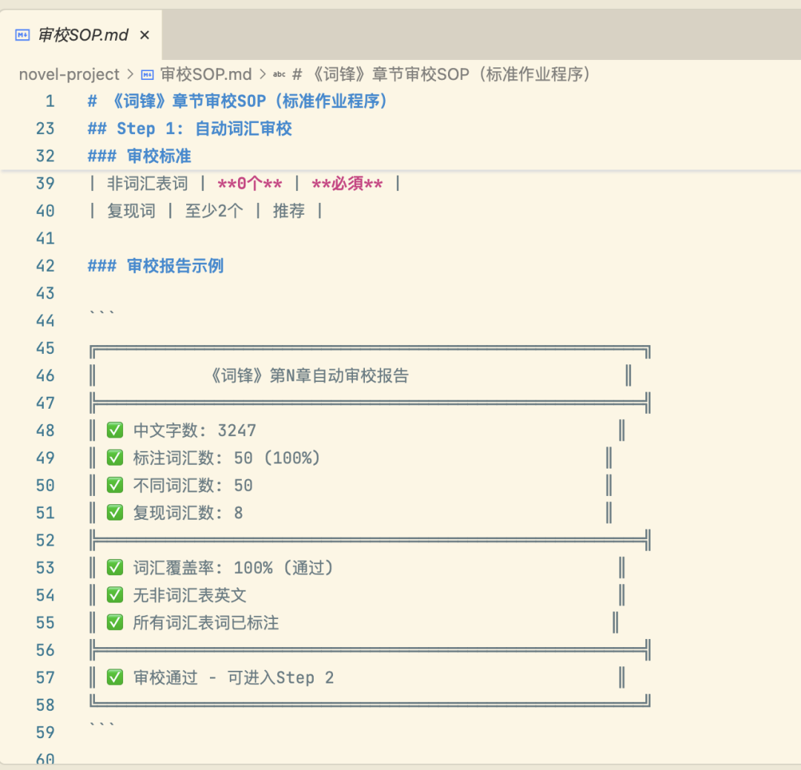
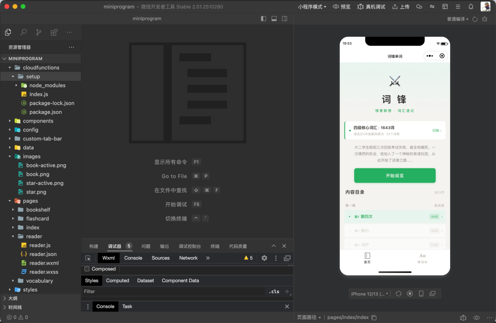
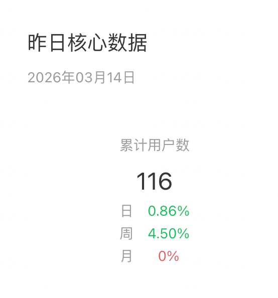

# 一行代码没写，我用 Claude Code 做了个小程序，上线当天 100 人注册

原创 阿天 *2026年3月15日 21:41*

大家好，我是阿天。

我花了一天开发，两天调试，半个月等备案，上线了一个小程序——全程没写一行代码。

事情的起因是刷小红书。有人在卖一本 PDF，几十块钱，主打卖点是：把四六级词汇嵌进一篇小说里，边读故事边背单词，无痛记忆。点赞量很高，评论区一片"已购""求链接"。

我的第一反应：一本 PDF？都 2026 年了，这个需求值得一个更好的产品形态。

看看这，笔记热度有多高。

01

不是 Demo，是一本 33 章的完整小说

很多人用 AI 做产品的思路是：让 AI 生成一段内容，套个壳，上线。

我一开始也是这么想的。但真正开始做之后发现，"把单词自然地融进小说"这件事，远比想象中复杂。

先说结论：最终上线的小程序里，有一本 33 章、五幕结构的完整小说，覆盖了 1654 个四级核心词汇。每章约 50

个单词，按主题语义分配——校园学业类的词放在前几章，商务竞赛类的放在中间，法律权利类的安排在冲突高潮。

不是随机塞词，是精准编排。

小说叫《词锋》，讲的是一个四级考了三次都没过的大学生陈阳，从被全班嘲笑到一路逆袭的故事。五幕：废柴篇、觉醒篇、崛起篇、至暗篇、逆袭篇——标准的爽文节奏，让你追着看下去

，看完了，单词也记住了。

整个开发用的是 Claude Code。从小说内容生产、审校工具链、到小程序前端，我一行代码都没写。不是谦虚，是真的——Claude Code

就是我的技术合伙人，我只负责提需求、做决策、定规范。

AI 替代的是编码能力，但产品判断力，一行代码都替代不了。

02

国产模型翻车：加了强约束，依然 hold 不住

一开始，我用的是国产模型 GLM-4.7 来生成小说内容。

给了它词汇表、覆盖率要求、故事类型和风格。前几章确实不错，单词嵌得进去，读起来也通顺。

但到了第四、第五章，它开始放飞自我了。

词汇表？不看了。覆盖率？随缘了。剧情倒是越写越嗨，恨不得给主角加十个金手指，但该出现的单词一个没出现。

我不是没想过办法——上了 skill 规则强约束、加了强校验流程，该限制的都限制了。依然没用。模型到了后半段就是 hold 不住，你给再多规则它也记不住。

这大概是所有人用 AI 写长内容时都会遇到的问题——上下文越长，AI 越容易"忘记"你最初的约束。不是模型不聪明，是能力有上限。

就像你跟一个实习生说"记住这十条规范"，前三天执行得不错，一周后只记得两条。

看看第 24 章的输出结果，几乎全都是英文单词了。

03

真的让人惊喜

后来我换了 Claude Opus 4.6。

这是整个项目最关键的一步。

同样的需求、同样的约束，Opus 4.6 的规划能力完全不是一个量级。它能真正理解"33 章小说、每章 50 个指定词汇、100% 覆盖率"这个复杂约束，并且在执行过程中始终保持住。

不只是"能写"，是"能规划"——它会主动思考哪些词适合放在什么场景、怎么安排词汇密度、怎么在不破坏叙事节奏的前提下把每个词都用上。

但光换模型不够，我还重新设计了整套工作流：

1. 词汇分配系统。 1654 个四级核心词汇，用脚本按语义主题分配到 33 章，每章约 50 个词。不是随机打散，而是按剧情需要编排——比如"exam""score""fail"分配到第一章《第四次》（主角第三次四级没过），"negotiate""contract""strategy"分配到商战章节。每个词在出现时都有场景支撑，不突兀。
2. 逐章生成，一章一审。 不是让 AI 一口气写完一整本，而是给明确约束：这一章的 50 个词是哪些、字数 3000-5000 字、词汇融入按比例分配（30% 商务文档、20% 演讲、15% 教学、15% 内心独白、10% 双语对话、10% 环境接触）。
3. 自动审校工具链。 让 Claude Code 写了一套 Python 审校脚本，每章写完就跑一遍——词汇覆盖率是否 100%、是否有非词汇表英文混入（PPT、Bug、CEO 都不行，必须用中文）、标注格式是否正确。不通过就打回，直到全绿。
4. 质量打分。 5 维度评分——情绪曲线、人物弧光、场景多样性、词汇自然度、悬念钩子，每项 20 分，低于 80 就重写。小说不好看，没人追着读，"背单词"就无从谈起。

选对模型，可能比优化 prompt 重要十倍。好的流程设计，能弥补模型的局限性。

设好流程就去睡了，一觉醒来，十几章写完并审校通过。Token 烧了几百万，换算下来几十块。自己写或雇人写？一两周加几千块。

当然值。

04

小程序开发：真正的所见即所得

内容搞定了，还需要一个载体。

折腾过三个平台：Next.js 网页版（没有微信生态的传播优势）、iOS 原生 App（上架要 $99/年，审核周期长）、微信小程序（离用户最近）。最终选了小程序。

开发过程极简到什么程度？

打开微信开发者工具，在 Claude Code

里描述需求，它改完代码，开发者工具里直接实时预览——所见即所得。不满意？说一句，它改，你看，你再说，它再改。就像跟一个全栈工程师结对编程，只不过你连键盘都不用碰。

五个页面：首页、书架、阅读器、生词本、闪卡复习。核心是阅读器——英文单词高亮显示，点击弹出释义，支持手势翻页和目录导航。描述清楚需求，Claude Code 直接实现。

不需要懂 JavaScript，不需要懂 WXML，你只需要知道你要什么。

这是小程序开发者的 IDE，体验很好

05

上线流程：才是真正的 Boss 关

开发一天搞定。真正卡住你的，是上线流程。

1. 正式 AppID。 开发阶段用测试号，功能随便调。上线必须注册正式账号，拿到正式 AppID。
2. ICP 备案。 现在微信小程序必须完成 ICP 备案才能上线。流程大概半个多月，纯等待，你什么都做不了。
3. 认证。 个人开发者一年只需要 30 块。说实话挺良心的，我之前还以为像企业认证一样要 300 块。
4. 内容审核。 被拒原因：涉及小说题材，需要版权资质认证。微信对"小说""阅读"这类关键词非常敏感，哪怕内容是 AI 原创的，只要页面里出现这些词，就触发拦截。

最后怎么过的？把所有跟"小说"和"阅读"相关的关键字全部去掉。产品核心功能就是读小说背单词，但在审核语境里，它不能叫小说，不能叫阅读，不能有任何暗示。

你品品这个荒诞感。

 

AI 把开发时间从一个月压缩到一天，但备案和审核的时间，一秒都没帮你省。

06

上线第一天：100+ 用户

提交、过审、上线。

第一天来了 100 多个用户。没有投放，没有推广，就是自然流量加上朋友圈扩散。

这个数字让我挺开心的。不是因为 100 多人有多了不起，而是它证明了——这个需求是真实存在的。

小红书上那个卖 PDF 的人验证了需求，我只是把它做成了一个更好的产品形态。

07

复盘：五条血泪经验

1. 需求嗅觉比技术能力重要一万倍。 起点不是"我要做一个 AI 应用"，而是刷小红书看到有人用最原始的方式满足一个痛点。没看到那条笔记，这个产品就不会存在。
2. 模型之间的差距，比你想象的大。 同样的需求，GLM-4.7 加了强约束强校验依然后半段失控，Opus 4.6 全程保持质量。选对模型，比优化 prompt 重要十倍。
3. 流程设计 > 单次 Prompt。 拆成"词汇分配 → 逐章生成 → 自动审校 →质量打分"的流水线，效果立刻不一样。你不能指望一个员工记住所有规范，但你可以设计一套流程让他没法犯错。
4. "没写代码"≠"什么都没做"。 我做了这些：33 章故事大纲、1654 个词汇的分配策略、创作 SOP 和审校 SOP、5 维度质量评分、产品需求和交互设计、备案审核的各种坑。AI替代的是编码能力，没替代的是产品判断力。
5. 备案审核才是真正的 Boss 关。 开发一天，备案半个多月，审核被拒好几次。考验你的不是技术，是怎么在平台规则的缝隙里把产品安全送上线。

爽文背单词，微信小程序搜一下就能找到。

如果你是学生，试试用它背四六级。读完 33 章故事，1654 个单词就记住了。

如果你是想用 AI 做产品的人，希望这篇文章能给你一点信心：一行代码不用写，真的可以。但你得知道自己在做什么。

扫码或者搜索体验下这款小程序

---

欢迎V交流，在 ai的浪潮中愉快玩耍

继续滑动看下一个

阿天AI编程

向上滑动看下一个
