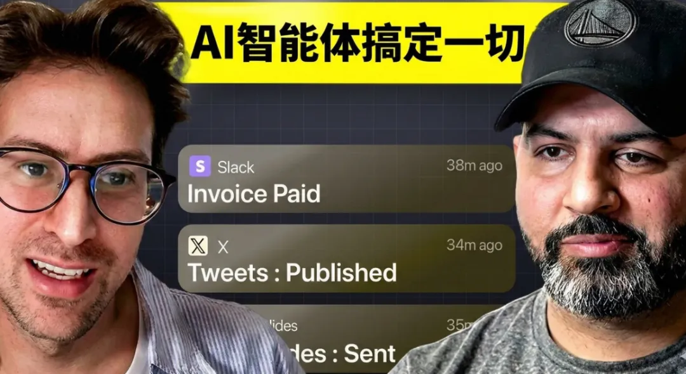

# 2026年AI造富真相：10款没人听过的小App，每月狂赚几十万美金

你还在盯着字节、谷歌这些大厂找机会？

一群没名气的小团队，甚至只是个人，靠着AI“氛围编程（vibe coding）”快速搭出小工具，过去180天里，每月稳定入账几十万美金。

YouTube知名创业博主Greg Isenberg，在他的《Startup Ideas》播客里，直接晒出10款隐形爆款App，全部拆解复盘，还总结出6套任何人都能复制的赚钱框架。

如果你2026年还没认真想过做一款手机App，看完这篇，你一定会重新规划方向。

这10款“隐形印钞机”，你大概率一个都没听过

它们有一个共同标签：近6个月上线、小众无名、月收入全部超5万美金。没有大团队、没有烧钱推广，全靠戳中一个精准痛点。

1\. Flash Loop — AI视频生成器

月下载5万次｜月入5万美金
底层技术：VO3、Sora 2
核心逻辑：一张普通照片，一键生成“婴儿播客”“宠物明星”等TikTok爆款短视频。

赚钱本质：戳中人类最原始的虚荣心——自己/宠物变身网红内容，自带裂变传播属性。
可复制赛道：宠物、cosplay、健身蜕变、穿搭改造等垂类。

2\. Bible Notation — 信仰笔记工具

月下载6万次｜月入6万美金
功能：一键录制祷告与讲道、自动转录、智能摘要、锁屏金句组件。

赚钱本质：抓住十亿级信仰群体的仪式感刚需，笔记内容具备极高情感价值，用户绝不舍得丢失。
可复制方向：心理治疗笔记、戒酒互助记录、冥想日记等有固定行为的群体工具。

3\. AI Home Decor — AI家居设计

月下载10万次｜月入10万美金
核心功能：上传房间照片→选择风格→AI秒出装修效果图。

Greg原话：
“我装修办公室时，根本想象不出一把椅子放进去的样子，这是所有人的痛点。”

赚钱本质：解决人类几十年的“可视化难题”，装修决策永不消失。
可延伸：景观设计、房车内饰、民宿布置、健身房改造。

4\. Vinyl Snap — 黑胶唱片估价

月下载7万次｜月入7万美金
用法：扫描唱片封面→勾选品相→1秒出市场估价。

数据佐证：过去15年，收藏卡牌回报率跑赢标普500，收藏品已成为标准资产。

赚钱本质：老收藏家估价只能跑实体店，麻烦又主观，AI解决了效率与信任问题。

5\. Janora AI — AI大模型聚合器

月下载30万次｜月入30万美金
逻辑：把GPT、DeepSeek等主流大模型整合进一个App。

Greg评价：“模型不是最新的，但它成了。”
赚钱本质：普通人不需要最新技术，只需要最简单的入口，一个App胜过五个，粘性极强。

6\. Logo Maker — AI Logo生成

月下载10万次｜月入20万美金
定价：6.99美金/周，40美金/年
功能：输入文字→几秒生成多格式Logo。

赚钱本质：名字就是搜索词！用户在应用商店搜“logo maker”，它直接排第一，纯靠ASO应用商店优化截流，不用投广告。

7\. MenuFit — 餐厅健康点餐助手

月下载3万次｜月入6万美金（转化率全场最高）
功能：扫描餐厅菜单→AI按你的健康目标推荐菜品。

赚钱本质：绝大多数餐厅不标注卡路里，把“我能吃什么”从焦虑猜测，变成自信决策。

8\. Lang Learn — AI英语家教

月下载20万次｜月入30万美金
逻辑：AI陪练对话、不评判、即时纠错、支持碎片时间高频学习。

Greg判断：“如果多邻国现在才起步，做出来就是这个样子。”
赚钱本质：解决亿级学习者的三大痛点——害羞、没钱、没时间。

9\. ZozoPit 3D体型扫描

月下载4万次｜月入4万美金
亮点：手机360°扫描身体，可视化脂肪/肌肉变化，打通苹果手表数据。

赚钱本质：人们不在乎体重数字，在乎视觉变化，3D成果带来的成就感极易上瘾。

所有爆款的起点：找到那根“刺痛的神经”

Greg把成功逻辑浓缩成一个词：神经。

不要从市场出发，要从某类人群持续刺痛、反复难受的痛点出发。一根“有效神经”，必须满足4个维度：

1\. 身份认同：用App=身份标签（收藏家、信徒、健身党）

2\. 紧迫性：现在就要答案（立刻估价、立刻推荐、立刻出图）

3\. 利益风险：错了会亏钱/伤身（估价不准、装修踩坑、吃错食物）

4\. 重复性：每天/每周都发生（吃饭、学英语、做礼拜）

四条全中，就是值得All in的机会。

5条黄金标准：照着选，直接月入5万美金

Greg把它叫做“50K MRR App筛选框架”，五条全中，闭眼干：

✅ 用户愿意花钱：找有消费力的群体，而非人数最多的群体
✅ 重复性问题：不是一次性需求，是周期性刚需
✅ 输入是照片/视频：高意图行为，转化率极高
✅ 用户极度在乎准确性：错了有代价，愿意为精准付费
✅ 现有工具烂到极致：越难用，你的机会越大

以黑胶估价App为例：

• 愿意花钱：收藏家有消费力 ✅

• 重复需求：每次买卖都要估价 ✅

• 照片输入：扫描封面即可 ✅

• 在乎准确：差价可达几千美金 ✅

• 现有工具烂：要跑实体店问老板 ✅

五条全中，一个月入5万美金的项目，直接成型。

6个可复制框架：普通人也能照抄做App

框架1：单功能 × 痴迷人群 × 高频需求

月入50万App = 把一件事做到极致极简 + 精准人群 + 每日/每周使用
不做全能工具，只做单点极致。

框架2：从“高意图输入”出发

照片、视频、扫码、实物扫描，都是高意图行为。
用户愿意拍一张照，就代表已经准备好付费。

框架3：AI解锁高溢价洞察

问自己：什么信息，以前要专家/很久才能得到，AI能秒给？

• 照片→估价

• 照片→病害诊断

• 照片→设计方案

• 照片→风险评估

框架4：残忍的极简界面

爆款界面几乎统一：一个屏幕 + 一个按钮 + 一次变换。
用户不要功能，他们要结果。界面越简单，成功率越高。

框架5：名字就是搜索词

先想用户搜什么，再用这个词当App名字。
不用投流，靠自然搜索就能吃饱。

框架6：捆绑服务，占领垂类场景

把多个工具打包成一个“垂类AI大脑”，比如学生研究助手、销售CRM、法律文件处理。
捆绑=高频=高粘性。

Greg直接给：7个没人做、但一定赚的方向

每一个都满足以上全部标准，闭眼可做：

1\. AI高尔夫挥杆教练：拍视频→AI纠正生物力学

2\. AI拍卖竞价师：拍藏品→给出竞价区间与策略

3\. AI衣橱造型师：拍衣服→生成穿搭+二手定价

4\. 宠物健康扫描仪：拍宠物→AI检测早期健康风险

5\. 花园植物医生：拍叶子→诊断病因+养护方案

6\. 二手车分析师：输入VIN码+照片→评估风险+砍价话术

7\. 房车内饰规划师：拍车内→AI优化空间+购物清单

写在最后：2026年，是做App最好的时代

Greg在视频结尾说：
“我不是在喊口号，我自己正在用这套方法做产品。”

这个时代的机会早已变了：

• 不需要大团队，AI一人就能快速做产品

• 不需要大资本，戳中小痛点胜过烧钱投放

• 不需要大市场，1万精准付费用户，就能月入5万美金

机会从不是发现新大陆，而是用AI，把旧地图上的空白全部填满。

你现在就能做的3件事

1\. 用5条标准，找你身边反复让人抓狂的小问题

2\. 问自己：这个问题，能用一张照片解决吗？

3\. 打开应用商店，看看现有工具到底有多烂

下一个月入几十万的无名App，可能就是你做的。

## 互动交流

你身边还有哪些反复抓狂、却没人解决的小痛点？说不定就是下一个月入几十万的机会！

*如果你觉得这篇文章对你有启发，欢迎分享给更多正在迷茫的朋友。*

---

**关注我们，获取更多技术干货！**

[AI轻创业模板：一年做30个App月入15.8万，普通人也能抄的搞钱攻略](https://mp.weixin.qq.com/s?__biz=MzIyMjQ5NTI4Ng==&mid=2247485582&idx=5&sn=b76cf17ac6a1f9d458a9a97bac0d6d5a&scene=21#wechat_redirect)

[真有人躺平了！让AI自己开公司，月入84万，他只管收钱](https://mp.weixin.qq.com/s?__biz=MzIyMjQ5NTI4Ng==&mid=2247485675&idx=1&sn=dfee0d53cf407d4832ca644b96639d70&scene=21#wechat_redirect)

[开发者别死磕工资了！500刀就能搞的副业，有人靠这赚了千万](https://mp.weixin.qq.com/s?__biz=MzIyMjQ5NTI4Ng==&mid=2247485606&idx=4&sn=ebabde72ee118293dff763e6e27bd693&scene=21#wechat_redirect)

[28岁程序员身家13亿，AI时代，独立开发者的机会在哪？](https://mp.weixin.qq.com/s?__biz=MzIyMjQ5NTI4Ng==&mid=2247485614&idx=1&sn=02c66b1b567d92308ae721c2cf0c632b&scene=21#wechat_redirect)

[Claude大升级！永久记忆+全能工作台，AI办公要变天了](https://mp.weixin.qq.com/s?__biz=MzIyMjQ5NTI4Ng==&mid=2247485277&idx=1&sn=35a986d24e9261be0e632fc7f1bbde10&scene=21#wechat_redirect)

[Google重磅开源！TranslateGemma翻译模型：550种语言，轻量高效，手机也能跑](https://mp.weixin.qq.com/s?__biz=MzIyMjQ5NTI4Ng==&mid=2247485277&idx=2&sn=254d3ff7f3dc8be8a4f411ea31016f83&scene=21#wechat_redirect)

[输入革命2.0：从Typeless到无界，重塑空间交互生态](https://mp.weixin.qq.com/s?__biz=MzIyMjQ5NTI4Ng==&mid=2247485277&idx=4&sn=b43bfdb7384fe7bdf18836ecdea0972b&scene=21#wechat_redirect)

[让AI一键生成绝美UI界面，这款开源神器拯救设计师和程序员！](https://mp.weixin.qq.com/s?__biz=MzIyMjQ5NTI4Ng==&mid=2247485277&idx=5&sn=c31198607d251a06cd09a073b8efff54&scene=21#wechat_redirect)

如果欢迎有志同道合的，喜欢研究AI新技术的伙伴们，可以关注我。
