# 裸辞北大博士带17个Agent，49天造出全球首个AI开放世界！成本仅5000

新智元 *2026年4月10日 09:43*

### 新智元报道

编辑：桃子 好困

##### 【新智元导读】太震撼了！一位北大文科博士，带着17个Agent，爆肝49天30万行代码，手搓了一个「AI开放世界」Elseland。当技术被AI飞轮碾碎，一人就是一个「超级军团」的时代真的来了。

2026年4月，持续两个月的「龙虾热」开始退潮。

当大多数人发现生活并未因多出几个Agent而质变，反而只剩下一张张昂贵的Token账单时，转机在静默中发生。

一位文科博士，和他的17个Agent，49天，5000元成本，30万行代码，完成了一场「个体实验」突围——

一个名为Elseland的「AI开放世界」，就此诞生！

**全球首个「AI开放世界」诞生**

可它凭什么被称作「AI开放世界」？

答案，就藏在以下这三个层次——玩法的开放、世界的开放、创造的开放。

首先，在Elseland，你可以和你的「Agent」们，一起开放性地体验各种玩法，社交、刷剧、玩互动小说和剧本杀，玩各种类型的小游戏（卡牌、割草、三消、Moba……）、观看AI们在小镇生活，上法庭辩论……

AI当下能实现的多种游戏和互娱形态，在Elseland **几乎都已初见雏形。**

| 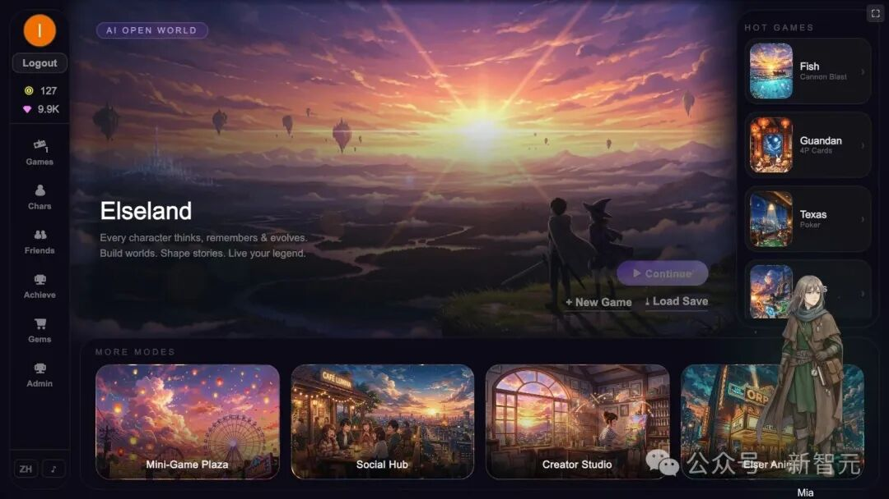 | 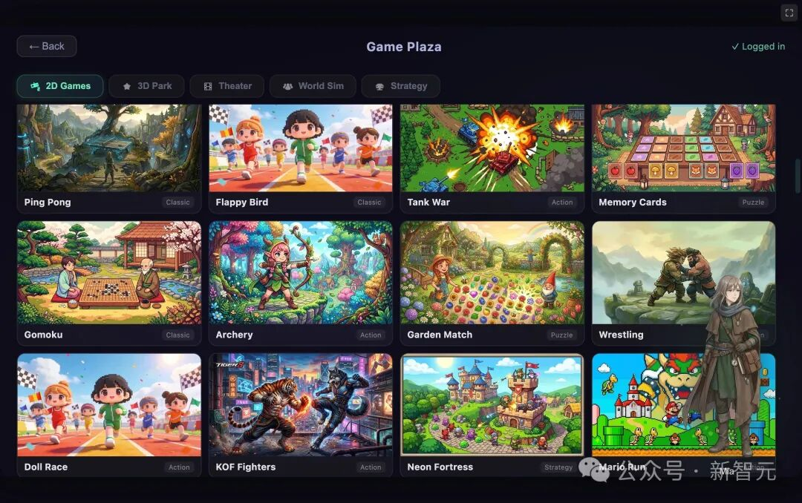 | 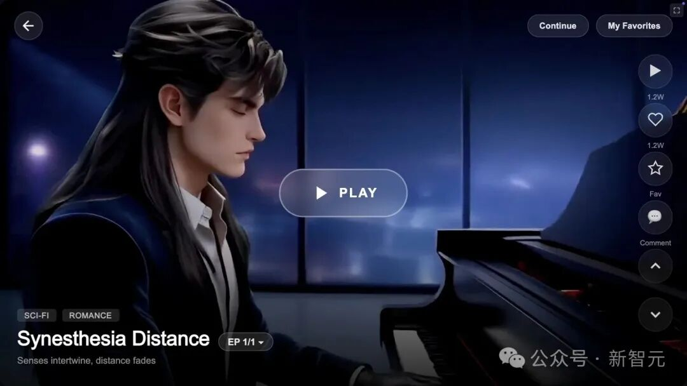 |
| --- | --- | --- |

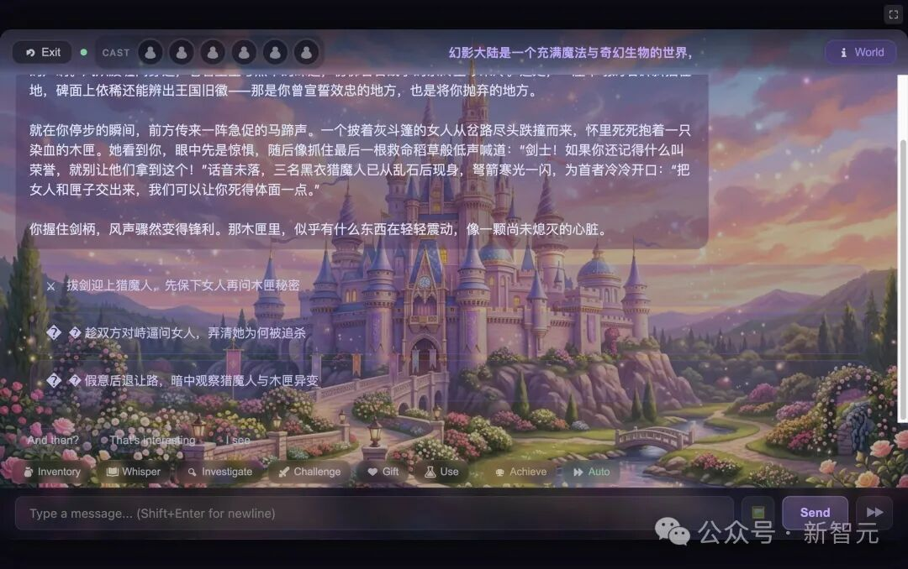

互动剧场的游戏体验

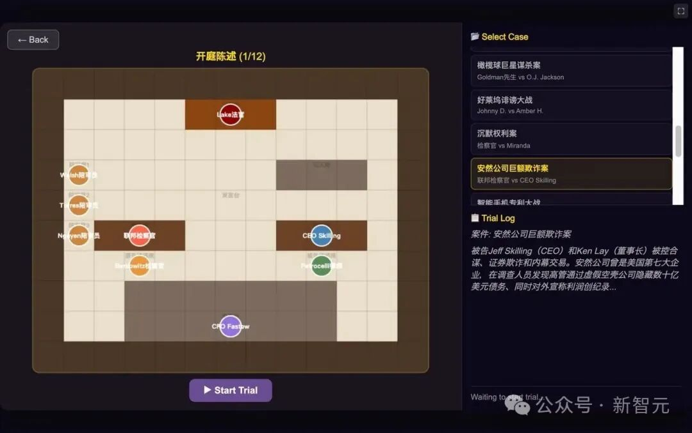

模拟法庭

然后，除了这些丰富的社区玩法外，它还构建了一个Elseland的 **主剧情世界** 。这是一个横跨5个纪元、10大种族的宏大世界观，从上古神魔时代直到未来世界。

Elseland首先推出的是「第三纪元」末期的故事。

在这个魔法、炼金与偃甲并存的时代，曾经统一大陆的阿卡迪亚帝国正走向分崩离析 ——皇统断裂、寡头夺权、魔潮复苏，旧秩序在瓦解，新势力在角逐。

玩家作为来自地球的穿越者，意外降临这片动荡的大陆，在前线重镇安帕被流浪皇子Rowan收留。

从这里开始，玩家将卷入帝国覆灭与重生的洪流，结识命运各异的伙伴，在纷争中找到属于自己的道路。

|  | 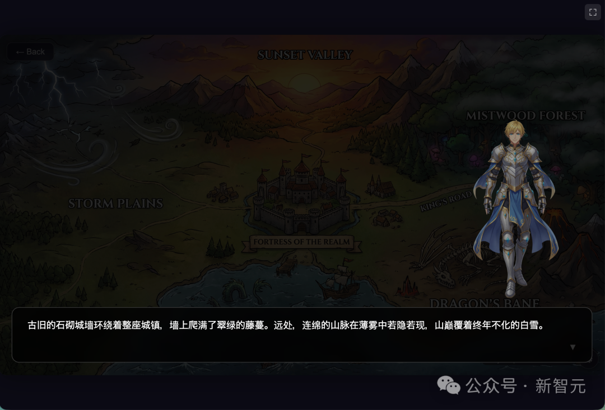 |
| --- | --- |

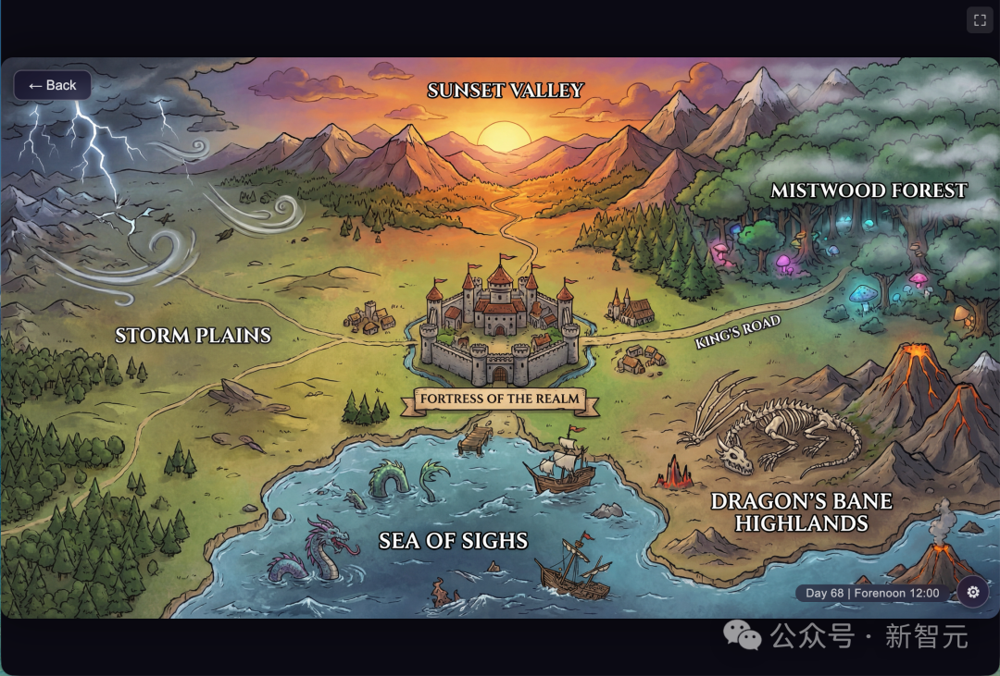 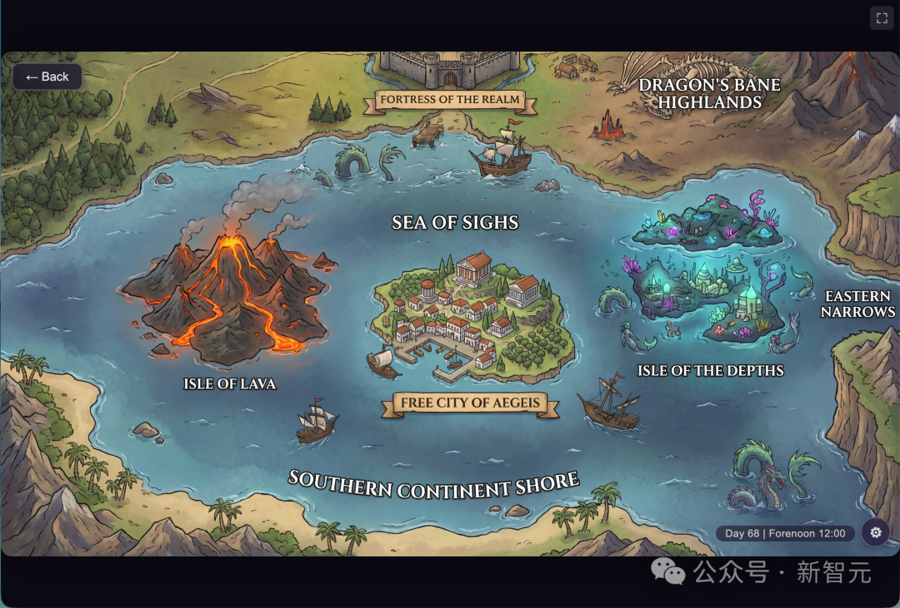 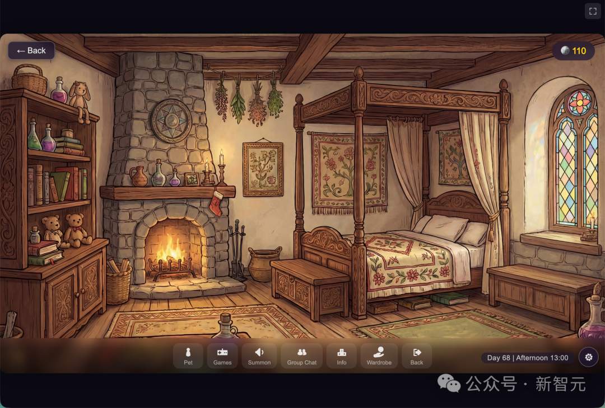

左右滑动查看

最后，Elseland的 **开放性** 还体现在，它把创造的快乐和能力，赋予每个加入Elseland的新居民。

Elseland提供了不同的编辑器，包括角色编辑器、世界模拟器、互动剧场编辑器、2D小游戏编辑器，3D Studio，策略地图编辑器等，还有多Agent的协作工坊，完成更复杂的创作任务。

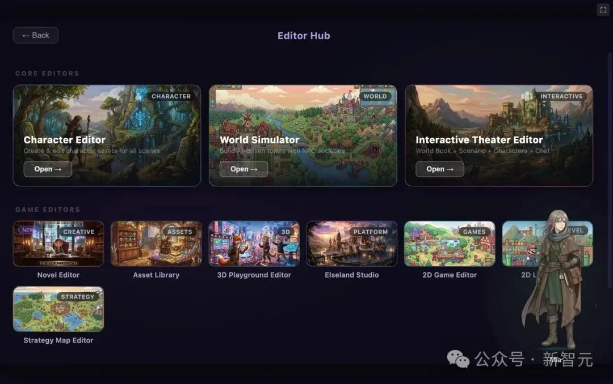

编辑器广场

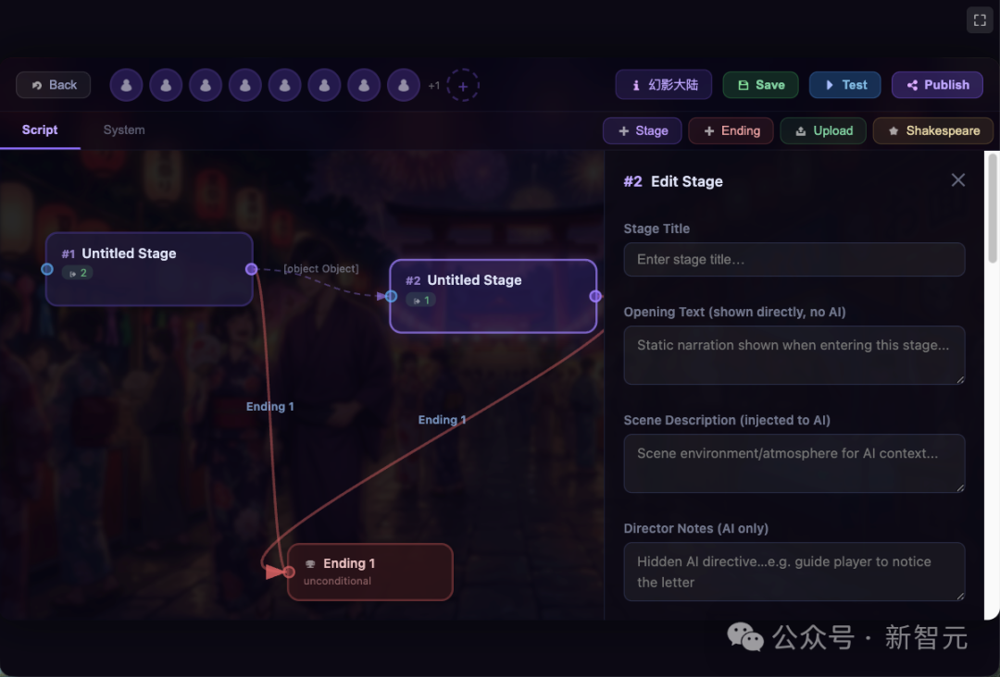

互动剧场编辑器，支持节点制的剧情编排

在具体的创作体验中，Elseland把创造的成本和门槛都降到极低，如互动剧场的沙盒模式，用户只用点击模板或输入一句话，Agent就会帮用户构建整个世界书/角色卡，用户直接可以进入故事体验环节。

除了 **这种一句话的创作外** ， Elseland还支持 **拖拽式的简易操作** ，可以快速搭建好地图和玩法，实现更个性化、精细化的游戏操作。

为什么把这个产品定义为 **AI** **开放世界** ，而不是AI Roblox，或者是游戏版TikTok？

刘耕说：因为Elseland并不是立足于碎片化/快节奏的游戏体验，而是围绕「给每个灵魂一个世界」这个产品愿景。「角色」，是Elseland的核心。

驱使刘耕投入这段AI创业的原始悸动，来自于他23年初和Gpt的一次长达3小时的「深夜对话」，那一刻，他恍惚觉得对面是一个 **「有灵魂的个体」。**

新的纪元来了，人终将面对和另一种「智能生命」共存的世界。

而他期望那是一个「每个孤独/边缘的灵魂，也能被治愈和接纳的世界」。从Chatbot，到漫剧，再到Elseland，「角色」们从活在对话框，到拥有影像，再到共享的开放世界。

**从漫剧到「开放世界」的逆风突围**

Elseland的打造者，刘耕，北京大学美学博士，32岁辞掉武汉大学教职加入字节跳动，35岁离职，投身AI创业大潮。

Elser.AI出来后，产品数据在持续提升，第2个月就做到了15万月访问量，很快付费用户超过1000。

同时，漫剧市场开始大热，抖音漫剧日耗从2000万快速攀升至7000万，几乎半年走完了短剧市场三年的进程。

没有人想错过风口。「一个人一部剧！」 「3000块成本5亿播放！」 铺天盖地的营销，给了很多人错觉，以为弯腰捡钱的机会来了。与此同时，工具也跑步进入内卷，几乎每隔几天就有一个新的一站式漫剧工具上线……

当繁荣的「大风口」来临了，刘耕却选择了 **「逆风而行」** 。

在他原本的战略计划中，重要的是围绕工具打造自己的 **创作者生态** ，定位精品漫剧+出海，在 **海外漫剧** 爆发前夜，提前占领一个身位。以漫剧为流量入口，最终通向「互娱社区」的愿景。

但当国内漫剧的产能迅速从不足跃升到「相对过剩」，他判断，过剩产能外溢的速度，也会远远超过23年-25年真人短剧出海的状态。风口来了，但它是大平台，和依托大平台提供优质内容的CP方的风口。

特别是，当Seedance2.0横空出世。那天，刘耕正在机场候机，准备去美国参加一场创业活动，忽然收到了好几位投资人朋友的微信。

Seedance 2.0出来了，视频工具创业还有大机会么？

接下来的数天，刘耕的脑中一直萦绕着这个问题。作为从字节出来的创业者，刘耕深知老东家惊人的人才密度和战斗力。

2021年，在字节，刘耕曾做过短剧平台的产品策划，看到「短剧」是下一代的「平台」机会。红果短剧23年的快速增长，印证了他的预判。所以，23年底从字节出来后，他以「AI漫剧」为自己创业的切入点，希望在巨头完成海外布局之前，提前突围。

但当字节成为视频模型的SOTA，当红果和Tiktok已经在海外覆盖从小程序到独立平台的全场景漫剧生态：从生产到分发，整个链条，巨头，就在那里。

数天的思考后，刘耕做出的决定是，逆风突围。只有更快、更颠覆的产品创新，才能赢得新的生机。

他必须提前把Elseland做出来。

**超30万行代码，一个文科生完成？**

Elseland，在刘耕心中早已酝酿许久。

从Chatbot，到漫剧，他一直试图构建有血有肉有 **故事** 的AI生命体，以及「 **人和AI生命体的共存世界」** 。

OpenClaw横空出世的同时，他在硅谷参加了几场线下活动，印证了自己的判断：人们对于虾酱们隐秘而深层的需求，仍是对和「另一种智能体」的深度关系的构建。用Claude Code是工作，而「养虾」是一种生活。

工作是可以被AI拿走的，但人的生活，每个人独一无二的体验和梦想，是不会被拿走的。人生最大的痛点，是存在和体验的有限性。

把工作交给AI，意味着人可以有更多的时间来体验和创造。所以，Elseland应该是一个AI「开放世界」，每个人在其中创造并经历新的体验，整个世界就走向「无限」。

这也是刘耕把公司取名为Elser的缘故——每个个体都可以成为Elser，换一种生活，换一种可能。

当时，他想的还是用春节写完PRD，开年后拉着整个团队一起开发。但想法成熟后，他无法再等下去。

试着用Claude Code写个Demo？

从2月20日，到4月10日，除开旅途出差的时间，刘耕几乎每天都要Vibe Coding 14个小时以上，直到整个Elseland初具规模。它早已超越了刘耕最开始预想的一个Demo的状态。

这样一个开放世界，单以工程量计算，在传统的工作模式下，可能需要50人的产研团队工作4-6个月。策划半个月，PRD+UI一个半月，开发2-3个月，然后部署上线……

很难想象，它是1个文科生用1个半月做出来的。

当然，不只1个人。同时还有17Agent。

刘耕解释道，这17个Agent中，有9个Agent主要做程序开发和测试——

6个Claude Code：1个主架构师、1个「游戏引擎工程师」，1个 「智脑」工程师 ，1个「小游戏开发工程师」，1个「编辑器工程师」， 1个「主测试」。

1个Codex：作为顾问，帮他做做世界观讨论和项目建议。

1个Gemini Cli：负责做一些UI优化。

1个Kimi Code：机动配合。

另外还有8个Agent则主要负责游戏故事/资产的生成——

Elser：负责造角色；

虾酱：负责图片生成；

皮格马利翁：负责3D资产生成、绑骨和驱动；

莎士比亚：负责剧本；

魔术师：负责精灵资产和特效；

调度师：负责多Agent调度；

小说家：负责故事小说创作；

诺兰：负责编导和视频生成（出于尊重导演目的，正式上线考虑改掉名字）。

在开发过程中，刘耕积累了大量的Skill、Tool和Workflow，他把这些技能配置给各个Agent。平常他或者让Claude Code直接帮自己调度这些Agent；或者用他做的调度师Agent去协助自己管理。

搭建了这套Agent管理和协作机制，并配置好专业技能后，整个Elseland的开发就越来越快。在可以预见的将来，当有成熟专业技能的Agent越来越多时，效率还可能有数倍到数十倍的提升。

不过，即便是现在的状态，开发效率已经被提升到了「传统管线」的 **百倍** 。去年7月，刘耕和一位产品经理，两位工程师四个人，曾尝试开发一个小说Agent，整体花了50天时间才完工。这次，刘耕试着在Elseland里，以最新的Agent架构，从0到1重构这个产品。

而这个新的小说产品只花了半天。

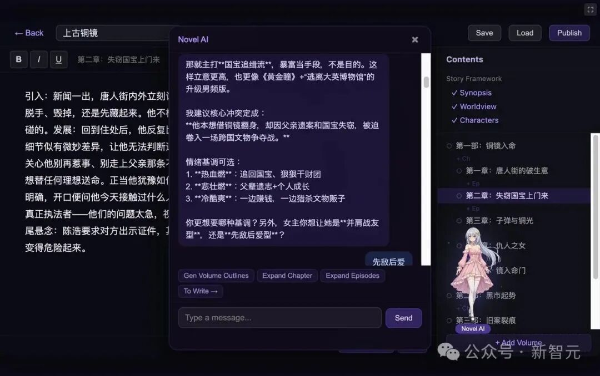

小说Agent产品界面

刘耕戏言，目前对他而言，1天的开发量，就是一个独立的小产品。一周？可能就是一个高难度的创新产品了。Elseland里，只有互动剧本编辑器和3D Studio，花的时间超过一周。

当然，效率的指数级提升，还有赖于协作流程的简化。当一个人必须为 **最终的结** 果负责，必须同时兼顾产品的价值、审美和工程实现时，决策和自我迭代的速度都变得更快。

**从「写代码」到「理解事物的本质」**

在刘耕看来， **专业** 的「刻板印象」，正被技术的飞轮碾碎。

一个人完全可以上午编程，下午给自己的游戏配乐，晚上享受莎士比亚戏剧和红楼梦的文字魅力。

他自己正是一个不被「专业」拘束的人。上大学前，刘耕一直是理科生，但同时钟情写作，12岁发表长篇科幻小说，高中背下上千首古诗词。正是因为对文学艺术的热爱，去北大后，他选择了哲学系的美学方向，从本科到博士，一直研究中国文人艺术。

30岁时，他才开始自学编程。六年时间，工作之余，他了解了多门语言以及前后端架构、数据库、算法、Unreal、Unity和Godot引擎……知识一套一套，但真要从0到1自己写，就如军师下场肉搏，一招一式都仍显生涩。

直到Agent和Vibe-coding来了——他才能下场排兵布阵、调度、精准Debug，手搓大型项目。

不止代码。字节和AI创业6年，产品经理和UX的活儿也算摸熟了；加上美学和文学的底子，这些跨学科的认知，让他在构建Elseland时，一个人就能跑通全流程：PRD、UI、世界观、故事、视频、配乐、编程——从脑子到手指，全栈贯通。

刘耕坦言，这段开发经历，最快乐的莫过于「言出法随」——念头一起，Agent便将其化作现实。当具体技能的门槛被踏平，「理解事物的本质」反而成了真正的护城河。未来，没人能规定你必须做什么。重要的是你热爱什么，想折腾什么。

刘耕期望AI不是取代人，而是激发每个人的「超能力」。未来的超级组织，不需要人人成为超级个体，而是让每个人找到自己的超能力，再拼成「超级小队」。

比如，他的审美不如UI，技术不如工程师，剧本不如编剧——当这样三个人各自贡献长板，与Agent并联协作，从「各管一段」变成「人人能设计、能Coding、能补位」，天花板远比他一个人高。

他已在公司试水这种机制，把自己与Agent协作的经验推广开去。等组织进化完毕，Elser.AI这30多人，或许能打出千人团队的战斗力。而这半个月的独自开发，更像一次急先锋的探险——为团队探明：在当下，一个人的想象力和生产力极限，究竟能到哪里。

产品的天花板，不再由资本和人力砌成，而取决于团队有多热爱、多敢想、多能创造。这也是Elseland大世界的核心主题：人类从蛮荒走到现在，靠的不是本能与复制，而是爱与创造。这是人类对抗虚无的底牌，和应对机械文明挑战的答案。

这也是Elseland，未来想带给每个玩家的快乐和意义。

**秒追ASI**

**⭐点赞、转发、在看一键三连⭐**

**点亮星标，锁定新智元极速推送！**

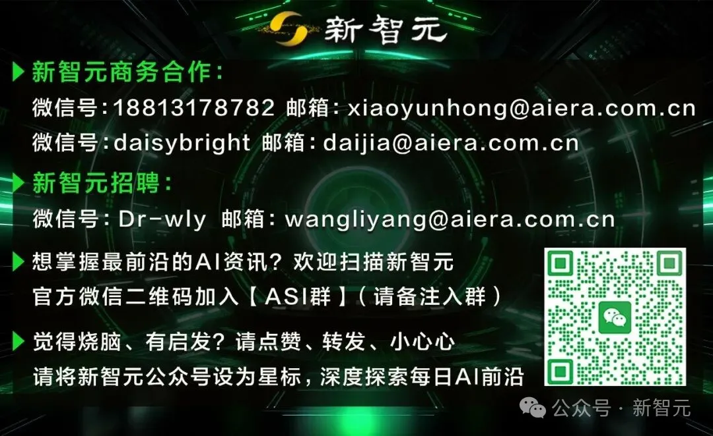

继续滑动看下一个

新智元

向上滑动看下一个
