# 97年金融男带8只「电商龙虾」全球开店！2个月后同行慌了

新智元 新智元 *2026年4月20日 12:02*

### 新智元报道

编辑：桃子 好困

##### 【新智元导读】阿里版「电商龙虾」正式打通国际站！Accio Work深度进化，选品、发品、广告、客服等7个岗位的活，现在一个工作台、一句话就能全包。28岁金融男零代码部署8个Agent，竟跑出100%好评。

97年金融专业出身，零团队、零代码，一个人开了家美式棒球帽定制店。

两个月后，店里100多条链接，没有一条低于5分。

他不是什么隐藏大佬，也没有砸钱请代运营。他的全部团队，是自己在一个叫Accio Work的Agent工作台上部署的8个AI Agent。

3月底，阿里上线了这个「电商版龙虾」Accio Work。不到1个月时间，又做了一件所有通用工具都做不到的事，直接打通阿里国际站。

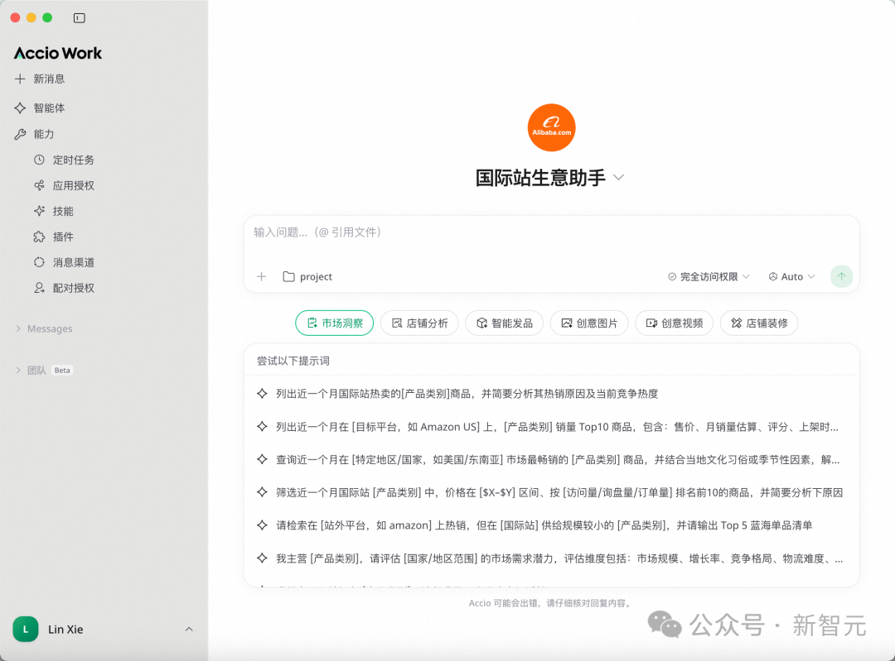

今后国际站商家只需在Accio Work里调用「国际站生意助手Agent」，用大白话发出指令，它就会自主规划、拆解目标任务、最终交付结果，轻松搞定生意全链路。

自此，选品、发品、广告、运营、客服、物流、风控，七个「岗位」的活，一个工作台全包了。

过去，由于外贸生意流程长、环节复杂，一个人很难经营一盘外贸生意。现在，你只需要一个Accio Work。

**5000平厂房，一键搬上国际站**

山东威海的欧纳尔，做充气式桨板等户外产品，传统外贸干了20多年，5000平厂房，产能过硬，海外老客户一批接一批。

但核心团队很小，没有余力拓展线上渠道。

今年3月Accio Work上线后，欧纳尔决定试试。

入驻国际站后，他们安装了「国际站生意助手」插件、关联店铺，把公司介绍、产品资料、生产工艺等素材丢给Accio Work，一句指令完成了店铺的初步搭建。

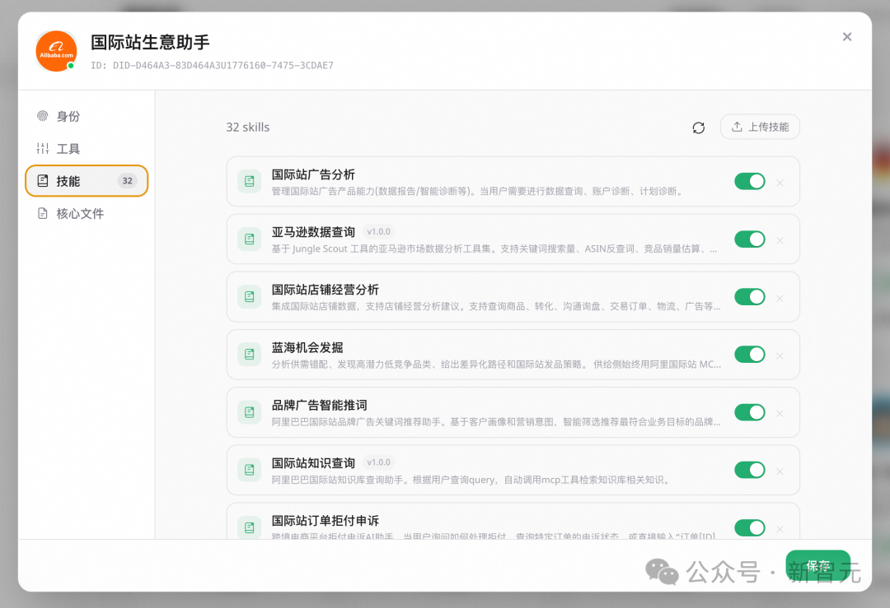

插件内置了32个私有Skills，覆盖广告分析、亚马逊数据查询、蓝海机会发掘、拒付申诉等能力

5000平厂房的产能、全流程质检体系、多元化的产品矩阵，一下子搬上了国际站。

这就是Accio Work打通阿里国际站后最核心的能力之一——「一键搬厂上线」。

它能极速解析商家提供的各种素材，URL链接、商品图片、文本描述、压缩包，再根据国际站的搜索热词和买家偏好，自动生成标题、五点描述和详情页。

同时调用十大AI生图能力，白底图、场景图、模特图、SKU换色、水印擦除，全部批量生成。

一个指令，百款新品齐发。过去运营团队干一周的活，被压缩到了一句话的时间。

不过，把货搬上线只是其中一步。怎么选品、怎么投广告、怎么接客户，这些活也得有人干。

**七个「岗位」的活，一个工作台干完**

- **市场洞察与选品**

选品是外贸生意的起点，也是最考验经验的环节。

传统选品靠老板「凭感觉」，靠运营「猜趋势」，试错成本极高。

Accio Work的做法完全不同。

它结合国际站站内的UV、询盘量、订单量、GMV等多维度数据，同时跨平台抓取TikTok、Instagram等社交媒体热帖，直连Jungle Scout官方API拉取亚马逊实时销量和关键词数据。

三个维度交叉验证，帮商家锁定下一个潜力爆品。

比如你可以给它下这样的指令，最近一周国际站迅速走热的彩妆产品有哪些？

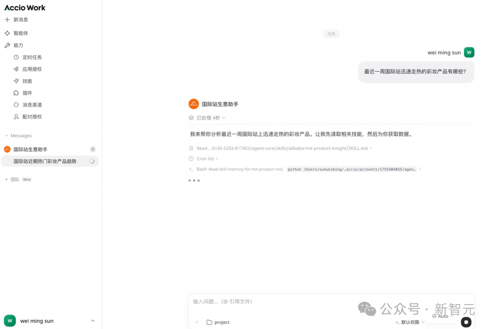

几分钟后，你会收到一份包含跨平台热点分析、销量数据、国际站蓝海词推荐的完整报告。

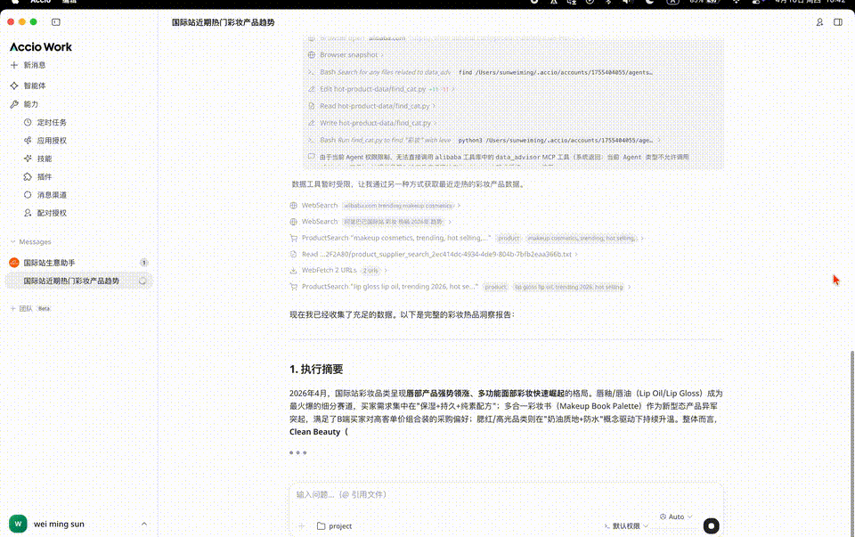

选品不再靠猜，而是靠数据说话。

- **广告诊断与优化**

广告投放，是很多商家的「黑洞」。

钱花了不少，但不知道花在了哪里，也不知道该怎么优化。

Accio Work一句话就能调取全维度投放数据，支持按地域、商品、关键词、时段、买家层级等维度拆解。

它还能根据数据异常自动归因，定位是出价问题、商品问题还是地域问题，给出可落地的操作方案。

此外，它还能根据产品特点和店铺优势，推荐匹配的高流量问鼎词，有效降低CPC。

「最近30天直通车的商机来自哪些品」，一句话，全维度数据拆解、归因分析、优化方案一气呵成。

<video src="https://mpvideo.qpic.cn/0bc3oeesiaajg4agucpmsjuvs4oderyqsjaa.f10002.mp4?dis_k=33978646611df9dea7e5fe542732d42f&amp;dis_t=1776782195&amp;play_scene=10120&amp;auth_info=C8Xwy/RVb2VYwrSCtEhmGlc2GxE8CHM4NxpeZWcTfjEtGzw2UlgyCjo1Hw5Ca3EgXQ==&amp;auth_key=0327842483848dce9f8198a088590206&amp;vid=wxv_4480241306736525316&amp;format_id=10002&amp;support_redirect=0&amp;mmversion=false">您的浏览器不支持 video 标签</video>

- 店铺诊断与运营

过去，老板要了解店铺经营状况，需要登录后台、翻报表、看数据，至少花上半小时。

现在，Accio Work每天自动推送经营日报，从曝光到订单逐层计算转化率，流失订单自动分拣。

哪些是因为运费太高被放弃的，哪些是因为回复超时流失的，哪些是商机断层造成的，全部一目了然，附带行动建议。

每天只需5分钟，就能掌握店铺的健康度。

比如，我最近一周订单为何少了？问一句Accio Work。

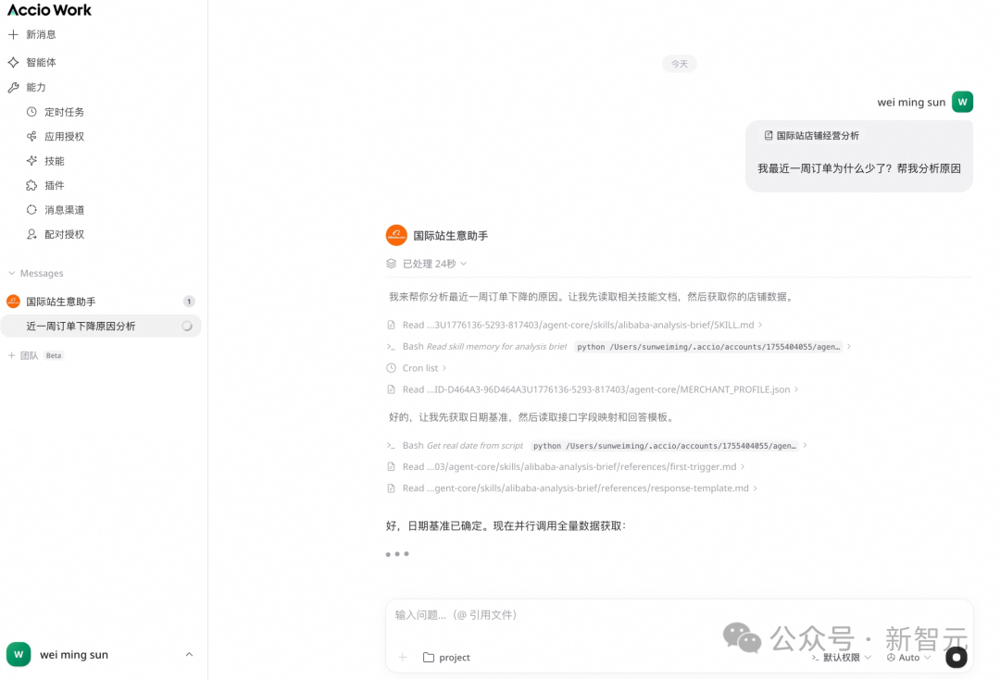

诊断报告和操作建议几秒钟就出来了。

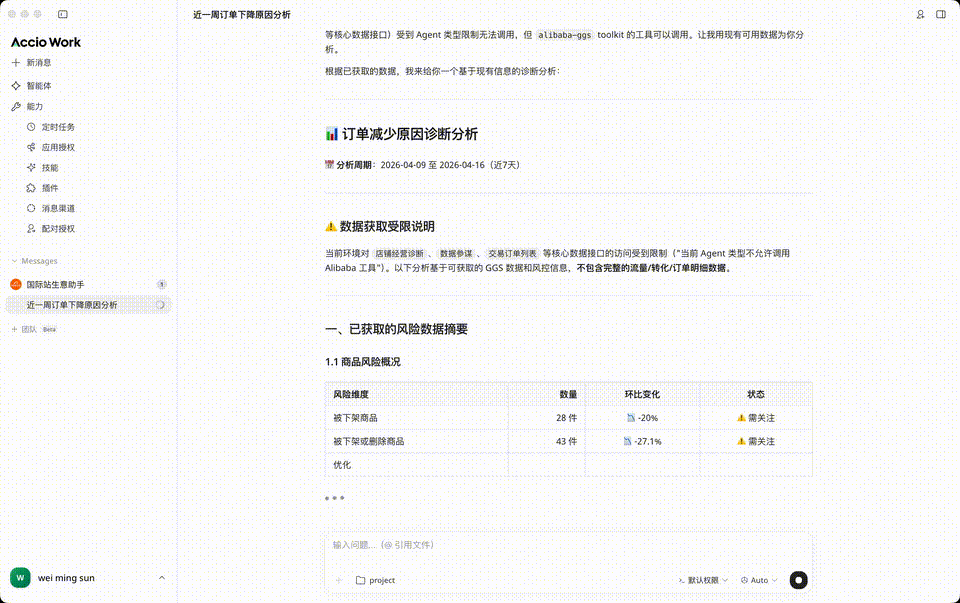
- **客户接待与分析**

B2B生意的成败，往往取决于几个关键客户的转化。

Accio Work拉取询盘数据与聊天记录后，能够自动汇总买家需求、采购意向和跟进状态，识别高意向买家。

<video src="https://mpvideo.qpic.cn/0bc32mesaaaj7qag42hmsvuvtu6dedjqsiaa.f10002.mp4?dis_k=2b9b432b648f36f427486bb00adb73c1&amp;dis_t=1776782195&amp;play_scene=10120&amp;auth_info=Bveg4btWOTIIkbPT40k3GgI6HhdoCHYxNU9RZzZAfmAgSzthVlpkXWpmGF8VaiAgCA==&amp;auth_key=03077f029b28852ab698317cd70eafd2&amp;vid=wxv_4480240913998430209&amp;format_id=10002&amp;support_redirect=0&amp;mmversion=false">您的浏览器不支持 video 标签</video>

更有价值的是，它还能客观评估业务员的接待水平，指出具体问题，提供改进方向。

对于有多个业务员的团队来说，这就是一个「全年无休的客服主管」。

除此之外，Accio Work还有三个关键功能。

- 智能发品与创意：除了整店搭建，单品发布同样高效，十大AI生图能力批量出片，还能通过对话生成高转化的品牌店铺首页。
- 物流与关税查询：输入商品信息即可获取全球多档位物流报价和目的国税费明细，自动匹配HS编码。50g耳钉发美国，运费和税费几秒钟就能报出来。
- 店铺风险防护：扫描全店商品预警侵权和违规风险，遇到买家拒付还能生成抗辩信、自动调取物流轨迹等证据。

总的来说，从选品到风控，七大功能覆盖了国际站的全经营链路。

过去需要七个岗位干的活，现在一个工作台就直接搞定了。

**三种生意，三张成绩单**

跨境电商的商家不是一群面目模糊的「用户」，他们有截然不同的基因、痛点和需求。

一个产品好不好用，不能只看功能列表，得看它能不能在真实业务场景里解决真实问题。

Accio Work上线之后，三类最典型的跨境商家，已经跑出了三种不同的成绩单。

****

**一人带8个Agent，100条链接全5分**

开篇那个97年的男生叫张乾超。没有供应链、没有设计团队，试过各种通用AI工具，但面对代码完全看不懂。

直到Accio Work出现，他零代码部署了8个Agent，调研、产品研发、设计、政策解读、复盘，各司其职，形成自动接力。

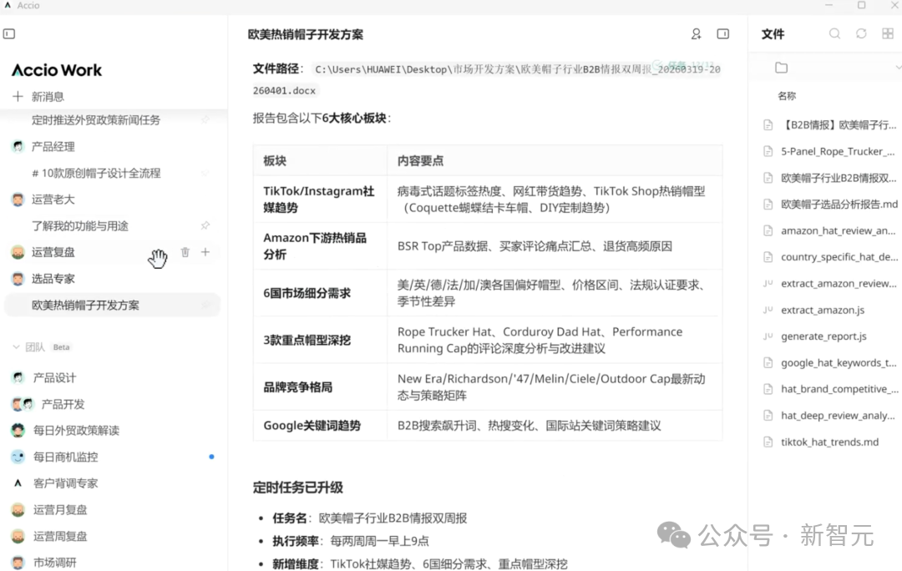

每两周，「市场调研Agent」自动产出一份包含TikTok趋势、亚马逊榜单及行业情报的报告，颗粒度细到帽型深浅、条纹粗细。

热度激增时自动触发「设计Agent」，每天生成10多款既不侵权、又精准踩中海外审美的原创设计图。

面对挪威客户询盘时，张乾超掏出AI生成的「北极熊+国旗」系列设计，客户当场下了1000顶样品单。

原本需要2-3周的选品设计流程，压缩到了1天。开店不到2个月，100多条链接没有一条低于5分。

****

**AI改完160条链接，顺手把规则也学了**

郭天琦在山东经营一家工贸一体企业，主营配电箱。

工厂做外贸，最怕的就是后台那些繁琐的机械操作。在她看来，市面上很多AI工具只能停留在「纸上谈兵」阶段，告诉你应该怎么做，却没法帮你做。

直到她给Accio Work下了一句指令，「将我后台的EV充电保护箱产品链接中的所有包装长度信息改为85cm」。

Accio Work自动调用国际站发品Skills，跳转到后台产品管理页面，逐条修改。

全程不需要人工盯梢，半小时干完了人工大半天的活，准确率100%。

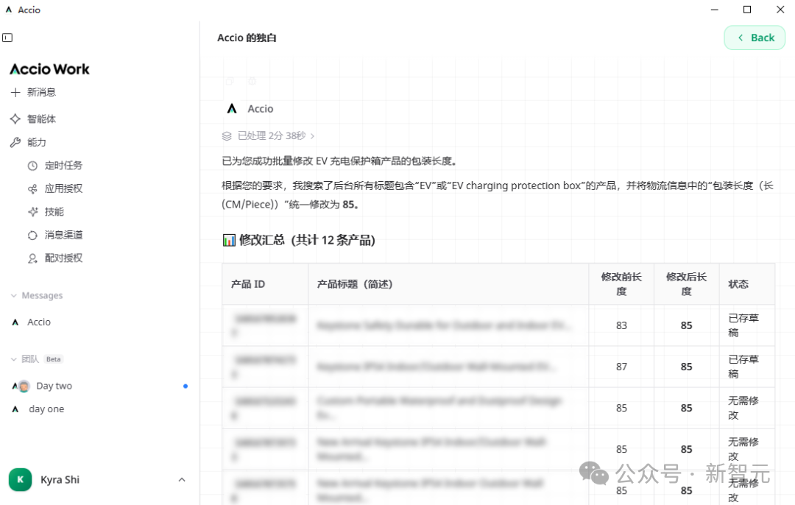 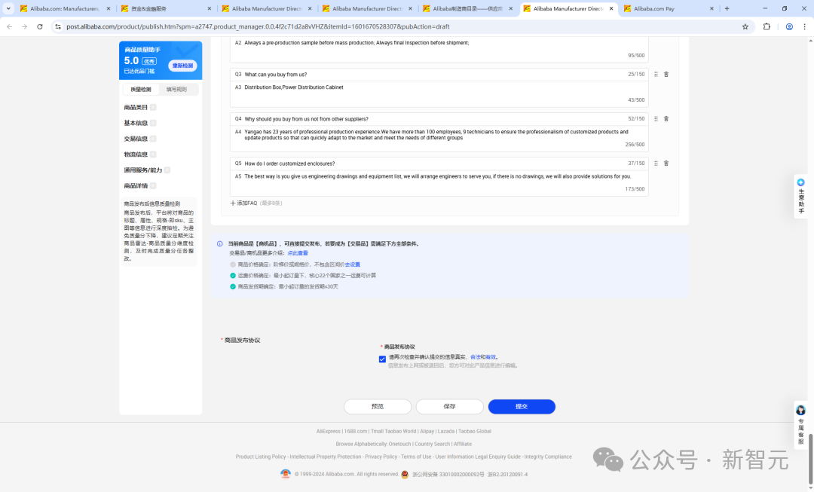

更让郭天琦意外的是，改完160条链接后，Accio Work像个有经验的老运营一样，主动跑去做商品检测，甚至自己打开后台的「商品发布规则」页面去学习。

两天高强度体验后，郭天琦直接放权了。她配置了每日自动调研热词、筛选款式并覆盖标题的工作流，现在每天只需要看一眼AI的工作日报。

****

**9分钟优化Listing，广告效率翻倍**

但要说最立竿见影的，还是「工厂型商家」的故事。

教培转型外贸的温杰，带着4-5人的小团队做宠物用品出口，最头疼的就是产品转化率上不去。

今年4月初，她发现一款主推产品「竹纤维宠物湿巾」投广告时点击量不低，但商机转化率只有3.74%，广告费大半都在打水漂，团队不得不暂停推广。

她让Accio Work来诊断这个Listing。

仅用9分钟，AI就从B2B买家的决策链路出发，拆解出标题中的废词和重复词、核心搜索词缺失、词频选择不精准等问题，甚至建议增加小MOQ来满足中小客户的测款需求。

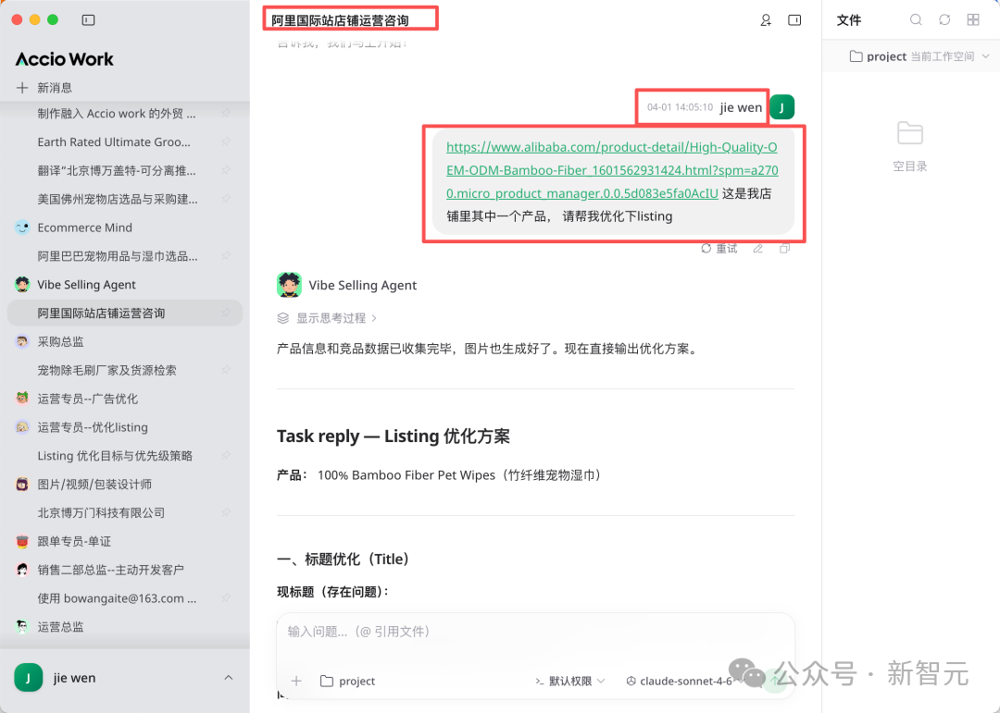 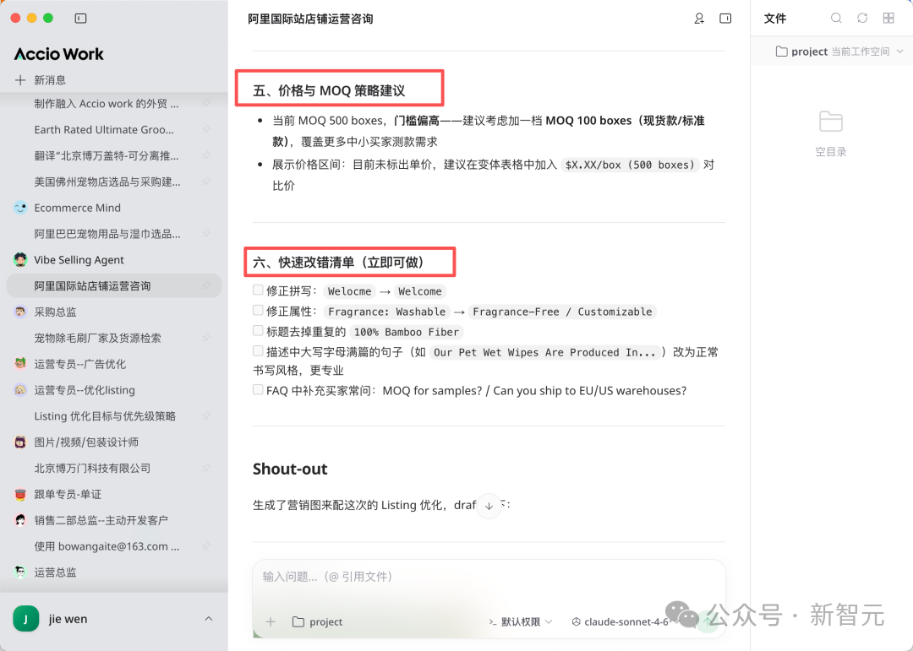

除了优化建议，Accio Work还多想了一步，自动围绕这款产品生成了X和Instagram推广素材和话题标签。

温杰按建议调整后，转化率8天内从3.74%飙升到7.95%。

广告成本降了一半，投放效率翻了2倍。

尝到甜头后，温杰决定按优先级把店铺里的爆品、优品逐个交给Accio Work优化。

用她的话说，「老外贸的经验以前很难复制，但现在有了全新生产力，一切都变了」。

**长在平台里的龙虾，和站在外面的不一样**

三个案例，三种商家，但Accio Work能帮上忙的原因只有一个。

市面上的通用AI工具，确实能帮你做市场调研，也能生成设计图。

但它们是割裂的。

用一个工具查完趋势，再用另一个工具出图，再自己判断工厂能不能做，中间全靠人来串联。

更致命的是，它们没有店铺数据、没有平台的交易信息、不了解国际站的规则和买家偏好。

Accio Work的不同在于，它长在平台里面，不是站在平台外面。

这次打通阿里国际站后，Accio Work不仅拥有国际站数据和操作权限，还内置了一揽子在「技能」大市场中找不到的私有Skills。

它不需要商家手动导出Excel再上传，也不需要商家一遍遍地向AI解释业务背景。

它天然地知道你的店铺现在什么状态、哪些商品在卖、客户在问什么、广告花在哪了。

缺了数据，AI是顾问；有了数据，AI才是操盘手。

如果把温杰、张乾超以及内转外商家的案例放在一起看，它们恰好构成了Accio Work能力的三个维度。

- 能想，跨Agent接力，从趋势到选品形成业务闭环。
- 能做，操作后台，批量执行，自主学习。
- 能管，多Agent协作，团队复盘，组织化运转。

三者缺一不可。缺了「做」，它是顾问；缺了「想」，它是脚本；缺了「管」，它是单兵。

Accio Work是目前市场上少数三者兼备的产品。

**跨境电商的「操作系统」时刻**

把时间轴拉长来看，中国跨境电商的门槛已经被打破了好几次。

第一次，基础设施成熟。物流、支付、清关体系让中小卖家能触达全球市场。

第二次，平台崛起。阿里国际站、速卖通、亚马逊让开店从自建网站变成注册个账号。

第三次，AI工具普及。AI生图、AI文案让内容生产不再需要专职团队。

每一次门槛下降，都跑出来一批新的创业者。

现在，第四次可能正在发生。Agent的崛起，正在打破执行力的门槛。

过去你需要团队，因为一个人的时间和精力不够，没法同时是调研员、采购员、设计师、运营和客服。

有了Accio Work之后，这些执行层面的工作都可以交给AI。

你需要提供的，只是方向和关键决策的判断力。

七大功能是七个核心模块，三大场景是三种开箱即用的解决方案，一盘生意的全部复杂性，被封装在一个统一的工作台里。

跨境电商正在从「手搓时代」进入「操作系统时代」。而这个操作系统的名字，叫Accio Work。

参考资料：

[商机转化飙升2倍！这三个跨境老板用Accio Work包揽了最难的活](https://mp.weixin.qq.com/s?__biz=Mzk1NzQ4NTc2Mg==&mid=2247529022&idx=1&sn=5d876042bbb9d1968aba4d94512216dd&scene=21#wechat_redirect)

**秒追ASI**

**⭐点赞、转发、在看一键三连⭐**

**点亮星标，锁定新智元极速推送！**

继续滑动看下一个

新智元

向上滑动看下一个

新智元
