# 6个塑料瓶做一双鞋，这个品牌卖爆全球60多国，220万人买单

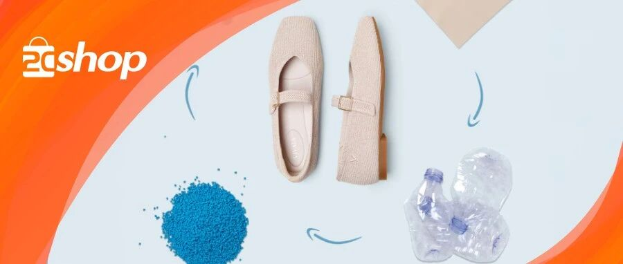

原创 Ellie 2Cshop跨境研究社 *2026年3月26日 10:30*

你敢信吗？

你扔掉的一个矿泉水瓶，可能正在变成一双鞋。

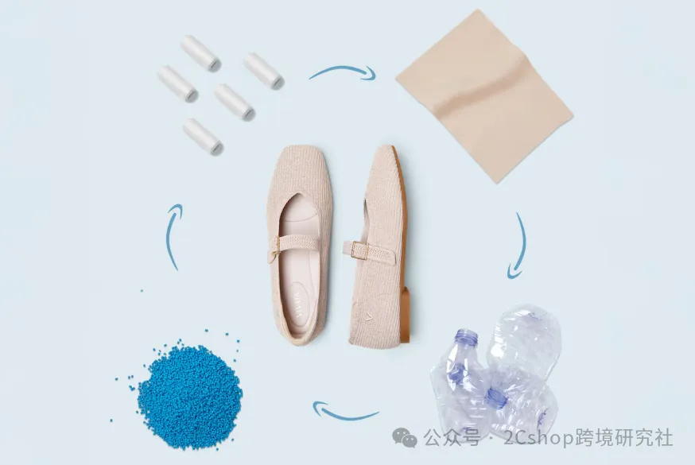

在美国、欧洲、澳洲，有一个品牌，把回收的塑料瓶做成了时尚舒适的鞋子，卖到了全球60多个国家，220万消费者买单。

它就是VIVAIA。

从一双鞋里，我们能看到什么？今天拆解这个靠“环保”出圈的品牌。

一、一双鞋=6个塑料瓶，从垃圾到时尚

VIVAIA的原材料来自美国材料供应商REPREVE，通过回收饮料瓶，经过清洗、剪切、高温熔融，把废弃塑料瓶变成柔韧有弹性的纱线。

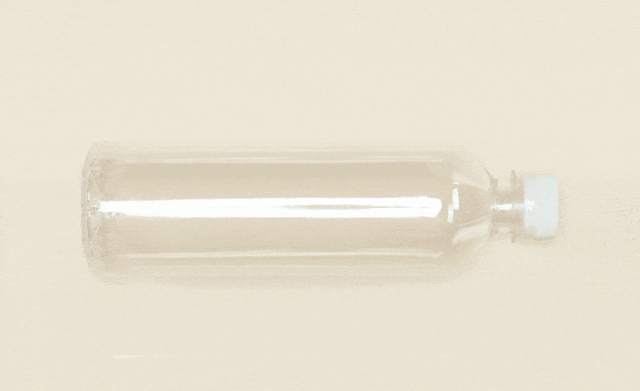

然后，用一体成型3D飞织工艺，省略传统布料裁剪步骤，制成的鞋子重量轻便舒适——仅约等于5双袜子。

“如果用皮料，从原材料到成品鞋，至少需要6个月。”VIVAIA联合创始人Marina说。而环保材料的优势是：可以随意定制，快速反应供应链，柔性生产。

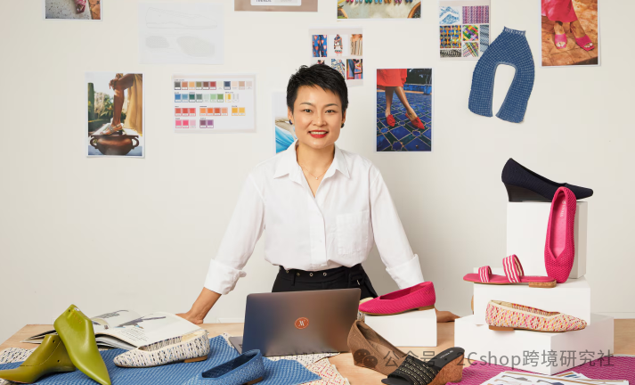

截至2025年12月，VIVAIA共回收了超过386万个PET瓶。

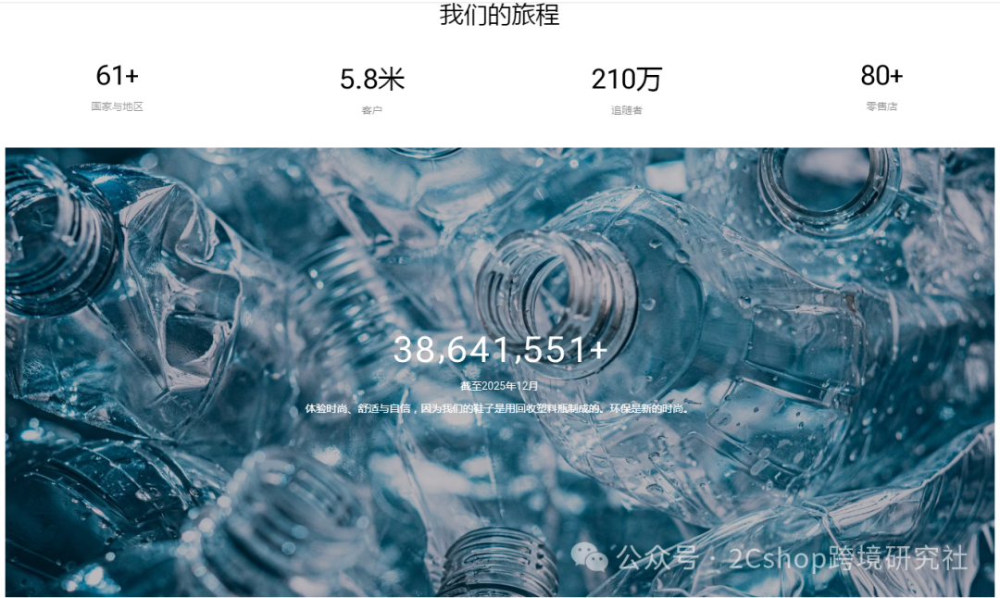

品牌名也大有渊源：双“V”和“A”象征着客户所穿的鞋子，设计来自相反的方向；双“I”代表品牌在生产鞋子时使用的塑料瓶。VIVAIA这个名称，本身就是产品、客户和环保定位的结合。

二、品牌定位：从to B到to C的转型

VIVAIA成立之初定位为全球化品牌，早期做的是to B业务。但to B弊端明显：团队需要重资产投入，要提前一年预判流行趋势，容易错过回应市场的最佳时间。

2020年，品牌重新定位，转型to C。用最传统也最有效的方式触达消费者：线上入驻亚马逊、eBay等电商平台，同时搭建独立站官网，多渠道组合销售。

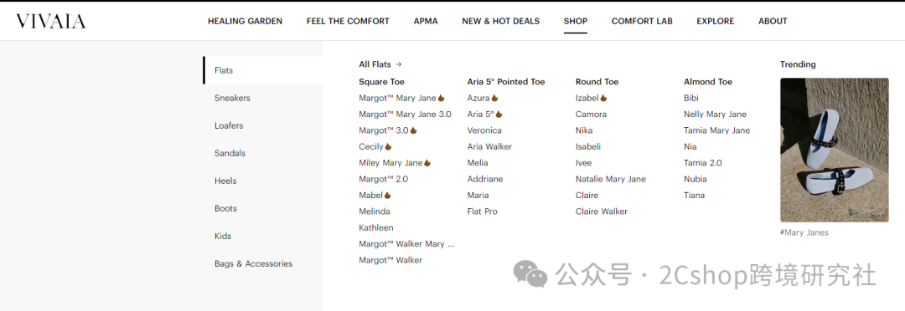

目前产品线已从鞋类延伸至平底鞋、凉鞋、高跟鞋、乐福鞋、靴子，甚至箱包及配饰。价格从最低6.99美元，到最高199美元。

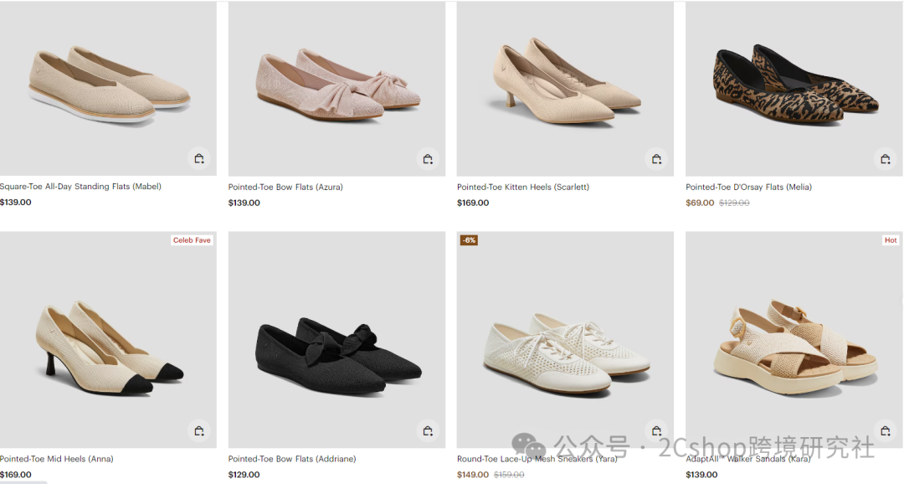

消费群体从25-44岁的职场女性白领，到好莱坞女星斯嘉丽·约翰逊、艾玛·罗伯茨、社交女王“傻脸娜”，以及谷爱凌、韩国女演员朴敏英——覆盖面极广。

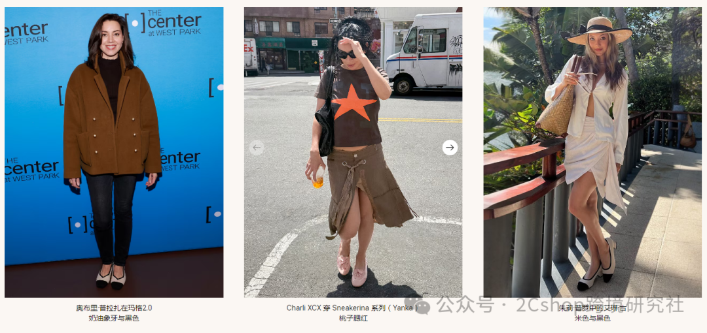

三、独立站流量

VIVAIA的社媒主阵地为Facebook、Instagram、TikTok等主流平台。目前Instagram账号已超165.3万粉丝，Facebook超12万粉丝。

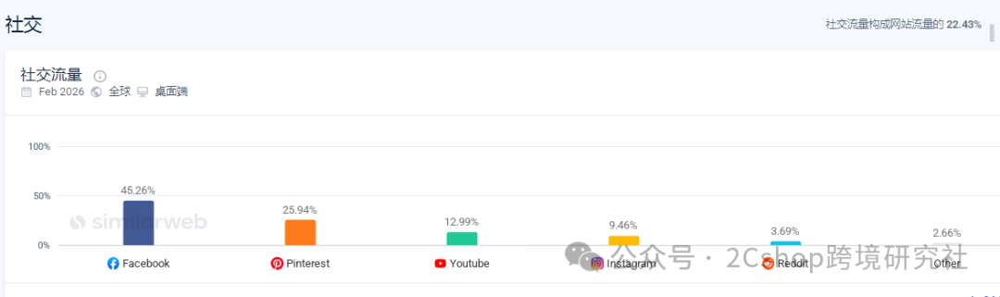

有不少消费者说：“他们一直都在Ins打广告，刚开始以为是个国外的品牌”“这个牌子在Ins上疯狂刷我的屏，后来就尝试买了一双，发货地是广州”“Ins上超级火。”

VIVAIA在Instagram上发布的内容以时尚、环保、生活为主，涵盖产品介绍、用户分享以及品牌本身的相关活动。

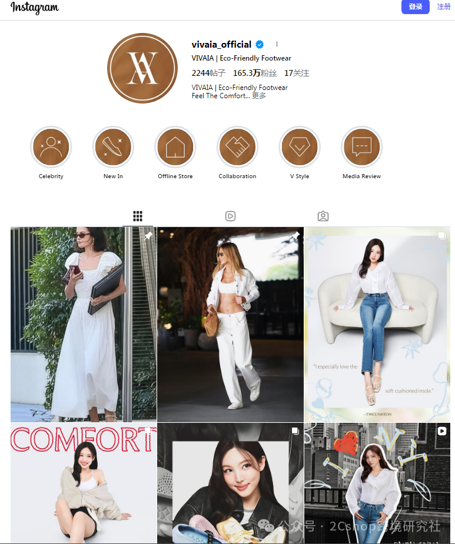

UGC玩法也很到位：鼓励消费者分享自己穿着VIVAIA鞋子的照片和感受，并标记品牌账号和相关标签，激发用户的参与感和忠诚度。

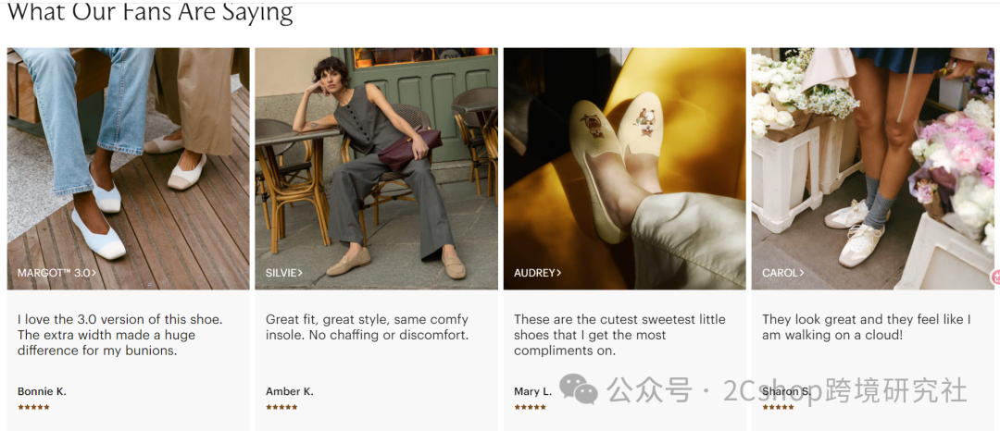

同时与有影响力的博主、社会企业家和艺术家合作，共同推广品牌理念和产品特点。这种方式既能扩大品牌影响力，也能吸引更多目标人群的关注和信赖。

四、为什么火？三个关键词：环保、舒适、时尚

消费者的评价很统一：“环保、舒适、简约、时尚。”

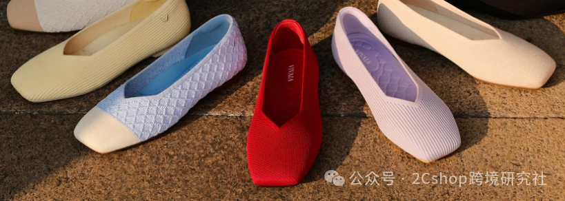

VIVAIA抓住的是海外高知女性的消费趋势：要舒适、要时尚、要能应对各种场景（尤其是职场），且环保主义已深入人心。

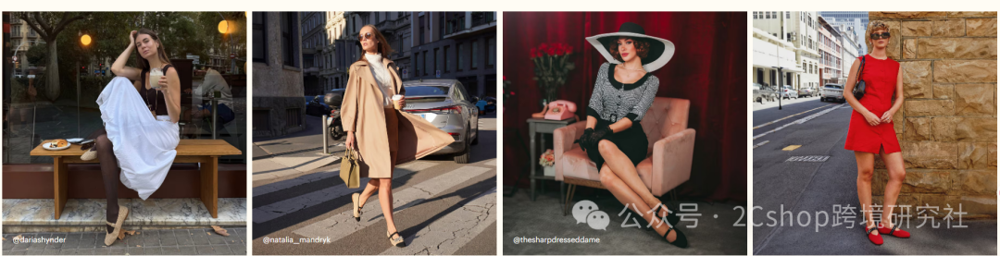

一双鞋，不只是穿在脚上的东西，更是“我在为地球做点什么”的身份认同。

VIVAIA证明了一件事：消费者愿意为价值观买单，但前提是产品本身足够好。

环保不是营销话术，而是贯穿从原材料到用户脚上的每一个环节。当一双鞋既舒适、又时尚、还环保，它的竞争力就不再只是价格，而是用户心里那句：“这鞋，值。”

**NEWS**

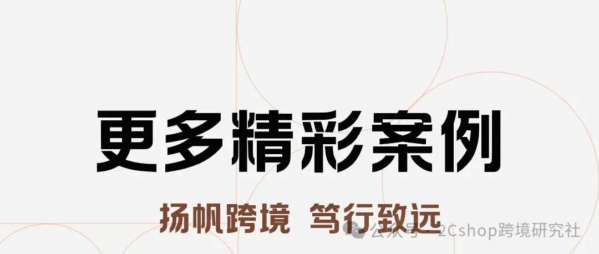

[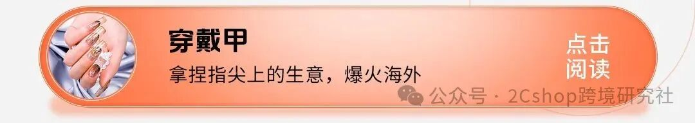](https://mp.weixin.qq.com/s?__biz=Mzg2ODM0NzI2OQ==&mid=2247499137&idx=1&sn=7e15083d92072d515ee02ab15c559434&scene=21#wechat_redirect)

[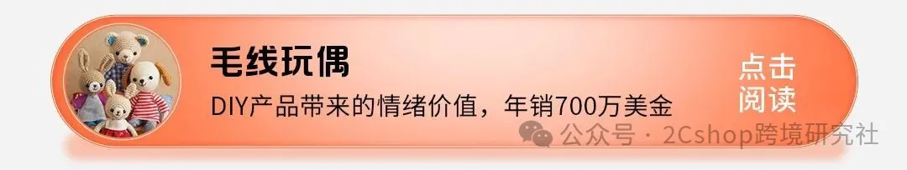](https://mp.weixin.qq.com/s?__biz=Mzg2ODM0NzI2OQ==&mid=2247497315&idx=1&sn=404b64c5f2f9933f652b6926b4b5c506&scene=21#wechat_redirect)

继续滑动看下一个

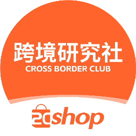

2Cshop跨境研究社

向上滑动看下一个

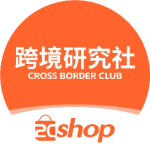

2Cshop跨境研究社
