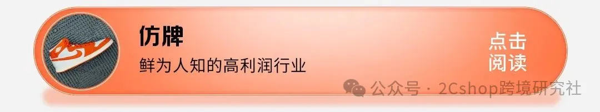

# 一件狗衣服卖两三百，半年狂揽5600万美金

原创 Ellie 2Cshop跨境研究社 *2026年3月4日 10:30*

## 宠物赛道越来越卷，但有一个品牌，专做法斗犬服饰，一件卫衣卖到两三百美金，半年营收5600万美元。它就是SparkPaws。在宠物服装这个看似拥挤的赛道里，SparkPaws硬是撕开了一条口子。它的打法，值得每一个想做垂直品类出海的卖家认真拆解。一、需求增长，市场空缺2017年，SparkPaws的创始人Neo和Sarah在为爱犬Stella物色宠物服饰时发现，市面上的宠物用品要么产品设计过于同质化，要么就是质量参差不齐。而法斗犬作为短毛犬类，若穿上质量差或是不透气的衣物，容易引起皮肤病。而彼时的宠物服装市场，几乎没有专门为法斗设计的品牌。与此同时，一组数据引起了他们的注意：据美国养犬人俱乐部统计，过去十年间，美国注册法斗犬的养宠人数增长了1000%以上。一边是快速增长的特定犬种人群，一边是空白的细分市场需求——SparkPaws由此切入，精准锁定“法斗犬服饰”这一赛道，从解决“透气、舒适、不伤皮肤”的真实痛点开始，站稳脚跟。二、从功能到时尚，打造“人宠亲子装”爆款解决了基础功能之后，SparkPaws开始往“时尚”走，而且走得很有策略。1. 男性审美破圈不同于大多数宠物品牌主打柔和可爱，SparkPaws在产品设计中融入了更多男性偏好的时尚元素。它的爆款单品——宠物卫衣，在独立站累计评论超9331条。2. 人宠亲子装拉高客单价随着携宠出行成为潮流，SparkPaws顺势推出人宠同款亲子装：从睡衣到卫衣，从雨衣到外套，主人和狗狗可以穿同款。这既击中了宠物主“把毛孩子当家人”的情感需求，也放大了社交分享属性——谁不想发一张和狗狗穿同款的照片？客单价自然被拉高。3. 包容性设计覆盖更多用户品牌主张“为所有品种狗狗而设计”，产品线覆盖不同体型、不同犬种。这不是一句口号，而是实打实的投入：团队测量了数千只狗的数据，持续更新尺码库，确保每款衣服都能找到合适的尺寸。更贴心的是，每个产品页都有详细的尺码指南，还配有视频教学，教宠物主如何正确测量。这一细节大大降低了退换率，也提升了用户好感。三、内容+社区：让用户主动回来小众赛道，复购是关键。SparkPaws在用户粘性上下了不少功夫。博客营销：定期更新养宠知识、训练技巧、创意活动等内容，并在文章中嵌入相关产品链接，一边种草一边转化。内容紧跟季节和热点，持续吸引精准流量。社区运营：Facebook上#SparkPaws话题帖子已超1万篇，品牌经常在这里发布新品、促销和线下活动信息，维持用户互动。达人合作：不只看头部博主，SparkPaws也大量合作中小宠物主，通过分享宠物真实日常，持续吸引精准用户关注，增加产品销量，提升品牌的市场影响力。四、付费+社媒双轮驱动Similarweb数据显示，SparkPaws独立站付费流量占比12.17%。付费词以“dog hoodie”“dog raincoat”等大类词为主，说明品牌在品类词上抢占了心智。社媒布局覆盖Facebook、TikTok、Instagram、Pinterest四大平台，根据不同平台调性分发内容。视频内容在Facebook和YouTube上精准投放，推广效果明显。值得注意的是，SparkPaws的竞品访问量普遍不高，说明这个细分赛道竞争尚不激烈，蓝海属性明显。小众不是小生意，SparkPaws的路径很清晰：从一个真实痛点切入→ 锁定一个快速增长的人群（法斗犬主）→ 做出差异化产品→ 用内容和社区留住用户→ 横向扩展品类它没有试图讨好所有人，而是把“某一类人”服务到极致。宠物赛道还在增长，但同质化内卷已经肉眼可见。真正的机会，可能就藏在那些“大多数人没注意到、但一小群人很需要”的缝隙里。如果你也深受启发，计划布局独立站，可以添加客服微信进一步沟通~

继续滑动看下一个

2Cshop跨境研究社

向上滑动看下一个

2Cshop跨境研究社
