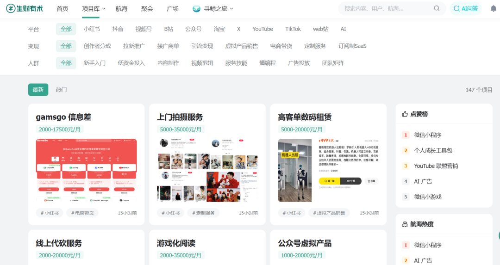
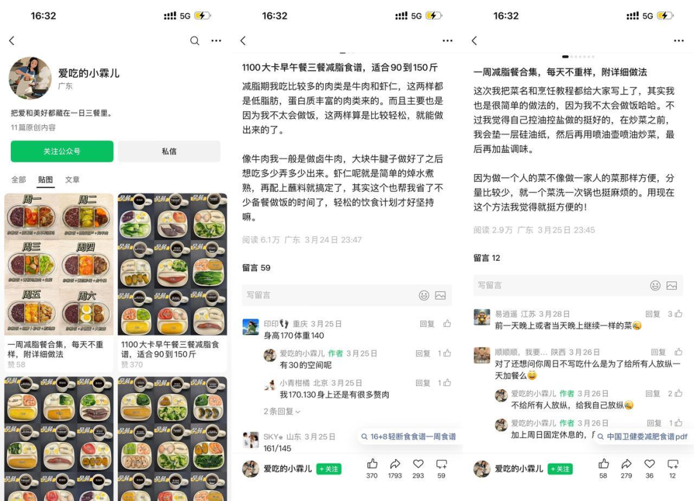
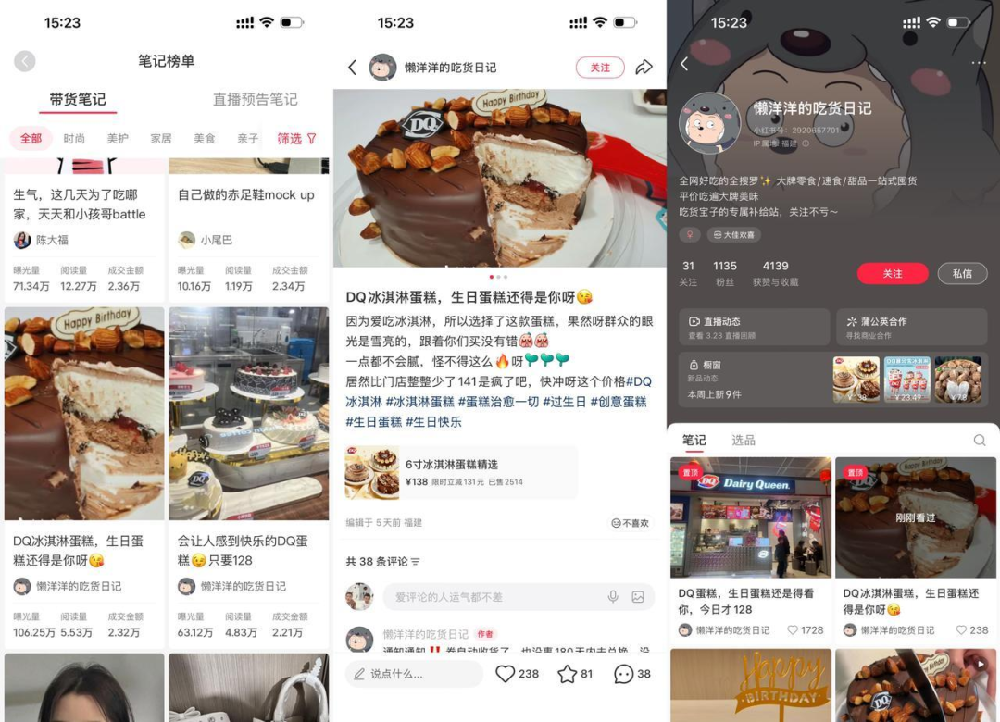
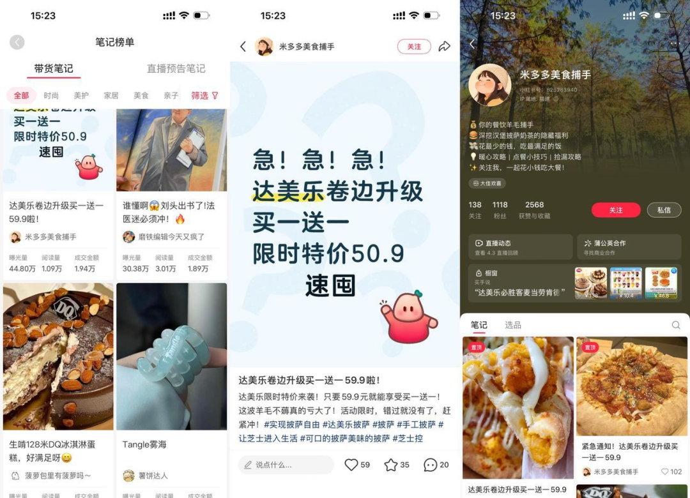
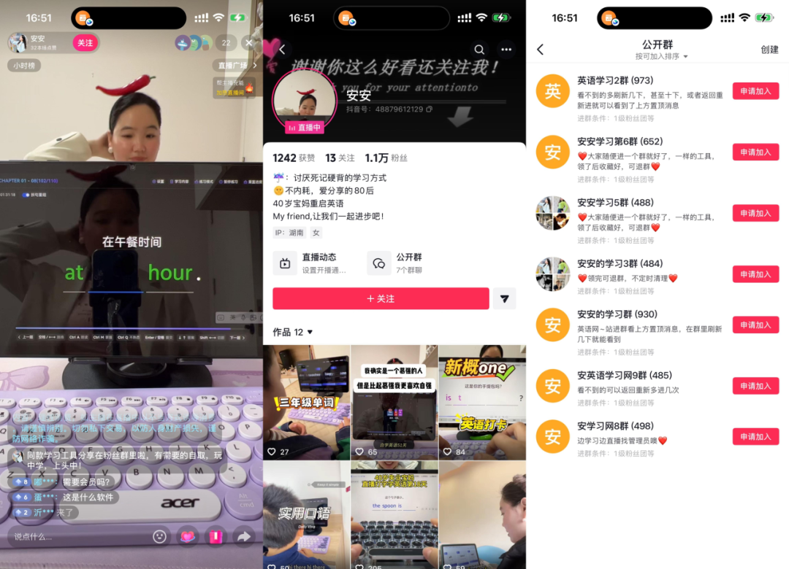
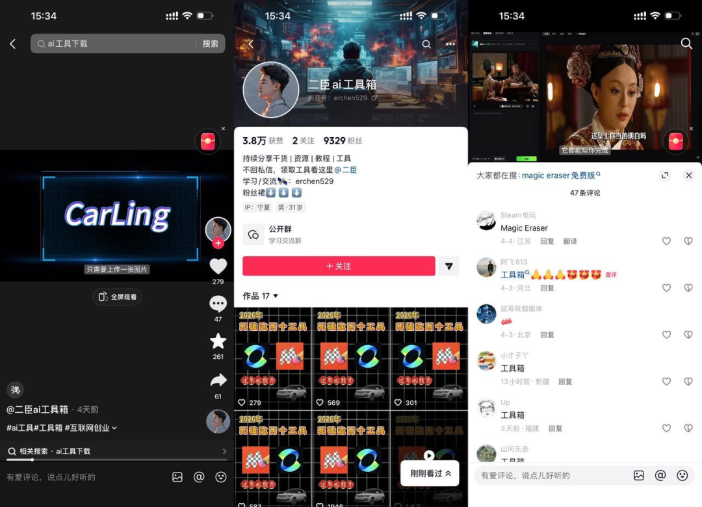

# 分享3个小众搞钱项目：不起眼，但赚钱 | 生财情报研究第15期

原创 杨爽 *2026年4月13日 20:01*

👆点击 **生财有术** >点击右上角“···”>设为星标🌟

“每天都有新的账号、新的项目在各个平台冒出来，而我们始终关注的是那些可以快速上手、带来实际收益的机会。”

公众号贴图号，门槛低、平台正在给红利，500浏览就能变现；小红书本地生活团购，借品牌活动价带货，解释成本低到离谱；抖音工具推广分销，一段录屏演示就能引流，素人佣金最高拿到9600元。

希望这些情报能给你带来启发，也希望能帮助你找到下一个值得投入的机会。

**这周三（4月15日）晚19点，亦仁和坤汀还会有一场直播** ，讲清楚第十年如何用好生财有术，欢迎预约。

如何用好生财有术第十年

大家好，我是杨爽。

停更之后催更的压力真的不小。不过好在项目库的持续更新，帮我降低了一些解释成本。

没更新不是因为没东西可写，主要是最近星球帖子密度太高了，我怕大家刷着刷着就只剩下焦虑： **项目这么多，到底哪个跟我有关？我能不能做？我什么时候开始？**

不过没更新的日子，项目库还是在持续上新的，如果大家想看一些最新在挣钱的项目，可以去项目库找找灵感和思路。

（非圈友下拉文末领取体验卡可解锁体验）

今天这期我挑了 3 个最近反复刷到、而且越看越觉得有机会的方向，跟大家一起聊一聊。

这些项目也都已经更新到项目库了，大家想看更多最新案例、对标账号的话，在项目库都可以找到。

那我们就正式开始吧！

**Part 1**

**案例1**

**公众号贴图号，真的是一波红利期**

跳转链接 1：https://t.zsxq.com/fr9sh

跳转链接 2：https://t.zsxq.com/WHVjB

这个项目我最喜欢它的一点是， **大多数人能做得到。**

除了我们观察到的一批账号，星球里也有不少圈友分享。链接我都贴在上面了，大家感兴趣可以跳转原链接。

一个账号分享自己的亲身体验：“ **公众号贴图绝对红利期，我发的碎碎念，不带配图直接发，500 浏览一块钱。** ”

另一个账号分享了一个案例：“ **总共发了 50 多条，差不多一半都是上万+，还有几条 10w+。** ”

几乎是同一个意思：公众号贴图号，改名之后重新出发，现在正在出现红利。

这个项目为什么值得关注，主要是源于背后的三个变化：

**(1) 门槛低红利先抓住**

以前公众号写一篇文章，门槛是能写长文；现在贴图更像发一张图 + 一段话，甚至碎碎念直接发。 **门槛降低** ，供给就会爆炸，但红利期恰恰就在爆炸之前。

**(2) 流量主有浏览就变现**

你不需要接广告、不需要卖课、不需要引流，能开流量主就能算账： **500 浏览≈1 块钱** 这种反馈，本质上就是已经在变现了。

**(3) 稳定更新平台偏爱**

“ **发了 50 多条，半数上万+** ”这句话背后其实是平台在奖励一种稳定更新的人。贴图号的机会是要求你能持续把内容发出来、让用户愿意停一下。

如果要先赚到第一块钱，我会怎么做？

**主体专一持续输出**

**先选一个你能稳定输出的主题** ，不要什么都发。贴图号最怕的就是今天鸡汤，明天段子，后天情感，系统不知道把你推给谁。更稳的主题是：自律打卡、减脂餐、读书笔记、育儿碎碎念、职场清单、情绪记录…… **你自己能坚持 30 天的那种。**

**以量破局三十起步**

用 **量去换第一波分发** ，别妄想一条就爆。我会给自己一个很土的 KPI： **先发 30 条** 。你发到第 10 条时，通常会出现两种反馈：有些贴图开始稳定破千/破万； 有些评论区开始出现求合集、求模板、求同款。这时候你再去看数据，决定下一步怎么加速。

**三秒留人互动循环**

提醒一下，贴图号，你可以把它理解成：用户在刷信息流， **你能不能让他 3 秒内看懂并愿意停一下** 。案例里那些上万+、10w+的账号，往往不是选题多厉害，而是互动做得好：评论区问什么、你下一条就回什么。你只要形成这个循环，第一块钱就不难。

**生财第 10 年已于4月7日晚 8 点正式开启，现在扫码下方二维码，添加老师即可锁定年度最低价。**

**Part 2**

**案例2**

**品牌活动价 + 小红书带货笔记**

**解释成本低到离谱**

 

第二个方向，我觉得很适合想试试带货，但不想被选品折磨的圈友： **小红书本地生活团购。**

最近出现了一批这样的账号，比如截图里的案例：

❖

**DQ蛋糕**

单条笔记曝光量 106 万，成交金额 2.32 万

❖

**达美乐披萨**

单条笔记曝光量 44 万，成交金额 1.94 万

这两条笔记厉害的地方，不是内容花里胡哨，而是它吃到了一个很硬的优势： **品牌自带流量 + 专属活动价** 。

你想想用户为什么愿意点、愿意买？

因为用户脑子里只有一句话：“ **这个价格我今天不买就亏了。** ”

**这就叫解释成本低。** 你不用教育用户为什么要买披萨、蛋糕，品牌已经替你把需求教育完了，你只要把“活动怎么薅”、“怎么买最省事”、“值不值得冲”，说清楚就行。

这就是这个项目最有意思的地方：品牌活动期，预算真金白银的砸进去。 **你做的是，把这波补贴翻译给用户。** 内容真实，转化反而更高。

那怎么才能赚到第一块钱呢？其实，笔记上面显示的已经很清晰了。

**关键点一**

**先选高频 + 低决策的品类** ，比如蛋糕、披萨、咖啡券、快餐券、奶茶券……这种最适合起步。用户决策快、复购高，你不用写很长的种草文。

**关键点二**

**内容只讲三件事** ，今天为什么便宜、怎么买最省事、适合谁。

**关键点三**

你能不能用同一套结构，连续做 10 条不同品牌的活动？ **能复制，就能规模化** ；不能复制，就永远靠灵感。

现在能出成绩的账号，基本都是这个逻辑： **把补贴翻译给用户，把下单路径做得更省事。**

**Part 3**

**案例3**

**好工具如何被发现？**

**抖音工具推广，流量不容小觑**

 

第三个方向，航海家大会后看到得更加频繁： **抖音工具类内容的推广和分销，正在变得越来越成熟。**

比如：

有人 **专门做AI工具下载、工具箱** ，账号粉丝已经不少，评论区会不断出现这是啥软件、怎么下、能不能发链接这样的异常值；

有人 **专门做直播承接到公开群** ，你点开主页就能看到一堆群入口，已经有差不多 7 个 500人群了；

以及航海家大会上分享了一种很典型的分销算账模式： **素人佣金 =（视频销售额 - 广告费）× 40%** ，有素人通过视频带来销售额 4 万，广告费 1.6 万，素人能拿 9600 元。

这说明什么？说明这已经不是随便发发工具推荐，而是完整的生意链路： **内容负责获客，群/私域负责交付，分销推广负责变现** 。已经是非常值得关注的生意模式了。这背后的原因是：

工具是高频需求，尤其在 AI 时代。很多人不是不想用 AI，而是卡在第一步：下载安装到哪、用哪个版本、怎么配置、怎么避坑。 **你能把第一步变得简单，你就值钱。**

工具内容的传播成本低，你不用讲故事，不用演戏，一段录屏演示就够了：打开—点哪里—结果出来。用户要的就是我照着做能不能成。

如果我想先赚到第一块钱，应该怎么做呢？

**(1) 精准工具 实用易搜**

找一款亲测好用的工具，比如：去水印、抠图、字幕提取、PDF 转换、AI 换背景…… **你越具体** ，用户越容易搜索到你，也越容易产生我现在就要的冲动。

**(2) 爆款录屏 演示引流**

**去找爆款，连续发 10 条录屏演示** ，不讲原理，不讲历史，甚至不需要露脸。你只要演示三次：打开—操作—结果。当评论区开始出现：链接呢、怎么下、求工具；或者私信开始出现能不能帮我弄一下。这时候你再去考虑承接方式：群、私域或者是直接挂链接都可以。

**(3) 深耕合作 流量共赢**

去谈更深入的合作方式，基于用户的反馈，基于流量的反馈，增加直播更多元的形式，成为这个产品真正的 **流量合伙人** 。

**Part 4**

**写在最后**

怎么样，这期的项目是不是还挺有趣的！

写完这期，我发现很多项目最后拼的都是，谁 **更能坚持把小事做成闭环** 。贴图号拼的是稳定更新；团购拼的是持续追活动、持续写清楚怎么买；工具号拼的是你能不能持续演示，找到属于你产品的流量和用户。

所以我想跟大家约一个小互动：你就选这 3 个方向里最不费劲的一个，给自己定一个特别小的目标，比如贴图号连续发 10 条内容；团购写 10 条不同品牌的小红书推广帖；给好用的工具录 5 条演示视频。

然后回到评论区，告诉我一个结果：你是在哪一步卡住的？

我们一起看看下场行动跑完闭环，会有什么样的结果。

好啦，最后祝大家生财有术！

也给大家推荐两个账号，生财旗下针对AI实战和圈友故事的垂直账号，干货密度很高。

1/【生财的朋友们】会用几年时间，访谈1000位生财圈友的第一个百万故事，每一个都是真实走过的路。

目前已更新了20多期视频，微信扫码下方二维码即可关注

 

**2/【生财AI精选】每周更新普通人用AI赚钱的真实案例，不讲概念，只讲实操和结果。**

**作者** 杨爽 | **排版** | 朱朱

**主编** | 七天 | **编辑** | 小武、JUN

生财有术是一个 **务实、接地气的赚钱机会分享与创业交流社群** 。目前已运营至 **第10年** ，累计付费会员 **超7.7万人** 。

继续滑动看下一个

生财有术

向上滑动看下一个