# AI企业服务依然有红利，我用AI做小程序拿下一个品牌订单

*2026年4月12日 20:01*

👆点击 **生财有术** >点击右上角“···”>设为星标🌟

AI发展越来越快，员工在担心被替代，但老板更焦虑，同行已经在用AI降本增效，自己再不跟上，差距只会越拉越大。这种焦虑正在变成真实的采购需求，AI企业服务的市场，比很多人想象的大得多。

生财圈友@乐轩麟 就是在做这件事。00后，毕业不到1年从大厂算法工程师辞职，一个人创业，没有团队没有案例。他没有急着推销自己，而是先听透需求，用AI快速做出一个能演示的小程序，让客户直接看到结果，拿下了第一个2万元的B端定制单。

---

**4月15日，亦仁和坤汀还会有一场直播** ，讲清楚第十年如何用好生财有术，欢迎预约。

如何用好生财有术第十年

**Part 1**

**在加入生财之前，**

**我做了哪些工作？**

大家好，我是乐轩麟，目前主要在做AI 企业服务与培训。之前我在广州一家上市公司做 AI 算法工程师，研究方向是计算机视觉。

去年 6 月我刚毕业，加入生财有术，今年 1 月离职，开启自己的一人公司创业生涯。不久前，我自己 **独立拿下了第一个2万元的B端小程序订单。** 在接这一单之前，我做过的项目其实一直偏技术。

本科时，我做过医疗影像识别，主要是拿 CT 图像做分类；

硕士时，我做过工业视觉质检，核心是做 PCB 焊点缺陷检测；

实习时，我又做过机械臂状态监控，用视频分析去判断产线状态和机械臂位置；

工作以后，则开始接触楼宇和数据中心相关的节能优化。这些经历让我一点点看清了技术的边界。

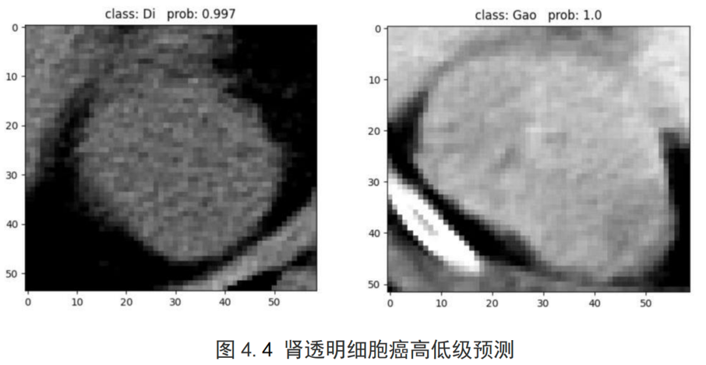

本科项目：肾癌细胞影像分类

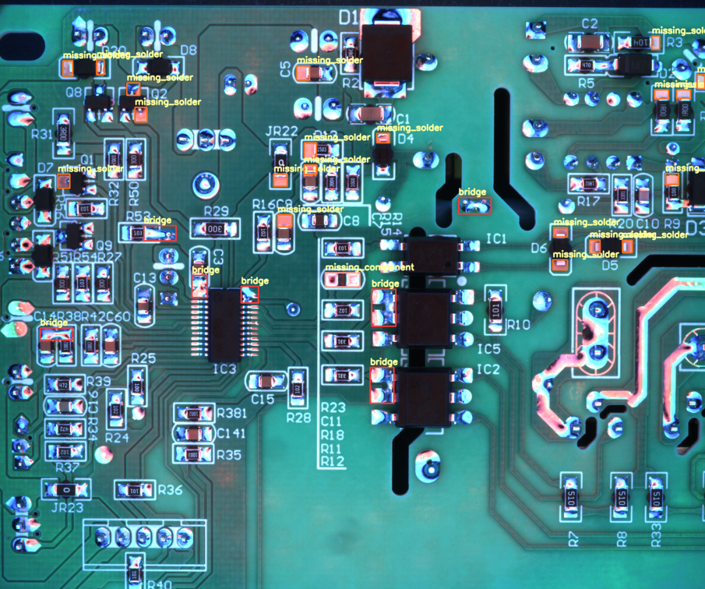

研究生项目：PCB 焊点缺陷检测

本科做医疗影像时发现，实验室里跑出来的高准确率，不等于真实场景能用，数据量、边界 case、推理速度和合规要求，哪一样都不是只靠模型精度就能解决的。

硕士做工业视觉质检时，我体会到，实验室里把检测做出来不难，难的是到了真实产线以后，光照、角度、硬件成本和一线人员的使用习惯都会变。你的方案不只是要“能识别”，还得“用得起、用得住、用得明白”。

真正让我开始往商业落地那边靠，是实习和后面的工程项目。

实习做机械臂监控时，我第一次感受到，真正麻烦的往往不是模型本身，而是大量视频数据怎么更高效地标注。那时候我花了不少精力去想办法提升标注效率，也第一次意识到，很多工程问题不是靠调一个模型就能解决的。

后来做楼宇和数据中心AI 算法项目时，我又进一步意识到，客户要的从来不是一个漂亮模型，而是一个能接进现有流程、最后稳定交付结果的方案。

也是从那时候开始，我慢慢补上了自己以前最欠缺的那部分： **不只看技术能不能做，还要看客户为什么要做、谁来用、最后凭什么愿意买单。**

也是因为上面这些经历，我后来慢慢把方向从偏工业AI落地，转向了 AI 小程序和轻软件创业。

不是我不看好工业项目，相反，我很清楚这类项目一旦做成，价值很高，但它的交付周期太长了，从方案沟通、现场配合、测试验证到最后回款，中间每一环都很重。

对一个刚起步、又想尽快创业的人来说，如果一开始就把自己绑在这种长周期项目上，很容易迟迟跑不出案例，也跑不出现金流。

所以我当时给自己的判断很直接： **先别一上来就做最重的项目，而是先做更轻、更短、更容易闭环的东西。**

AI 小程序和软件虽然客单价不一定最高，但更容易快速验证需求、快速交付、快速回款，也更适合我在早期先把单子跑起来，先把现金流跑起来，再慢慢往更重的项目走。

而生财星球里就有很多在这方面有经验的创业前辈，也有不少精华帖，站在巨人的肩膀上，我少走了不少弯路。

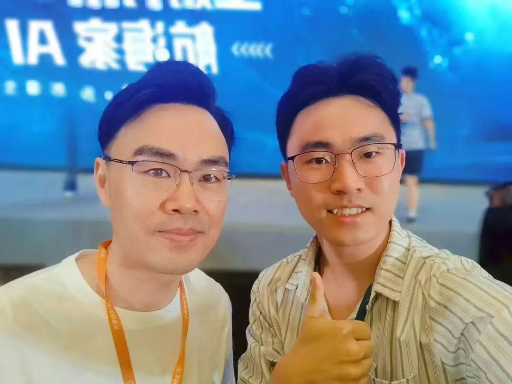

在航海家 AI 大会上和亦仁的合影

现在回头看，这个选择至少在那个阶段是对的， **因为创业前期最重要的，往往不是想象空间有多大，而是你能不能先活下来，先持续滚出正反馈。**

以前在公司里做项目，需求有人梳理，客户关系也有人顶在前面，轮到自己出来谈单，我才第一次很直接地感受到那种落差。尤其我是个刚毕业不到一年的 00 后，说完全不虚，那是假的。

技术出身的人应该都懂这种感觉：你心里明明知道这个需求有机会，技术上也知道大概怎么实现，可一想到要和企业客户坐下来谈，脑子里还是会冒出很多念头，比如客户会不会觉得你太年轻、没案例，或者一句“回头我们再看看”、“我们团队内部商量一下”，这事就没下文了。

更麻烦的是，我们天然习惯讲“生产者语言”。我们会说模型、流程、架构、接口、准确率、部署方式，可客户脑子里转的，是成本、效率、营收、风险和上线时间。 **你越讲技术，对方越容易听不懂；他越听不懂，就越不敢拍板。**

**Part 2**

**打造个人 IP**

**为信任加分**

在生财有术，我参加过 AI 自媒体和垂直小号航海，也是在这个过程中，我越来越意识到个人 IP 的重要性。

很多技术出身的人其实都不太擅长表达自己，朋友圈里能让别人快速认识你的信息也不多。

但我会把 **朋友圈当成一份“持续更新的信任说明书”。** 我不追求封面多精美，也不刻意把自己包装得多厉害，而是高频更新自己的创业动态、技术思考和踩坑经历，也会分享一些真实的生活碎片。

我的朋友圈会长期置顶一条“高光时刻”总结，可能是项目上线、客户好评，或者某个重要的认知突破。这其实是在帮新朋友快速建立第一轮信任，让他很快知道我是谁、做过什么。

这样做的结果是，潜在客户看到的不是一个冷冰冰的服务商， **而是一个活生生的、在持续进步的创业者。**

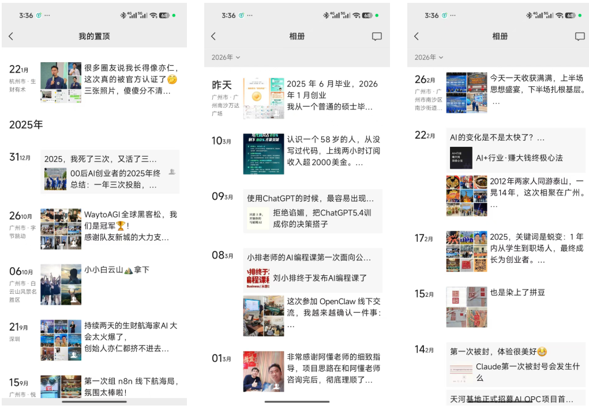

在公众号里，我会系统输出自己对 AI 技术、小程序商业化和垂直行业应用的思考。 **B 端客户选择你，往往不是因为你技术最强，而是因为他对你的认知最清晰、也最信任。**

为了回馈那些曾经帮助过我的圈友，我也开始主动分享自己的经验。通过发帖、参与讨论和做公开分享，把自己对技术商业化的理解慢慢讲出去。

2025 年 12 月，我成为了生财垂直小号自动化航海的教练；

2026 年 3 月，我又成为了微信小程序开发和内容工厂 Agent 双航海的教练。

当我完成第一场千人线上直播，开始有人认可我的观点和方法，也愿意来问我问题的时候，我才更明显地感觉到，原来自己掌握的 AI 技术，也可以借助生财这个平台被放大，帮助到更多普通人。

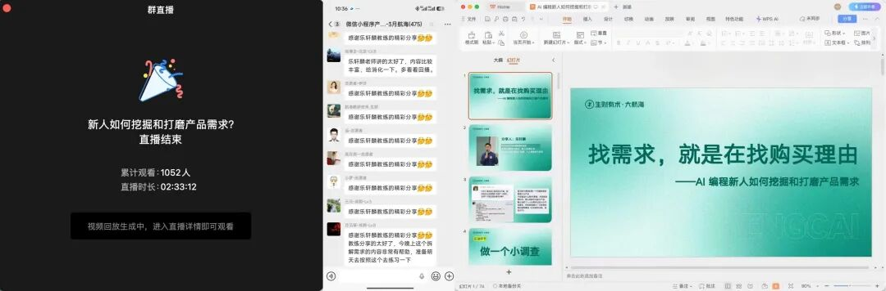

而 **和** **线上相比，我觉得更有价值的是线下。** 我自己组织过 4 场，也参加过 30 多场线下聚会和活动，还和生财圈友新城一起组队，拿了 WaytoAGI 全球黑客松的冠军。

以前在科技公司时，我总觉得自己只是一个普通的算法工程师，因为身边技术比我强的大佬不在少数，我只是个小透明。

但到了线下，我第一次更真实地触摸到市场，也第一次更具体地感受到， **原来 AI 技术真的可以赋能到很多小但是具体的行业，我原来可以被那么多人需要。**

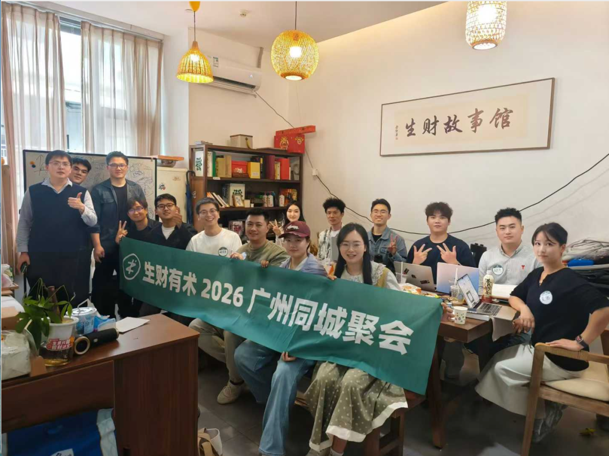

参加传术师 OpenClaw 线下聚会

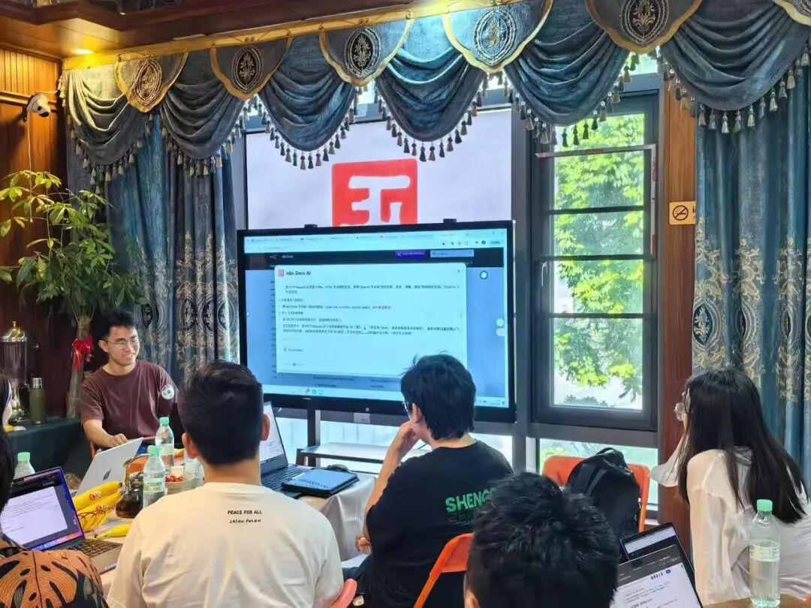

第一次组局分享n8n工作流

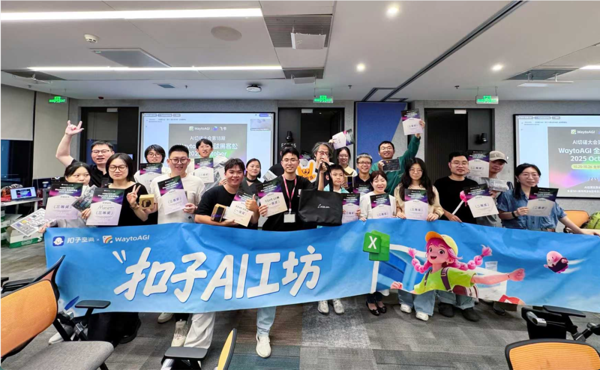

和AI 编程深海圈圈友新城参加 WaytoAGI 全球黑客松并获得冠军

这次找我的客户，就是我在生财线下活动里认识的圈友介绍来的，一个我之前没接触过的传统行业老板。我没有现成案例可套，也没有行业背书可搬。

前面那些项目更多是在证明我会做技术，但这一单要证明的，是我 **能不能把技术变成客户愿意付钱的结果。** 也正因为这样，这一单对我很重要，它让我第一次真切地感受到，原来技术人也可以做 B 端高客单，只是得先学会换一种方式说话。

**Part 3**

**真正的转折**

**不是我技术更强了**

如果非要说这次成单的转折点是什么，我觉得不是我突然变会销售了，而是我看清了两件事。

第一， **AI 工具已经把试错成本打下来了。** 以前做一个定制小程序，从需求梳理、原型设计到开发联调，周期很长，成本也不低，很难在签约前就拿出一个像样的东西给客户看。

现在借助 ChatGPT、Figma、Codex 这一套工具，很多事情已经可以在很短时间里先做出一个最小版本。

第二，B 端客户最缺的，往往不是方案，而是确定性。他们不是没听过别人讲故事，也不是没见过 PPT，可 PPT 这种东西，说到底还是“你告诉我你能做”； **一个能跑起来的最小版本，才是“你已经让我看见你能做”。**

这两件事一旦想明白，我整个人的打法就变了： **不再想着怎么把自己包装得更像一个成熟服务商，而是先拿一个最小结果，把这段信任链条接上。**

**Part 4**

**我是怎么把这单拿下来的**

代码写得再好，B端项目依然容易烂尾。

很多技术人在面对高客单、重决策的B端客户时，往往陷入一个误区:急于展示技术，却忽略了信任与边界。

真正值钱的不是“你会做什么”，而是你能不能帮客户“把问题看透，把东西落地”。

而以下这五步，是区分“外包工具人”与“专业服务商”的分水岭。

01

***第一步：洞察，不急着推销，***

***先看透冰山之下的人与问题***

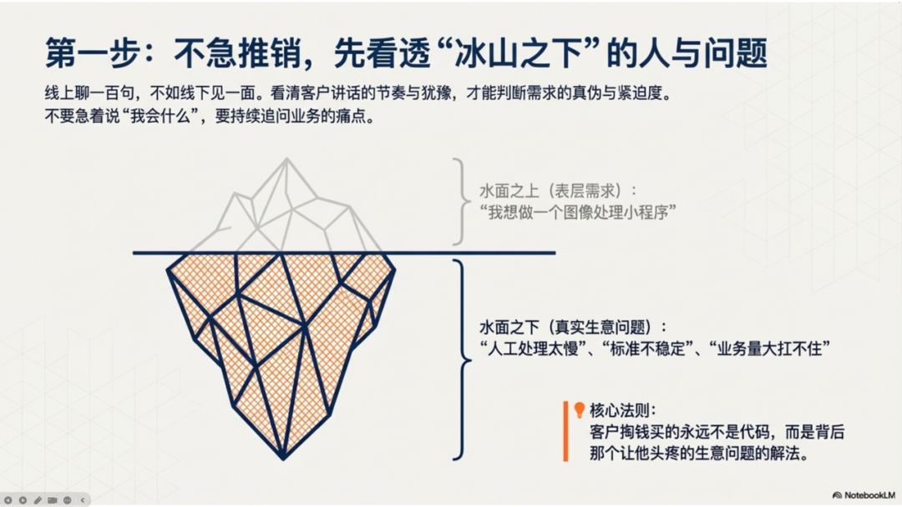

我现在越来越相信，B 端很多合作，真不是在微信聊天框里敲出来的，尤其是高客单、重决策的单子，线上聊一百句，不如线下见一面。我这次的线索最早就是从线下来的。

见面最有价值的地方，不只是拉近关系，而是你终于能看到一个真实的人。他讲话的节奏、对问题的重视程度、哪些地方反复强调、哪些地方明显犹豫，都在告诉你： **这个需求到底急不急、真不真、值不值得往下做。**

我第一次深聊的时候，没有上来就讲“我会什么”“我以前做过什么”，而是一直在问业务问题。我最关心的不是“你想做个什么功能”，而是“你现在最费人的环节到底是什么”“这个环节卡住了，会直接影响什么”“你为什么觉得这件事现在必须做”。

因为客户嘴里说出来的，常常只是表层需求。他嘴上可能说的是“我想做个图像处理小程序”， **但真正让他愿意掏钱的，是背后的那个生意问题：** 人工处理太慢、标准不稳定、业务量一上来就扛不住。

如果你没有先把这个问题听出来，后面做得再快，也可能只是做了一个“看起来挺完整”的工具，而不是一个客户真正愿意买单的解法。

02

***第二步：翻译，不做无脑开发，***

***做业务需求的翻译官***

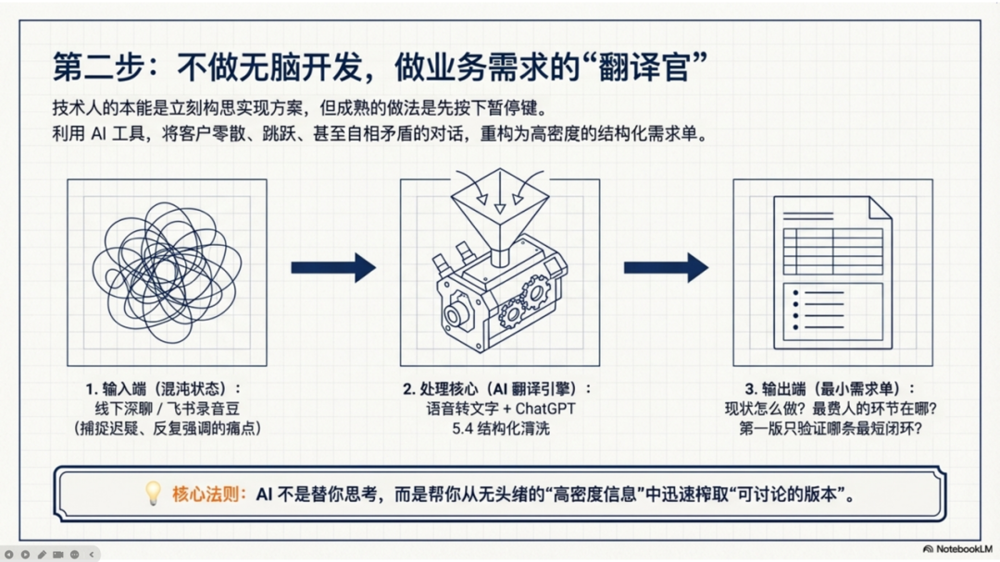

很多技术人一听完需求，第一反应就是开始想怎么实现，我以前也是这样。但现在 **我会先逼自己停一下，先把客户那堆零散、跳跃、甚至自相矛盾的话，重新翻译一遍。**

第一次深聊，我一般会尽量用电话或者飞书会议，如果是线下我还会使用飞书录音豆。微信打字只用于预约线上会议或者线下见面，因为文字的信息密度太低了。

**很多真正关键的东西，不在字面上，而在他强调什么、迟疑什么、反复提什么。** 我会征得同意后，把沟通内容录下来，不是为了留痕，而是为了让自己别漏信息。

聊完之后，我会把录音转成文字，再交给 ChatGPT 5.4 先帮我整理成一页最小需求单： **客户现在是怎么做的、最费人的环节在哪里、谁在实际使用、第一版只验证哪条最短闭环、哪些东西先不做。**

这一步对我帮助很大，不是因为 AI 替我想明白了所有事情，而是它能很快帮我把信息密度很大，但没有头绪的对话记录整理成结构化的文档。

以前我用手敲的方法，还要来回听录音、补笔记、拉流程，经常半天就没了；现在至少能先迅速拿到一个可讨论的版本，然后再判断：哪些理解是对的，哪些地方我还得再追问。

03

***第三步：破局，打破常规，用能***

***跑的 MVP 建立绝对信任***

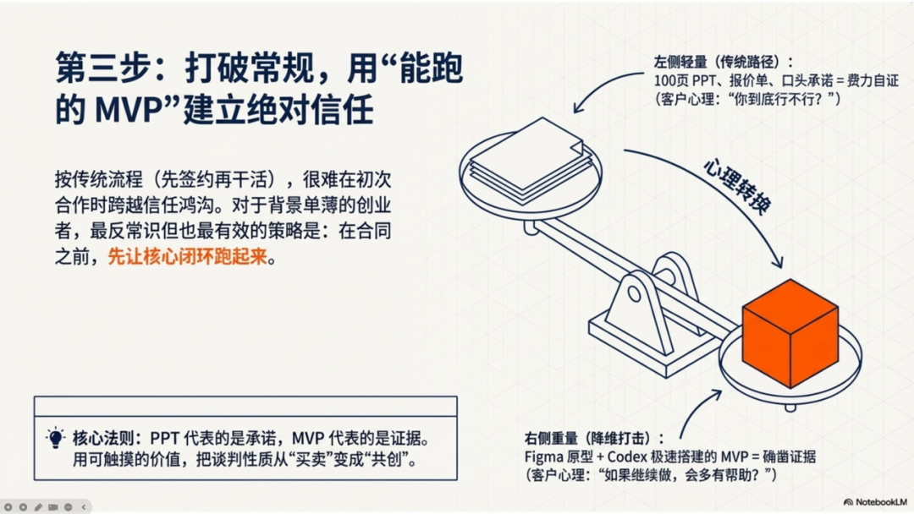

真正改变局面的，是我先做出了一个能跑的 MVP。坦白讲，我一开始也犹豫过，因为按传统思路，应该是先报价、先签约、先收钱，再开始做。

你在合同没签之前就先做东西，听起来多少有点冒险。但我后来越来越觉得， **对于第一次合作的 B 端客户来说，最大的问题不是价格，而是信任。**

你让他在什么都还没看到的时候，就先相信一个刚出来创业的技术人，这件事本身就很难。

尤其是我这样的背景，年纪不大，团队也不大，客户天然会先看你靠不靠谱。

所以我换了一个思路： **我先不急着证明我“会做”，我先做出一点东西，让他看到我“真的在做”。** 我先根据整理好的需求，用 Figma 生成一个产品原型，再借助 Codex 很快搭出了一个能演示的 MVP。

不是完整产品，也不是花里胡哨的版本，就是最核心的那条闭环先跑起来。这一步最重要的不是功能有多少，而是客户第一次有机会摸到一点真实的东西。

你讲一小时，他脑子里可能还是一团雾；可你把一个能点、能跑、能感受到价值的东西摆出来，客户对你的很多看法会一下子变掉， **对方会从“你到底行不行”，变成“这个东西如果继续做下去，会不会真对我有帮助”。**

那一刻，谈话的性质就变了。你不再是在费力自证，而是在和客户一起讨论一个已经开始存在的东西。 **PPT 代表的是承诺，MVP 代表的是证据。**

04

***第四步，控盘，决定成交稳健度的，***

***是把控交付边界。***

只要把 MVP 做出来，客户自然就会签付款吗？其实没那么简单。

**MVP 只是把门打开了，后面真正决定你能不能把项目稳稳拿下的，是你有没有能力把交付边界谈清楚。**

这一点也是我这次特别深的一个感受。客户一旦开始认真提修改意见，其实是好事，说明他已经开始把这件事当自己的项目看了。但如果你这时候还保持一种“先都答应下来再说”的心态，事情很容易失控。

我以前就很容易这样，客户一说“这个能不能顺手加一下”，我第一反应是先评估技术难不难；可现在我会先问自己一个问题： **这件事，属不属于这一轮该做的范围？**

**后面我开始把事情拆得更具体：** 演示版只验证核心闭环，正式版再谈更完整的功能；页面细调和体验优化算本轮，新增流程、新页面就算新增需求；Bug 该尽快改，但超出范围的部分，要重新确认报价、定金和排期。

说实话，第一次这样和客户谈边界时，我心里也会紧一下，怕把气氛谈僵，也怕对方觉得你事多。但结果恰恰相反，边界越清楚，客户反而越放心。

这次我很明显地感受到， **当我把边界、节奏、付款节点讲清楚之后，对方对我的判断，反而更像是在看一个“可以合作的服务商”。**

05

***第五步：跨越，替客户走完上线***

***的最后一公里。***

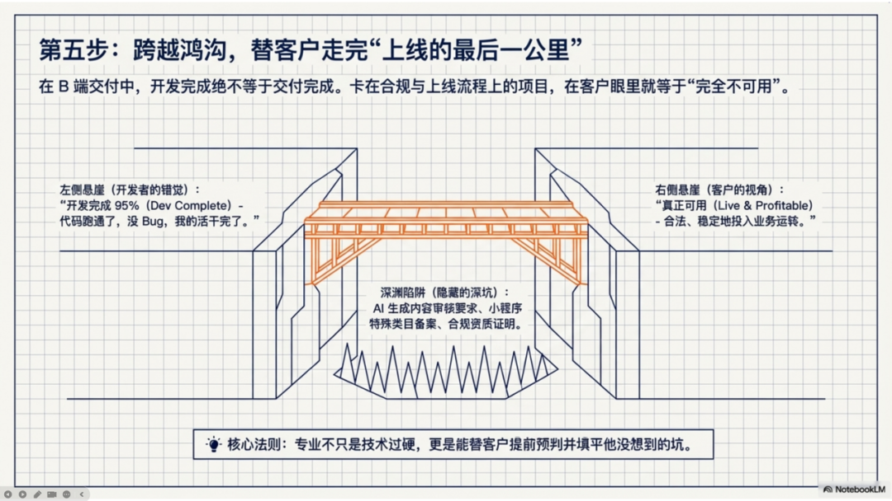

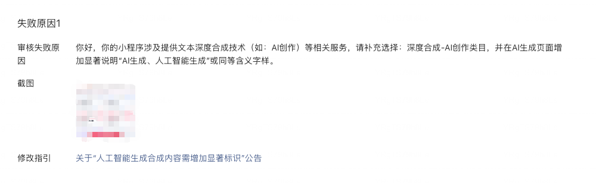

项目做到后面，我本来以为最难的部分已经过去了。结果临到小程序备案和提审的时候，我又被教育了一次。

因为这个项目涉及 AI 生成内容，最后在类目和审核要求上，和我一开始想的不一样。不是随便按个普通工具类去提交就行，而是还要补充更匹配的 AI 相关类目和说明。

这件事让我很警醒。以前我以为开发完成就算交付完成，可站在客户视角，他要的不是一个代码包， **而是一个能合法上线、能稳定运行、能真正拿去用的东西。**

如果你前面的功能都做完了，最后卡在上线和合规上，那客户感受到的不是“你已经完成了 95%”，而是“这东西现在还是不能用”。

这就是 B 端交付和个人项目特别不一样的地方。你不只是做功能，你还得替客户把最后一公里走完。也正因为这一下，我对“专业”这两个字的理解更具体了。 **专业不只是技术过硬，更是你能不能替客户提前想到他没想到的坑。**

**Part 5**

**这第一单，**

**给我的不只是 2 万块钱。**

回头看，这单对我最大的意义，其实不是金额，而更像是一个确认：我不一定非要依附在一家公司里，才能把技术变成结果；

**我不只是能把东西做出来，也开始能把需求听明白、把信任接起来、把项目往前推进。** 这单之后，我心里有几个感受特别深。

第一，技术人想做 B 端，真的不能只把自己当开发者，你得先把自己变成一个翻译官。你要能把“模型、流程、接口”翻译成客户更关心的“能不能少花人力、能不能更快出结果、能不能按时上线”。

**客户不是为技术词汇买单的，客户是为结果买单的。**

第二，AI 时代最有价值的地方，不是它让你少干活，而是它让你更容易把“一个想法”变成“一个看得见的东西”， **而信任很多时候不是靠说出来的，是靠看见之后长出来的。**

第三，0 到 1 的阶段，别总想着把每一单利润抠到最大， **对刚起步的人来说，更重要的是先拿到案例、先把闭环跑通。**

如果你也是技术背景，也在犹豫要不要碰 B 端，我想很直接地说一句：你不一定要先有大团队，不一定要先有很多资源，也不一定要先把自己包装得很成熟，但你至少要敢先往前走一步。

先抓一个具体场景，先听懂一个真问题， **先做出一个最小结果，先把那份最难的初始信任拿下来。** 很多时候，信心不是准备好了才有的，而是在你真的去做、去卡住、去解决、最后把钱收回来之后，才一点点长出来的。

我现在回头看，会觉得这第一单更像是我创业路上的一次“成人礼”。它没有让我一下子变成多厉害的人，但它让我第一次很确定：这条路，我可以走下去。

如果你现在也正卡在那个阶段，心里有想做的事，也知道大概有机会，但就是不敢真正往前迈，我特别想把这句话送给你： **别先想着把整条路都看清，先把那个最小的、能让客户眼前一亮的版本做出来。**

很多事情，真的是做着做着，路就有了。

最后给大家推荐两个账号，生财旗下针对AI实战和圈友故事的垂直账号，干货密度很高。

1/【生财的朋友们】会用几年时间，访谈1000位生财圈友的第一个百万故事，每一个都是真实走过的路。

目前已更新了20多期视频，微信扫码下方二维码即可关注

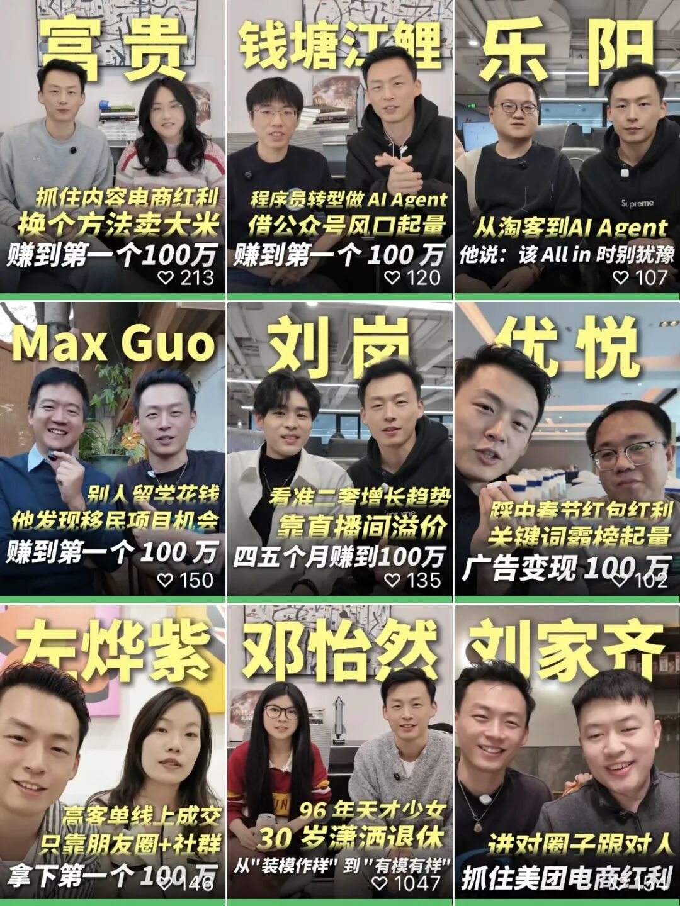 

**2/【生财AI精选】每周更新普通人用AI赚钱的真实案例，不讲概念，只讲实操和结果。**

**作者** | 乐轩麟 | **排版** | 辛拉面

**主编** | 七天 | **编辑** | 杜阿寻、小武

生财有术是一个 **务实、接地气的赚钱机会分享与创业交流社群** 。目前已运营至 **第10年** ，累计付费会员 **超7.5万人** 。

生财有术第10年已在4月7日（晚8点正式开启），如果您暂时还没有加入生财，可以扫描图中二维码，添加鱼丸，回复【418】，参与418活动，锁定年度最低价。

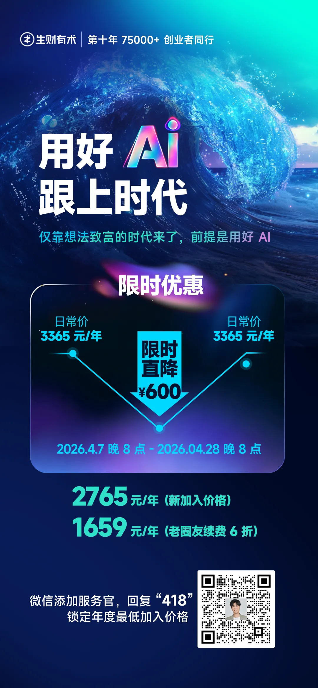

继续滑动看下一个

生财有术

向上滑动看下一个