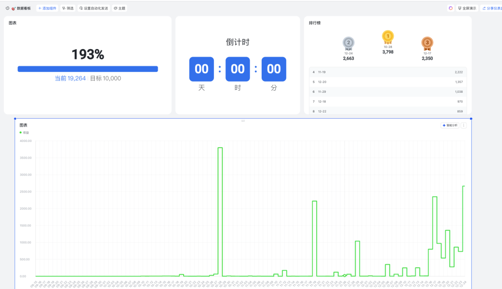
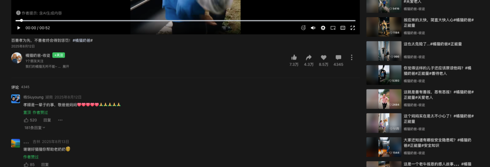
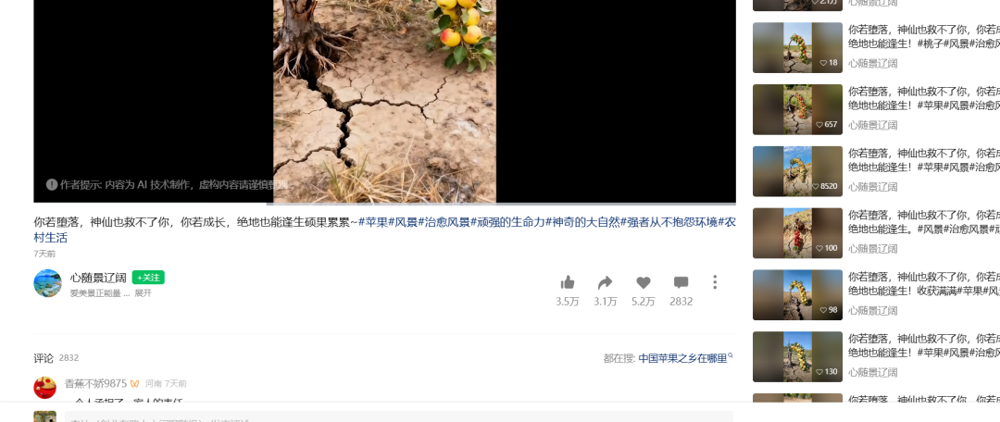
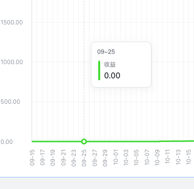
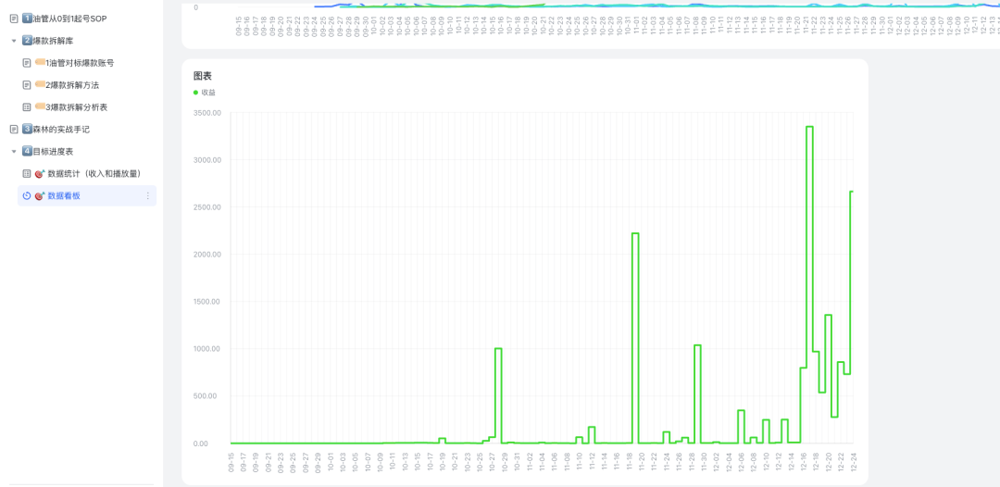
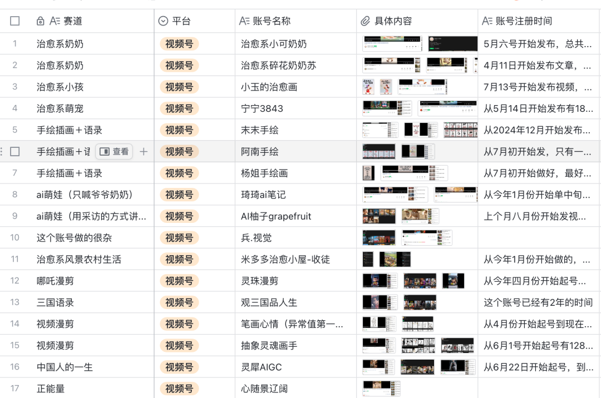
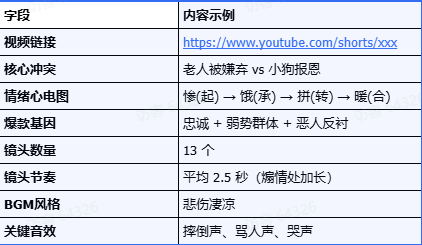
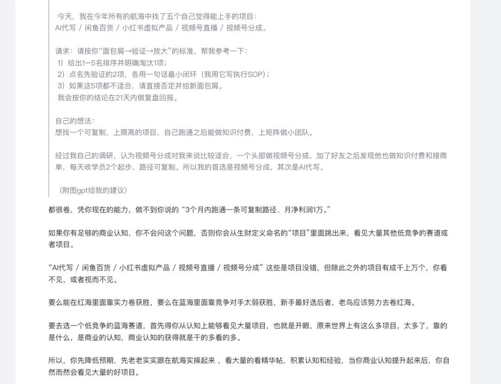

# 三次创业失败后，我靠深耕 AI 视频变现1.9万

原创 森林 *2026年3月25日 19:05*

👆点击 **生财AI精选** >点击右上角“···”>设为星标🌟

AI短视频的红利还在，现在入场依然来得及。

生财圈友@森林，服役8年的退伍老兵，退伍后独闯杭州，裸辞后三次创业失败，背水一战入局AI短视频。

从每天收入不到1块，熬到最后10天单日破3000元，100天全网播放3.7亿，变现1.9万，目标完成193%。他说：那段每天收入不到1块的日子，不是失败，是在打地基。


大家好，我是森林，一名曾在部队服役8年的退伍老兵。

2025年2月，退伍半年的我独闯杭州，因直播商务高压低薪果断裸辞。在历经装修资料、二手车等三次创业失败后，我通过ROI分析锁定 **视频号AI短视频赛道** 。借力AI红利扬长避短，我立下军令状： **从0开始死磕100天，目标赚够1万块！**

100天后，全网累计播放3.7亿，变现1.9万元。



**Part 1**

**项目经过：从第1天到第100天**

**第一阶段：走错方向，6天颗粒无收** **（第1-6天）**


第一天入局，我没有做AI原创视频，而是做了搞笑混剪二创。第一条视频发布后，意外收获30万播放、500点赞，当天涨粉39人。我以为找到路了，当晚睡觉也踏实。

第三天就出事了。视频被平台判定非原创，流量清零。

我当时没有埋怨，而是继续发、继续试。直到第6天，找了十几个爆款账号之后，我才真正意识到：这条路走不通，必须转向。

这是第一个教训： **入局前没有验证赛道能不能走通，直接上手，白干一周。**

转机在第6天。我在新榜翻到了三个正在爆火的账号：AI萌宠运财、AI动物救援、AI植物生长。

仔细观察一圈，当时动物救援的质量普遍很差，粗制滥造占大多数，但随便发就能过十万播放。

机会就在这里，我当天就定下来，开始换方向。

  

（向右滑动以查）

**第二阶段：一分钱没赚，但每天都在进化** **（第7-25天）**



第7天，我花399元付费学了AI短视频制作的完整课程。一条视频的制作流程在我脑子里清晰起来：写剧本→文生图→图生视频→剪辑发布，4个步骤，每一个都是坑。

第8天，我做出了第一条真正的AI原创视频。足足花了8个小时。

接下来整整17天，每天收入：0。

我在日报里写过一句话：“ **做项目就跟在部队叠被子一样，做到最高标准，才能拿到更好的结果。** ”

写这句话的时候是凌晨，我已经连续11个小时没离开椅子了。

为了逼自己静下心来，自己单独在外面租了个单间。切断了几乎所有的社交，没有饭局，没有朋友聚会，甚至一整天连话都说不上。每天陪伴着我的，只有窗外的车流声，和电脑日夜不停的嗡嗡风扇声。

那段时间网络上有人说我在割韭菜，有人直接拉黑，我把那些截图全部存了下来。

**不是为了记仇，而是为了当燃料。** 每次想偷懒，就打开看看，然后继续干。

**第三阶段：3块8毛3，第一笔收入（第26-43天）**

第26天，第一笔收入到账：3块8毛3。

我仔细观察这个数字看了很久。不是感动，是算了笔账：100天赚1万，现在26天过去了，才赚了不到4块，怎么算都不够。

但我并没有慌。我当天的日报里只写了一句话： **“要清楚的知道只要我做对动作，钱就一定会来到我身边。”**

接下来半个月，每天收入在4到7块之间浮动，偶尔跳到五六十块又掉回去。

但我知道，每一天都在变好——提示词越写越准，出图速度越来越快，爆款制作逻辑越来越清晰。

**第四阶段：第44天，单日破千（第44-79天）**

第44天，单日收入3798元。

钱不是来自视频播放流量分成，而是来自我发在生财的一篇精华帖。

我把自己摸索出来的完整流程分享出去，生财奖励了我3个碎片，一个碎片折下来价值1265元。

当时我愣了一下。

我做了将近一个半月的视频，每天十几个小时，累计赚到的钱加起来还不到这个帖子的零头。

但我不觉得讽刺，反而觉得踏实—— **因为金钱是实实在在用价值换来的。** 我替别人趟了那段最难走的路，节省了他们的时间，他们愿意付钱，这件事本身就说得通。

这也是我第一次明确地分享：除了平台流量中断，知识本身也可以变现的。只要你真正投入、踩坑、总结出可用的经验，就有人愿意为你买单，我当时AI短视频账号也只有几千个粉丝。

**第五阶段：第80天的觉醒，把体力活交出来（第80-90天）**

做到第80天，我记下了：做一个视频要4小时，剪辑就占了一半。我每天最宝贵的精力，全部在搬砖，没有一点投入到真正重要的事。

我在群里发了一条消息： **“招剪辑短片，30元一条，会剪映就行。”**


决定改变整个节奏。把剪辑交出来之后，我的精力全部释放到脚本研究和制作视频素材上。这是整个项目里最重要的一个转折。

**第六阶段：最后10天，爆发（第90-100天）**

第92天，和瓜子二手车品牌广告商在视频号和快手双平台合作。

第94天，12月17日，单日收入3350元。

我看到后台的数据，手颤抖，第一次单条视频能够有那么多的收益。


12月24日，又是2663元。

最后10天，到账 **超过1万元** 。

这还不是终点——还有几条商单的播放量还在攀升，收益仍在持续结算。

**100天结束，全网累计播放3.7亿，总变现1.9万元，目标完成193%。**



这组数字值得反复看：

❖

10月24日，收益0.76元；

❖

12月17日，收益3350元。

中间隔了53天。

这一百天，我想告诉还在从 0 到 1的圈友一件事：

❖

那段每天收入不到1块钱的日子，不是失败，是在打地基。

所有最后10天的爆发，都是前90天那些0.76元一块块垒起来的。

**竹子长4年，只长3厘米。第5年，每天长30厘米。**

**熬，是做成事情必须经历的步骤，不是失败的信号。**

**Part 2**

**AI短视频到底怎么做？**

这部分是这篇文章最核心的内容，我将分享从选题到发布的完整流程。

整个流程分四步： **找对标账号、拆解爆款逻辑、用AI生成视频素材、剪辑发布。**

01

***手动找对标账号***

很多人做AI短视频，上来就研究哪个AI工具好用，结果做出来的东西没人看。

工具只是铲子，你得先找到有金子的地方。

刚开始我也走弯路。我做过“搞笑混剪AI视频”，结果二创内容死活过不了原创审核。

后来我把目光锁定在了”动物救援”这个赛道。

理由很简单： 我盯上了一个博主，5 月份起号， **到我入局时已经 70 万粉丝** 。抖音单条视频经常 10 万+ 赞。这说明池子够大。

"万物皆有灵"这种题材在各个平台都容易传播；而且当时这个赛道的竞争对手普遍质量不高，粗制滥造的内容占大多数，进去做高质量的，胜算更大。

当时很火的还有“哪吒”、“治愈女孩”赛道，但我发现那些账号要么半死不活，要么内容质量太 Low，全是粗制滥造的 PPT。

我找国内对标账号的方法是这样的：先在新榜或者蝉妈妈这类数据平台搜低粉爆款账号或者最近涨粉非常快速的账号。

❖

新榜网址：

https://www.newrank.cn/ranklist/gongzhonghao?l=sq\_main-t\_bd


❖

蝉妈妈网址：

https://www.chanmama.com/bloggerRank/


也可以在抖音和视频号搜相关关键词，比如"动物""救援""正能量"，按播放量排序，只看头部账号。重点看他近30天的爆款占比，如果高频率出爆款，说明他手里有成熟的模板。

找到账号之后，不只看点赞数，还要看评论区。如果有人评论"这只猫咪好聪明呀"、"看哭了"，说明观众信了，把AI内容当成了真实的。这种账号才是真正值得研究的。

这是我之前找到的AI视频账号。



还有一个找捡漏机会的思路：如果你发现有人在YouTube上搬运某个博主的视频，画质很差，但播放量还很高，这说明这个题材需求大、但优质内容供给不足，你带着高质量内容进去，直接是降维打击。

02

***拆解爆款——三遍渗透法***

找到对标账号之后，不是直接模仿，而是先搞清楚为什么这条视频会火。我用的方法叫"三遍渗透法"，把一条爆款视频看三遍，每遍关注不同的维度。

**第一遍：关掉声音，只看画面。**

目的是看视觉叙事：故事线是否顺畅、镜头切换的节奏快还是慢、哪个画面会让你的心里"咯噔"一下。以一条"老人与狗"的爆款为例，故事线是这样的：

❖

老人摔倒、粮食撒了一地，商店老板恶语赶人，小狗发现没有东西吃，小狗去工地搬砖，最后买回面包，老人落泪。

镜头节奏整体很慢，煽情的地方足足停了3到5秒，铺垫的地方1到2秒就切走。

视觉上有几个暴击点：老人摔倒时粮食扬起的瞬间、巨大的水泥袋压在小小的狗身上造成的反差、老板把钱扔在地上的轻蔑表情，以及最后人和狗拥抱的结尾。

**第二遍：关掉画面，只听声音。**

感受声音是怎么推动情绪的。注意BGM在哪个节点变调、哪里加了特效音。

同样是那条视频，全程是悲伤的大提琴，几个关键音效贯穿全程：老人那声"哎呦"、老板凶狠的"Get out"、小狗搬东西时吃力的喘息声。

**画面是骨架，声音才是灵魂，** 这是拆解之后最大的感受。

**第三遍：逐帧填表，把细节变成可复用的资产**

用剪映的"智能镜头分割"功能把视频拆开，把每一个镜头的画面内容、对应情绪、时长、音效细节全部填进表格。这步最枯燥，但最值钱，因为你以后做新视频的时候，可以直接翻这个表来找参考。

拆解了10条视频之后，你会开始发现规律：所有爆款都有情感共鸣的内核， **前3秒必须有冲击** ，情绪曲线基本是 **"悲→更悲→转折→治愈"** 。这些规律，一条视频是看不出来的，拆得多了自然会看见。

有一个额外的方法：把你的拆解结果发给AI（比如Google AI Studio或者Claude），让它用"好莱坞导演"的视角来指出你分析的不对的地方。

我就是这样发现了 **"视觉镜像手法"** ——老人搬粮食和小狗搬粮食的镜头构图是一样的，这在心理学上叫命运镜像，让观众潜意识里感受到小狗在承担主人的苦难。这个细节我自己看了几遍都没发现，AI一下子给点出来了。

我的提示词（Prompt）：

```js
“你现在是一位拥有 10 年经验的好莱坞短视频导演。我上传了一段视频，并对这条视频进行了拆解分析（如下）。请你毒舌一点，指出我分析的不对的地方，以及我没看出来的爆款逻辑是什么？”【这里粘贴你的拆解内容】
```

我的拆解表格模板（建议收藏）：



03

***AI短视频怎么做***

整个制作流程分五步：撰写剧本设计分镜→文生图生成静态素材→图生视频生成动态素材→检查和优化。

很多人一开始就想着批量生产、自动化生产，结果做出了很多东西，但不知道问题在哪，因为他们从来没有搞清楚什么是对的。

我刚开始的做法是先买了几款爆款脚本，不是为了直接用，而是研究它的结构——为什么这样开头、为什么这里要停顿、为什么这个镜头特别强调。

只有搞懂了这些，你才能判断好坏。提示词也一样，只有自己写过、跟AI工具反复碰撞过，你才知道这个工具的调性是什么、什么样的它能理解、什么样的指令它会跑偏。

等你建立起六大判断标准之后，再上自动化才有意义——因为AI批量生成的内容，你能一下子看出哪里对、哪里需要改。跳过这一步直接上自动化，就是在用你不懂的标准检验你不懂的输出，只能靠运气。

**1、编写剧本和设计分镜**

**剧本是一条视频的灵魂。**

先写一个故事大纲，然后把大纲拆成若干个分镜头。

比如我设计过这样一个故事：

❖

奶奶和金毛坐在街头吃包子，一辆法拉利跑车开过来溅了奶奶和金毛一身泥，然后女人下车给奶奶打了一巴掌，然后用高跟鞋踩碎包子，金毛大叫被女人踢打，女人大笑开车跑走，金毛仰天长啸，所有流浪狗跑过来。金毛和流浪狗跟着跑车。女人到家下车，金毛让所有的狗上去砸车。女人发现跑过来，然后蹲在地上哭。接着金毛跑进别墅叼走爱马仕香包，然后把包包送给奶奶。

故事逻辑顺了之后，把它拆成16个分镜头。每个分镜头需要写清楚事件发生经过。

分镜头拆得越细，后面生成素材和剪辑的时候越省事，不用边做边想“下一个镜头该拍什么”。

人物形象设计上， **善恶的反差要尽量拉大。**

被欺负的奶奶，我的设计是破烂捡烂的农村老妇人：

```js
提示词为：奶奶：一位满头白发满脸皱纹的农村老奶奶，头发散乱。身穿打补丁的破旧蓝色粗布上衣，黑色粗布裤子，脚穿破旧的手工黑色布鞋。
```

**2、文生图：静态素材怎么生成**

出图工具我用即梦，开69元会员，目前用 4.5 生成图片不要钱，一次同时出4张，成本低、出图量大。

**第一步：先把形象图生成出来**

不要上来就开始做分镜，先把这个故事里所有出场人物的形象图单独做好。每个人物生成4张，挑一张最符合你设计的留下来，后面所有分镜的提示词都以这张图为基准来描述。

这一步很多人跳过，结果达到第8个镜头发现女人的脸跟第1个镜头对不上，重做非常浪费时间。

**第二步：按格式逐个编写的分镜提示词**

人物形象图确定后，对照飞书多维表格里的分镜描述，逐个写提示词。每个提示词的格式固定如下：

❖

**图片比例 ＋ 图片风格 ＋ 场景 ＋ 画面描述 ＋ 人物形象 ＋ 道具形象**

以被奶奶溅泥那个镜头为例：

❖

图片比例9:16 ，写实风格，夜间冬天在中国城市的街道上，奶奶和金毛坐在路边，身上沾满了黏糊糊的黄泥。奶奶：一位满头白发满脸皱纹的农村老奶奶，头发散乱，穿衣服的破旧蓝色粗布上衣，黑色粗布裤子，脚破旧的手工黑色布鞋。

格式写好后，全部填进飞书多维表格的“分镜提示词”那一列，然后逐个复制粘贴到即梦里生图。生成完成后直接把图片粘贴进表格对应的“分镜图”列，后续写动态视频提示词时图片就在旁边，随时可以参照。

**3、图生视频：动态视频素材怎么生成**

静态图片全部生成好之后，把图片粘贴进飞书多维表格对应的分镜图那一列。然后在旁边再插入两列：一列放动态视频提示词，一列放生成好的视频。这样所有素材集中在一张表里，写提示词的时候图片就在旁边，不用来回切换窗口。

动态视频提示词必须包含两个要素： **镜头运动＋事件。**

镜头运动常用的有：镜头推近、镜头拉远、镜头固定、镜头聚焦、镜头靠近。

事件就是你想画面里发生什么，描述清楚主体的动作和状态就行。

完整的格式模板：

❖

镜头运动+时间+画面主体动态呈现人物面部纹理，动作自然流畅，环境光亮，符合逻辑，极致细节，超真实动态捕捉，人物轮廓不变形，自然，不模糊，高质量，无瑕疵。

举个例子，那个奶奶和金毛在街边的镜头：

❖

镜头固定，奶奶把包子分给金毛一半，红色跑车快速向前行驶，在路过泥坑的时候，溅起泥水撒在奶奶和金毛身上。人物面部表情，自然动作流畅，超真实动态捕捉，高质量。

对于刚开始不会写提示词的人，有一个笨办法很管用：找一条爆款视频，对着视频把画面里的人物动作和场景逐字描述出来，把描述词套入上面的格式，就是一条完整的提示词。

另外分享一个节省时间的小习惯：提示词写到一半的时候，先把已经写好的那些丢进AI视频生成工具里面开始生成，生成的过程中继续写后面的提示词。两件事情，能省下大概10分钟。

**4、检查和优化**

视频全部生成之后，不要着急着剪辑，先做三件事。

**第一，核对数量。**

对照分镜表，一个镜头一个镜头确认视频文件是否齐全，有漏掉的立即补做。这个很容易忘记。

**第二，修改逐个看效果。**

每一条视频都要打开反复看，确认画面达到你想要的效果。人物表情不够丰富、动作不对、画面模糊，都要重新提示词再出一遍。不能为了赶进度就将就，视频质量直接影响播放率。

**第三，把最终满意的提示词补回表格。**

这一步很多人觉得麻烦就跳过了，但非常值得做。积累了20、30条视频之后，把所有动态提示词拿出来研究，你会慢慢找到规律——复杂的动作怎么更准确、什么样的格式出图更稳定。而且哪条视频爆了，直接翻出提示词换个人物形象就能复刻，不用重新想。

**提示词也是有价值的资产，** 积累足够多之后，爆款视频的完整剧本可以放在小红书、公众号和闲鱼上卖，是一次投入多次收益的东西。

生成视频的工具，我主要是用海螺，大家也可以根据自己的需求选择适合自己的工具。

**Part 3**

**感谢生财有术**

写到这里，有几个人我必须单独说声谢谢。

入局前我仍然犹豫，特意在生财匿名提问了亦仁，把自己的情况和困扰的几个方向都列了出来。

他的回答很直接：这几个方向都卷，凭着我当时的能力很难跑通，新手最好找到低竞争的蓝海赛道，先降低预期，老老实实跟着航海实操，看大量精华帖，等商业认知提升了自然会看到好项目。



虽然没有帮我直接选项目，但让我认清了一件事： **与其在红海里跟高手过招，还不如找一个竞争对手弱的方向扎进去先跑通。** AI短视频当时在各个自媒体平台上竞争对手质量普遍很差，这就是机会。

做项目过程中，生财的YouTube和视频号航海手册帮了我很大的忙。从注册账号、制作 AI视频技巧，到开通YPP、顺利回款，手册里写得很细，我照着一步步走下来，没有走太多弯路。

还有代一、zero、 大臣等很多大佬的精华帖，让我在做视频的过程中学到了很多具体技巧。

慢慢成长，终会提炼出自己的一套方法论。

以上就是我分享的关于0基础做AI短视频的变现经验分享，希望对你有帮助。

**作者** | 森林 | **排版** | 爱丽丝家的胖兔子

**主编** | 七天 | **编辑** | 小武 高月亮


继续滑动看下一个

生财AI精选

向上滑动看下一个