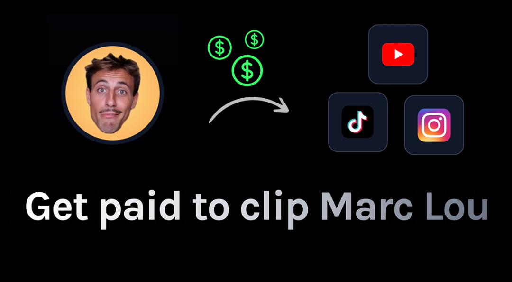
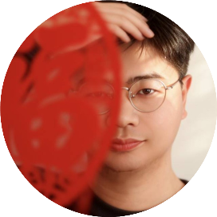

# 他一个人，3年做了25个产品，去年赚了740万

原创 方北H5FUN 北方的方北 *2026年3月27日 18:01*

## 法国独立开发者Marc Lou的故事，比你想象中更可复制

---

我第一次看到这个数字的时候，下意识以为是标题党。

**103万美元。一个人。一年。**

折合人民币大约740万。没有团队，没有投资，没有融资，不用坐班，在法国的一个小城市，靠着一台电脑和几款SaaS工具做到的。

然后我花了两个小时把他的公开内容翻了一遍，发现比想象中还要值得细讲。

不是因为钱，而是因为 **他的路，普通人真的能走** 。

---

## 先说这个人是谁

Marc Lou，法国人，不是什么名校毕业的天才，也没有硅谷大厂背景。

2022年，他开始走上独立开发这条路。起点并不好看——头几个产品没什么水花，没有用户，没有收入。但他有一个习惯： **做完就上，上了就看，没人用就下一个。**

从2022年到2025年，他做了25个产品，其中12个实现盈利，成功率将近50%。

2025年，他的年收入越过了100万美元的门槛。

---

## 他是怎么做到的？

我把他的路拆成三个关键决策，每一个都值得单独说一说。

---

### 决策一：不做"一款大产品"，做"一个产品矩阵"

很多人创业的思维是：我要做一个改变世界的产品，然后用三年打磨它。

Marc Lou完全相反—— **他把精力分散在一组互相补充的小工具上，每个产品都只解决一个具体问题。**

他的几个主力产品：

\- **ShipFast** ：帮开发者快速搭起SaaS应用的代码模板（集成支付、登录、邮件），月收入2万美元+ - **CodeFast** ：在线编程课程，主打"几周学会独立开发"，月收入2.1万美元+ - **DataFast** ：轻量级数据分析工具，月收入约1.6万美元 - **TrustMRR** ：收入验证平台，帮助独立开发者展示真实收入数据，后来居上

单个产品看起来都不算"爆款"，但 **叠加起来，就是一台稳定的现金流机器** 。

更聪明的是，他把这些产品做成了一个生态：在ShipFast的支付文档里推荐ByeDispute，在部署教程里推荐IndiePage——用户从一个产品进来，被自然引导到下一个。 **每个产品都在给其他产品导流。**

---

### 决策二：AI不是辅助，是基础设施

2023年很多人还在说"AI是个玩具"的时候，Marc Lou已经把AI工具嵌进了自己产品开发的每一个环节。

他用AI辅助写代码（Claude Code、CodeX等），用AI帮他做内容营销，用AI跑A/B测试文案。

不是偶尔用一下，而是 **每天都用，每个产品都用** 。

有人问他，如果没有AI，你的收入会是多少？他的回答很直接："大概只有现在的三分之一。"

这句话我觉得比任何方法论都有冲击力。

AI不是让你"效率提高20%"的小工具，而是 **直接改变了一个人能做多少事的上限** 。

---

### 决策三：把透明度本身做成护城河

很多创业者觉得公开收入是一种炫耀，Marc Lou把它做成了一种商业策略。

他在Twitter和LinkedIn上定期公开自己每款产品的收入数据、产品上线过程、失败经历。这种透明度给他带来了两样东西：

1\. **持续的自然流量** ：每次分享都能吸引新用户关注，有机增长无需烧广告 2. **真实的信任感** ：用户愿意为ShipFast付钱，部分原因就是"我知道这个人是真的在做，做到了多少"

他的产品 TrustMRR（专门用于验证收入真实性的平台），本身就是这个策略的产物——他发现用户需要这个工具，因为他自己就在用类似的需求。

**用自己的问题做产品，本身就是最好的产品验证。**

---

## 哪些东西可以复制？

说完故事，我觉得最重要的不是"哇，好厉害"，而是： **普通人从这里能学到什么？**

我提炼了三点，不是方法论废话，是可以明天就开始做的东西：

**① 先做小产品，不要等"时机成熟"** 找一个你自己有的真实痛点，做一个解决它的最小工具。不需要完美，需要上线。Marc Lou25个产品里，有13个失败了，但他没有停下来哀悼，而是继续往前。

**② 把AI当团队成员，而不是搜索引擎** 每天问自己：这件事AI能不能做？如果能，你为什么还在亲自做？不是偷懒，是解放时间去做AI做不了的事——决策、判断、建立信任。

**③ 公开你的过程** 不需要收入破百万才发内容。你在学习的过程、你踩的坑、你第一个100个用户是怎么来的——这些本身就是有价值的内容。公开就是复利，越早开始越好。

---

## 最后想说一件事

Marc Lou的故事常被人拿来"激励自己"，但我觉得他真正的价值不在于那个103万的数字，而在于他 **证明了一种工作方式是可行的** ：

不需要团队，不需要融资，不需要在大城市卷，一个人，靠几个解决真实问题的工具，就可以过上有尊严的、自由的职业生活。

这在2020年之前，几乎不可能。

但AI出现之后，这条路真实存在了。

而且它会越来越宽。

---

**👇 留言区聊一聊：**

如果让你明天就启动一个"一人产品"，你最想解决的是什么问题？

说出来，也许就是下一个值得做的产品。

 喜欢作者

继续滑动看下一个

北方的方北

向上滑动看下一个

北方的方北