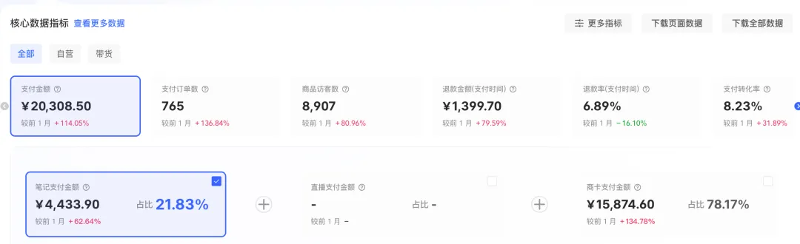
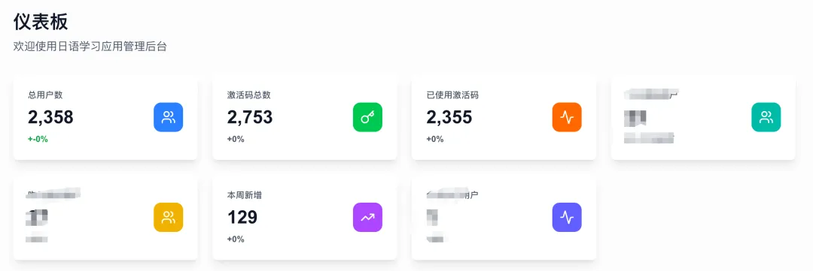
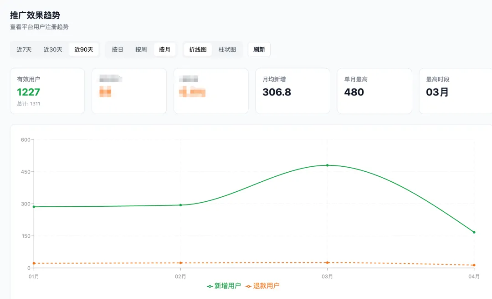
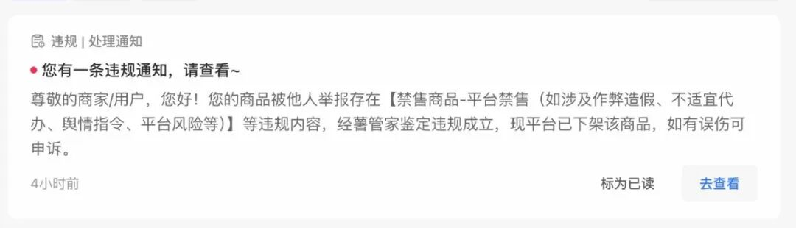
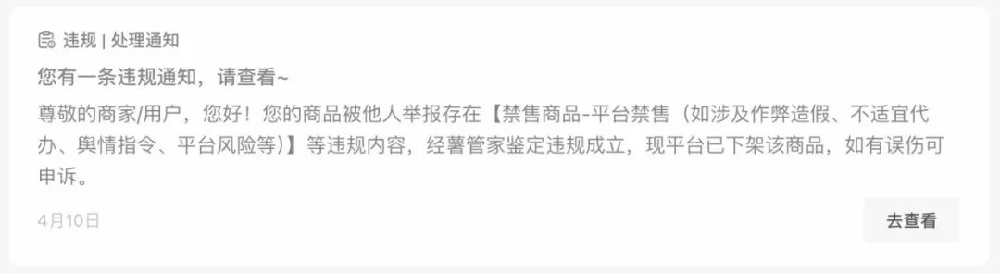
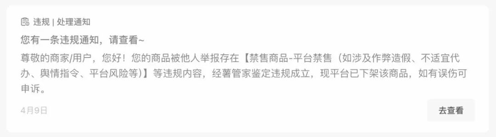
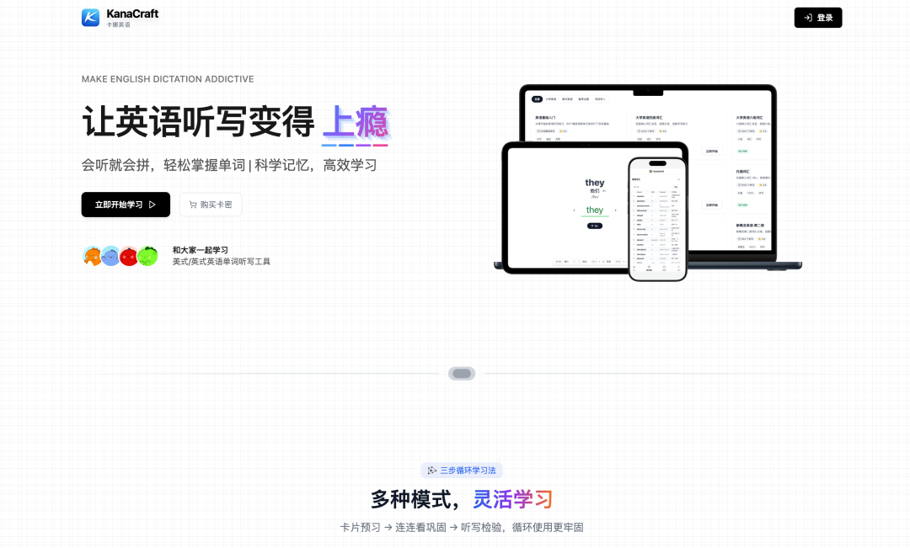
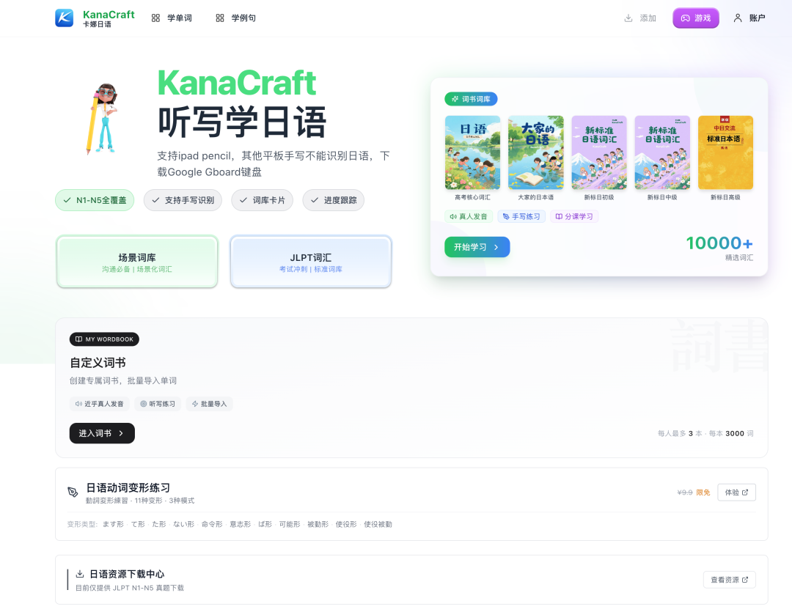
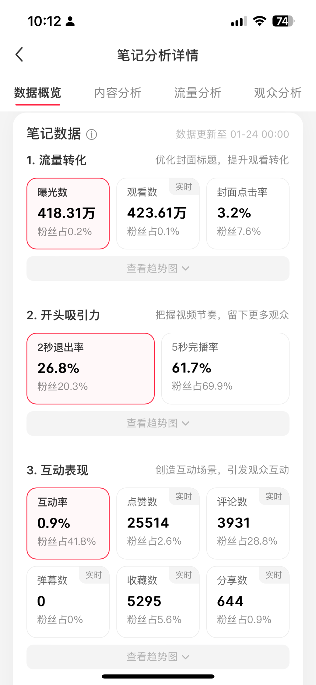

# 不懂代码，开发学英语/日语网站，累计付费用户 4300+，变现12万，完整复盘

原创 黑帽子 *2026年4月24日 11:58*

过去10个月，我用AI做了两款背单词工具，累计4300+付费用户，小红书做到1.8w粉，平均每个月收入1-2万。

  

然而，我决定放弃小红书了。不是因为做不下去，不是因为不能再赚钱，是因为我不想再做了。

从今年3月开始，我的小红书店铺就没消停过：上架，被举报，违规下架，再上架，再被举报，循环往复，一直到现在。

原因想必大家也都知道，最近几个月小红书抽风，虽然我开通了电子资源类目的权限，但还是架不住很多同行举报，商品被反复违规下架。

  

这让我觉得这个市场环境越来越恶劣，所以审时度势，我决定放弃在小红书卖我的产品，至少不再会以小红书为主阵地了。

说实话，我是以一种比较坦然的心情，来写这篇文章的。因为被人举报这种事换谁都得挺生气的，都得去再举报10个同行泄愤，但我还是比较坦然。

我坦然的是，虽然做了小一年的产品阶段性死亡了，但我终于决心放弃在小红书，以电商的方式销售产品这种方式了。

我觉得当一个市场出现这样的恶性竞争时，最好应对策略不是继续纠缠，而是快速抽身才是更明智的选择。

过去这10个月，我一直不希望更多人知道我在用这种方式做产品，甚至是，我写过一篇5000字的复盘，但想了想后还是没有公开发出去。

因为在小红书开店卖产品，好处是成交路径最短，但坏处是将自己放在了所有人的面前，没有太多的信息差可言。

写今天这篇文章，算是给我做了差不多10 个月的产品，做一个阶段性的复盘总结，画上一个句号，因为我今年即将开启下一个做产品的阶段。

先说一下我这俩产品是啥吧。

一个学英语单词的工具，一个学日语单词的工具。

 

我为什么会做这样的一个产品？

原因很简单，大概是去年四五月，我在生财看到一条风向标：小红书有个账号在卖日语背单词工具，卖了几千单。

我在小红书搜了下后，发现这类产品整个平台就她一家在做。

不过星球的评论区也有人泼冷水，说她的销量有水分，说刷单是电商基操。我搜了下，发现这个机会从24年12月开始，就有人不止一次发过了，但时隔四五个月，市场上依然只有她一家。

所以，我意识到这是个机会，一个还没充分竞争的蓝海产品。

不过，我没有立刻动手，而是盯着她的店铺观察了两三周，确认销量每周能稳定增长1000+，才开始用cursor开发。

后来，我想了想，当时之所以没人跟进去做，大概是因为那时候会用AI编程的人还不多，而我早在24年12月就开始接触ai编程，这反而给了我短暂的机会窗口期。

等我观察确认产品能做后，这个时候，差不多是25年5月份了。

我的开发能力比较菜鸡，加上也不够专注，所以开发进度很慢，大概到6月底的时候，我才勉强将一堆bug的产品做出来上线，并上架到小红书店铺。

现在想想，当时还是因为拖延和对这件事的信心不是那么足，所以浪费了至少一两个月的黄金时间。

并且，我在产品开发的过程中，纠结一些功能的细节，做了一些自我感动但没啥卵用的功能，浪费了比较多的时间。

如果现在再让我做一遍，我会快速先将整个产品的框架做出来，只做最核心最基础的功能，然后快速拓展英语、德语、法语、意大利语、泰语等等所有语种，直接搞至少10个小红书号做矩阵销售。

因为在这个时间阶段，小红书在卖这类工具的人真的是屈指可数，很多语种甚至是完全没有人在卖，而我很早就有这个意识拓展其他语种，但输在了执行力上，今天再看只觉得当时执行速度太慢太慢。

上线前3天，发了五六条笔记，没卖一单，还是有些失望的，感觉这东西没有自己想象中那么好卖。

但认真想了想后，我还是决定继续坚持一下。

一方面是因为我想对方既然能卖几千单，为什么我不能？另一方面，是毕竟开发花的时间也不算短，所以还是想再坚持一星期看看。

还算幸运的是，第四天，我卖了第一单，从那之后，每天都陆续有出单。

最疯狂的时候，一条视频爆了400万的播放量，小红书千帆客服消息几秒一条客服消息进线，网站上1分钟内瞬时500多个注册请求，让我不到200块钱在火山引擎买的新手服务器直接宕机了。

我的这个产品从最开始卖不出去，到慢慢出单，到爆单，说实话也不算是运气，这里面还是花了挺多心思的。

最开始我直接模仿对标账号的爆款做视频，但播放量最多一二百。

后来发现问题出在细节上，比如：拍摄角度要让平板看起来舒适，在平板上手写的字不能太小也不能太丑，视频节奏快要且有节奏感等。

在摸索出稳定的内容模板之后，我就把账号交给了我女朋友运营。

站在今天来看，这俩产品能够持续产生销量，一直有用户付费。

一方面，我觉得最主要的还是在恰当的时间做了正确的事情。

因为，在我的产品上线后大概三四个月后，各种同类的产品就开始冒出来了，不止是日语和英语的背单词工具，还有德语、俄语、泰语等至少大几十个同质化的产品。

另一方面，这是个纯粹的流量变现的生意，因为是直接在小红书卖的网站兑换码，用户需要走平台付款，所以对于内容能力的要求，其实要大于产品能力本身。

但当时我觉得产品和内容一样重要，不应该在一个买断制的产品上过分打磨产品的细节，事实证明，对于一次性的生意来说，客户的体验是次要的。

因为不需要考虑用户复购，也不需要担心用户口碑，产品做到及格能用的程度就完全足够了，多做一个不同的功能都是浪费时间。

而这类产品用户极大概率也不会复购，因为学习类的产品本身就是在对抗人性最大的弱点。

对于内容能力，我觉得最核心的还是持续输出的能力，如果不是我女朋友来运营这个账号，即使这个产品能卖，让我来做，可能最多不超过3个月，我就得放弃，我对于这种高度重复性的工作向来没啥耐性。

其实，这个账号发的视频也不是说每条都会爆，不少时候点赞也是个位数，但架不住发的多，数量堆上去了后，自然也就会出来一些爆款和大爆款。

我大概数了下，到目前为止，一共发了有几百条视频。其实，这些视频花多少时间不多，只是最开始在摸索的时候，花了比较多时间测试模版，到后面，基本一个星期的视频，最多一上午就能做完。

我的这个两个产品，过去一年的经历大概就是如此。

严格上来说，我做的日语和英语背单词工具，不算是一个纯粹的软件类产品，更像是一个虚拟版的电商产品，和那些卖各种电子资料网盘链接的没有太大区别。

而小红书现在的电商环境，对于卖虚拟资源的人来说越来越不友好。

所以，下一步就我的这两个产品来说，我已经在布局第二渠道，将销售的重心放在抖音上。

最后，我觉得自己这俩产品，对于我这种不懂代码，只会用ai手搓的人来说，算是阶段性成功的，成功在做了一个能卖的出去，还有人一直愿意买的产品。

但从做产品的角度来说，这是俩很失败的产品，因为产品是买断制的，没有任何复购，所以天花板就很低，不会随着时间不断积累门槛。

其次，产品本身的定位就很模糊，这俩产品本质上卖的只是一个功能，靠在ipad上用手写笔手写单词吸引用户的兴趣，卖不是一个针对用户学单词场景中问题的解决方案，所以就很难真正留住用户。

所以，我觉得对于做国内产品来说，买断制的产品能不能赚钱，关键只在于是否有做好流量的能力，但这类的产品往往很难持续性赚钱，因为流量会随着时间竞争越来越大，产品上很难建立护城河。

在产品方面，我下一步的打算，是去做一些，能够解决用户某一个具体小问题，且用户愿意按需付费的产品，不再会去开展做买断制的产品了。

，

继续滑动看下一个

黑帽星球pro

向上滑动看下一个
