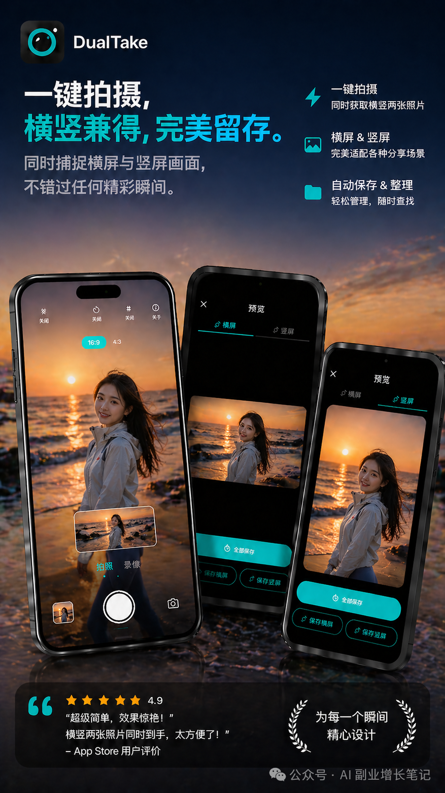
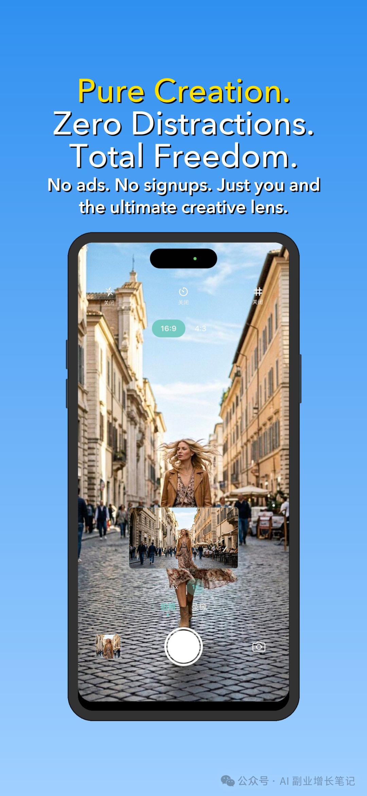
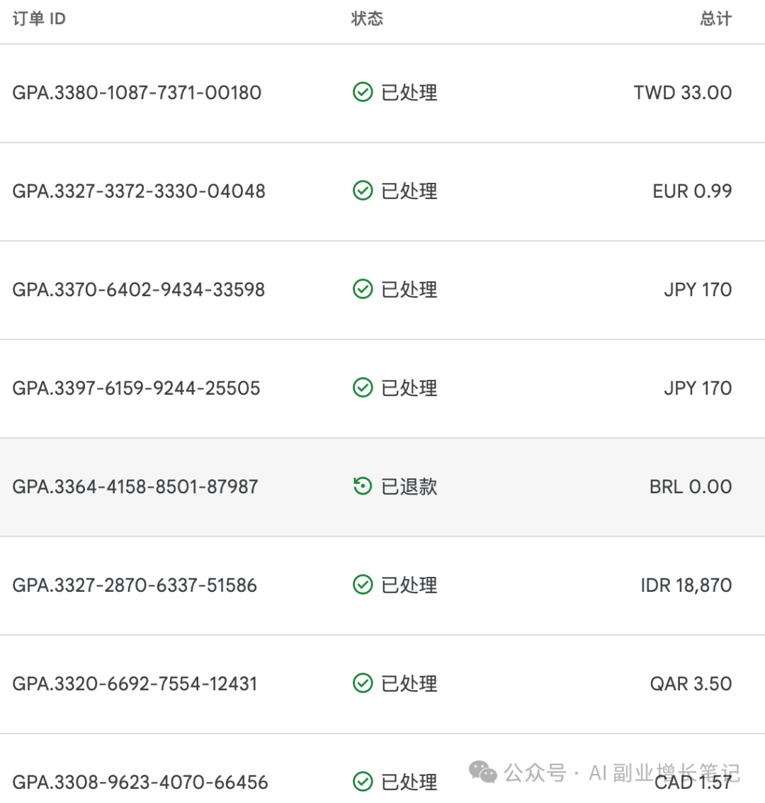

# 停更半个月，我用 AI 做的相机 App，赚到了第一笔收入，海内外四端上线，从个人痛点到真实用户

原创 小欧 *2026年5月7日 07:30*

这个公众号停更了半个月。

不是因为不想写了，也不是因为 AI 副业这件事不做了。

恰恰相反，这半个月我几乎把所有空闲时间，都投入到了一款叫 **DualTake** 的相机 App 上。

它的功能很简单： **按下一次快门，同时得到横版和竖版两份素材。**

📱 **国内 iOS：** DualTake相机
🌍 **海外 iOS：** DualTake Camera
🤖 **海外 Android：** DualTake Camera
🏪 **国内 Android：** DualTake，已覆盖小米、OPPO、vivo、应用宝、华为等主流应用市场

数据还远谈不上成功，但它已经不再只是一个 Demo。

海外版本已经产生了第一批真实付费下载，国内版本也达到了千级下载规模，日活大概稳定在几十人左右，Android 端每天也开始通过广告持续产生收入。

对一个独立开发者来说，这件事的意义不只是赚了多少钱，而是它终于从一个想法，走到了真实用户面前。

· · ·

## 一、创意来自一个很具体的拍摄痛点

DualTake 的想法，不是拍脑袋想出来的。

它来自我自己一个很高频的痛点。

很多时候我拍视频或者照片素材，会遇到一个很尴尬的问题： **同一个画面，不同平台需要的画幅不一样。**

比如 B 站、YouTube、横屏封面，往往更适合横版；而抖音、小红书、视频号、朋友圈，又更适合竖版。

📌 普通相机的处理方式其实很麻烦：

要么横着拍一遍，再竖着拍一遍；
要么只拍一种画幅，后期再裁剪；
要么拍完才发现，某个平台的比例根本不合适。

但无论哪种方式，都有问题。

重复拍摄会错过瞬间，后期裁剪会损失构图，有时候还会让原本完整的画面变得很别扭。

所以我当时就在想，能不能做一个相机：

**用户只需要拍一次，App 自动同时保存横版和竖版两份素材。**

这就是 DualTake 的产品原点。

它不是想做一个功能很多的大而全相机，而是想解决一个非常具体的问题： **同一个画面，不用为了不同平台反复拍摄。**

· · ·

## 二、用 AI 辅助开发，大概花了一周空闲时间

这次 DualTake 的开发，我主要用的是 **Antigravity** 。

主力模型是 Gemini，遇到复杂问题时，会切到 Claude Opus 4.6 来解决。

🧩 **开发工具：** Antigravity
🧠 **主力模型：** Gemini
🔧 **复杂问题：** Claude Opus 4.6
⏱️ **总投入：** 大概一周空闲时间，合计约 20 小时

这里我最大的感受是：AI 确实显著降低了普通人做产品的门槛。

过去一个非科班、非全职开发者，想独立完成一个 App，从功能开发、页面调试、权限处理、包体配置，到后面的上架和问题排查，中间会有非常多技术细节。

但现在借助 AI 工具，很多原本需要长时间查资料、试错、排 Bug 的事情，可以被压缩到一个更短的周期里。

**我这次最大的体感是：**
AI 最大的价值，不是让我不用思考，而是把很多原本必须依赖工程经验的实现问题，压缩成了可以快速试错的问题。

当然，这并不意味着 AI 可以自动帮你做成一个产品。

产品方向怎么定，商业模式怎么选，用户到底为什么需要，商店素材怎么表达，价格策略怎么调整，这些判断还是要自己来做。

AI 能帮你把想法更快变成产品，但它不会自动帮你把产品变成生意。

· · ·

## 三、一开始，我优先考虑的是海外付费下载

DualTake 在商业化策略上，一开始就没有打算所有市场都用同一种方式。

我的优先级是： **先验证海外付费下载，再做国内广告变现。**

原因也很简单。

海外用户对工具类 App 的付费习惯相对更好，尤其是一些垂直、小而美、解决具体问题的产品，更适合先尝试一次性买断。

💵 **海外版：** 早期采用 3.99 美元一次性下载，五一前调整为 0.99 美元促销，降低冷启动阶段的付费门槛。

📣 **国内版：** 主要通过穿山甲等广告联盟进行变现，先跑通下载、使用和广告收入的链路。

目前国内收入主要来自 Android 端，虽然每天只是几十元量级，但至少说明这条链路已经开始运转。

这对我来说，是一个很重要的节点。

它说明 DualTake 不只是被做出来了，也开始进入真实商业化环境里接受检验。

· · ·

## 四、海内外双端开发，比想象中更容易踩坑

真正做起来之后，我才发现，海内外双端并不是简单复制一份代码。

一开始，我甚至用 4 个仓库来维护不同版本。

看起来好像很清晰：国内一个，海外一个，iOS 一个，Android 一个。

但实际开发起来，维护成本非常高。

❌ 同一个 Bug 可能要修多遍；
❌ 同一个功能要同步多次；
❌ 某个配置差异没有处理好，又可能引入新的问题。

后来我才意识到，很多国内版和海外版的差异，本质上应该通过配置、环境和构建方式来管理，而不是复制多个项目硬撑。

调整之后，开发效率提升了很多。

这也是我这次非常真实的一个体会：独立开发不是只看能不能做出来，还要看后面能不能持续维护。

· · ·

## 五、开发只是第一关，上架才是真正的消耗战

如果说开发阶段主要是和代码打交道，那么上架阶段就是和规则打交道。

海外主要是 Google Play 和 App Store。

整体来说，这两个平台的规则相对规范。中间也被拒审过 2 次，但问题描述比较明确，按照要求修改之后，很快就解决了。

真正工作量比较大的，是国内 Android 上架。

国内 Android 版本需要覆盖小米、OPPO、vivo、应用宝、华为等多个主流应用市场。

每个平台的要求都不完全一样，尤其是在隐私政策、权限说明、SDK 披露、广告行为、包体信息这些细节上。

DualTake 在国内 Android 上架过程中，累计被驳回了大约 20 次。

最集中的问题，一个是广告联盟集成，一个是隐私政策。

有的平台要求 SDK 信息必须非常详细；
有的平台会检查隐私政策里的字段是否完整；
有的平台会关注广告 SDK 是否在用户同意前初始化；
还有的平台会因为非常细小的描述不一致而驳回。

这部分经历让我更加意识到，做 App 最难的并不一定是把功能写出来。

真正要上线、要商业化、要进入不同应用市场，每一步都会遇到新的规则和细节。

· · ·

## 六、上线之后才发现，增长不会自然发生

产品上线以后，我一开始也有过一个很朴素的期待：

既然已经上架了，是不是就会自然有下载？

现实当然没有这么简单。

刚上线的时候，DualTake 的下载量并不高。

后来我开始看漏斗数据，发现问题不完全是没有曝光。

应用其实有前卡曝光，但用户从前卡进入商详页的点击率很低。

这说明至少有两个可能：
**第一，定价门槛可能偏高。**
**第二，应用详情页的图片没有把产品价值讲清楚。**

现在回头看，早期的商店素材确实做得比较粗糙。

它更像是把 App 截图临时放上去，而不是认真围绕转化设计过的详情页素材。

后来我们重新做了详情页图片，把重点从“这是一个相机 App”，改成“它能一次拍摄，同时获得横版和竖版素材”。

现在的图片风格，更强调使用场景和横竖版结果。

早期版本更像是功能截图堆叠，视觉完成度和卖点表达都比较弱。

两版图片放在一起看，差距其实非常明显。

这件事对我触动挺大。

很多时候，独立开发者会把注意力放在功能上，觉得只要产品能力够清楚，用户自然就能理解。

但真实情况是，用户在应用商店里可能只给你 1 到 2 秒。

他是否点进详情页，是否继续下载，很大程度上取决于第一眼能不能看懂。

所以商店素材不是装饰，而是产品增长的一部分。

· · ·

## 七、看到订单来自全世界，这件事开始变得真实

到目前为止，DualTake 的海外订单来自印尼、日本、加拿大、台湾、巴西、韩国等不同国家和地区。

说实话，这些收入还很小。

无论是海外的付费下载，还是国内每天几十元的广告收入，都远远谈不上什么成功。

但对我来说，这件事最有意思的地方在于：

一个从个人痛点出发、用 AI 辅助开发出来的小工具，真的被不同国家和地区的用户下载、付费和使用了。

每天看到订单来自世界不同地方，那种感觉有时候比产品卖了多少单更强烈。

因为它意味着这个产品不只是我电脑里的一个项目，也不是一个自嗨的想法，而是真的进入了市场。

有人看到了它，有人愿意下载，有人愿意付费，也有人通过广告使用它。

这就是第一笔收入真正带来的意义。

它不大，但它很真实。

· · ·

## 八、接下来，问题变成了如何放大收益

DualTake 现在还处在非常早期的阶段。

目前它完成的，只是从想法到产品、从产品到上线、从上线到第一批真实用户和收入的过程。

接下来真正要做的事情，是继续放大收益。

**① 继续优化应用商店素材**
提高商详页点击和下载转化。

**② 继续测试海外价格策略**
看 0.99 美元促销是否能带来更多付费。

**③ 继续优化国内广告变现**
平衡收入和用户体验。

**④ 继续通过内容渠道曝光**
让更多有横竖版拍摄需求的人知道这个产品。

后面我也会继续在公众号里记录 DualTake 的数据、优化、踩坑和思考。

不会写得太宏大，也不想把它包装成什么成功案例。

它就是一个独立开发者用 AI 辅助做产品的真实过程。

这半个月，我没有停止做 AI 副业。

只是从写想法，真的进入到了做产品。

DualTake 只是一个很小的相机 App。

但对我来说，它已经完成了一件很重要的事：

**它让我看到，一个普通人借助 AI 工具，确实有机会把一个具体想法，推进到真实市场里。**

这件事还远没有到终点。

接下来，就继续边做边写。

**📌 AI副业增长笔记**
不贩卖焦虑，记录真实的 AI 副业、独立开发和产品增长
如果你也在用 AI 做产品，欢迎一起交流

继续滑动看下一个

AI 副业增长笔记

向上滑动看下一个
