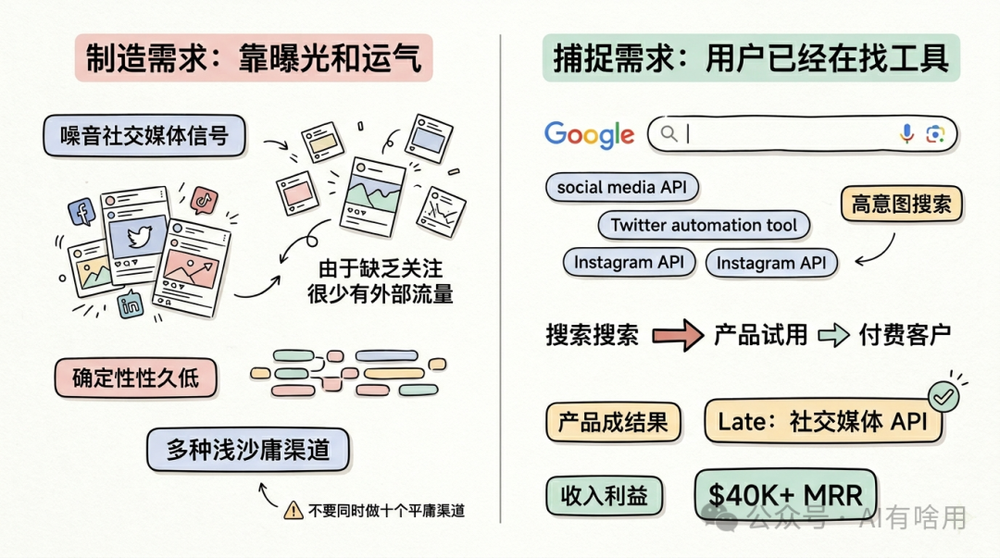
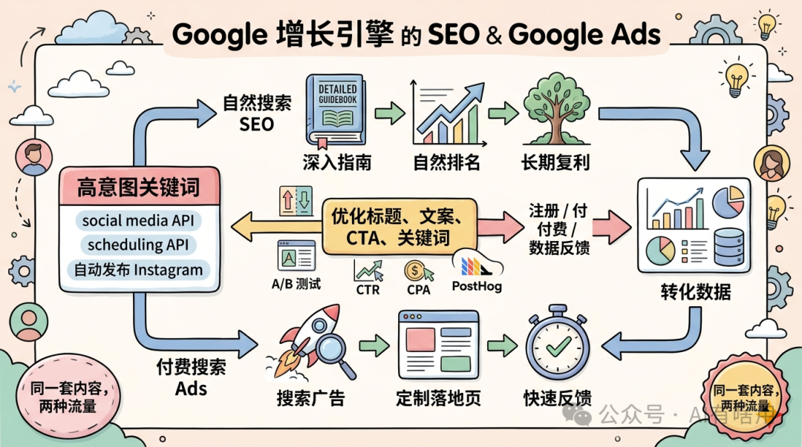
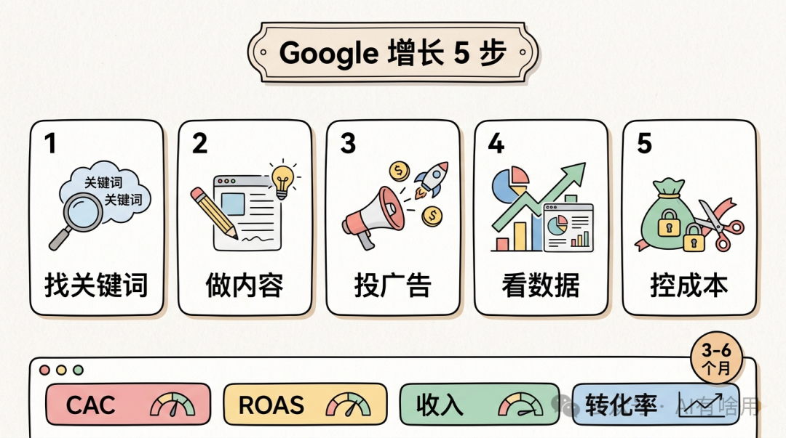
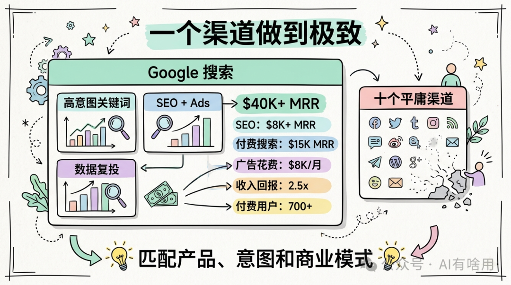

# 我只靠 Google 一个渠道，把 SaaS 做到月入 4 万美元

原创 AI有啥用 *2026年5月1日 11:40*

## 大家好，我是 Mickey，来自西班牙。

我做的产品叫 Late，是一个面向开发者的社交媒体 API。上线大约 7 个月后，它已经做到每月超过 4 万美元的经常性收入。

更重要的是，这个增长不是靠 TikTok 爆款，也不是靠我多年经营个人品牌。

我们几乎只押注一个渠道：Google。

这篇文章想讲清楚一件事：对很多独立开发者和 SaaS 创业者来说，你不一定非要到处发内容、追热点、做十个渠道。你可以选择一个最适合产品的增长渠道，把它做深、做透，然后用数据反复放大。

## 1\. 我们做的是一个社交媒体 API

Late 是一个社交媒体 API（API，Application Programming Interface，应用程序编程接口，指不同软件之间互相调用功能的一套接口）。

简单说，我们把 Facebook、Instagram、Twitter、LinkedIn 等平台的官方 API 包装在一起，帮客户处理平台权限、接入限制和复杂文档。

客户不需要分别对接每个平台，也不需要自己处理各种审核和限制。他们只需要接入 Late 的一个 API，就可以在多个平台上发布内容、管理账号、处理评论和私信。

我们的收费方式主要按已连接账号计费。

产品有三个计划：

第一个是 Build，适合用户开始搭建集成。

第二个是 Accelerate，支持更多账号。

第三个是 Unlimited，允许连接尽可能多的账号。

目前，我们已经超过 4 万美元 MRR（Monthly Recurring Revenue，月经常性收入，指订阅制业务每月可重复获得的收入）。上线以来总注册用户大约 5 万，付费用户超过 700，流失率低于 10%。

## 2\. 我为什么做这个产品

在做 Late 之前，我花了 5 年多时间尝试不同创业项目。

我在西班牙做过一家线上技术教育公司，拿过风险投资。那家公司现在有 100 多名员工。

大约一年前，我开始更深入地研究 SaaS 产品，并注意到一个市场空缺：市面上没有一个简单、价格合理、文档友好的社交媒体自动化 API。

很多工具要么太贵，要么太复杂，要么文档很差。

对开发者产品来说，文档尤其重要。因为开发者不是听你讲概念的人，他们要直接照着文档接入。如果文档不清楚，产品再强也很难转化。

于是我决定做一个 API 优先（API-first，指产品首先围绕接口能力和开发者接入体验设计）的平台，让它对开发者足够友好。

但我从一开始就很清楚：会做产品不够，分发才是关键。

所以我没有把主要精力放在到处试渠道，而是把时间集中在两个经过验证的渠道上：SEO 和 Google 搜索广告。

## 3\. 我们没有去制造需求，而是捕捉已有需求

很多创业者一开始会想：我要不要做 Reddit？要不要做 TikTok？要不要做 LinkedIn？要不要先攒一个等待名单？

我的想法不一样。

社交媒体已经非常嘈杂，很多企业的自然触达也越来越难。你想靠内容制造需求，需要时间、运气和持续曝光。

但有一类人已经在主动搜索解决方案。

比如有人搜索“social media scheduling API”，或者“Twitter automation tool”。这种搜索背后，购买意图非常强。

这类人不是随便看资讯，而是已经在找工具。

所以我们的策略是：不要试图通过病毒式内容创造需求，而是捕捉已经存在的需求。

这就是为什么我们 100% 聚焦在高意图渠道上，比如 SEO（Search Engine Optimization，搜索引擎优化）和 Google 搜索广告。

这些渠道的好处是，经济模型更可预测，也不太依赖运气或平台趋势。

我们会把两个渠道的数据放在一起，用来优化落地页、文案和关键词。然后把收入继续投入到已经证明有效的地方。

## 4\. 同一套内容，同时服务自然搜索和付费广告

我们的 Google 策略可以概括成一句话：围绕用户真正会搜索的关键词，创建有用内容。

有些页面会自然排名，有些页面短期内排不上去，我们就为它投广告。

也就是说，同一篇文章、同一个落地页，可以同时服务自然搜索和付费搜索。

我们当然更希望页面通过自然搜索免费获得流量。但如果某个关键词足够高意图、转化足够好，即使自然排名还没有起来，也值得用广告先买流量。

这让我们的内容不是为了“写博客而写博客”，而是直接服务增长。

## 5\. 自然搜索：只做漏斗底部关键词

在 SEO 上，我们关注的是漏斗底部关键词（ **指用户已经接近购买或选择工具阶段时搜索的关键词** ）。

我们会用 Ahrefs 等工具找那些每月搜索量大概 300 到 800、竞争不高、但购买意图很强的关键词。

比如：

social media API

scheduling API for Twitter

how to schedule Instagram posts automatically

这些关键词的搜索量不一定巨大，但用户意图非常明确。

找到关键词后，我们会写深入指南，真正回答用户的问题。同时，我们会维护清晰的网站结构、较快的加载速度、移动端优化、正确的元数据（ **指网页标题、描述等帮助搜索引擎理解页面的信息** ）。

我们也会做外链建设，包括通过工具获取外链，也包括手动联系别人，有时也会付费。

所有排名都会用 Ahrefs 和 Google Search Console 跟踪，并持续根据点击率（CTR，Click Through Rate，点击率）优化标题和描述。

这部分自然搜索，目前已经带来超过 8000 美元 MRR。

## 6\. 付费搜索：我们的确定性收入引擎

SEO 会随着时间复利增长，但付费搜索能立刻给我们反馈。

所以 Google 搜索广告，是我们的确定性收入引擎。

我们会竞价那些高意图商业关键词，也就是我们同时想通过自然搜索排名的关键词。

每个广告组都有对应的定制落地页，页面内容和关键词意图强相关。

比如 Instagram API，就有专门面向 Instagram API 的页面。

广告投放上，我们使用 Google Ads 的自动出价，把目标 CPA 设置为 120 美元。CPA（Cost Per Acquisition，获客成本）指获得一个客户所花的钱。120 美元是我们能接受的平均获客阈值。

Google 的算法会围绕这个目标自动优化出价。

广告文案上，我们不会只写功能，而是强调价值。

比如：

“1 小时安排 30 天社交媒体内容。”

“用我们的 API 快速触达 10 万粉丝。”

同时，我们持续做 A/B 测试（A/B testing，指同时测试多个版本，比较哪个转化更好），测试标题、描述和落地页。所有结果都会通过 PostHog 等工具追踪。

现在我们每月广告花费大约 8000 美元。每花 1 美元，能带来约 2.5 美元收入。付费搜索每月贡献大约 1.5 万美元 MRR。

## 7\. 如果从零开始，我会按这五步做

如果今天给我一个全新的 SaaS，产品已经有 MVP，也有少量客户，我会这样启动 Google 增长。

第一步，找到核心高意图关键词。

这些关键词必须非常接近你的价值主张。你可以用 Ahrefs、Semrush，也可以先从最明显的词开始。

比如对我们来说，“social media API”就是最核心的词。

把关键词放进表格，记录月搜索量、关键词难度、相关页面和优先级。然后只专注这些词，不要分散到一堆不相关内容上。

目标是在 3 到 6 个月内，逐步让它们开始排名。

第二步，为这些关键词创建内容。

内容可以是博客、落地页，也可以是免费工具。

关键是内容必须高质量，能真正回答用户意图，并且页面上要有明显的注册入口 CTA（Call To Action，行动号召，比如“立即注册”“开始使用”）。

同时做好内部链接，把相关内容互相连接起来。

我会在第一周推出 10 到 15 篇高质量内容，先建立动量。但不要为了数量疯狂发低质量内容。Google 不喜欢这种做法，长期来看质量更重要。

第三步，用已有内容启动广告。

建立 Google Ads 账号，围绕同一批关键词创建广告组。每组准备 3 到 5 个文案版本。

文案要讲价值，不只是堆功能。

第四步，根据数据优化和放大。

你要识别哪些关键词真的带来客户，而不是只带来流量。

那些不转化的词，可以暂停。高 ROI（Return on Investment，投资回报率）的词，要加大投入。

同时持续测试标题、文案、CTA 和落地页。如果回报稳定，就逐月增加预算。

第五步，追踪并改善获客成本。

你可以用 Google Sheets、Looker Studio 或其他工具搭一个仪表盘，追踪 CAC（Customer Acquisition Cost，客户获取成本）、ROAS（Return On Ad Spend，广告支出回报）、收入和不同渠道流量。

一个健康的 CAC，通常是 LTV（Lifetime Value，客户生命周期价值）的 20% 到 40%。我们的目标是让 CAC 低于第一年收入的 30%。

每个月都基于上个月的数据，测试新关键词、新广告文案和新落地页。

这就是我会从零开始执行的五步。

## 8\. 产品本身保持简单，但文档必须好

Late 的界面并不花哨。

用户可以在里面创建社交媒体内容，选择要发布到哪些账号，也可以连接和管理不同平台账号。

开发者可以创建 API key，管理 API 调用。

我们还有 inbox 功能，可以处理私信和评论；也支持网络钩子（ **指当某个事件发生时，系统自动向指定地址发送通知** ），比如发布成功、发布失败、账号断开连接时发出通知。

用户还可以查看发布日志，判断是否有错误，或者确认系统是否正常运行。

但对我们来说，最重要的是 API 文档。

因为客户要基于它做集成。文档越清楚，开发者越容易上手，转化也越顺畅。

## 9\. 我们用的工具

我们最重要的开发工具之一是 Claude Code，它让写代码速度更快。

我们也用 Datafast 来追踪哪些渠道带来收入，哪些没有。

Google Ads 每月花费最高到 8000 美元左右。

Ahrefs 每月大约 200 美元，主要用于自然搜索侧的关键词洞察和排名监控。

这些工具本身不神奇。真正重要的是，我们知道每个工具服务哪个环节：开发、归因、广告、SEO。

## 10\. 不要试图服务所有人，也不要做十个平庸渠道

如果让我给刚开始做 SaaS 的自己一个建议，我会说：停止试图成为所有人的解决方案。

选一个增长渠道，把它做到非常好。

对我们来说，付费搜索和 Google 是最适合的杠杆。

把一个渠道做到极致，比在十个渠道上都做得平庸，要强 100 倍。

你完全可以只靠一个渠道做出百万美元生意，甚至更大的生意。关键是这个渠道必须和你的产品、用户意图、商业模式匹配。

现在很多人说 Google 搜索死了，SEO 死了。

我的看法是：信息型搜索确实越来越难。

比如用户搜索“如何写一篇好的社交媒体帖子”，他可能直接问 ChatGPT，因为 AI 能给出更个性化的答案。

但意图型搜索还在。

比如用户搜索“social media scheduler”“social media API”“insurance tool”，他不是随便了解知识，而是在找具体工具。

这种需求仍然存在，而且仍然会转化成购买。

所以，Google 没有死。只是你不能再靠泛泛的信息内容获胜。

你要找到那些离购买最近的搜索词，给出清楚的页面，用自然搜索和付费搜索一起验证，然后把数据跑通。

对不想露脸、不想追热点、更喜欢表格和数字的人来说，这是一条非常扎实的增长路径。

我的经验就是：选中一个渠道，痴迷地研究它，持续测量它，然后把有效的部分反复放大。

---

案例分享翻译整理自油管频道StarterStory。

本公众号会持续更新AI和互联网创业相关的内容，如果你觉得有用，请点赞关注，下期见。

继续滑动看下一个

AI有啥用

向上滑动看下一个
