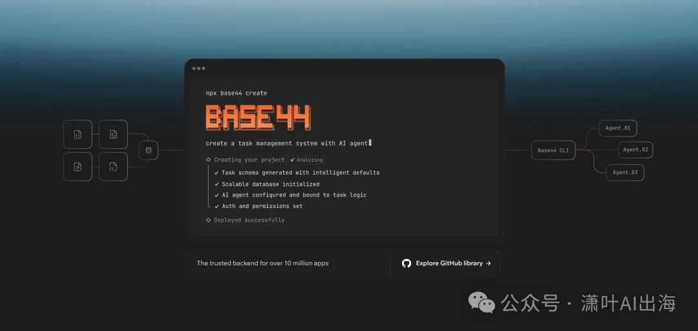
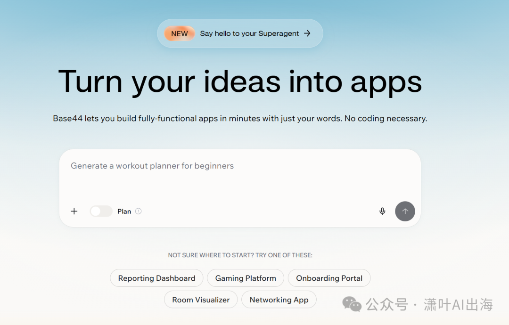

# 1人6个月8000万美元：独立开发者出海的极简打法

原创 潇叶AI出海 潇叶AI出海 *2026年4月20日 09:24*

6个月，1个人起步，0融资。

然后，8000万美元被收购。

这是Base44创始人Shlomo的故事。最初没有团队，没有办公室，没有投资人PPT，只有他一个人和一台电脑。

2025年6月，网站搭建平台Wix以8000万美元（约5.7亿人民币）收购Base44。此时距离Shlomo开始独立开发，刚好半年。

## 01 一个人的"正规军"

Shlomo的模式，和硅谷那套玩法完全相反。

别人融资、招人、烧钱、冲增长。他只做三件事：写代码、发推特、收钱。

Base44是一个网站构建工具，功能和Wix、Squarespace类似。但这个赛道早就红海一片，巨头林立，新人入场无异于找死。

但他用了另一套打法：公开构建（Build in Public）。

从第一天起，Shlomo就在Twitter上公开记录产品构建的全过程：

• 今天写了什么功能
• 遇到了什么技术难题
• 用户反馈了什么bug
• 收入数据是多少
• 营销策略是什么

没有滤镜，没有包装，就是赤裸裸的透明。

3周后，用户破1万。两个月内，开始盈利。六个月后，Wix带着支票找上门。

## 02 "公开构建"为什么管用

这不是运气。Shlomo踩中了一个正在被重新定义的营销逻辑。

**第一，信任前置。**

传统模式是：产品→营销→销售→信任。先做产品，再花钱打广告，用户看到广告后产生兴趣，使用后建立信任。

公开构建把这个顺序倒了过来：信任→产品→销售。

用户从第一天就看着你成长，见证你的迭代，参与你的决策。等产品上线时，他们已经是"精神股东"，付费意愿自然高。

**第二，内容即获客。**

在AI时代，内容生产的门槛被击穿，但内容的信任门槛在升高。用户不再相信精心制作的广告片，他们相信"真实的人说的真实的话"。

Shlomo的每一条推文，都是在为Base44积累信任资产。6个月发了数百条推文，相当于做了数百次零成本的内容营销。

这些内容的ROI远超付费广告——因为它们是真实的、可验证的、可持续的。

**第三，快速验证。**

公开构建最大的好处是：还没等产品完美，就知道市场要不要。

Shlomo在Twitter上分享产品构想时，评论区立刻有用户反馈："这正是我需要的"或"这个功能没用"。他把这些反馈直接写进下一版代码，迭代速度是封闭开发团队的10倍。

## 03 对AI出海创业者的启示

Shlomo的案例不是孤例。

Pieter Levels（Nomad List创始人）、Danny Postma（AI头像生成工具）……越来越多独立开发者用"公开构建"实现年收入百万美元。

**第一，小团队甚至是单兵作战，才是AI时代的优势。**

AI工具让1个人的产出相当于过去10个人的团队。Cursor、Claude、GPT-4这些工具，让一个开发者可以独立完成产品、设计、文案、客服。

不需要融资，不需要分股权，不需要管理成本。赚到的每一分钱都是自己的。

**第二，"公开构建"是最便宜的获客方式。**

Twitter/X是全球独立开发者的主战场。一条爆款推文的触达量，可能比几千美元的广告投放还管用。

关键是持续输出：分享构建过程、技术心得、收入数据、失败教训。真实的内容自带传播力。

**第三，海外市场对"小而美"的接受度远高于国内。**

国内用户习惯大平台、大品牌、大团队背书。海外用户更看重产品本身好不好用，创始人是不是真诚。

Base44被Wix收购，不是因为团队规模，不是因为融资背景，而是因为产品有价值、用户有粘性、增长有数据。

**第四，从第一天就追求盈利，不是增长。**

Shlomo两个月内盈利，说明他从一开始就想清楚了商业模式。不是先做用户再想办法变现，而是每个功能都有对应的付费点。

这种"自力更生（Bootstrapped）"的模式，反而让公司在被收购时更有议价权——因为你有收入、有利润、有选择权。

## 04 具体怎么做：公开构建实操清单

如果你想复制Shlomo的路径，这里是一份实操清单：

**Step 1：选赛道**

• 找你能独立完成的细分市场
• 避开需要重度运营或合规门槛的领域
• 优先选择有明确付费意愿的工具型产品

**Step 2：建立公开身份**

• Twitter/X是主战场，用英文名运营
• 简介写清楚"我正在做什么"
• 置顶推文介绍产品愿景

**Step 3：持续输出内容**

• 每天1-2条推文，记录构建过程
• 分享具体数据：用户数、收入、增长率
• 展示失败和迭代，不要只晒成功
• 回复每一条评论，建立社区感

**Step 4：快速发布，持续迭代**

• MVP（最小可行产品）要在2-4周内上线
• 根据用户反馈每周迭代
• 用AI工具加速开发和设计

**Step 5：从第一天就收费**

• 免费试用+付费订阅是最稳的模式
• 定价要大胆，海外用户愿意为价值付费
• 公开收入数据，增强信任

## 写在最后

Shlomo的故事告诉我们：在AI时代，小就是美，快就是好，真就是强。

不需要VC加持，不需要豪华团队，不需要烧钱换增长。

你只需要：一个真实的产品，一个真实的声音，一群真实的用户。

公开构建的本质，是把"创业"这件事从封闭的密室游戏，变成开放的社区共创。用户不再是冷冰冰的数字，而是和你一起成长的伙伴。

当你在Twitter上分享"今天修复了一个bug"时，可能就有潜在用户在屏幕那头默默关注，等待你的产品成熟到值得付费的那一天。

这就是AI出海的新机会：做一个小而美的产品，公开构建，自力更生，活得比那些烧钱的大公司更久。

───

我是潇叶。

一个在 AI 时代不断进化的 80 后实操者，一个死磕到底的外贸老兵。

在 AI 的时代森林里，我可能跑不赢老虎。

但只要能跑赢旁边的兔子，我就能活下来。

**一个人走得快，一群人走得远。如果你想系统学习AI出海，从0到1跑通闭环，欢迎加入AI破局俱乐部，和我一起在AI时代破局前行。**

👆 扫码领取「AI破局俱乐部」3天免费体验卡

继续滑动看下一个

潇叶AI出海

向上滑动看下一个

潇叶AI出海
