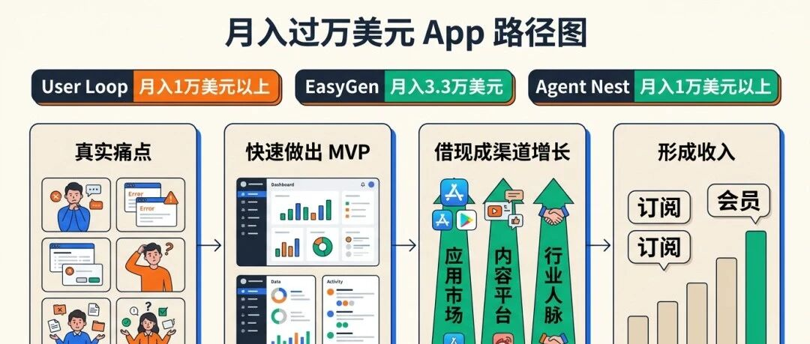
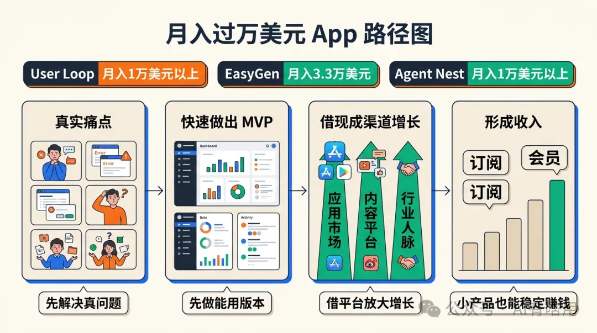
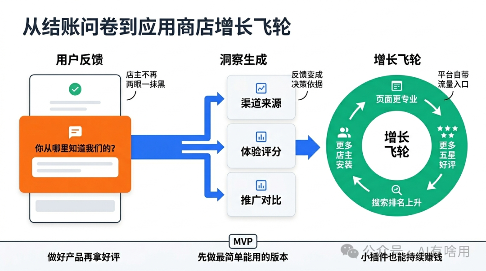
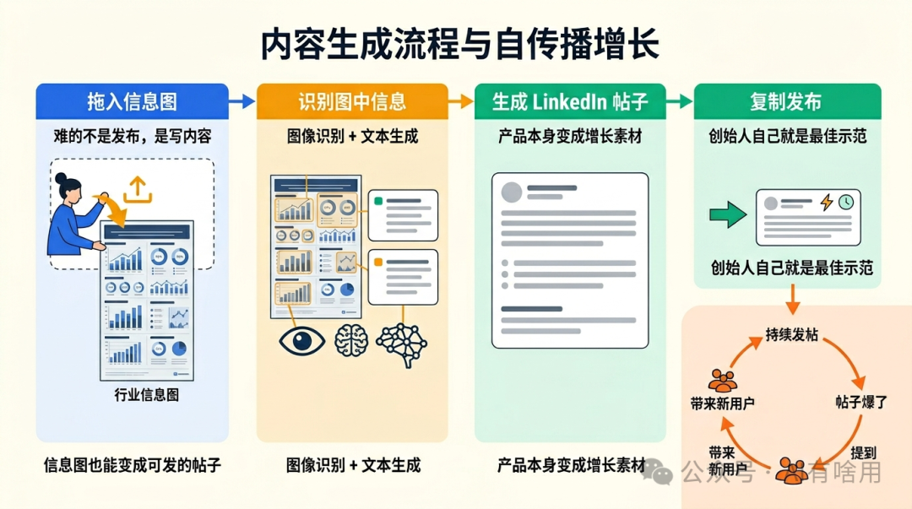
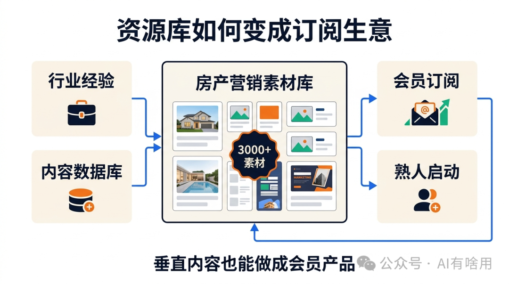
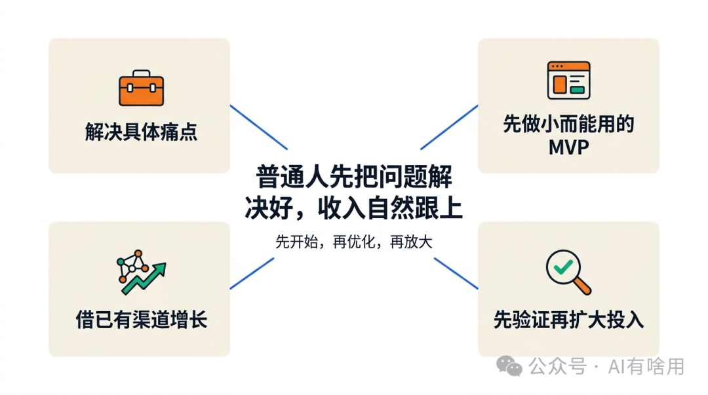

# 不会写代码，这3个普通人的App却月入几万美元，他们是怎么做到的？

原创 AI有啥用 AI有啥用 *2026年4月1日 17:47*

不会写代码的普通人，真的能靠做App赚到钱吗？

我们在 Starter Story 的案例库里做了一番深挖，答案是： **普通人完全可以靠App赚到钱。** 而且这些创意比你想象的更容易上手。下面分享的每一个项目，目前都至少月入1万美元，更重要的是，没有一个需要很深的技术功底。让我们来看看吧。

---

## 创意一：User Loop —— Shopify 反馈插件（月入$10K+）

### 它解决了什么问题？

所有成功的生意都在解决某个真实的痛点。User Loop 瞄准的这个痛点很简单：Shopify 店主对自己的客户两眼一抹黑。这些客户从哪来的？他们购物体验怎么样？User Loop是这么做的，它可以接入 Shopify 的结账流程，在顾客付款后弹出问卷，比如"你是从哪里知道我们的？"——然后把这些原始数据转化成可以直接指导决策的洞察。

举个例子：你开着一家 Shopify 店，发现 80% 的客户都是从 YouTube 来的，那信号就很明确了，多做 YouTube 视频。这就是这个工具能给你带来的东西。

### 为什么我喜欢这个商业模式？

这是一个 Shopify 插件，而我特别喜欢在成熟平台上做插件这条路。Shopify、Slack、Monday.com、Notion。。。这些平台本身就有数百万活跃用户。你不需要提前攒粉丝，不需要烧钱做广告，平台的应用市场本身就是你的自带流量入口。

你只需要做出有用的东西，拿到好评，平台就会把你推给更多用户。

### 怎么做出来的？

这里有个细节特别值得说： **这个产品是用 Bubble搭建的，** Bubble一个无代码平台，不用写代码就能做应用。创始人在假期里花了几天时间就做出了第一版。那个最初的版本极其简单，就是一个发送带 emoji 选项的反馈邮件的小工具，没有任何花哨的功能。后来他在 Bubble 的基础上陆续接入了 HookDeck、OpenAI、MX 这些工具。

结论是：你不需要一上来就做出功能完善的精品产品。先做出一个只解决一个具体痛点的最小可行版本（MVP），验证了再说。

### 怎么增长？

核心增长引擎是 **应用商店优化（ASO）。** 原理跟 SEO 一样，只不过针对的是应用市场。把你的应用页面做得专业、关键词到位，然后死磕五星好评。好评越多，Shopify 就越愿意把你的应用推到搜索结果前面。

我聊过另一个做 Shopify 插件的创始人，一年能做到四五百万美元，他的杀手锏几乎就是 ASO 一件事。做好产品，拿好评，让平台帮你做营销。

---

## 创意二：EasyGen —— LinkedIn 内容生成器（月入$33K）

### 它解决了什么问题？

写 LinkedIn 内容太费时间了，这些时间本来可以用来做正事或者陪家人。EasyGen 是一个 AI 工具，能把你的粗糙想法（甚至一张信息图）变成一篇可以直接发出去的 LinkedIn 帖子。它在 5 个月内月收入做到了 3.3 万美元。

### 这个应用怎么用？

流程非常简单。你去 Pinterest 找一张跟你行业相关的信息图，下载下来，拖进 EasyGen，它就会提取图里的内容，帮你生成一篇 LinkedIn 帖子。它甚至没有"自动发布到 LinkedIn"的功能，你需要自己复制粘贴过去。但难的从来不是发布，而是写内容，发布只要 10 秒钟。

从技术角度来说，这个应用用了两个核心能力：一个是 **图像识别 API** （大概率是 OpenAI 的），用来读取并理解上传的图片；另一个是 **文本生成 API** （类似 GPT-4）来写出实际的帖子内容。模型应该是基于大量高质量 LinkedIn 帖子训练或调优过的。

### 怎么做类似的东西？

这就是个网页应用，技术复杂度不算高。用 **Lovable** 这类专门为网页应用设计的无代码工具就能搭。接上 OpenAI 的图像识别和文本生成 API，做个干净的界面，基本上就可以了。

定价方面，EasyGen 收月费 $60，或年费 $600。听起来不便宜，但想想它的目标用户：LinkedIn 上的职场人、顾问、公司。对他们来说时间就是钱，$60/月比起花好几个小时写东西，根本不算什么。

### 增长策略

创始人 Ruben 主要靠 **LinkedIn 本身** 来推广 EasyGen。他用自己的工具来维护和打造自己的 LinkedIn 个人品牌，持续发帖、不断迭代优化内容。当某篇帖子火了，收到大量评论时，他就在评论区回复说："这篇帖子是用 EasyGen 生成的，那是我做的工具。"

这就是最好的活广告。数百万 LinkedIn 用户看到一篇爆款帖子，同时看到这篇帖子是用这个工具写出来的，那么他们很可能就会从围观者变成付费用户。

更广泛地说，这里的启发不是去复制 EasyGen。想想还有哪些地方，人们在内容创作上浪费大量时间，销售邮件、Reddit 帖子、X 推文、产品描述，都有可能是类似的机会。（国内的公众号、小红书、网文等等，都有类似EasyGen的工具）

---

## 创意三：Agent Nest —— 房产经纪人营销素材库（月入$10K）

### 它解决了什么问题？

房产经纪人擅长卖房子，但往往不擅长营销自己。Agent Nest 的解法是：给经纪人提供一个超过 3000 份可定制数字和印刷营销素材的资源库，用来发社媒帖子、传单等等。

这就是我说的 **资源库策略：** 围绕一个精心策划的垂直领域内容数据库做会员产品，然后收订阅费。

### 为什么我喜欢这个模式？

我自己的产品 Starter Story，本质上走的就是这条路。它的核心是一个创业案例的资源库，一个大而有序的数据库，面向那些想创业的人，而他们愿意为此付费。这个生意已经给我带来了数百万美元的收入。

资源库策略的妙处在于，它靠的是内容，而不是技术。你不需要写复杂的算法，你做的是筛选、整理、呈现，帮你的用户省时间省精力。

### 怎么做类似的东西？

可以看看 **Softr** 这个无代码工具，特别适合搭建数据库驱动的会员网站。你可以做一个模板资源库，设置订阅付费墙，上线速度其实很快。

真正值得问自己的问题是： **我对哪个领域足够了解，可以围绕它做一个资源库？** Agent Nest 的创始人 Molly 深耕房产行业多年，她为自己熟悉的圈子做了这个产品。如果你是销售，也许可以做一个冷邮件模板库；如果你是健身教练，也许是一套训练计划素材库。你已有的行业积累，就是你的护城河。（据我所知，类似的案列在小红书上非常多，也许你也看到过。小红书上发笔记用来吸引用户，小红书店铺用来做转化成交）

### 怎么增长？

Molly 的第一步增长动作简单粗暴，但真的管用： **她给自己在房产行业积累的 1000 个联系人，挨个发了邮件。** 就这样。没有投广告，没有做 SEO，没有找 KOL 合作，就是直接找那些已经认识她、信任她的人。

这也是在自己熟悉的领域里创业的优势，你很可能早就认识了你的第一批用户。这些关系，比任何发布策略都值钱。

---

## 三个案例背后的共同规律

现在，把这三个生意放在一起看，它们有几个明显的共同点：

**都在为特定人群解决具体的、真实的痛点。** 不需要大，也不需要全，只要能解决具体的问题。

**起步都很小。** 先做出一个最小可行版本（MVP），可能用几天就搭出来了，一个能跑起来的简单版本，比完美但迟迟不能上线的产品更重要。

**都借助了已有的渠道来增长。** 应用市场、职场社交平台、行业人脉，没有一个是白手起家积累流量的。

 本公众号会持续更新AI和互联网创业相关的内容，如果你觉得有用，请点赞关注，下期见。

 喜欢作者

继续滑动看下一个

AI有啥用

向上滑动看下一个

AI有啥用
