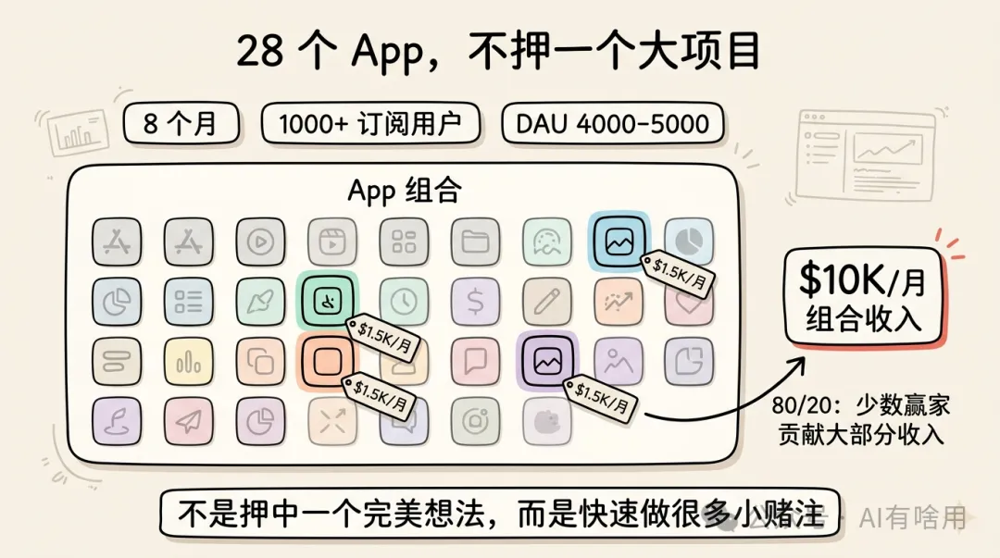
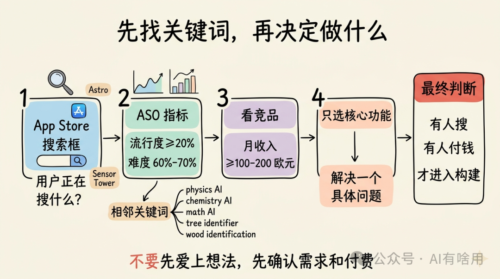
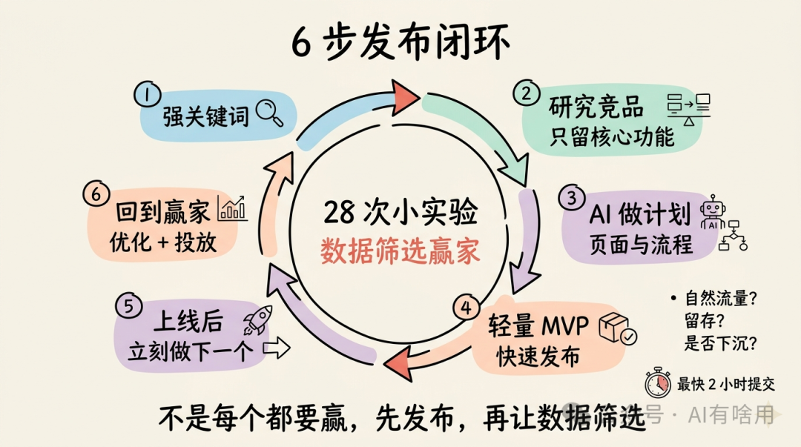
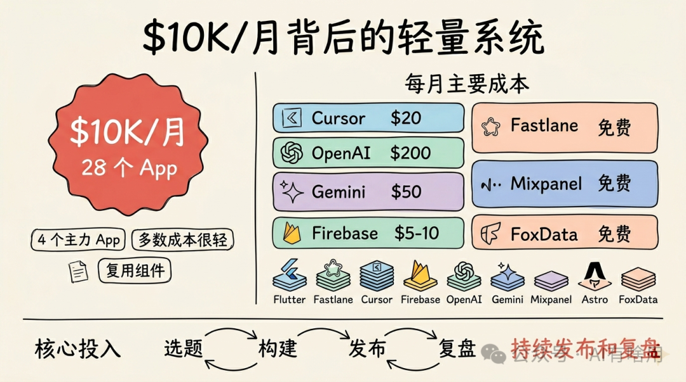

# 我 8 个月做了 28 个 App，月收入做到 1 万美元

原创 AI有啥用 *2026年4月28日 11:36*

## 过去很多年，我都以为做 App 成功需要一个“大项目”。

找到一个想法，投入大量时间，把它打磨得足够好，然后想办法让它增长。

但我试过很久，效果并不好。

我叫 Max，是一名全职 iOS 工程师，也是两个孩子的父亲。过去 8 个月，我在下班后的时间里上线了 28 个简单移动应用。现在这些 App 合起来每个月带来大约 1 万美元收入。

所有 App 加起来有超过 1000 名订阅用户，每天活跃用户大约 4000 到 5000。

其中大部分收入来自 4 个 App，每个 App 每月大约贡献 1500 美元。剩下的 App 收入很小。

这就是很典型的 80/20 法则。

（ **80/20 法则，也叫帕累托法则，意思是很多结果往往来自少数关键因素。这里就是少数几个 App 贡献了大部分收入。** ）

我的经验不是“押中一个完美想法”，而是快速做很多小项目，让数据告诉我哪个值得继续投入。

## 我以前也做过失败的个人项目

我大概 8 年前开始做软件工程，职业方向是 iOS 开发。

和很多开发者一样，我也有过自己的移动端宠物项目。那是一个我很想做起来的 App。我花了很多时间尝试各种增长技巧，但什么都没有明显奏效。

后来，在今年 2 月，我在 YouTube 上看到了 Adam Lyttle 的视频。那条视频改变了我对做 App 的理解。

以前我以为，做 App 就是选一个项目，然后把所有精力、时间和希望都放在它上面。

但 Adam 展示了另一种方式：

做一个简单 App，只保留一个功能，发布它，先放下，然后立刻进入下一个项目。

我以前从没这样想过。

这个方法让我意识到，很多时候不是你必须做出一个完美产品，而是你需要提高试错速度。

## 第一步不是想点子，而是找关键词

我找 App 点子的第一步，是找关键词。

原因很简单：如果用户有一个问题，他会打开 App Store，在搜索框里输入一个搜索词。这个搜索词就是需求的信号。

我的主要工具是 Astro，一个常见的 ASO 工具。

（ **ASO 是 App Store Optimization，应用商店优化。它关注用户在应用商店里搜什么、哪些关键词有流量、竞争难不难、排名机会大不大。** ）

我的流程通常是：

先选一个随机品类，或者选一个我自己想做的方向，然后搜索各种相关关键词。

我也会找相邻关键词。它们面向同一类用户，但解决略有不同的问题。

比如学习类 App，可以围绕 physics AI、chemistry AI、math AI 这些关键词展开。关键词不同，但用户群都是学生。

这样有一个好处：当我做完一个 App，就能很快跳到相关关键词，复用很多思路和组件。

做关键词研究时，我会看两个指标：

关键词流行度至少要有 20%，难度大概在 60% 到 70% 之间。

找到有意思的关键词后，我会检查排名靠前的竞品，并用 Sensor Tower 或类似工具看它们的月收入。

我的最低标准是竞品每月至少赚 100 到 200 欧元。如果竞品收入都很低，就说明这个市场不太愿意付钱，我不会浪费时间进去。

我不是凭感觉做 App。

我先确认有人在搜，再确认有人在付钱。

## 一个树木识别 App 的例子

假设我想研究树木识别这个方向。

我会在 Astro 里创建一个临时 App，然后加入 tree identifier 相关关键词。接着查看相关 App、相邻关键词、关键词流行度和难度。

如果我看到 wood identification 这样的关键词，有一定搜索热度，但竞争难度很低，我就会认真考虑。

下一步，我会打开 App Store，查看相关 App 的收入。如果收入足够好，我就会进入构建阶段。

这个过程看起来很机械，但它帮我避免了一个常见错误：

不要先爱上自己的想法。

先看市场有没有搜索，竞品有没有收入，再决定要不要做。

## 我怎么快速构建一个 App

确定关键词之后，我会先选两三个竞品，仔细研究它们。

我只关注和关键词最相关的核心功能，其他东西先不管。

然后，我会告诉 ChatGPT 或 Gemini：我想围绕某个关键词做一个 App，并提供一些 UI、UX 约束，让它帮我生成详细实现计划。

接下来，我创建项目，开始复用已有组件。

我的很多 App 都有类似结构：设置页、引导页、付费墙、按钮、视图、基础页面。与其每次从零做，我会直接从之前项目里拖拽或复制。

有些 App 甚至可以复制 90% 的代码。

这就是为什么我能这么快。

当 App 做好后，我会打开 Figma，基于已有模板制作截图和图标。最后让 ChatGPT 生成 App 描述，填写元数据，并确保这些内容都和最初选定的关键词相关。

然后提交到 App Store。

具体耗时取决于 App。有些需要一周，因为中间会遇到一些特殊功能。但我最快的一次，从想到点子到提交审核，只用了 2 小时。

## 我的 6 步发布流程

如果今天从零开始，我会按下面这套流程做。

第一步，找强关键词。

关键词要有不错的流行度和难度比例，同时排名靠前的 App 要真的有收入。我不想做一个没人付钱的市场。

第二步，研究竞品，定义核心功能。

查看品类里的头部 App，分析它们，然后只选择一个最核心的功能。这个功能要能更高效地解决用户的主要问题。

第三步，用 AI 快速做计划。

我会用 Cursor 或 Claude，让它们列出所有页面、功能和用户流程。这样我能看到清楚的开发路线，也能判断哪些页面可以从旧项目复制过来。

第四步，轻量构建，快速发布。

只做干净的 MVP（ **最小可行产品** ）。它不需要功能很多，只需要完成一个明确价值。

第五步，上线后进入下一个项目。

App 功能可用、足够干净、已经上线后，我就先放下，继续做下一个。

新 App 上线时，通常会有一段 App Store 应用商店初始曝光加成。之后流量会慢慢下降。

我会观察它是继续下沉，还是稳定住，甚至开始增长。如果一个 App 没有持续下沉，就说明它可能有潜力。

第六步，回到赢家身上，加大投入。

过一段时间，我会回到那些有自然流量或留存的 App 上，继续优化、修 bug、打磨体验，并投放广告，把已经验证的结果放大。

这就是我 28 个 App 背后的核心打法。

不是每个都要赢。

先大量发布，再让数据筛选赢家。

## 我的技术栈和工具

我用的工具并不多。

App 开发框架是 Flutter。

发布流程用 Fastlane，它可以帮我更快完成构建和提交。

AI 编码主要用 Cursor。

后端用 Firebase，包括认证、数据库，甚至网站托管。

AI 功能会用 OpenAI 和 Gemini，比如图像识别和其他 AI 工作。

数据分析用 Mixpanel。

关键词和 ASO 方面，iOS 用 Astro，iOS 和 Android 相关研究也会用 FoxData。

这套工具的重点不是“豪华”，而是能让我快速复制、快速发布、快速观察数据。

## 运营 28 个 App 的成本

虽然现在每月收入超过 1 万美元，但成本并不高。

Cursor 每月大约 20 美元。

Fastlane 是免费工具。

OpenAI 成本高一些，大约每月 200 美元。

Gemini 每月大约 50 美元。

Firebase 虽然承担很多后端工作，但我基本没有超过免费额度，所以每月大概 5 到 10 美元。

Mixpanel 我用免费版。

Astro 每月大约 10 美元。

FoxData 我也用免费版。

整体看，这个 App 组合的成本很轻。

真正的投入不是服务器，而是持续选题、构建、发布和复盘。

## 不要害怕发布

如果只能给一年前的自己一条建议，我会说：

不要害怕发布。

不要把时间浪费在反复打磨上，也不要总想着“再加一个杀手级功能，用户一定会来”。

不要这样做。

把它做到没有明显 bug，只保留一个核心功能，然后发布。

让用户告诉你他们怎么看。

同时，你继续做下一个 App。

这句话听起来简单，但对很多开发者来说很难。

我们太容易陷入完美主义。总觉得还不够好，还不能上线，还需要再优化一点。

可问题是，如果你一直不发布，市场永远不会给你答案。

## 为什么这个方法在今天更重要

软件和 App 的构建方式正在变化。

过去，做一个 App 可能需要很长时间和很多人。现在，AI 编程工具、组件复用、跨平台框架、现成后端服务，让一个人也能非常快地做出可用产品。

当越来越多人都能做 App，速度就变得更重要。

不是盲目求快，而是快速完成一个能验证需求的小产品。

我的 28 个 App 不是 28 个宏大愿景。它们更像 28 次小实验。

每一次实验都问同一个问题：

这个关键词背后有没有用户？用户愿不愿意付费？这个 App 上线后会不会自然下沉，还是能稳定留下来？

如果答案不好，我就不纠缠。

如果答案好，我再回去加码。

这就是组合式小赌注的力量。

## 对普通开发者的启发

如果你也想做类似的事，我觉得最重要的是训练发布肌肉。

不要只训练写代码。

你还要训练找关键词、看竞品、判断收入、复用组件、写元数据、做截图、提交审核、看数据，再决定下一步。

一个会写代码但不发布的人，很难靠 App 赚到钱。

一个能持续发布、持续复盘、持续复用的人，即使每个 App 都很小，也有机会慢慢做出一个有收入的组合。

我的经验不是让你随便做 28 个垃圾应用。

恰恰相反，每个 App 都要围绕一个明确关键词，解决一个具体问题，用最少功能交付价值。

然后发布。

发布之后，不要让情绪决定它的命运，让数据决定。

有些 App 会沉下去，那就让它沉下去。

有些 App 会浮起来，那就回去优化它。

8 个月、28 个 App、每月 1 万美元，这背后的核心不是我找到了一个神奇点子，而是我终于放弃了对“唯一完美项目”的执念。

我开始快速做很多小实验。

在今天这个 AI 和软件工具越来越强的时代，这可能会成为越来越多独立开发者的机会。

---

案例分享来自油管StarterStory。

本公众号会持续更新AI和互联网创业相关的内容，如果你觉得有用，请点赞关注，下期见。

继续滑动看下一个

AI有啥用

向上滑动看下一个
