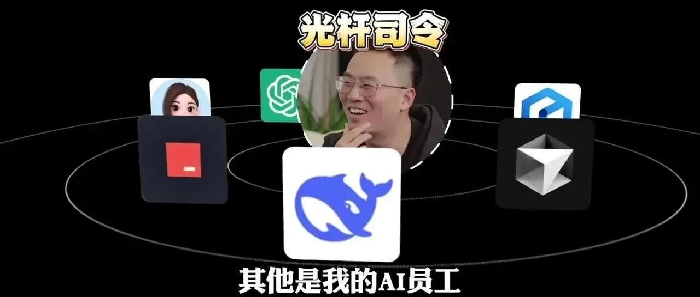
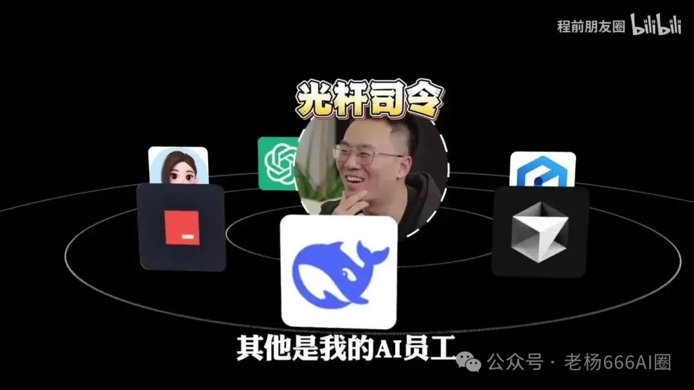
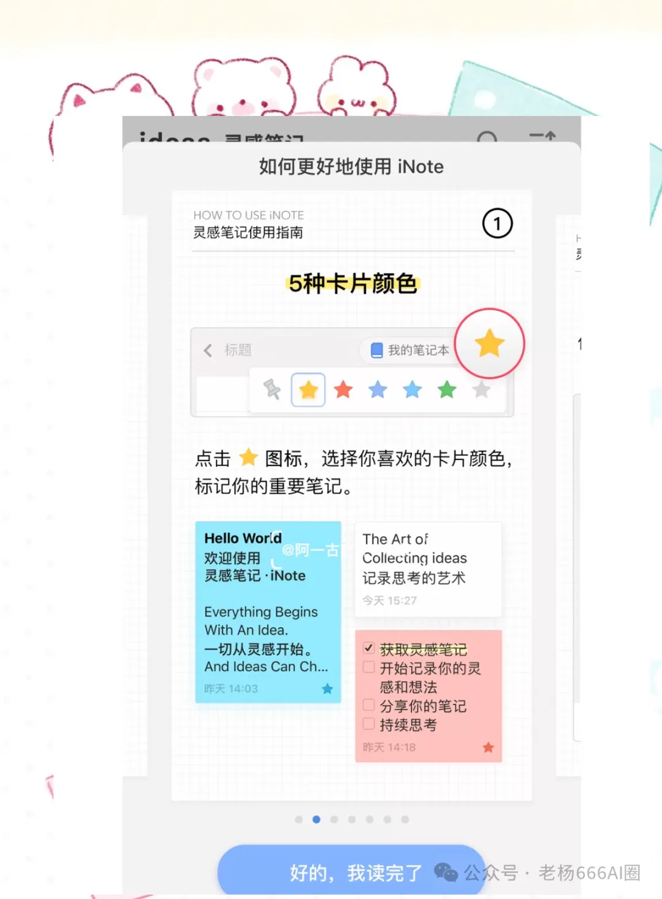
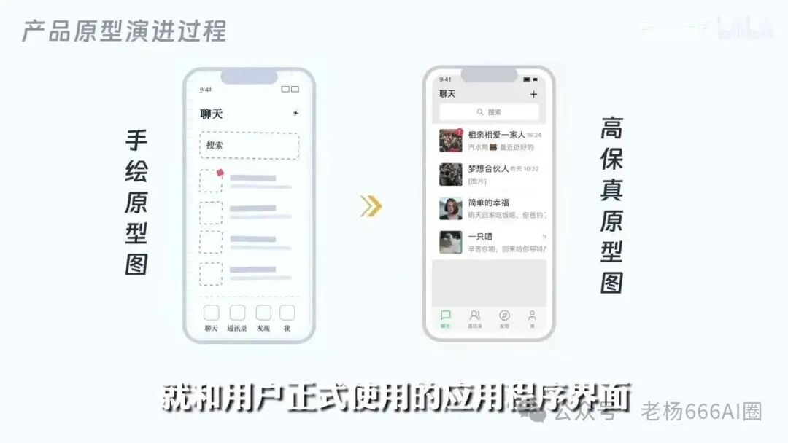
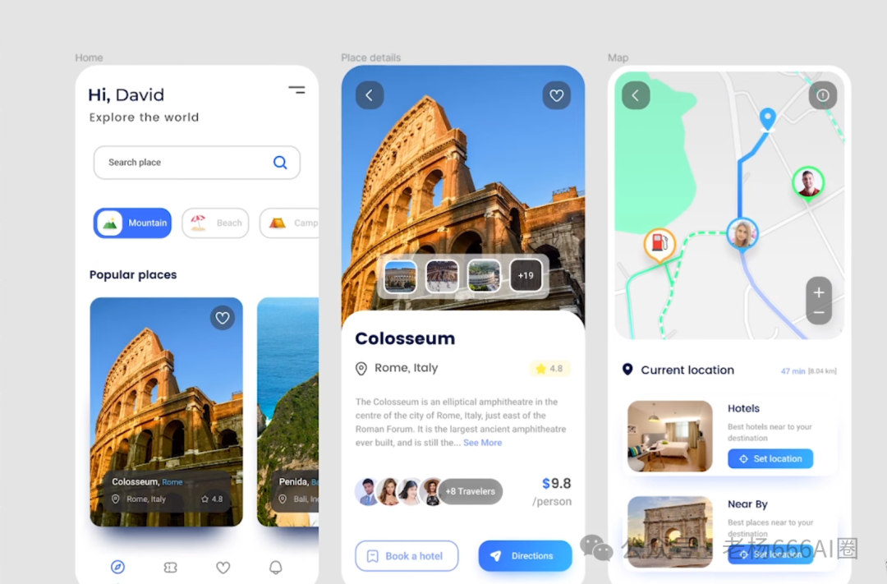
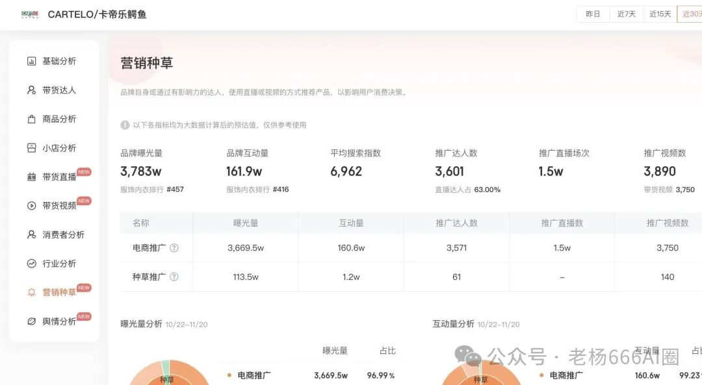
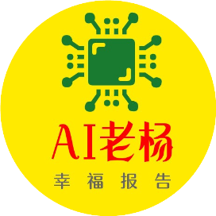

# 一个人年入千万，AI创业的十个步骤

八盏灯AI 老杨666AI圈 *2026年4月4日 21:11*

AI创业别再瞎冲了，一个人想年入千万，真正该走的是这10步

这两年，AI这股风，已经不是新鲜感了，是 **明牌** 。大厂在抢入口，资本在抢叙事，普通人呢，很多还在刷短视频，看着别人晒收入截图，心里痒得不行。说白了，大家都在问一件事，AI创业到底还能不能轮到自己。

咱们先把大背景捋一捋。技术门槛确实被砸低了，以前做软件，前后端、产品、设计、测试，一套人马拉满，没个20万你别开口。现在不一样，Cursor、Copilot、各种大模型一上，很多原来要团队干的活，1个人就能先跑起来。 **但这背后的潜台词非常直白，便宜的不是赚钱，便宜的是试错。** 你以为机会来了，其实淘汰赛也来了。

很多人一上来就想，扫描全网需求，找人开发，上架收费。听着挺美。真干，八成废了。为啥，咱们今天就把这10步扒开说透。

## 第1步，先别急着做产品，先去找那个让人睡不着的痛点

我认识一个朋友，前阵子盯着小红书和抖音扒了半个月，看到一堆人聊「职场焦虑」「简历优化」「副业变现」，激动得不行，觉得全是金矿。结果呢，分析完才发现，热闹不等于能赚钱，搜索多，也可能只是围观的人多。

这事很现实。 **需求不等于生意，热度也不等于付费。** 真正值钱的，是那种用户反复抱怨、现有方案又烂得不行的口子。你让AI去抓平台近30天的高赞内容，找高频吐槽，再让它聚类，筛掉伪需求，这才像样。

## 第2步，别被自嗨骗了，先做市场验证

很多人一有点灵感，马上热血上头。大可不必。你得让AI扮演「产品经理」也好，「行业分析师」也好，把竞争对手、获客成本、用户生命周期价值都过一遍。说白了就是看看，这个赛道是不是已经挤破头了，你进去是不是纯送人头。

这里最容易犯的错，就是觉得自己发现了蓝海。其实大部分所谓蓝海，都是信息差造成的错觉。你一查，10家在做，3家融资了，2家快做死了。就这。

## 第3步，把脑子里的模糊想法，压成一份能执行的PRD

想赚钱的人多，能把需求说清楚的人少。你别小看这一步。很多项目不是死在开发，死在一开始就说不明白，用户是谁，最小功能是什么，什么先做，什么别碰。

这时候AI就很好使。你直接让它根据你筛出来的场景，生成一版PRD，把用户画像、核心流程、MVP功能列清楚。能做成「实时指标」「自动回复」「内容生成」这种单点突破的，先做单点。别贪。贪就乱了。

## 第4步，先出原型，不要一脚踩进开发泥潭

老李去年就吃过这个亏，脑子一热，找外包做系统，功能列了28项，结果3个月过去，钱烧了，东西还像个半成品。你说冤不冤。其实本来完全可以先用AI把高保真原型跑出来，拿去给目标用户看，看看他们到底买不买账。

**先做纸上谈兵，不丢人。上来就砸钱开发，才是真的拎不清。**

## 第5步，MVP只做一刀见血的核心功能

这一步最考验人性。很多创业者老想一步到位，恨不得把企业版、社区版、国际版一起端上来。没必要，真的没必要。MVP的本质，就是验证你最核心的假设。

用AI编程工具把任务拆开，前端、后端、接口，一个个甩出来。比如你做情绪管理工具，那就先把检测、展示、基础反馈做出来，别一上来就整会员体系、社交裂变、积分商城。那些都可以一会说。很多最后也没必要说。

## 第6步，先验证流量，再谈变现

这一步太关键了。很多人产品做完了，开始幻想付费。结果没人看见，连第一波用户都没有。那不是商业模式不行，是压根没进入市场。

你得让AI帮你研究平台分发规则，尤其是短视频平台的冷启动逻辑。前3秒说什么，落地页怎么接，视频怎么引导到小程序，这都是硬功夫。 **没有流量，产品再好也是仓库里的货。**

## 第7步，设计分层收费，不赚钱的热闹没意义

有流量不代表能活。白嫖用户永远最多。你得尽快知道，谁愿意掏钱，愿意为啥掏钱。免费版给一点甜头，Pro版解决效率问题，企业版解决管理问题，这套逻辑基本跑不掉。

如果你测下来付费率只有1%，那就不是再优化页面的事了，多半是定位歪了。别骗自己。该换就换。

## 第8步，上线以后别靠感觉，要靠数据狠狠干迭代

用户不会温柔地告诉你哪里不好，他们只会默默走人。你得盯着最近7天、14天的行为日志看，哪个路径最顺，哪个功能没人用，哪个页面跳出高。AI在这块很顶，能直接帮你分析出低使用率功能和NPS改进方向。

这一步很多人也容易懒。懒了，产品就死。就是这么直白。

## 第9步，产品跑顺了，再考虑全球化和合规

别刚起步就喊出海，容易闹笑话。真到了一定规模，你再去看本地化、数据合规、语言适配这些东西。比如中东市场的右向左布局，欧洲对隐私的要求，都是白纸黑字的刚性约束，不是你想糊弄就能糊弄过去的。

## 第10步，别只做工具，要往平台和生态抬一层

这还不算完。真正能把收入往千万推的，不是你单卖一个小工具，而是从工具变成入口。开放API，让别人接进来，做开发者分成，搞社区内容，让用户替你长内容、长场景、长客户。

到了这一步，钱就不是一份一份挣，是一层一层涌进来。这个比喻不一定准，大概就这意思。

说到底，AI创业最核心的门槛，早就不是会不会写代码了，而是 **你能不能比别人更早看见真实需求，更快完成验证，更狠地做取舍。** 技术只是铲子。流量才是水。需求洞察，那才是金矿本身。

时代已经翻篇了。对有判断力的人，这是黄金窗口。对还沉迷做个产品就能躺赚的人，现实会很冷，冷得很。各位读者朋友，你们感受到这股风向了没。

继续滑动看下一个

老杨666AI圈

向上滑动看下一个

老杨666AI圈
