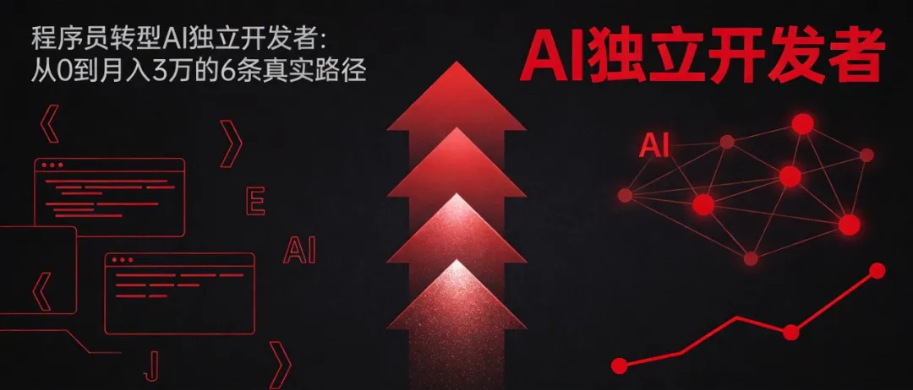

# 干货！程序员转型AI独立开发者：从0到月入3万的6条真实路径

原创 大黄 *2026年4月30日 07:30*

2025年 · 实战方法论 · 真实案例数据

2025年，AI浪潮席卷全球，程序员的职业路径正在被重新定义。

有人在深夜提交完最后一个PR后，看着镜子里疲惫的自己，突然意识到： **尽管年薪已超60万，但每天的生活就是公司-家两点一线，写的代码解决的是"如何让用户多停留3秒"这类问题。**

十年编程经验，熟练掌握各种框架，能写低代码也能手撸架构—— **却从未创造过真正属于自己的产品。**

但也有另一群人，正在用AI杠杆撬动前所未有的可能性：

- **Pieter Levels**
	：一个人维护着12个产品，月收入超过30万美元
- **Marc Lou**
	：每2周发布一个新SaaS产品，其中几个月入$10,000+
- **Danny Postma**
	：全栈独立开发者，单人产品年收入超过$1,000,000
- **国内某前大厂工程师**
	：辞职后用6个月做出AI代码审查工具，月收入突破10万元

**这些案例证明了一个事实：AI抹平了技术门槛，但放大了行动差距。**

本文将分享 **6条程序员转型AI独立开发者的真实路径** ，每条路径都有：核心逻辑、真实案例、工具推荐、收入预估、避坑要点。

**目标很明确：从0开始，6个月内做到月入3万。**

---

## 路径一：AI工具开发（SaaS产品）

### 核心逻辑

用AI解决自己每天都会遇到的真实痛点，做成订阅制SaaS产品。

程序员天然的优势是 **每天都在使用开发工具** ，对痛点的感知比任何人都深。一个需求如果连你自己都觉得"太费事了"，那至少有成千上万的开发者和你有同感。

### 真实案例

案例：前大厂高级工程师的"代码审查自动化"

2024年3月，某大厂高级工程师注意到：每周要花10+小时review同事的代码，重复性工作占比超过70%。

他利用晚上和周末时间，基于开源大模型训练了一个专用代码审查模型。第一个版本只支持Python基础检查（命名规范、复杂度分析、安全漏洞检测）。

在技术社区发了篇帖子，意外收获了300多个star和50多个issue。

2024年9月，他决定all in。辞去大厂工作，拿出30万积蓄，拉上两位前同事开始全职创业。

2024年12月，第一个付费版本上线，定价每月99元/团队。第一个月就收获了28个付费客户。

2025年3月，产品迭代到3.0版本，支持Java、JavaScript、Go等8种主流语言。月收入突破10万元。

### 工具推荐

| 环节 | 推荐工具 | 说明 |
| --- | --- | --- |
| 开发 | Cursor + GitHub Copilot | AI辅助编程，效率提升3-5倍 |
| 后端 | Supabase | PostgreSQL数据库+认证+存储，0成本MVP |
| 部署 | Vercel | 推代码即上线，免费额度充足 |
| 支付 | Stripe | 文档最完善，开发者友好 |
| UI生成 | v0.dev | 输入描述即可生成React组件 |

### 收入预估

- **第1-2个月**
	：验证期，0收入（时间和服务器成本约2000元）
- **第3-4个月**
	：首批付费用户，月收入3000-8000元
- **第5-6个月**
	：产品打磨后规模化，月收入1.5-5万元
- **稳定期**
	：月收入3-10万元

### 避坑要点

1. **不要做"全能型"工具**
	：什么都想做，什么都不精。聚焦一个具体场景，比如"只做Python代码审查"
2. **先验证再辞职**
	：用业余时间做出MVP，拿到10个付费用户后再考虑全职
3. **定价不要太低**
	：定价太低不只是赚不到钱，更重要的是会吸引价格敏感型用户——他们最难伺候、最容易流失

---

## 路径二：AI开源项目变现

### 核心逻辑

开源项目天然是低成本引流工具： **免费代码降低尝试门槛 → 优质项目自发传播 → 用户依赖后为高级服务付费** 。

GitHub Sponsors、数据集销售、商业授权——开源不等于免费，更不等于"用爱发电"。

### 真实案例

案例：独立开发者Marc Lou的"疯狂发布"策略

Marc Lou每2周发布一个新的SaaS产品，其中MakeLanding（AI落地页生成器）月收入达到约6.5万美元（约45万人民币），利润率高达91%。

关键策略：用GitHub开源核心代码 → 吸引开发者关注 → 在ProductHunt发布付费版本 → 通过Twitter建立个人品牌 → 持续推出新产品。

案例：国内开发者"小傅哥"的Java知识体系

开源的Java全栈知识体系项目GitHub star超过10万+，通过知识星球（年费365元）和付费课程，年入超50万。

### 工具推荐

| 场景 | 工具 | 说明 |
| --- | --- | --- |
| 赞助平台 | GitHub Sponsors | 绑定PayPal，全球开发者首选 |
| 国内赞助 | 爱发电 | 适合个人开发者 |
| 知识付费 | 知识星球 | 社区+内容，适合教程类项目 |
| 插件市场 | VS Code Marketplace | 代码插件变现渠道 |

### 收入预估

- **GitHub Sponsors**
	：star 1000+后，月赞助$100-500
- **付费插件**
	：10个插件 × 200用户 × 50元/月 = 1万元/月
- **知识付费**
	：500人 × 365元/年 = 18万元/年（1.5万元/月）
- **综合**
	：月收入5000-5万元

### 避坑要点

1. **核心功能永远免费**
	：赞助权益只能是"附加服务"，而非"基础功能收费"
2. **不要做"玩具级"项目**
	：仅实现基础功能、无实际用户场景的demo很难变现
3. **避免"重复造轮子"**
	：已有成熟替代品的项目，用户没有理由选择你

---

## 路径三：AI外包接单

### 核心逻辑

用AI大幅提升外包效率——以前需要3天完成的项目，现在3小时就能交付核心功能。

2025年的AI外包市场呈现两极分化：

- 低端外包（纯执行）：价格持续走低
- **高端外包（AI+经验+解决方案）**
	：需求暴增，溢价空间巨大

### 真实案例

案例：独立开发者Andy Walters的10个月奇迹

Andy Walters在Reddit发了一篇帖子，意外获得第一个客户——为Local Falcon（本地SEO平台）设计AI排名优化建议系统。

第一笔订单：低六位数（几十万美元），分成多个阶段按小时计费。

他发现这个模式可复制，于是：

- **冷邮件策略**
	："您喜欢威士忌吗？"主题邮件，打开率37%，转化率8%，单月带来$8万收入
- **定价策略**
	：$200/小时（"硅谷AI工程师要三四百美元，我们不在硅谷，能帮您省钱"）
- **客户类型**
	：种子轮创业公司 + 200-5000人的传统企业

结果：10个月内，从独自一人发展到9人团队，月收入13万美元。

案例：Fiverr上的AI辅助写作服务

自由职业者利用AI辅助写作，在Fiverr/Upwork提供AI写作服务：

- 单篇$30-200，月收入$5000-8000美元（约3.5-5.6万人民币）
- 关键：AI提效 + 人工精修 + 客户维护

### 工具推荐

| 场景 | 工具 | 说明 |
| --- | --- | --- |
| 获客 | Upwork、Fiverr | 国际外包平台 |
| 客户管理 | Notion | 项目管理和客户沟通 |
| AI写作 | Claude + ChatGPT | 文案、内容生成 |
| 合同管理 | Stripe Atlas | 公司注册+收款 |

### 收入预估

- **入门阶段**
	（1-3个月）：$50-100/小时，月收入8000-15000元
- **成长阶段**
	（3-6个月）：$100-200/小时，月收入2-5万元
- **稳定阶段**
	：$200-350/小时，月收入3-10万元
- **带团队后**
	：项目制，月收入10-50万元

### 避坑要点

1. **不要只做"执行层"外包**
	：纯执行的价格只会越来越低，要做"AI+经验+解决方案"
2. **先收钱再干活**
	：预付款是生死线，小项目预付50%，大项目按阶段付款
3. **控制范围**
	：AI让交付变快，但客户需求也会膨胀，用合同明确边界

---

## 路径四：AI内容创作（知识付费）

### 核心逻辑

程序员最值钱的是 **经验** ，而不是代码。把踩过的坑、总结的方法论、积累的案例变成知识产品——课程、专栏、电子书、一对一咨询。

内容创作的杠杆效应极强： **一次录制，长期销售** 。一份299元的课程，卖100份就是29900元。

### 真实案例

案例："独立开发者IP"的打造路径

Twitter博主Alex Finn分享了他的案例：

- **Twitter策略**
	：每天发5分钟的思考，3个月积累3000粉丝
- **信任资产**
	：爆款算法解读帖，5%转化率
- **变现路径**
	：粉丝 → 1v1访谈150人 → 推出产品
- **最终结果**
	：ProductHunt日榜第2，月ARR达到10万美金

案例：AI游戏开发课程

独立开发者李明：

- 用Midjourney画图 + ChatGPT写剧情 + Suno生成BGM
- 放置类手游3个月上线，月流水30万+
- 后续开设"AI游戏开发"课程，定价999元，首批学员500人 = 50万收入

### 工具推荐

| 场景 | 工具 | 说明 |
| --- | --- | --- |
| 内容发布 | 公众号、知乎、掘金 | 文字内容平台 |
| 视频课程 | 知识星球、小报童 | 付费内容平台 |
| 社群运营 | 微信群、Discord | 私域流量 |
| AI辅助 | Midjourney、剪映 | 视频内容创作 |

### 收入预估

- **初期积累**
	（1-3个月）：免费内容+低价课，月收入0-3000元
- **私域转化**
	（3-6个月）：高价课+1v1咨询，月收入1-5万元
- **稳定期**
	：年营收30-100万元
- **爆款内容**
	：单篇文章/视频带来10万+曝光，转化1000+付费用户

### 避坑要点

1. **先免费再付费**
	：用免费内容建立信任，再推付费产品
2. **不要做"什么都教"**
	：聚焦一个垂直领域，比如"AI辅助编程"或"独立开发变现"
3. **内容要真实**
	：虚假夸大只会透支信任，真实案例+数据最有说服力

---

## 路径五：AI Agent产品

### 核心逻辑

AI Agent（AI智能体）是2025年最大的风口。用户只需描述目标，AI自动规划路径、调用工具、执行任务。

相比传统SaaS工具，Agent的价值在于 **替代用户完成工作** ，而不只是提高效率。

### 真实案例

案例：AI Dungeon的奇迹

独立开发者Nick Walton用GPT做成互动文字冒险游戏：

- 月收入高达$500,000+
- 核心价值：用户输入"我想去冒险"，AI自动生成剧情、分支选项、NPC对话

案例：Cursor/Windsurf的"AI代码助手"

这类工具不只是补全代码，而是理解整个项目上下文、自动重构、自动调试。

- Cursor：估值 500亿美元，年化收入突破20亿美元，SpaceX以600亿美元收购期权锁定
- 关键洞察：用户需要的不是"更好的代码补全"，而是"帮我搞定这个需求"

### 工具推荐

| 环节 | 工具 | 说明 |
| --- | --- | --- |
| Agent框架 | LangChain、LlamaIndex | 构建Agent的基础 |
| 模型调用 | Claude API、GPT-4 API | 核心智能能力 |
| 工具集成 | Zapier、Make | 连接外部服务 |
| 部署 | Railway、Render | 容器化部署 |

### 收入预估

- **MVP验证**
	（1-2个月）：免费试用 → 付费转化
- **早期产品**
	：月收入5000-2万元（100-500付费用户 × $5-20/月）
- **增长期**
	：月收入5-20万元
- **爆款产品**
	：月收入20-100万元

### 避坑要点

1. **Agent≠Chatbot**
	：不要只是套壳ChatGPT，要真正解决"用户不想自己动手"的问题
2. **控制成本**
	：AI调用的Token成本是主要开销，需要精细化运营
3. **明确使用场景**
	：Agent最好的落地场景是"重复性、有明确目标、流程标准化"的任务

---

## 路径六：AI垂直行业解决方案

### 核心逻辑

不做通用工具，做 **特定行业的AI解决方案** 。比如：法律、医疗、教育、电商、金融……

垂直方案的溢价空间远高于通用工具，因为：

- 解决的是"生死问题"（不是效率问题）
- 需要深厚的行业know-how
- 竞争对手少

### 真实案例

案例：医疗AI SaaS

某医疗信息化背景的开发者：

- 产品：诊所AI诊断辅助系统
- 定价：年费2-10万元
- 客户：300家中小诊所
- 年营收：600万-3000万元

案例：法律AI工具

专注于"合同审查"的AI工具：

- 定价：199元/月（个人版）→ 1999元/月（团队版）
- 痛点：法务人员每周审查50份合同，AI可以缩短70%时间
- 月收入：50万元+

### 工具推荐

| 场景 | 工具 | 说明 |
| --- | --- | --- |
| 行业数据 | 公开数据集+自建 | 训练垂直模型 |
| 部署方式 | 私有化部署 | 满足数据安全要求 |
| 获客 | 行业展会+垂直社区 | 精准触达 |
| CRM | HubSpot | 客户管理 |

### 收入预估

- **小客户**
	（小诊所、小律所）：年费1-3万元
- **中客户**
	（中型企业）：年费5-20万元
- **大客户**
	（集团企业）：项目制，30-100万元/个
- **综合**
	：月收入3-30万元（稳定期）

### 避坑要点

1. **选对行业**
	：不是所有行业都适合AI化，要选"数据积累多、重复性工作多、付费能力强"的行业
2. **合规优先**
	：医疗、法律、金融等领域有严格的监管要求
3. **行业壁垒是关键**
	：纯技术背景难以竞争，需要找懂行业的合伙人

---

## 总结：6条路径对比

| 路径 | 启动成本 | 技术门槛 | 收入天花板 | 适合人群 |
| --- | --- | --- | --- | --- |
| AI工具开发 | ★★☆ | ★★★ | ★★★★★ | 有产品思维的开发者 |
| AI开源变现 | ★ | ★★★ | ★★★ | 开源社区活跃者 |
| AI外包接单 | ★ | ★★☆ | ★★★★ | 执行力强、时间充裕 |
| AI内容创作 | ★ | ★★☆ | ★★★★ | 有表达欲、爱分享 |
| AI Agent产品 | ★★☆ | ★★★★ | ★★★★★ | 技术前沿追逐者 |
| AI垂直方案 | ★★★ | ★★★★ | ★★★★★ | 行业背景深厚者 |

---

## 行动清单

### 第一周：定位

①

列出过去5年做过的所有项目，标注你做得最好的那个场景

②

找到交集：哪个场景你既有技术深度，又有业务理解？

### 第二周：验证

①

不要先写代码，先找3个潜在用户聊

②

问他们："如果我能帮你解决XX问题，你愿意付多少钱？"

③

如果3个人都愿意付费，这个方向就有戏

### 第三周：MVP

①

用你最熟悉的工具栈，做一个"能跑通核心流程"的Demo

②

目标不是完美，是让用户看到可能性

### 第一个月：上线

①

在ProductHunt或相似平台发布

②

收集前100个用户反馈

③

找到你的前10个付费用户

### 第三个月：优化

①

根据数据优化产品

②

建立定价体系

③

开始思考规模化

### 第六个月：规模化

①

推出企业版/高级版

②

建立内容营销体系

③

考虑融资或合伙人

---

## 结语

"代码可以外包，注意力必须自有。"

**AI抹平了技术门槛，但放大了行动差距。**

从"为老板赚钱"到"为自己创造价值"，这条路并不容易，但绝对值得。

**你，准备好把今晚的灵光一闪变成明天的现金流了吗？**

**最好的时机是十年前，其次是现在。但比时机更重要的，是方向。**

如果你觉得这篇文章有帮助，欢迎转发给需要的朋友。

关注公众号，回复"AI独立开发"，送你一份《独立开发者工具清单》

继续滑动看下一个

AI大黄与我

向上滑动看下一个
