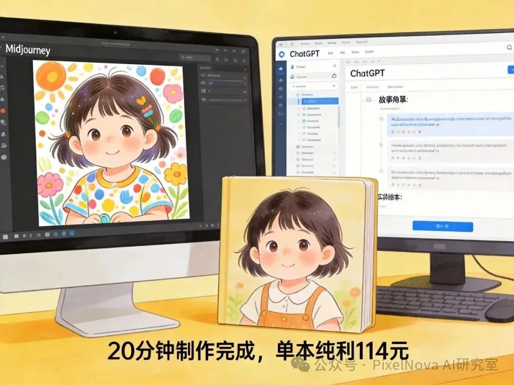

# 3个真实AI一人公司案例：单月最高赚20万，没团队没融资

原创 PixelNova PixelNova AI研究室 *2026年3月13日 20:29*

### 一、AI一人公司正在颠覆传统创业逻辑：成本砍90%，效率翻10倍

过去开公司，你得租办公室、招行政、雇销售、找技术，启动资金没个几十万根本打不住，一旦三个月没盈利就可能资金链断裂。但现在AI工具的普及，直接把创业门槛打了下来：一个人就是一家公司，设计、文案、客服、销售全靠AI搞定， **启动成本最低只要几百块，单人年赚百万的案例正在批量出现** 。

美国创投机构A16Z2024年发布的报告显示，全球年收入超100万美元的一人公司已经超过1000家，其中37%的创始人完全没有技术背景，核心就是靠AI工具替代了传统团队的工作。国内的情况更夸张，某电商平台2024年上半年AI相关服务订单量同比增长320%，其中60%的卖家都是单人运营，不需要任何实体产品，靠AI输出的虚拟服务就能盈利。

你可能会觉得“AI创业是程序员的事”，但接下来要讲的三个案例全是普通人：有全职妈妈、有刚毕业的大学生、还有从互联网大厂裸辞的运营，他们不会写代码，甚至对AI的了解一开始也只停留在ChatGPT聊天，但就是靠找准细分赛道，把AI工具组合起来用， **最高单月纯利超过20万，比过去打工十年赚的都多** 。更重要的是，他们的模式没有任何壁垒，你只要愿意花一周时间熟悉工具，完全可以直接照搬。

### 二、案例1：95后女生做AI儿童绘本定制，单月纯利8万

95年的陈悦之前是幼儿园老师，2023年生完孩子之后想做副业，偶然发现很多家长想给孩子做专属绘本，但市面上的定制绘本要么价格贵（一本要200多），要么制作周期长（要等半个月）。她花了一周时间研究AI工具，找到了一套完全不用自己画画的解决方案： **用Midjourney生成插画，用ChatGPT写故事，用Canva自动排版** ，原来需要专业插画师3天才能做完的一本绘本，现在她一个人2小时就能搞定。

她的客单价定在99元一本，成本几乎为零，只需要让家长提供孩子的照片、名字、喜欢的卡通形象，就能生成完全定制的故事：比如孩子喜欢恐龙，就做一本《小明的恐龙王国冒险记》，每一页的主角都是孩子的脸，故事里还会融入过马路要走斑马线、自己吃饭等教育内容。一开始她只在宝妈群里推广，第一个月就卖了300多本，去掉平台手续费纯赚2万多。

后来她又优化了流程：把常见的故事模板做成了固定的ChatGPT提示词，Midjourney的画风也统一调成了小朋友喜欢的水彩风， **制作效率从2小时一本压缩到20分钟一本** ，同时对接了线下印刷厂，印刷+包邮的成本控制在15元以内，客单价提到129元，利润反而更高。现在她每个月稳定接600-800本订单，加上给其他想做同款业务的人收1999元的培训费， **单月纯利稳定在8万左右** ，比过去当老师一年的工资还高。

这个案例最值得借鉴的地方是：完全不用从零创造需求，定制绘本本身就是已经被验证的刚需市场，AI只是把原来的高成本供给打了下来。你不需要会画画，不需要懂出版，只要把AI工具串起来解决一个细分人群的具体痛点，就能快速赚到第一桶金。

' fill='%23FFFFFF'%3E%3Crect x='249' y='126' width='1' height='1'%3E%3C/rect%3E%3C/g%3E%3C/g%3E%3C/svg%3E>)

### 三、案例2：大厂裸辞运营做AI企业短视频代运营，单月赚20万

李浩之前是某互联网公司的运营主管，2023年公司裁员之后他没找工作，打算做短视频代运营，但传统代运营需要拍剪团队，一个月至少要十几万成本，根本扛不住。他发现很多本地中小企业想做抖音，但又请不起专业团队：一方面是拍一条视频要500块，一个月20条就是1万，很多小商家掏不起；另一方面是大部分商家的产品非常垂直，传统拍剪团队不懂行业，做出来的内容根本没流量。

他摸索出了一套AI代运营的模式： **用GPT写脚本，用数字人工具拍口播，用剪映AI自动加字幕、配背景、做剪辑** ，原来3个人的团队一天最多做5条视频，现在他一个人一天就能做30条，成本直接砍到原来的十分之一。他找的第一个客户是本地的一家工程机械租赁公司，之前老板自己拍了半年抖音，一共才2000粉丝，李浩接手之后，先让老板把过去3年客户常问的200个问题列出来，比如“挖掘机租赁一天多少钱”“高空作业车怎么选”，然后把这些问题喂给GPT生成口播脚本，再用老板的照片训练了一个数字人，直接让数字人念脚本生成视频。

第一个月就给这家公司做了60条视频，涨了1.2万粉丝，接了17个咨询单，成了3个大单，赚了12万。老板直接和他签了年框，一年服务费18万。后来他用同样的模式复制，专门接本地垂直类商家的代运营：比如装修公司、财税公司、五金批发， **每个客户每月收8000元服务费，现在手里已经有26个稳定客户** ，他一个人根本忙不过来，就花3000块钱招了个应届生帮忙传视频，剩下的活全靠AI搞定， **单月纯利稳定在20万以上** 。

很多人觉得AI会抢工作，但这个案例恰恰说明：AI是给普通人放大能力的杠杆。过去你做代运营要和几十家团队竞争，现在靠AI把成本降下来、效率提上去，你一个人就能打一个团队，在小赛道里几乎没有对手。

' fill='%23FFFFFF'%3E%3Crect x='249' y='126' width='1' height='1'%3E%3C/rect%3E%3C/g%3E%3C/g%3E%3C/svg%3E>)

### 四、案例3：全职妈妈做AI简历优化，半年赚了30万

张雯之前是互联网公司的HR，辞职在家带娃3年，2024年想重返职场的时候发现自己已经和社会脱节了，找了两个月工作都没合适的，干脆在家做副业。她发现每年金三银四、秋招季都有大量人需要简历优化，但市面上的简历服务要么是模板化修改（改完和没改一样），要么是资深HR收费贵（一次要300多），很多应届生和想转行的人根本掏不起。

她的模式很简单： **用自己的HR经验做了一套简历优化提示词，把用户的原始简历喂给GPT，先让AI做第一轮优化，调整专业术语、补充量化成果，然后自己再花15分钟做人工调整，匹配目标岗位的招聘需求** 。原来资深HR改一份简历要1小时，她现在20分钟就能改完，效率提升了3倍，客单价定在99元一份，比同行便宜三分之二，竞争力非常强。

一开始她只在小红书发帖，分享“简历怎么写能通过HR筛选”“面试常见的10个问题怎么回答”，每天能引流20多个意向客户，第一个月就改了180份简历，赚了17000多。后来她又拓展了业务：199元做面试辅导（用AI生成目标岗位的常见面试题和参考答案），399元做职业规划（用AI分析用户的过往经历和行业招聘需求，给出转行建议），客户复购率超过30%。

现在她的小红书已经有12万粉丝，每天稳定有50多个咨询，她一个人忙不过来就招了两个兼职HR，每个人改一份简历给30块钱提成，她只需要做最终审核， **2024年上半年纯利已经超过30万** 。更重要的是，她的工作时间非常自由，每天只需要工作4小时，剩下的时间都可以陪孩子，真正做到了工作生活平衡。

这个案例最适合普通人参考：你不需要找什么高大上的赛道，只要把自己过去的工作经验和AI结合，就能创造出远超打工的收入。HR可以做AI简历优化，老师可以做AI辅导资料，设计师可以做AI设计模板， **你的经验就是最好的创业资本，AI只是帮你把经验批量变现的工具** 。

' fill='%23FFFFFF'%3E%3Crect x='249' y='126' width='1' height='1'%3E%3C/rect%3E%3C/g%3E%3C/g%3E%3C/svg%3E>)

### 五、普通人做AI一人公司的3个核心避坑指南

看了上面三个案例，你可能已经跃跃欲试，但我要先给你泼冷水：不是所有人都能靠AI一人公司赚到钱，很多人踩了坑，不仅没赚到钱，还浪费了几个月时间。结合这三个案例的经验，我总结了3个必须避开的坑，只要你能做到，成功概率至少能提升80%。

第一个坑：沉迷学AI技术，不找具体需求。很多人一开始就陷进去了：今天学Midjourney提示词，明天学GPT插件，后天学AI视频生成，学了三个月工具，还是不知道自己能做什么。记住： **AI只是工具，你要先找需求，再学对应的工具，而不是反过来** 。比如你想做绘本定制，只要学会Midjourney生成人物插画、ChatGPT写儿童故事就行，其他的AI工具根本不用碰，需求永远排在技术前面。三个案例的创始人，每个人会用的AI工具都不超过3个，够用就行，不用追求样样精通。

第二个坑：一上来就想做平台，做通用赛道。很多人一想到AI创业，就想做个AI聊天网站、AI画画平台，这种模式需要服务器成本、技术开发成本，还要和大厂竞争，普通人根本做不起来。 **AI一人公司的核心是“小而美”，找一个足够细分的赛道，在这个赛道里做到第一就行** 。比如陈悦做儿童绘本定制，李浩做本地垂直商家短视频代运营，张雯做简历优化，都是非常小的赛道，大公司看不上，同行没意识到用AI降本，你进去就能吃到红利。不要怕赛道小，中国有14亿人，再小的赛道都有几百万潜在客户，足够你年赚百万了。

第三个坑：不敢收费，总想着等“完美”了再变现。很多人刚开始做，觉得自己的AI服务还不够好，不敢定高价，甚至免费给别人做。记住： **用户要的是解决问题，不是完美的产品** 。陈悦最开始做的绘本，AI生成的插画还有点违和，但家长只要看到主角是自己的孩子就愿意掏钱；李浩最开始做的数字人视频，口型还有点对不上，但只要能给商家带来咨询，商家就愿意付钱。你先跑通最小闭环，收第一笔钱，再慢慢优化产品，比你在家憋三个月做出来的“完美产品”有用得多。三个案例的创始人都是从第一个月就开始收费，边做边调整，越做越顺。

### 六、2025年AI一人公司的3个必赚方向

很多人问我，现在入场AI一人公司晚不晚？我可以明确告诉你：一点都不晚，现在AI工具的成熟度刚好，大部分人还没反应过来，正是红利最大的时候。结合2024年的行业数据，我给你推荐3个普通人完全可以做的必赚方向，不用技术，只要花一周时间熟悉工具就能上手。

第一个方向：AI细分内容生产。现在所有平台都缺垂直内容，你可以专门做某个细分领域的内容：比如给汽车博主写文案、给美食博主生成食谱、给职场博主做PPT。 **用AI生成初稿，你只需要做简单的人工调整，一份内容可以卖给多个同领域的博主，单月赚个两三万非常轻松** 。比如现在很多健身博主需要的训练计划、饮食方案，你用AI就能生成，一套卖99元，一个月卖100套就是1万块，成本几乎为零。

第二个方向：AI线下商家服务。大部分线下商家根本不会用AI，你可以给他们提供AI解决方案：比如给餐饮店做AI电子菜单（用户扫码就能看到菜品的AI生成视频、营养成分、搭配建议），给服装店做AI试衣（用户上传照片就能试穿店里的所有衣服），给美甲店做AI美甲设计（用户上传手的照片就能生成适合的美甲款式）。这些服务商家的付费意愿非常强， **一单收几千块，一个月接10单就是几万块，竞争非常小** 。

第三个方向：AI个人技能放大。把你自己的技能和AI结合，做高附加值的服务：比如你是设计师，可以用AI给客户做品牌设计，原来要一周做完的logo，现在两天就能做完，价格比同行便宜一半，订单接到手软；你是翻译，可以用AI做初稿翻译，自己做校对，效率提升3倍，接更多订单；你是心理咨询师，可以用AI做初步的情绪疏导，自己只做深度咨询，服务人数翻5倍。 **这个方向完全没有竞争，因为你的经验是独一无二的，AI只是帮你放大能力的杠杆** 。

最后我想说：AI不是来抢普通人的饭碗的，恰恰相反，AI是普通人这辈子遇到的最好的创业杠杆。过去你要和别人拼资金、拼团队、拼资源，现在你只要拼谁先学会用AI，谁先找到细分需求，一个人就能赚到过去一个团队才能赚到的钱。不用等什么都准备好，现在就开始找一个你感兴趣的小赛道，花一周时间试试，说不定你就是下一个年赚百万的AI一人公司创始人。

 喜欢作者

继续滑动看下一个

PixelNova AI研究室

向上滑动看下一个

PixelNova AI研究室
