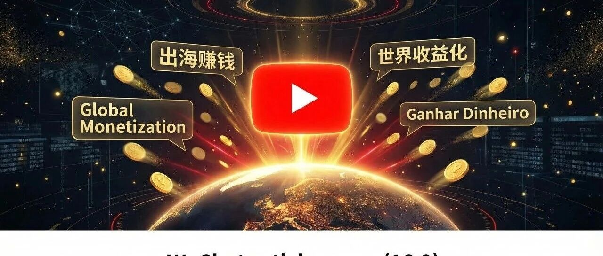
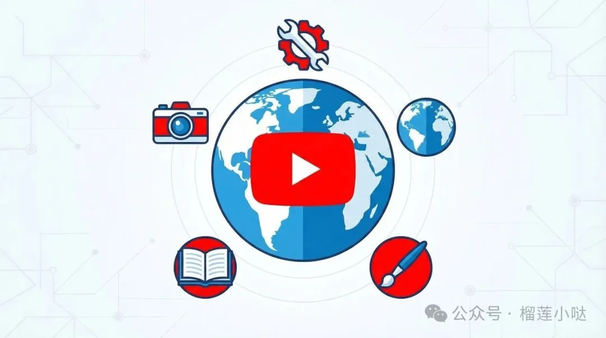
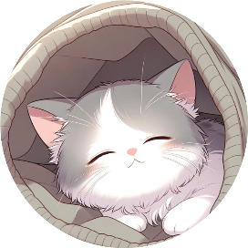

# YouTube出海正当时：2026年中文创作者的5个闷声赚钱频道类型

点击关注👉 榴莲小哒 *2026年3月23日 18:38*

很多人知道YouTube能赚钱，但一想到"我要做英文频道"就劝退了。其实2026年的YouTube生态，中文创作者的机会比想象中多得多。

不一定非要做全英文内容。以下是5个已经验证可行、适合中文创作者的频道类型。

YouTube出海

## 一、无脸频道（Faceless Channel）：不露脸也能月入千元

无脸频道是出海门槛最低的形态。核心逻辑：AI生成脚本+AI配音+素材混剪=视频。

**热门赛道：**

- • 冥想/白噪音：配合放松画面，制作难度极低，但竞争也大。
- • 历史故事/冷知识：用AI写脚本+AI配音+公开素材，订阅增长快。
- • 排行榜/Top 10：选题容易，制作标准化程度高。
- • 财经知识：中文财经内容在YouTube有大量未满足需求。

**关键：** 不要做英文无脸频道（竞争太激烈），做中文无脸频道反而蓝海更大。中文YouTube用户规模在持续增长，但优质内容供给不足。

## 二、工具教程频道：刚需流量，广告单价高

AI工具教程是当前YouTube增长最快的品类之一。每周都有新工具发布，教程需求源源不断。

**实操建议：**

- • 锁定1-2个工具做深度内容（ChatGPT、Notion AI、Canva等）。
- • 标题格式用"How to"+"具体结果"，例如"How to用ChatGPT 10分钟写一篇公众号文章"。
- • 中英双语字幕覆盖两个受众群。

工具教程频道的CPM（千次播放收入）通常在$5-15，远高于娱乐频道的$1-3。

## 三、Vlog+中英双语：文化差异就是流量密码

如果你愿意露脸，做"在中国"或"海外华人"视角的Vlog，天然自带话题性。

**成功案例的共同特征：**

- • 标题突出文化冲突或反差："老外第一次在中国用外卖App"。
- • 内容真实、不过度包装，观众对"真实"的偏好越来越强。
- • 固定更新频率，YouTube算法偏好稳定更新的频道。

## 四、AI绘画/设计展示频道：视觉冲击力拉满

用Midjourney、Stable Diffusion生成高质量图片，做成"过程展示"或"作品集"视频。

**变现路径：**

- • YouTube广告收入
- • 付费教程（教别人怎么生成）
- • 接商单（AI工具品牌推广）
- • 卖预设/模型参数

这类频道的完播率通常很高，因为观众会看完整个生成过程。

5种频道类型

## 五、知识付费导流频道：YouTube是最大的免费广告牌

不靠广告收入赚钱，而是把YouTube当成漏斗顶端：

1. 1\. 发布免费的干货视频（职场技能、理财知识、副业方法）。
2. 2\. 在简介和视频中引导观众加微信/进群/报名课程。
3. 3\. 后端变现：社群、课程、1对1咨询。

这个模式的天花板比纯广告收入高得多。一个10万订阅的知识频道，年变现能力在几十万到百万级别。

## 启动建议

新手最容易犯的错：追求完美，做不出第一条视频。

正确的做法是：今天注册频道，本周发3条视频，用数据决定下一个方向。YouTube的算法会给新视频一定的测试曝光，0-1000订阅的阶段反而是试错成本最低的时候。

别等准备好了再开始，在YouTube上，开始本身就是最大的准备。

继续滑动看下一个

榴莲小哒

向上滑动看下一个

榴莲小哒
