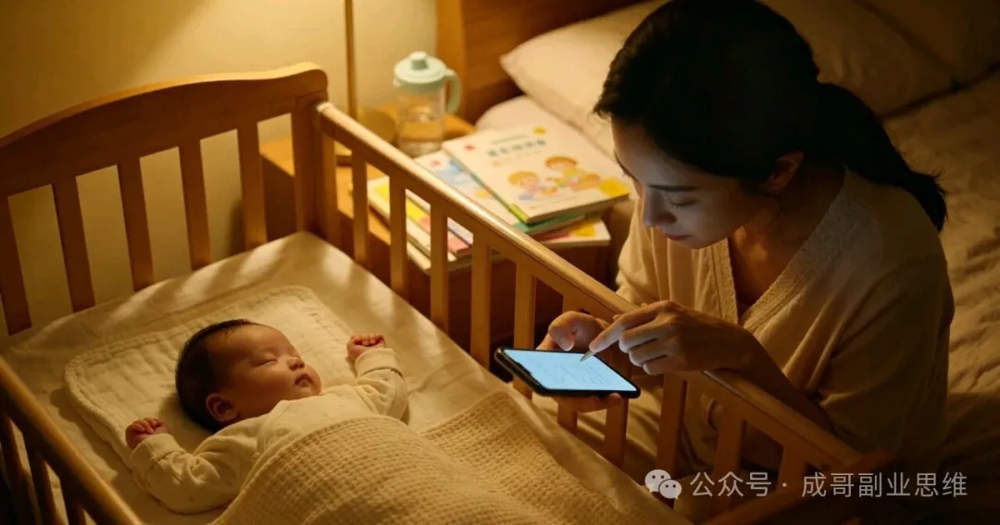

# 真实案例拆解：一篇育儿心得，如何变成5个渠道的被动收入？（宝妈3个月从0到月入8K）

原创 成哥副业思维 *2026年5月5日 19:18*

大家好，我是成哥。

上一篇文章讲完“三重杠杆+三轮驱动”系统后，后台留言里，最多的不是问新项目，而是：“成哥，理论我都看懂了，但真的不知道怎么落地到自己身上。有没有普通人照着做就能成的真实案例？”

还有一位宝妈说得特别戳心：“我每天只有宝宝睡着后的2小时，试过配音、试过刷单、试过卖手工皂，钱没赚到还倒贴了几百块学费。我不求月入过万，能每个月赚够孩子的奶粉钱和尿不湿钱就行，真的有这么简单的方法吗？”

今天，我就不讲任何大道理，只给大家拆解一个我读者的真实故事。她就是上面那位留言的宝妈，叫小琳，坐标青岛，宝宝刚满2岁，每天能用来做副业的时间不超过2小时。

她没有任何特长，不会写文案，不会拍视频，声音也不好听。但就是靠着我教的“一源多用”模型，从一篇3000字的育儿心得开始，用3个月时间，把这一篇内容变成了5个渠道的持续收入，从最初月入300块，到现在稳定月入8000+。

全程零成本、零投资、没露脸、没囤货，所有操作都是用一部手机完成的。

我把她的每一步操作都拆解到了最细，精确到她用了什么标题、定了什么价格、每个渠道赚了多少钱。看完这篇文章，你直接照着抄作业就行。

一、案例背景：踩过所有坑的普通人，如何找到正确的路？

先说说小琳的情况，相信很多人都能在她身上看到自己的影子。

小琳之前是一家公司的行政，怀孕后辞职在家带娃，全家的收入都靠老公一个人。老公工资不高，每个月除去房贷和基本生活费，几乎剩不下什么钱。孩子的奶粉、尿不湿、疫苗，每一样都是开销，日子过得紧巴巴的。

为了补贴家用，她开始疯狂找副业，也踩了所有新手能踩的坑：

\- 花299元报了“配音速成班”，老师说“声音不好听也能月入过万”，结果交完钱只给了一堆录好的课程，一个单子都没接到，群里最后变成了广告群；

\- 跟风做闲鱼卖童装，听别人说“童装利润高”，脑子一热囤了500块钱的货，结果尺码不全、款式过时，挂了三个月只卖出去两件，剩下的都送给了亲戚；

\- 学着别人做自媒体写鸡汤文，每天熬到半夜写1000字，发出去只有几十个阅读，连一分钱收益都没有。

就在她快要放弃的时候，刷到了我写的《2026零成本手机副业》系列文章。她一口气看完了所有内容，给我发了很长一段私信，说：“成哥，我觉得你说的特别实在，没有那些虚头巴脑的东西。我现在什么都不会，就会带孩子，你说我能做什么？”

我给她的建议很简单：不要去学任何新技能，就从你最擅长、每天都在做的事情入手——育儿。先从自媒体发文开始，跑通第一个最小盈利闭环，再用“一源多用”模型放大。

她听进去了，没有再去追什么风口，也没有再交任何学费。每天趁着宝宝午睡的1小时和晚上睡着后的1小时，安安静静地写自己带娃的真实经历。

半个月后，她写出了第一篇爆款文章，从此彻底打开了副业的大门。

' fill='%23FFFFFF'%3E%3Crect x='249' y='126' width='1' height='1'%3E%3C/rect%3E%3C/g%3E%3C/g%3E%3C/svg%3E>)

二、完整拆解：一篇文章的5次变现全过程（精确到每一步）

小琳的所有收入，都起源于一篇3000字的育儿长文。这篇文章本身只赚了1200元的广告收益，但通过“一源多用”的转化，它最终带来了超过2万元的总收入，而且现在每个月还在持续产生被动收入。

下面，我就把这篇文章的5次变现过程，一步一步拆解给你看。

第一步：写出第一篇爆款长文（自媒体广告收益：单篇1200元）

很多人觉得写爆款文章很难，需要很好的文笔。但小琳的经历告诉我们：真正的爆款，从来不是靠文采，而是靠真实和共鸣。

她没有自己瞎想选题，而是严格按照我教的方法：

1\. 打开头条号，搜索关键词“2岁宝宝”；

2\. 点击筛选，选择“最近7天”、“最多点赞”；

3\. 把点赞量1000+的文章全部收藏，找一篇自己最有共鸣的。

她找到的爆款选题是《2岁宝宝叛逆期，别只会说“不可以”》。这篇文章有5万多赞，说明“2岁宝宝叛逆期”是一个巨大的痛点需求。

然后，她没有直接抄袭，而是关掉原文，结合自己的真实经历，用大白话重新写了一遍。她的标题是：《我家2岁娃叛逆期，我只用了3个方法，现在乖得像天使》

内容结构非常简单：

\- 开头：讲自己的痛点，2岁的宝宝有多叛逆，说什么都对着干，自己每天都被气得崩溃，试过很多方法都没用；

\- 中间：分3个小标题，讲自己亲测有效的3个方法，每个方法配一个自己带娃的真实小故事。比如“用选择题代替命令”，她写“以前我说‘别玩插座’，他偏要玩；现在我说‘你想玩积木还是画画’，他立刻就会选一个”；

\- 结尾：总结一下，说叛逆期不是孩子不听话，而是他们在成长，家长要多一点耐心。

整篇文章没有一句专业术语，全是大白话，就像和闺蜜聊天一样。她早上7点把文章发出去，当天下午阅读量就破了10万，第二天涨到了28万。

最终，这篇文章的广告收益是1200元。这是小琳做副业以来，第一次赚到这么多钱。她给我发截图的时候，说自己激动得手都在抖。

避坑提醒：新手写文章，不要追求长篇大论，300-800字就够了。手机用户没耐心看长文，短文的完读率更高，收益也更高。也不要写太专业的内容，真实的经历和感受最能打动人。

' fill='%23FFFFFF'%3E%3Crect x='249' y='126' width='1' height='1'%3E%3C/rect%3E%3C/g%3E%3C/g%3E%3C/svg%3E>)

第二步：转化为小红书图文带货（佣金收益：单篇2800元）

文章爆了之后，小琳没有停下来，而是立刻按照“一源多用”模型，把这篇文章转化成了小红书图文。

她从文章里提到的3个方法中，提取出了3个她自己一直在用的带娃神器：防撞条、绘本架、吸盘碗。这三个东西都是每个有宝宝的家庭都需要的，需求量极大，而且佣金比例很高。

她的操作简单到离谱：

1\. 拍照：就在自己家的客厅里，用手机拍宝宝用这些东西的真实场景。比如拍宝宝自己从绘本架上拿书，拍吸盘碗吸在桌子上不会被打翻。没有修图，没有滤镜，就是最真实的素人感；

2\. 写文案：标题是\*\*《2岁叛逆期宝妈亲测！这3个神器救了我的命》\*\*，正文和头条的内容差不多，只是更简短一些，重点讲每个神器怎么帮她解决了带娃的痛点；

3\. 关联商品：在小红书选品广场找到这三个商品的同款，佣金都是20%-30%，然后直接关联到笔记里。

这篇笔记发布后，第二天就爆了，最终获得了1.2万赞，3000多条收藏。一共卖出了320单，佣金收入2800元。

小琳说，她当时看着订单一个一个跳出来，简直不敢相信自己的眼睛。她只是拍了几张自己家的东西，写了几句话，就赚了老公半个月的工资。

避坑提醒：小红书图文带货，照片越“素人”越好。不要把产品图修得跟淘宝详情页一样精致，用户一看就知道是广告，直接划走。真实的使用场景，才是最能打动用户的。

' fill='%23FFFFFF'%3E%3Crect x='249' y='126' width='1' height='1'%3E%3C/rect%3E%3C/g%3E%3C/g%3E%3C/svg%3E>)

第三步：做成虚拟资源包（被动收益：每月稳定1500元）

这一步是最关键的一步，也是实现“躺赚”的核心。

小琳把那篇爆款长文的内容进行了扩充，加上了自己平时整理的3份实用资料：

\- 《2岁宝宝科学作息时间表》（精确到每小时）

\- 《2岁宝宝必看绘本清单（附年龄分级）》

\- 《叛逆期宝宝沟通话术100句》

她把这些内容整理成了一个PDF文件，命名为\*\*《2岁宝宝叛逆期全攻略.pdf》\*\*，定价9.9元。

然后，她把这个资源包上架到了两个虚拟资源平台，同时在自己的头条号和小红书简介里写上：“私信‘叛逆期’，领取完整版攻略”。

结果，第一天就卖出去了18份，赚了178.2元。第一个月一共卖了120份，赚了1188元。

现在，这个资源包已经上传了3个月，每个月不用管，自动发货，稳定能卖150份左右，每月被动收入1500元。

小琳说，这是她赚得最轻松的一笔钱。她只花了一个晚上整理资料，之后什么都不用做，每天醒来都能看到有新的订单。

避坑提醒：虚拟资源的核心价值不是内容本身，而是“帮用户节省时间”。你不需要自己原创内容，只需要把网上零散的资料整理成系统化的合集，用户就愿意为这个价值付费。但一定要注意版权，不要上传有版权的内容。

' fill='%23FFFFFF'%3E%3Crect x='249' y='126' width='1' height='1'%3E%3C/rect%3E%3C/g%3E%3C/g%3E%3C/svg%3E>)

第四步：录制成音频节目（播放分成：每月稳定800元）

接下来，小琳又把这篇长文和资源包的内容，录制成了音频节目。

她没有用任何专业的录音设备，就是用手机自带的录音功能，在宝宝睡着后，关上门，用自己平时说话的声音读一遍。每条音频5-10分钟，一共录了5条。

她把这些音频上传到了喜马拉雅，创建了一个专辑，名字叫《2岁宝宝叛逆期怎么办？宝妈亲测有效》，开通了播放分成。

一开始，播放量很低，每天只有几十次。但慢慢地，随着搜索的人越来越多，播放量开始稳步增长。现在，这个专辑每天有几千次播放，每个月的播放分成稳定在800元左右。

而且，音频还为她带来了很多精准的粉丝。有不少粉丝听完音频后，私信问她更多的育儿问题，她后来顺势推出了39.9元的1对1育儿咨询，每个月也能额外赚几百块。

避坑提醒：现在的音频市场，不需要你有标准的播音腔。真实、有温度的声音，反而更受欢迎。你略带方言的普通话，可能会让听众觉得更亲切、更可信。

' fill='%23FFFFFF'%3E%3Crect x='249' y='126' width='1' height='1'%3E%3C/rect%3E%3C/g%3E%3C/g%3E%3C/svg%3E>)

第五步：延伸出闲鱼实物代发（差价收益：每月稳定1200元）

最后一步，小琳从她的虚拟资源包里，延伸出了闲鱼实物代发的生意。

她的资源包里有一份《2岁宝宝必看绘本清单》，很多粉丝私信问她这些绘本在哪里买。她灵机一动，在拼多多上找到了这些绘本的一件代发货源，然后在闲鱼上上架了这些绘本。

她的标题是：《2岁宝宝必看绘本10册，全新包邮，宝妈亲测推荐》。拼多多上这套绘本卖29.9元，她在闲鱼上卖39.9元，每卖一套赚10元差价。

有人在她这里下单，她就去拼多多拍同款，收货地址填买家的地址，上家直接发货，她全程不用碰货，也不用囤货。

现在，她的闲鱼账号每天能出2-3单，每个月稳定赚1200元左右。

至此，一篇3000字的育儿长文，通过5次转化，变成了5个渠道的持续收入。我们来算一笔账：

\- 头条广告收益：1200元（一次性）

\- 小红书带货佣金：2800元（一次性）

\- 虚拟资源包：每月1500元（被动）

\- 喜马拉雅音频分成：每月800元（被动）

\- 闲鱼绘本代发：每月1200元（被动）

第一个月，她靠这一篇文章就赚了5988元。从第二个月开始，虚拟资源、音频和闲鱼每个月稳定带来3500元的被动收入。再加上她每个月新写2-3篇文章，用同样的方法转化，现在她的月收入已经稳定在8000元以上。

而她每天花在副业上的时间，依然只有2小时。

' fill='%23FFFFFF'%3E%3Crect x='249' y='126' width='1' height='1'%3E%3C/rect%3E%3C/g%3E%3C/g%3E%3C/svg%3E>)

三、从案例中提炼：普通人可复制的“一源多用”黄金公式

小琳的成功，不是因为她有多厉害，而是因为她掌握了“一源多用”这个核心方法。这个方法，任何普通人都可以复制。

我把它总结成了一个黄金公式：

爆款核心内容 × 5种内容形态 × 5个变现渠道 = 指数级收入

这个公式的核心逻辑是：把你的一份时间，重复卖无数次。

普通人做副业，最大的误区就是“一份时间只卖一次”。你写一篇文章只发一个平台，做一个产品只卖一个渠道，那你的收入永远有天花板。而“一源多用”，就是让你把一份时间的价值，放大到极致。

在运用这个公式的时候，一定要记住3个关键心法，这是小琳用踩坑的经验换来的：

心法一：先做爆款，再做衍生

绝对不要一开始就铺5个渠道、做5种内容。那样只会分散你的精力，最后什么都做不好。

正确的顺序是：先集中所有精力，做出一篇爆款内容，验证这个选题的市场需求。只有当这个内容被证明是用户喜欢的、能赚钱的，你再去把它转化成其他形态，分发到其他渠道。

小琳就是先写出了头条的爆款，确认了“2岁宝宝叛逆期”这个选题有巨大的需求，才开始做小红书、虚拟资源、音频和闲鱼的。如果她的第一篇文章没有爆，那她就换一个选题重新来，不会浪费时间在没有需求的内容上。

心法二：内容为产品服务，产品为流量变现

很多人做自媒体，陷入了“为涨粉而涨粉”的误区。他们每天想着怎么涨粉，却从来没想过怎么变现。结果粉丝涨了几万，一分钱都赚不到。

记住：你的内容不是为了涨粉，而是为了卖产品。

你在写文章、拍视频的时候，就要提前想好，你要通过这个内容卖什么产品。是带货佣金？是虚拟资源？还是服务？然后在内容里自然地植入产品的信息，引导用户购买。

小琳的那篇育儿长文，看似是在分享带娃经验，其实已经为后面的小红书带货、虚拟资源和闲鱼代发做了铺垫。用户看完文章，觉得她的方法有用，自然就会愿意买她推荐的产品和资料。

心法三：轻资产试错，快速迭代

做副业，最忌讳的就是一开始就投入很多钱。很多人脑子一热，就囤货、买设备、交学费，结果钱没赚到，先亏了一大笔。

小琳全程零成本启动，没有花一分钱。她做虚拟资源，只花了时间整理；做闲鱼代发，不用囤货，零风险；做音频，用手机自带的录音功能就行。

即使某个渠道做不好，她也没有任何损失，大不了换一个渠道重新来。这种轻资产的模式，容错率极高，非常适合新手。

' fill='%23FFFFFF'%3E%3Crect x='249' y='126' width='1' height='1'%3E%3C/rect%3E%3C/g%3E%3C/g%3E%3C/svg%3E>)

四、7天落地行动清单（看完就能立刻做）

很多人看完案例，会说：“成哥，她是宝妈，擅长育儿，我没有擅长的领域怎么办？”

其实，每个人都有自己擅长的事情。你会做饭，就可以做美食领域；你会收纳，就可以做家居领域；你会用Excel，就可以做职场领域；你会省钱，就可以做省钱技巧领域。

哪怕你什么都不会，你每天刷手机，知道什么内容火，你就可以做副业赚钱领域。

下面，我给你准备了一个7天落地行动清单。你不需要准备任何东西，只要有一部手机，每天抽1小时，按照清单做，7天就能跑通第一个盈利闭环。

\- 第一天：找到你的核心优势领域

拿出一张纸，写下3件你最擅长、最有经验、或者最感兴趣的事情。比如：带娃、做饭、Excel、收纳、省钱、追剧。然后选一个你最有话可说的，作为你的主攻领域。

\- 第二天：找到1个爆款选题

打开头条号，搜索你选的领域关键词，点击筛选，选择“最近7天”、“最多点赞”。找3篇点赞量1000+的文章，选一篇你最有共鸣的，作为你的第一个选题。

\- 第三天：写出你的第一篇短文

通读那篇爆款文章，然后关掉原文，用自己的话把内容重新讲一遍，加上你自己的真实经历和感受。文章不用太长，300-800字就够了。标题要用数字、痛点或者结果式，比如《我用了3个方法，解决了XX问题》。

\- 第四天：发布到头条号，开通收益

用手机号注册头条号，完成实名认证（免费），现在0粉丝就能开通广告分成。排版记住三个原则：多分段（每段1-2句话）、加2-3个小标题、配3张平台免费图库的图片。早上7点或者晚上18点发布。

\- 第五天：改写成1篇小红书图文

从你的短文中提取3个核心点，每个点配一张手机实拍图（不用修图，真实就行）。标题用小红书的风格，比如《亲测有效！XX的3个神仙方法》。如果有对应的商品，就关联上商品链接。

\- 第六天：整理成第一个虚拟资源包

把你的短文内容扩充一下，加上一些实用的清单、表格或者步骤图，做成一个PDF文件。定价9.9元，上架到虚拟资源平台。

\- 第七天：复盘数据，制定下周计划

看一下头条的阅读量和小红书的点赞量。如果数据好，就继续按照这个方法，把内容转化成音频和闲鱼商品。如果数据不好，就换一个选题，重新来。不要因为一次失败就放弃。

' fill='%23FFFFFF'%3E%3Crect x='249' y='126' width='1' height='1'%3E%3C/rect%3E%3C/g%3E%3C/g%3E%3C/svg%3E>)

五、最后说几句

我经常说，普通人做副业，最大的敌人不是没有时间，也不是没有能力，而是错误的思维模式。

很多人觉得，要想赚钱，就要更努力、花更多的时间。但其实，靠出卖时间赚钱，永远有天花板。你一天只有24小时，就算你不睡觉，也只能工作24小时。

真正的赚钱之道，是把你的时间变成产品，让产品为你赚钱。一份产品，可以卖给无数个人，你的收入就没有上限。

小琳就是最好的例子。她只是一个普通的宝妈，没有天赋，没有资源，没有背景。但她用对了方法，把一份2小时写出来的文章，重复卖了无数次，最终实现了月入8000+。

你不需要很厉害才能开始，你需要开始才能变得很厉害。

不要再说“我不会”、“我没时间”、“我做不到”了。从今天起，每天抽1小时，按照上面的清单做。7天之后，你一定会赚到你的第一笔副业收入。

下一篇文章，我将给大家拆解一个更小众、更暴利的垂直赛道——“中老年手机教程”。这个赛道竞争极小，需求量却极大，而且中老年人的付费意愿非常高。我会教你如何用同样的“一源多用”模型，针对这个被忽视的巨大市场，做到月入过万，新手也能快速上手。

关注【成哥副业思维】，持续分享零基础新手可做的变现干货，少走弯路，不踩坑。让每一分时间，都产生复利。

继续滑动看下一个

成哥副业思维

向上滑动看下一个
