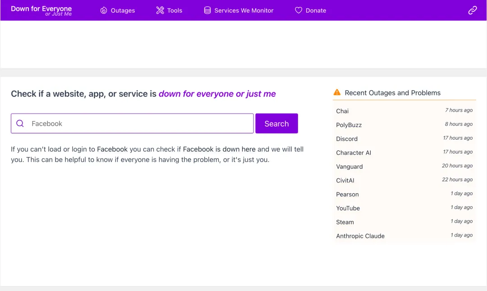

# 不起眼的小工具网站，单人运营月入20万！程序员副业别再踩坑了

很多程序员在探索副业时，往往会陷入一个致命的误区：认为只有去开发复杂的SaaS产品、搭建庞大的业务系统，才称得上是“能赚钱的项目”。于是，熬了无数个通宵写代码、搭架构，结果产品上线后无人问津，根本无法变现，白白耗费了大量的时间和精力。

但现实的真相却截然不同：大批独立开发者正是靠着那些极简的小工具网站在闷声发大财。这些网站往往功能单一、界面简陋，完全由单人维护，但却能实现每月几万甚至几十万美元的稳定收入。

今天，我们就来深度拆解一个真实的赚钱案例。看完之后你会发现：有些看似“无聊”且简单的网站，其变现能力远超你的想象。

## 案例拆解：仅靠“查网站宕机”，单人月入3万美元

我们要看的是一个名为 **Down For Everyone Or Just Me** 的网站。

它的核心功能极致简单，只做一件事：用户输入任意网址，一键检测这个网站到底是只有自己打不开，还是全球范围内的服务器都宕机了。

没有花里胡哨的多余功能，没有复杂的交互逻辑，甚至连界面都十分朴素。它纯靠解决用户的一个极度刚需的痛点：快速排查网站访问故障，判断究竟是本地网络出了问题，还是目标服务器真的挂了。



就是这么一个“小而美”的工具，不靠融资、不雇团队，完全由单人独立运营。但它每个月能稳定变现约 3 万美元（折合人民币近 20 万），绝对算得上是副业里的暴利项目。

更重要的是，这类工具的技术门槛极低。其核心逻辑只需几行代码就能实现，即使是经验不多的开发者也能快速上手并完成开发。

## 核心逻辑与Python实现

这款宕机检测工具的核心原理其实非常简单：通过服务器向目标网址发起网络请求，判断目标站点的响应状态，从而区分是用户本地网络故障还是网站全局宕机。这里分享一段使用 Python 实现的核心代码：

```python
# 网站宕机检测核心代码import requestsfrom requests.exceptions import RequestExceptiondef check_site_status(url: str) -> str:    """    检测网站是否宕机    :param url: 目标网址    :return: 检测结果文案    """    # 补全协议，避免用户输入缺失    if not url.startswith(("http://", "https://")):        url = f"https://{url}"
    try:        # 设置超时时间，防止请求卡死        response = requests.head(url, timeout=5, allow_redirects=True)        # 状态码200/3xx均为正常访问        if 200 <= response.status_code < 400:            return "✅ 网站正常运行，只是你的网络/本地环境打不开哦！"        else:            return f"⚠️ 网站返回异常状态码 {response.status_code}，大概率是全站宕机了！"    except RequestException:        # 请求失败，说明站点无法访问        return "❌ 网站无法响应，全世界都打不开，确实宕机了！"# 测试调用if __name__ == "__main__":    test_url = "downforeveryoneorjustme.com"    print(check_site_status(test_url))
```

以上只是最核心的检测逻辑。在实际操作中，你只需再搭配一个简单的 HTML 前端页面，然后将其部署到云服务器（如阿里云、腾讯云的轻量应用服务器或 Vercel 等平台），一个同款的工具网站就正式成型了。整个过程运维成本极低，单人完全能够轻松搞定。

## 商业模式拆解：它凭什么赚钱？

为什么一个如此简单的工具，能做到月入 3 万美元？这类小工具网站的盈利模式和运营心法，值得每一个想做副业的程序员深思。

- **广告收入**
	：这是最基础也是最核心的变现方式。一旦工具解决了刚需痛点，获得了巨大的自然流量，通过展示横幅广告、弹窗广告等就能获取丰厚收益。
- **合作伙伴分成 (Affiliate)**
	：与网络服务提供商（如域名注册商、主机服务商、VPN 厂商等）合作。当用户检测发现自己的网络有问题时，顺势推荐相关服务并获取高额佣金。
- **高级功能与数据服务**
	：虽然基础功能免费，但可以提供付费 API 接口，或者分析海量访问数据，为企业提供网站可用性监控、市场洞察等商业服务。

## 源码站结语

单人运营之所以能获得高利润，核心在于“精准”和“低成本”。不要去碰那些大而全的通用工具市场，而是要 **聚焦小而痛的需求** 。比如“查网站宕机”、“特定格式的文件转换”、“快速去水印”等。功能越聚焦，用户留存率越高。

同时，必须做到 **低成本验证与自动化** 。初期投入必须极低。利用开源工具、免费代码辅助快速完成开发。首月投入甚至可以控制在百元以内。后续通过自动化部署和维护，将人力成本降至最低。这类工具的增长高度依赖搜索引擎优化（SEO）。只要把核心关键词的排名做上去，就能获得源源不断的免费自然流量。
