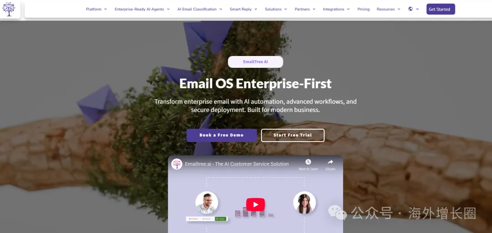

# 从0到$10K MRR：一个独立开发者的增长黑客之路

原创 思考的汉堡 *2026年3月26日 08:55*

在SaaS领域，我们经常听到"增长黑客"这个词，但真正的增长黑客是什么样的？今天我们来拆解一个真实的独立开发者案例——Danny Postma，他在18个月内将一个简单的Chrome扩展从0做到了$10,000的月经常性收入（MRR）。

## 🎯 引言

这是一个关于持续迭代、数据驱动决策、以及如何用极低成本获取用户的实战案例。

## 💼 项目背景：EmailTree

EmailTree是一个AI驱动的邮件分类工具。它通过GPT-4分析邮件内容，自动将邮件分类到不同文件夹，帮助用户清理收件箱。

核心痛点：

- 创业者和高管每天收到数百封邮件
- 手动分类浪费时间
- 重要邮件容易被淹没

初始MVP：

- Chrome扩展
- 简单的GPT-4集成
- 基础分类功能（工作、个人、促销、重要）

## 📊 第一阶段：冷启动（0-100用户）

问题：没有预算，怎么获取第一批用户？

Danny没有投放广告，也没有做SEO。他用了三个低成本策略：

策略1：Product Hunt发布

成本： $0

准备时间： 2周

结果结果： 47个早期用户，12个付费转化

关键细节：

- 提前2周在PH社区预热，分享开发过程
- 发布当天在多个时区发帖（美国、欧洲、亚洲）
- 准备了详细的演示视频（60秒）
- 前100名注册用户送30天免费试用

策略2：Twitter持续分享

成本： $0

时间投入： 每天30分钟

结果： 150个关注者，30个转化

内容策略：

- 分享开发日志（"今天实现了X功能，用了Y小时"）
- 发布增长数据（"本周新增50个用户，流失率3%"）
- 回复相关话题（在#indiehacker、#SaaS话题下互动）

策略3：Reddit精准营销

成本： $0

时间投入： 每周2小时

结果结果： 80个用户，8个付费

执行方法：

- 在r/productivity、r/entrepreneur发布案例研究
- 不直接推销，而是分享"我是如何解决邮件混乱问题的"
- 提供免费试用，降低试用门槛

## 数据洞察

通过Google Analytics和Mixpanel，Danny发现：

来源分析：

Product Hunt：47%的初始用户

Twitter：35%

Reddit：18%

转化率：

Product Hunt：25.5%（最高）

Twitter：20%

Reddit：10%

留存率（30天）：

整体：42%

来自Product Hunt的用户：48%

来自Twitter的用户：45%

结论： Product Hunt的质量最高，Twitter的持续性强，Reddit的转化低但用户粘性不错。

## 🔄 第二阶段：产品迭代（100-500用户）

问题：用户流失率高，如何提升留存？

第一个月的流失率高达58%。Danny通过用户访谈和数据分析，发现了三个核心问题：

问题1：分类不够准确

用户反馈： "GPT-4经常把促销邮件当成重要邮件"

解决方案：

- 引入用户反馈机制（"这个分类对吗？"）
- 收集错误样本，微调prompt
- 增加自定义规则功能（用户可以设置"来自@company.com的邮件总是重要"）

结果： 分类准确率从73%提升到91%

───

问题2：免费用户没有升级动力

30天试用期结束后，只有8%的用户转化为付费。

解决方案：

• 引入分层定价：

• Free：每月100封邮件

• Pro ($9/月)：无限邮件+高级规则

• Team ($29/月)：团队协作+API

• 添加使用限制提示：

• "本月已处理98封邮件，升级Pro解锁无限使用"

• 在达到80%使用量时推送通知

结果： 付费转化率从8%提升到22%

───

问题3：用户不知道如何最大化价值

很多用户注册后只用了一两次就流失了。

解决方案：

• 新用户引导流程：

• 首次使用时弹出3步教程

• 提供"一键导入100封测试邮件"功能

• 发送3封自动邮件（第1天、第7天、第14天）

• 添加成功指标：

• "你本周节省了2.5小时"

• "你已经分类了500封邮件"

结果： 30天留存率从42%提升到65%

## 数据驱动的功能优先级

Danny用了一个简单的框架来决定开发什么功能：

RICE评分 = (Reach × Impact × Confidence) / Effort

| 功能 | Reach | Impact | Confidence | Effort | RICE |
| --- | --- | --- | --- | --- | --- |
| 自定义规则 | 80% | 3 | 80% | 5 | **38.4** |
| 团队协作 | 20% | 3 | 60% | 8 | **4.5** |
| 移动端App | 60% | 2 | 40% | 10 | **4.8** |
| API接入 | 15% | 2 | 70% | 3 | **7** |

结论： 优先开发自定义规则功能，暂缓移动端App。

## 📈 第三阶段：规模化增长（500-1000用户）

问题：如何从有机增长到规模化？

当用户达到500时，Danny开始尝试付费渠道。

策略1：内容营销

成本： $0（时间成本）

时间投入： 每周4小时

结果： 每月200个自然流量，15个转化

执行方法：

在Medium、Dev.to发布案例研究

撰写"如何用AI管理收件箱"教程

制作对比文章（EmailTree vs SaneBox vs Clean Email）

SEO优化：

目标关键词："email automation tool"、"AI email organizer"

每篇文章包含3-5个内部链接

添加FAQ部分，覆盖长尾关键词

───

策略2：联盟推荐计划

成本： 20%佣金

时间投入： 一次性设置

结果： 每月30个推荐用户，8个付费

设计：

每个用户都有专属推荐链接

推荐人获得20%的终身佣金

被推荐人获得30%折扣（第一个月）

推广：

在用户Dashboard突出显示推荐计划

发送邮件给活跃用户："邀请朋友，双方都受益"

───

策略3：付费广告（小规模测试）

成本： $500/月

平台： Google Ads

结果： CAC $15，LTV $90，ROI 6x

广告策略：

精准关键词："email management software"、"inbox zero tool"

否定关键词："free"、"download"（避免免费用户）

A/B测试广告文案：

A: "Save 2 hours every week with AI email sorting"

B: "Achieve inbox zero automatically with EmailTree"

结果： 文案A的CTR是2.3%，B是1.8%，选择A。

───

## 关键指标监控

Danny每天早上都会看这个Dashboard：

| 指标 | 目标 | 实际 | 状态 |
| --- | --- | --- | --- |
| 新用户/天 | 10 | 12 | ✅ |
| 付费转化率 | 20% | 22% | ✅ |
| 30天留存率 | 60% | 65% | ✅ |
| MRR | $8,000 | $10,200 | ✅ |
| CAC | <$20 | $15 | ✅ |
| LTV | \>$80 | $90 | ✅ |

红色警报机制：

如果新用户连续3天低于5 → 检查营销渠道

如果付费转化率低于15% → 检查定价和引导流程

如果留存率低于50% → 立即进行用户访谈

───

## 💰 第四阶段：稳定增长（$10K MRR）

当前状态

• MRR： $10,200

• 用户数： 850（其中220个付费用户）

• 团队： 1人（Danny）+ 1个兼职客服

• 技术栈： Next.js + Supabase + OpenAI API

• 月成本： $300（服务器+API+工具）

───

## 增长引擎

现在，EmailTree已经建立了三个稳定的增长引擎：

引擎1：产品驱动增长（PLG）

• 免费用户通过使用产品，自然转化为付费用户

• 转化路径：注册 → 试用 → 达到使用限制 → 升级

• 占新付费用户的65%

引擎2：内容营销

• 每月发布2-3篇高质量文章

• 带来持续的自然流量

• 占新付费用户的20%

引擎3：口碑推荐

• 用户推荐计划

• NPS评分：72（优秀）

• 占新付费用户的15%

───

## 下一步计划

Danny正在探索：

1\. 企业版： 针对大客户的定制方案

2\. API产品： 将分类能力开放给其他开发者

3\. 移动端： iOS和Android App

───

## 💡 核心经验总结

1\. 冷启动：多渠道，小规模测试

不要把所有鸡蛋放在一个篮子里。Danny同时测试了Product Hunt、Twitter、Reddit三个渠道，最终发现Product Hunt质量最高，Twitter持续性最强。

可复制策略：

• Product Hunt：适合新产品发布，质量高

• Twitter：适合持续分享和建立个人品牌

• Reddit：适合精准话题，但转化率低

───

2\. 产品迭代：数据驱动，用户反馈优先

不要凭直觉开发功能。用RICE框架评估优先级，用数据验证假设。

关键工具：

• Mixpanel：用户行为分析

• Hotjar：用户录屏和热图

• Typeform：用户反馈收集

───

3\. 增长策略：先自然，后付费

在验证产品-市场匹配之前，不要花钱买流量。自然增长（内容、推荐、SEO）虽然慢，但用户质量高，LTV也高。

投放原则：

• 先测试，再规模化

• 监控CAC和LTV，确保ROI > 3

• 从精准关键词开始，避免浪费

───

4\. 留存比增长更重要

Danny花在提升留存上的时间，是花在获客上的2倍。因为留住一个老用户，比获取一个新用户便宜5-10倍。

留存策略：

• 新用户引导流程

• 持续的价值证明（"你节省了X小时"）

• 定期的功能更新通知

───

5\. 保持简单，避免过度工程

EmailTree至今只有1个全职开发者。Danny的哲学是：

• 用成熟的技术栈（Next.js + Supabase）

• 不追求完美，追求快速迭代

• 能用现成工具就不用自己造

───

## 🎯 给中国独立开发者的建议

1\. 选题要具体

不要做"又一个笔记App"，要做"专门为产品经理设计的笔记App"。越具体的痛点，越容易找到目标用户。

2\. 从小处着手

EmailTree的第一个版本只用了2周开发。不要憋大招，快速上线，快速迭代。

3\. 拥抱中文社区

除了Product Hunt，也可以在V2EX、少数派、知乎、小红书发布和分享。中国独立开发者社区正在快速增长。

4\. 数据说话

用Google Analytics、Mixpanel等工具，持续监控关键指标。不要凭感觉做决策。

5\. 持续分享

像Danny一样，在社交媒体上分享你的开发过程、增长数据、遇到的坑。这能帮你获得早期用户、建立个人品牌、获得反馈和建议。

───

## ✨ 结语

EmailTree虽然不是特例。很多成功的B2B SaaS虽然是这样起步的：

• Buffer（社交媒体管理工具）从博客起家

• Groove（客服工具）靠公开分享增长数据获得关注

• Zapier（自动化工具）靠内容营销和社区建立品牌

增长黑客不是黑科技。它是：

• 深入理解用户

• 用数据验证假设

• 快速迭代优化

• 坚持长期主义

没有营销预算？不是问题。问题是：你愿意花多少时间去理解用户、优化产品、建立信任？

增长从来不是一蹴而就的。它是每天做对一件事，持续6个月、12个月、24个月的结果。

EmailTree的故事告诉我们：零预算也能增长，关键是你有没有耐心和策略。

───

数据来源： Danny Postma的公开分享、Product Hunt页面、Twitter公开数据、EmailTree公开Dashboard

───

下一步行动：

1\. 检查你的产品是否有清晰的指标体系

2\. 识别1-2个可以快速测试的增长渠道

3\. 与5-10个用户进行深度访谈

4\. 用RICE框架评估你的功能优先级

海外创业案例精选 · 目录

继续滑动看下一个

海外增长圈

向上滑动看下一个
