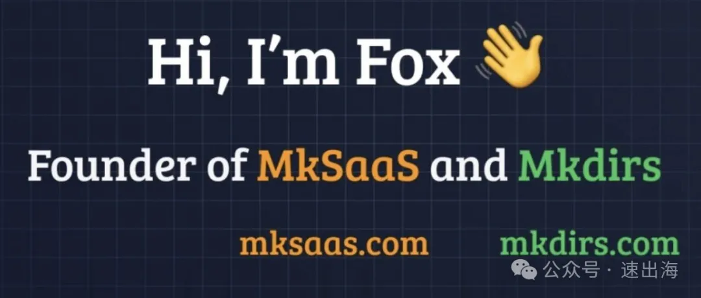

# 10 万美金 2 年 - 这可能是中文独立开发者的代表案例

原创 速出海 *2026年5月6日 22:12*

大家好，我是速出海的opcmax。

前两篇说的都是英文圈、全职、百万美金一年的头部样本。

今天浅浅分析一个完全不一样的——@indie\_maker\_fox， **2 年挣到 10 万美金** 。

为什么不一样？因为他是这个系列里第一个 **让大多数中文读者真的有可能复刻** 的样本。

- • levelsio 一年 300 万美金，靠的是 12 年的英文 X 账号 + 美元区购买力
- • Marc Lou 一年 100 万美金，靠的是 4 年密集 build in public + 国际化时间窗口
- • indie\_maker\_fox 2 年共 10 万美金，靠的是 **对标 Marc Lou + 中文出海圈 + 副业精力**

这是中文独立开发者圈最有现实意义的一个体量。

## 起

3 个产品，全是 boilerplate（启动模板），客户全是其他想做独立开发的开发者：

| 产品 | 类型 | 上线时间 | 已知数据 |
| --- | --- | --- | --- |
| **Mkdirs.com** | 导航站模板 | 2024 年 10 月 | 300+ 付费客户 |
| **MkSaaS.com** | AI SaaS 模板 | 2025 年 4 月 | 截至 2025 年 8 月 150+ 客户 |
| **TanStarter.dev** | TanStack + Cloudflare 模板 | 2026 年 2 月 | 数据未公开 |

外加一个 ~3000 人的出海交流 Discord 社群，作为流量 + 人脉沉淀。

**他的客户群跟 Marc Lou 完全一样——其他独立开发者** 。他还曾致谢过 Marc Lou：「MkSaaS 上周收入超过了 Marc 的 ShipFast」

## 从 2024 年国庆开始

| 时间 | 关键节点 |
| --- | --- |
| **2024 年 8 月** | 开始开发 Mkdirs 导航站模板 |
| **2024 年国庆假期** | 通过 Stripe Atlas 注册美国公司 MkSaaS Inc. |
| **2024 年 10 月 21 日** | Mkdirs 正式上线（其实开发还没完，先收到一笔客户主动要求付款的预付款） |
| **2024 年 11 月** | Mkdirs 上线 10 天突破 2000 美金，40 天突破 1 万美金 |
| **2024 年 12 月** | 注册 @indie\_maker\_fox 这个 X 账号（之前用 @javay\_hu） |
| **2025 年 2 月 16 日** | 开始写 MkSaaS 第一行代码 |
| **2025 年 4 月 22 日** | MkSaaS 正式发布 |
| **2025 年某周** | MkSaaS 周收入超过 Marc Lou 的 ShipFast |
| **2025 年 8 月** | MkSaaS 累计 1000+ commits、150+ 客户 |
| **2026 年 2 月 25 日** | TanStarter 发布（第 3 个模板） |
| **现在** | X 粉丝 1.2 万，Discord 社群 ~3000 人 |

## 大厂员工的稳定 + 副业的灵活

这块跟前两篇都不一样。

levelsio 的护城河是 12 年的 X 账号；Marc Lou 的护城河是"自己就是用户"。indie\_maker\_fox的护城河是另一种—— **他根本不需要靠这件事吃饭** 。

- • **不焦虑现金流** ：他自己说过"我目前的工作内容和氛围都很好，收入也非常稳定，我没有考虑过全职独立开发"。这意味着他做产品的所有决策都是 **长期最优** 而不是 **短期回血最优** 。
- • **可以慢慢打磨** ：Mkdirs 从 8 月开发到 10 月才上线，整整 2 个月没收入。MkSaaS 从 2 月写第一行到 4 月发布也是 2 个月。一个全职独立开发者，一个产品花 2 个月不出收入，心态早崩了。
- • **可以挑赛道** ：他选了"独立开发者卖给独立开发者"这个细分赛道，避开 levelsio 那种通用消费者市场——因为他不需要追大池子。
- • **可以接受 10 万美金的天花板** ：副业的好处是预期管理。他不需要做到 100 万美金/年才算"成功"。

更关键的一点： **他的本职工作本身就在互联网大厂，长年浸泡在工程实践里** 。所以做 boilerplate 这件事对他来说是"把工作里学到的工程经验产品化"，而不是从 0 开始学。

### 对标 Marc Lou

如果把 Marc Lou 那篇文章里我画过的产品矩阵图套到indie\_maker\_fox身上， **复刻度极高** ：

| Marc Lou | indie\_maker\_fox |
| --- | --- |
| ShipFast（Next.js 模板） | MkSaaS（Next.js + AI 模板） |
| CodeFast（独立开发课程） | Discord 社群 + 持续推文教学（未做收费课） |
| DataFast（独立开发者的分析工具） | （未做） |
| TrustMRR（独立开发者的市场） | IndieHub（独立开发者的导航站，用自己 Mkdirs 模板做的） |
| build in public on X | build in public on X + 中文社群复述 |
| 4 倍速 levelsio | **indie\_maker\_fox = Marc Lou 的中文副业版** |

中文圈想做出海的开发者很多，我觉得他做的还是挺成功的，而且还不是全职做，只是副业。

## 不看好的几个方向

**第一，中文圈出海开发者的付费能力是有限的。**

他自己也说过——微信群里大多数人想"学怎么挣钱"，不想"花钱买模板"。Mkdirs 的 300+ 客户、MkSaaS 的 150+ 客户里，有相当一部分其实是英文圈用户（boilerplate 这个产品本身就是面向 GitHub / X / Reddit 的）。

**第二，模板赛道现在是红海。**

ShipFast、MakerKit、SaasRock、Shipixen、BuilderKit、NEXTY、Supastarter——竞品几十个。indie\_maker\_fox的优势是"中文用户体验 + 中文文档 + 中文社群"。这是一个结构性优势，但也是天花板，这个市场的竞争很激烈了。

**第三，X 粉丝 1.2 万远不如 Marc Lou 的 32.9 万。**

Marc Lou 一发推就有几万人来看，indie\_maker\_fox 1.2 万粉发推主要靠 Discord 社群和小红书做口碑放大。这意味着他做新产品的"分发成本"远高于 Marc Lou，每个新产品都需要重新推一遍。

**第四，3 个产品全是 boilerplate 一个品类。**

Marc Lou 至少有模板 + 课程 + 分析 + 市场 4 种品类。indie\_maker\_fox目前 3 个产品都是模板。一旦"模板"这个品类整体退潮，他的整个矩阵会同步受影响。

## 学得来的部分 vs 学不来的部分

**学得来的：**

- • **挑独立开发者圈做客户群。** 中文圈付费力不如英文圈，但 Discord / 小红书 / 即刻 / X 上的中文出海开发者群体在变大，是真实的目标用户。
- • **副业起步、不裸辞。** indie\_maker\_fox证明了大厂员工 + 周末做模板，2 年能挣 10 万美金。这是绝大多数中文独立开发者读者最现实的路径。
- • **抄一个跑通的模式。** Marc Lou 的所有动作都被indie\_maker\_fox复刻了一遍——产品定位、工具链、build in public 节奏、注册公司的方式。 **他不需要发明轮子，他只需要把 Marc 的轮子翻译过来。**
- • **持续上新模板。** 从 Mkdirs → MkSaaS → TanStarter，每年 1–2 个新产品，保持 build 节奏。

**学不来的：**

- • **互联网大厂员工的工程背景 + 稳定收入。** 这个对应"我有本职工作可以兜底"的心态。如果你已经裸辞，indie\_maker\_fox的"长期最优心态"你学不来。
- • **2024 年中文出海圈的早期红利。** indie\_maker\_fox入场时中文圈 build in public 的人不多，所以 1.2 万粉很容易做起来。今天再起步，1.2 万粉会更难。

## 写在最后

我个人觉得indie\_maker\_fox是这个系列到目前为止 **最值得中文读者抄作业的样本** 。

levelsio 和 Marc Lou 的故事好看，但学得来的部分有限。indie\_maker\_fox的故事没那么戏剧性，但他的每一步都可以被中文圈一个普通工程师在 12 个月内复制——前提是你愿意接受"副业 + 周末 + 2 年 10 万美金"这个起步预期，而不是从一开始就想着"要全职、要百万、要财务自由"。

**他会全职吗？**

如果他全职做独立开发，理论上 12 个月内年收入翻一倍到 20 万美金/年不是难事。但他自己说过不打算全职。10 万美金这个区间，可能已经是大部分独立开发者难以达到的现实天花板。

你怎么看？如果你也在做副业出海，欢迎来聊聊。

关注我，一起探索和发现出海副业机会。

' fill='%23FFFFFF'%3E%3Crect x='249' y='126' width='1' height='1'%3E%3C/rect%3E%3C/g%3E%3C/g%3E%3C/svg%3E>)

\=====================

往期文章推荐：

[一个压缩图片的网站，月入 66 万，6 个人](https://mp.weixin.qq.com/s?__biz=MzA4MDk4Nzk5NQ==&mid=2454179326&idx=1&sn=9390f2b84e60a3a83ecba4b2e99a2814&scene=21#wechat_redirect)

[6个人，10美元/年的VPS，如何做到年收入500万美元](https://mp.weixin.qq.com/s?__biz=MzA4MDk4Nzk5NQ==&mid=2454179348&idx=1&sn=4f8b086884570dee36d6b57b063f4f28&scene=21#wechat_redirect)

[Postman：4000万用户里只有1.25%付费，但年收入3亿美金](https://mp.weixin.qq.com/s?__biz=MzA4MDk4Nzk5NQ==&mid=2454179341&idx=1&sn=c95e234b8c5e40dd9334804b52837f6d&scene=21#wechat_redirect)

[80% 的数据库是AI建的——这个Postgres平台刚卖了 10亿 美元](https://mp.weixin.qq.com/s?__biz=MzA4MDk4Nzk5NQ==&mid=2454179354&idx=1&sn=7786c8681cbd15a88b26d61d012c21d6&scene=21#wechat_redirect)

[一个月访问2400万的表格工具，凭什么估值117亿美元？](https://mp.weixin.qq.com/s?__biz=MzA4MDk4Nzk5NQ==&mid=2454179321&idx=1&sn=909dbb078027a758f1cb16b06dcc4a3f&scene=21#wechat_redirect)

[一个人搞了 24 个产品、年入 $3.5M——MarsX 到底是开发工具，还是创业永动机？](https://mp.weixin.qq.com/s?__biz=MzA4MDk4Nzk5NQ==&mid=2454179304&idx=1&sn=6fc111d2d8bf2aaf6d898d36cc37c99b&scene=21#wechat_redirect)

独立开发者赚钱图鉴 · 目录

继续滑动看下一个

速出海

向上滑动看下一个
