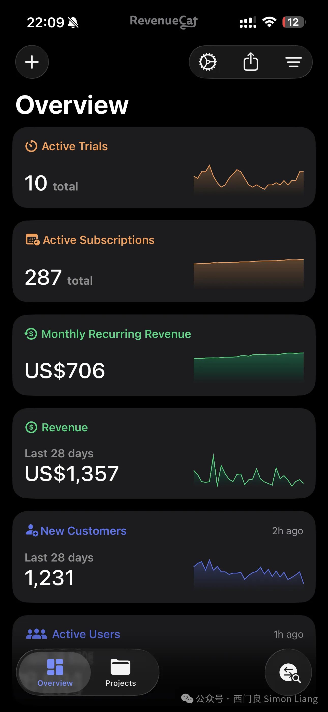

# 独立开发两年，达到1k MRR有感

 

上周开始，我其实就隐约感觉我的MRR快接近1k了。但是其实这个数字不是很稳定，而且最近无论是流量还是收入上都下降了一些，但还是很高兴在月底前就达到了这个里程碑。
从2023年底我开始做独立开发，一共做了8个Apps，目前有4个Apps（正好两个web，两个iOS）有收入。目前MRR构成中，iOS比web正好是7比3。
这个数字是一个折算出来的平均月收入，但是也说明了，如果维持现状的话，未来一年每个月都能稳定拿到这个数。这个数字其实非常不容易，因为它反映了有人能看见我做的Apps，有人觉得我做的产品有用，有人为了我的创造力付费。
到现在我也还记得，我有很长一段时间，这个MRR数字都停留在零。我当时很迷茫，心里尽管有想做的Apps，但是很怕做出来没有任何人用，每天都在想怎么样才能有人能看到我做的App，怎么样才能复刻社交媒体上其他独立开发者的成功。
中间有一段时间，我发现我开始变得克制。每一次我有idea的时候，我需要做严格的调研，看看这个项目如果要做起来的话，需要做什么类型的推广工作；每一次我看我的代码不顺眼的时候，我要抑制住自己想重构的欲望。因为我在烧自己的积蓄做这个事情，所以在有收入之前的每一天，我都无时无刻不在怀疑自己当初的决定，各种焦虑的情绪也涌上心头。我有一段时间不想看任何社交媒体，因为每一个社交媒体我都能刷到别的独立开发者怎么怎么成功，让我睡不着觉。
但是幸好我没有放弃。我坚持研究ASO和SEO，并且强迫自己去介绍和推广自己做的Apps，慢慢地，我发现开始有人进来用我的Apps了，并且慢慢开始有人付费了。我发现自己做的每一个主动或者被动推广的时候，都有正反馈。慢慢地，这个收入数字也上来了。
作为踏入第三个本命年的我，其实如果全职做一个事情两年下来，还只有这个收入数字，可能会被人笑话。而且这个收入水平说实话，现在还差一点才能完全支撑我的生活。但是我觉得这份收入来的很珍贵，因为这是我不靠公司，不靠甲方，完全凭自己的努力获得的。而且现在我已经把独立开发这件事情当作我生命里的无限游戏了，如果可以的话，我将一直做独立开发。
现在我已经把目标定到了2k MRR，按照现在的速度非常希望今年年底之前能够实现。收入上来了一些之后，我也可以考虑开始做一些我更喜欢做的Apps，那种可以一点点打磨变得更好的Apps。
#独立开发

 喜欢作者

西门良 Simon Liang

西门良 Simon Liang

向上滑动看下一个
