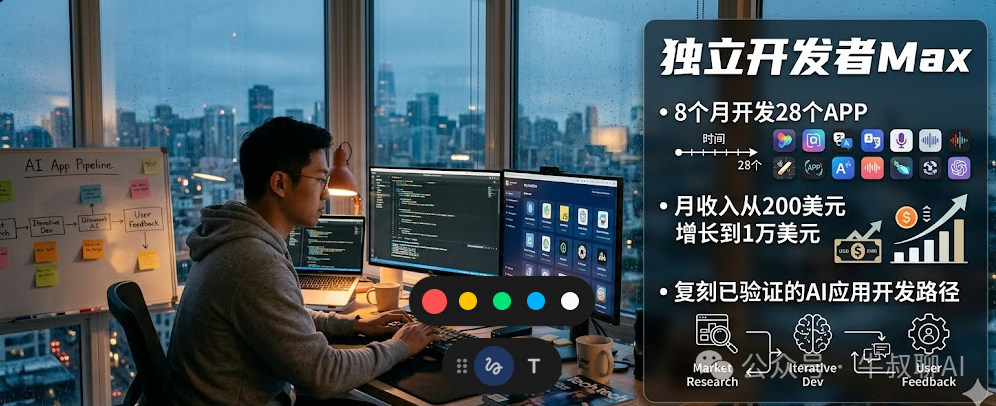

# 8个月，28个APP，月入1万美金，一文拆解全流程

原创 牛叔 *2026年4月18日 22:41*

## 2024年初，Max盯着自己的收入报表，陷入了沉默。

那个月，他从28个上线的APP里赚了多少钱？

200美元。

换算成人民币，1400块。不够他一个月的云服务器费用。

他已经在这条路上走了将近两年。全职辞职，独自开发，每天坐在那台MacBook前盯着Xcode，周围的朋友都觉得他在做梦。

---

他当时非常想放弃。

但没有。

8个月后，他的月收入变成了 **1万美元** 。

不是因为某个APP爆了。是因为他彻底换了一套思维方式——把"做APP"这件事，从一门手艺，变成了一条 **流水线** 。

---

## 第一个问题：他是怎么找方向的？

很多独立开发者的找方向方式是这样的：某天刷到一个功能，觉得不错，做一个；或者自己有个痛点，做一个；再不然，看到别人某个APP火了，跟做一个。

这三种方式有一个共同点： **凭感觉** 。

Max不这样干。他用的是一套搜索框架，核心工具是ASO（App Store Optimization）数据平台，专门扒关键词的热度和竞争难度。

他的筛选标准非常具体：

**流行度超过20%** ——说明有真实需求，不是伪需求。

**竞争难度低于60%** ——说明这个坑还没被大公司填满。

**搜索结果前几名的APP必须是赚钱的，而且做得一般** ——这是最关键的一条。不是找没人做的方向，是找 **有人赚钱但没人做好** 的方向。

然后还有一个他自己总结的规律：专门找能 **批量复制** 的词。

比如他发现"物理AI"这个关键词有流量，那"化学AI"、"数学AI"大概率也有。一套代码逻辑，换个封面和关键词，就是一个新APP。

这不是什么高深的战略，更接近于 **搜索套利** ——在信息不对称里找到被忽视的空隙，然后批量填进去。

---

## 第二个问题：他为什么做得这么快？

传统独立开发者的节奏是：一个APP从零到上线，快则三个月，慢则半年。

Max的节奏是： **一个APP一到两周** 。

他怎么做到的？

**第一步：只抄核心。**

他会先扒开竞品，分析用户评论、付费转化逻辑、订阅截图——只提炼出那个 **用户最愿意掏钱的核心功能** 。其余全部删掉。用他自己的话说：我不是在做产品，我是在做一个 **付费理由** 。

**第二步：让AI干脏活。**

开发Roadmap？扔给GPT，让它生成详细的开发步骤和技术栈选择。UI细节？扔给GPT，让它拆解每一个界面的交互逻辑。App Store的描述文案？也是GPT，按照关键词密度来写。

他做的事情，更像是一个 **产品导演** ，而不是一个写代码的人。

**第三步：80%代码不重写。**

他手里有一套自己攒了一年多的代码库——登录模块、支付集成、推送通知、用户设置——这些基础设施全部是现成的，每次开发新APP，直接拖进来用。

他管这叫"代码工厂"。每个新APP，他实际上只需要写那20%的核心差异化逻辑。

**第四步：Figma包装一下。**

功能可以很简单，但界面必须看起来不简单。他在Figma里有一套自己的设计规范，换皮的速度极快。用户看到的，是一个精致的App；他知道，里面跑的是大量复用的老代码。

---

## 第三个问题：成本烧了多少？

这是很多人犹豫的地方。

Max一个月的固定开销：

• **Cursor** （AI编程助手）：$20/月

• **OpenAI + Gemini** ：$250/月

• **ASO搜索工具** ：$10/月

加起来， **$280/月** 。

折合人民币两千出头。

他把这个模式总结得很直白： **用AI劳动力换取个人自由** 。雇不起外包团队，但雇得起AI。

---

## 他为什么能成？

复盘下来，有两件事是他做对了的。

**第一：他从一开始就不打算做"好产品"。**

他打算做的是 **能过活的产品** ——能在App Store被搜到、能让用户觉得值得订阅、能稳定运行不崩溃。

这个标准听起来低，但它隔绝了一个普通开发者最大的陷阱： **完美主义** 。他没有花三个月打磨一个功能，因为他很早就想通了：市场不为完美买单，市场为 **足够好** 买单。

**第二：他发布后不盯着看。**

很多人做了APP，每天早上第一件事是开数据后台。下载量涨了高兴，下载量跌了焦虑，然后花大量时间分析原因、调整策略……

Max的做法是： **发布，然后立刻做下一个。**

如果某个APP慢慢有了增长，他才回来，打开广告投放，推一把。如果一个APP三个月没什么动静，他就直接放弃。他自己说过一句话：时间会给你答案，如果没人用，那就是垃圾，直接扔掉。

这句话听起来很冷，但背后是一种极其清醒的资源分配逻辑——把时间全押在下一个机会上，而不是守着一个失败的赌注苦等翻盘。

---

## 他最可能死在哪里？

也是两件事。

**第一：护城河极低。**

他的模式本质是"快速填坑"。但如果一个更大的团队、更多的预算，以同样的方式进来，他怎么赢？

他目前的优势，只是 **跑得快** 。一旦这个赛道被大玩家盯上，他积累的代码库和运营经验，能不能构成真正的壁垒，是个问题。

**第二：靠流量吃饭，就要伺候流量。**

他所有的收入，都建立在App Store的搜索流量上。算法一变，关键词权重一调，收入可能立刻打折。而他目前几乎没有做内容营销、没有自己的用户社区、也没有打造过个人IP。

"裸奔"上架，是他最大的风险敞口。

---

## 普通人能复制吗？

可以，但要把预期摆正。

Max的"8个月28个APP"，是他已经有了一定代码积累之后的速度。如果你从来没做过APP，最开始的时间，要花在 **搭建你自己的代码工厂** 上，而不是第一个月就幻想量产。

但" **一个月一个APP** "，对于有基础经验的独立开发者来说，是完全可以实现的节奏。

他的方法论，精炼下来是五步：

1用数据找关键词，不用感觉；

2分析竞品，只让一个核心功能变得更好；

3让AI做它最擅长的：功能拆解、UI指导、文案生成；

4发布后马上做下一个，不要盯着数据揪心；

5有增长迹象，才打广告，没有就放弃。

还有一条隐藏的第六步，很多人忽略了： **要么打造人设，要么做内容** 。零推广发布，大概率零下载。这一步不能省。

---

## 写在最后

Max的故事，让我想起一句话：

> 你不需要先造出完美的产品，你需要先把产品工厂造出来。

很多人把"独立开发者"这件事，想成了一个创作者在孤独地雕刻一件艺术品。

但Max告诉我们，至少在这条路线上，它更接近于 **一家只有一个人的小型工厂** ——选品、生产、测试、下一个。

没有浪漫，但有真金。

*每期拆解一个真实的AI独立开发者案例，只讲两件事：他为什么能成，最可能死在哪里。*

继续滑动看下一个

牛叔聊AI

向上滑动看下一个
