# 我用AI搭了个海外工具站，60块域名+0元服务器，从找词到上线全流程

大家好，我是鹏远！

今儿咱们唠唠这个海外站的事儿。说实话，这玩意儿确实挺折腾人的，环节多得很，很多人一看就怂了。但咱得想想——不用备案、不用买服务器、还能赚老外的广告费，这买卖它不香吗？

今儿这篇，咱就手把手，保姆级地教大伙儿怎么从0到1搞一个海外站，包教包会，走着！

## 第一步：找词

我跟你说啊，找词这事儿，直接决定你网站是生是死。词找对了，流量哗哗来，词找歪了，累死累活也白搭。所以今儿这篇，咱就死磕找词，手把手教大伙儿怎么从0挖出金矿来。

第一条：关键词找词——手里攥着个词根，像剥洋葱一样一层层往外扩。适合咱脑子里还没啥想法的时候，简单粗暴，见效快。

第二条：站找词——盯着一个做得好的站，把他家的词全扒下来。这个以后咱再细说。

今儿咱先走第一条道，关键词找词。为啥？因为哥飞大佬早就给咱把饭喂到嘴边了——核心词根就51个，剩下的全是基于这些词根往外长。这51个词根，我给大家列出来，大伙儿收藏好，以后找词就从这里面挑：

```sql
Translator（翻译器）、Generator（生成器）、Example（示例）、Convert（转换）、Online（在线）、Downloader（下载器）、Maker（制作器）、Creator（创作者）、Editor（编辑器）、Processor（处理器）、Designer（设计师）、Compiler（编译器）、Analyzer（分析器）、Evaluator（评估器）、Sender（发件人）、Receiver（收件人）、Interpreter（解释器）、Uploader（上传者）、Calculator（计算器）、Sample（样本）、Template（模板）、Format（格式）、Builder（构建器）、Scheme（方案）、Pattern（模式）、Checker（检查器）、Detector（检测器）、Scraper（爬虫）、Manager（管理器）、Explorer（浏览器）、Dashboard（仪表盘）、Planner（计划器）、Tracker（追踪器）、Recorder（录制器）、Optimizer（优化器）、Scheduler（调度器）、Converter（转换器）、Viewer（查看器）、Extractor（提取器）、Monitor（监视器）、Notifier（通知器）、Verifier（验证器）、Simulator（模拟器）、Assistant（助手）、Constructor（构建者）、Comparator（比较器）、Navigator（导航器）、Syncer（同步器）、Connector（连接器）、Cataloger（目录制作人）、Responder（响应器）
```

就51个，不多吧？但这51个词根，每一个都能长出成百上千个长尾词，够咱吃一年的。

今儿咱就拿"Generator"这个词开刀，实操一把！

为啥选 Generator？这词太香了！"生成器"这概念，老外特别喜欢用，而且覆盖的领域广得很——图片生成、代码生成、名字生成、密码生成、甚至 excuse 生成（借口生成器，老外真有人搜这个，哈哈）。

首先打开google trends进行Generator搜索

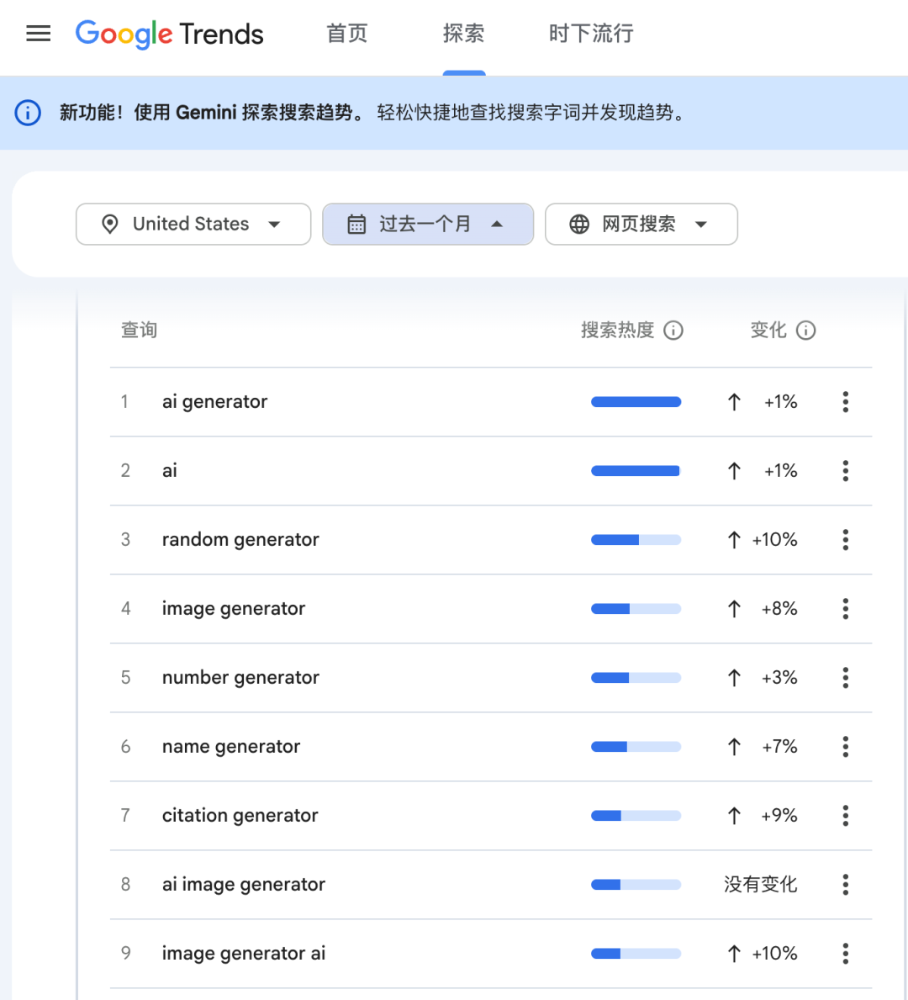

搜索出来的结果涉及到Generator这个词近期一个月都在增长，说明流量还是可以的。

我发现random generator这个词增长率还不错，然后打开Google进行搜索random generator这个词，分析一下竞品网站。

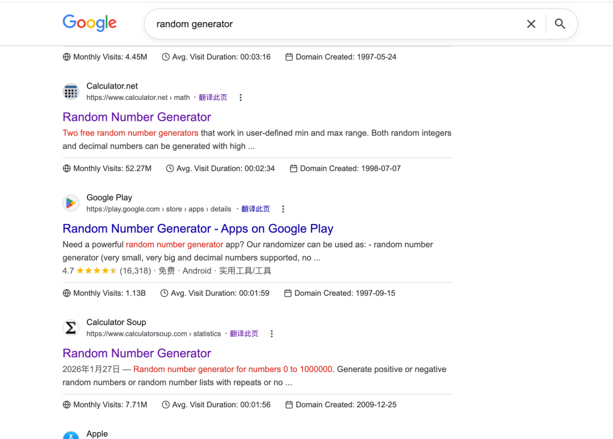

我们打开搜索出来的竞品网站，这里我们会用到“AITDK SEO”浏览器插件，这个需要你提前在Chrome中先安装这个插件。

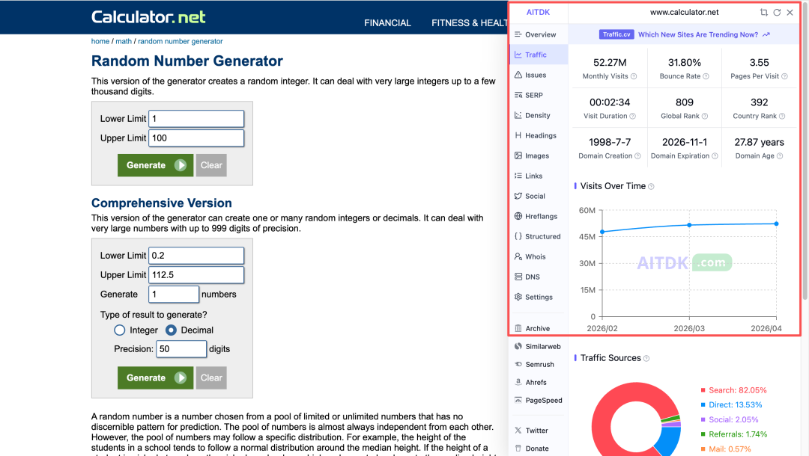

通过这个插件可以分析竞品站点，分析发现这个网站月访问量竟然高达 52.27M，也就是5227 万，流量相当恐怖，靠广告费直接赚翻了。

除了这个网站，接着往下翻会发现随机颜色生成器、随机字母生成器、随机密码生成器这些网站比较多，而且流量也相当不错。

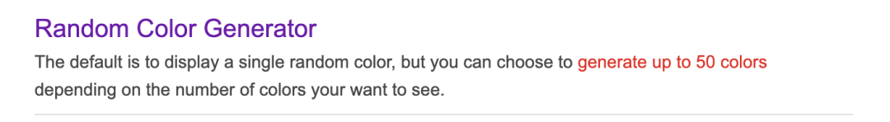 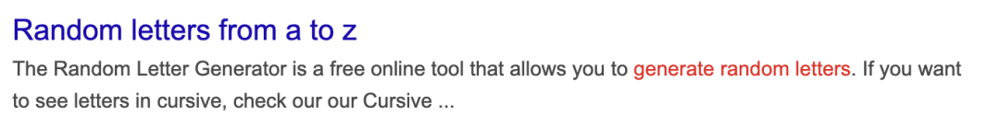

既然这类随机生成器流量都不错，我索性直接做一个randgenerator随机生成器，把这些都包含进去，哈哈。

## 第二步：域名购买

域名可以去Cloudflare或者spaceship官网购买，我更倾向spaceship，因为它支持支付宝付款，Cloudflare需要绑定信用卡：Visa、MasterCard、American Express 等，你们可自行选择。

接着我们打开spaceship官网搜索域名，我本来想购买randgenerator.io，但是价格竟然要217.62元，有点贵，索性就挑一个便宜的吧，randgenerator.com只需60块大洋，哈哈，简直为我量身定制的。

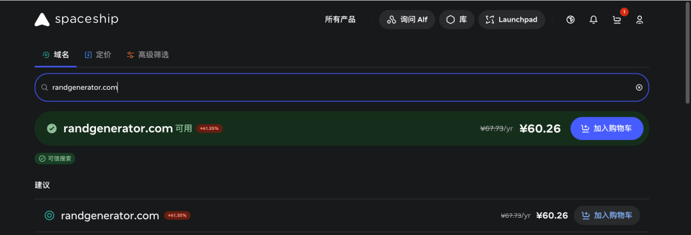

加入购物车，进行购买付款就OK了。

## 第三步：使用AI编程工具进行开发

我使用的AI编程工具是Trae，大家可以用Cursor、Codex都可以，开发工具都大差不差，哪个用的习惯就用哪个。

打开Trae编程工具，在右侧对话框输入提示词

```markdown
你现在是一名专业的web开发工程师，需要开发一款纯前端工具网站（不用写后台、不用存数据），面向国外用户，整个网站都是英文。10个功能工具（每个工具一个单独页面）：随机数字、随机颜色、随机密码、模拟抛硬币、模拟掷骰子、随机选择、随机分组、随机英文名、随机用户名 / 游戏 ID、随机字母输出要求：1. 给我完整项目文件，目录清晰；2. HTML 分开输出，每个工具一个页面；3. 共享一套样式 css 和交互 js；4. 代码干净、可直接运行；
```

大概等一段时间，网站就开发完成了，如果哪里不满意你自信再跟AI对话进行调整，直到你满意为止。

网站完成之后，最重要的来了，那就是SEO优化了。

我整理了SEO优化清单：

- 创建 sitemap.xml - 帮助搜索引擎索引
- 创建 robots.txt - 控制爬虫访问
- 优化所有页面的 Meta Description - 提高点击率
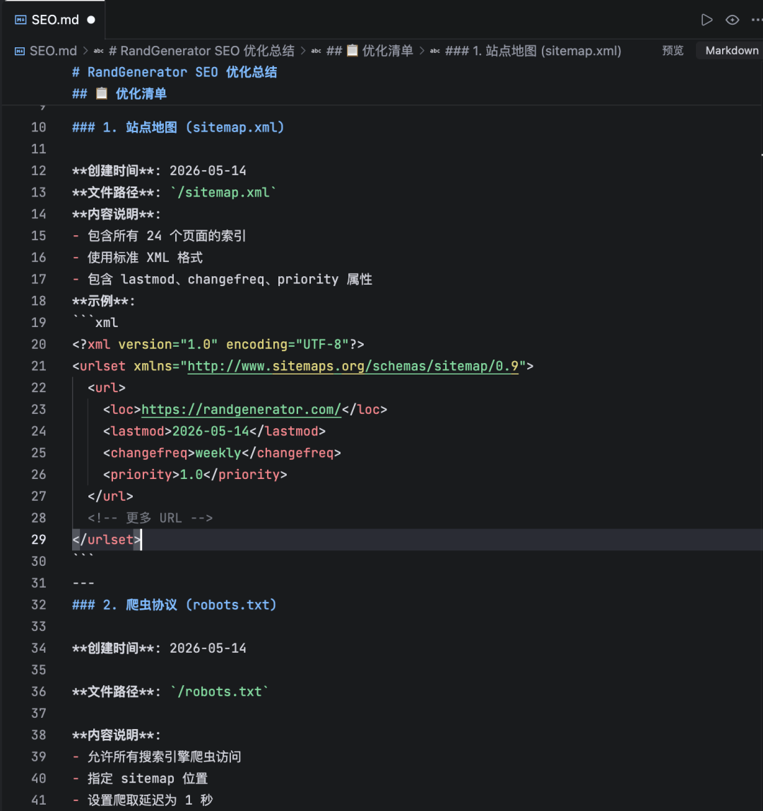

可以再结合AI，让它给优化。

## 第四步：web网站上线部署

代码可以上架到Vercel或者GitHub（这两个都是免费的，让你节省了购买服务器的费用和https证书的成本，前提是必须注册 Vercel 或者GitHub 账号），我把代码推送到了Vercel上面。

如果你也使用 Vercel CLI，那么具体步骤：

步骤 1：安装 Vercel CLI

```css
npm install -g vercel
```

步骤 2：登录 Vercel

```nginx
vercel login
```

步骤 3：部署项目

```bash
cd /Users/Desktop/randomvercel
```

步骤 4：配置部署

按照提示回答问题：

```bash
Set up and deploy "~/Desktop/random"? [Y/n] 输入：YWhich scope do you want to deploy to? Your Name你的名称Link to existing project? [y/N]  输入：NWhat's your project's name? randgeneratorIn which directory is your code located? ./Want to modify the settings? [y/N]  输入：NDo you want to change additional project settings? 输入：N
```

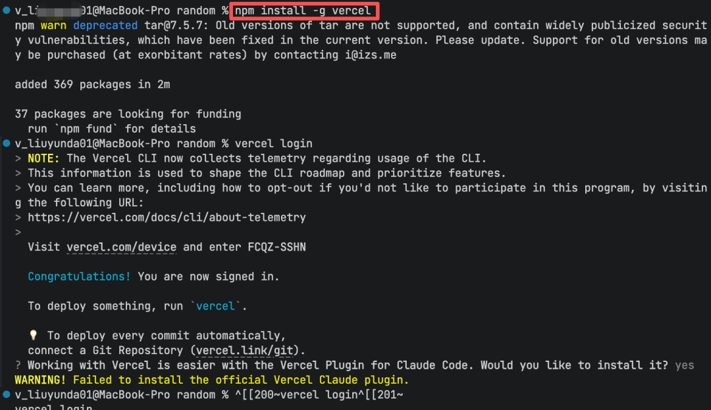

步骤 5：完成部署

```makefile
Production: randgenerator-umber.vercel.app
```

步骤 6：配置 DNS 记录

在 Vercel 中添加域名

- 1\. 进入项目设置 → Domains
- 2\. 输入你的域名： randgenerator.com
- 3\. 点击 Add 并保存
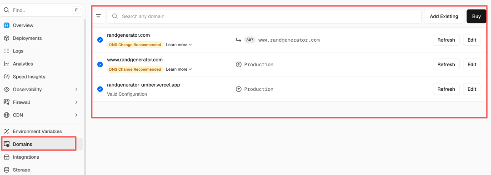

步骤 7：配置 DNS 记录

你的域名注册商（spaceship）中添加DNS 记录

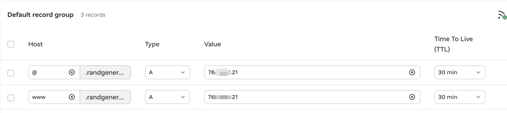

Vercel 会自动配置 Let's Encrypt SSL 证书，通常需要 5-10 分钟生效。

到这里你的海外web站部署完成了，现在可以去访问你的网站了。

这是我最终的效果，域名地址：https://www.randgenerator.com 欢迎大家体验。

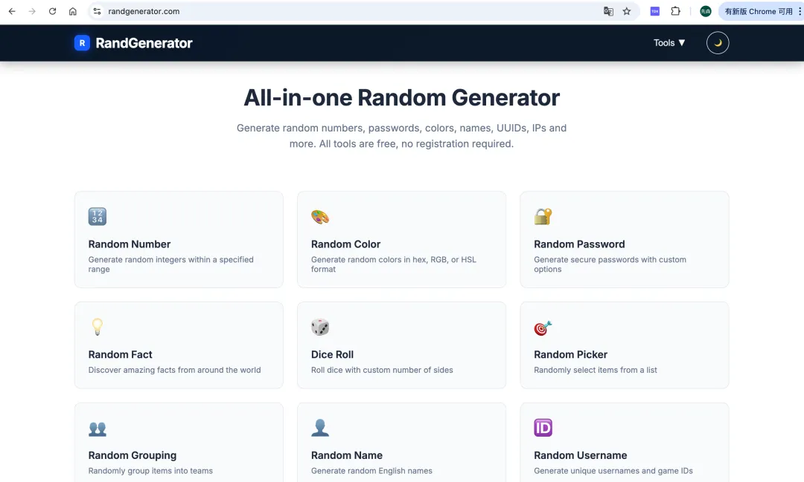

## 最后说两句：

算下来，做个海外工具站，你只需要花一笔域名费。服务器、HTTPS 证书，Vercel/Netlify 全给你免费搞定。AI 编程直接把建站门槛打穿了，感兴趣的朋友真的可以上手试试。

我是鹏远，关注我，持续分享更多AI编程实战玩法。

作者提示: 个人观点，仅供参考

继续滑动看下一个

鹏远r

向上滑动看下一个
