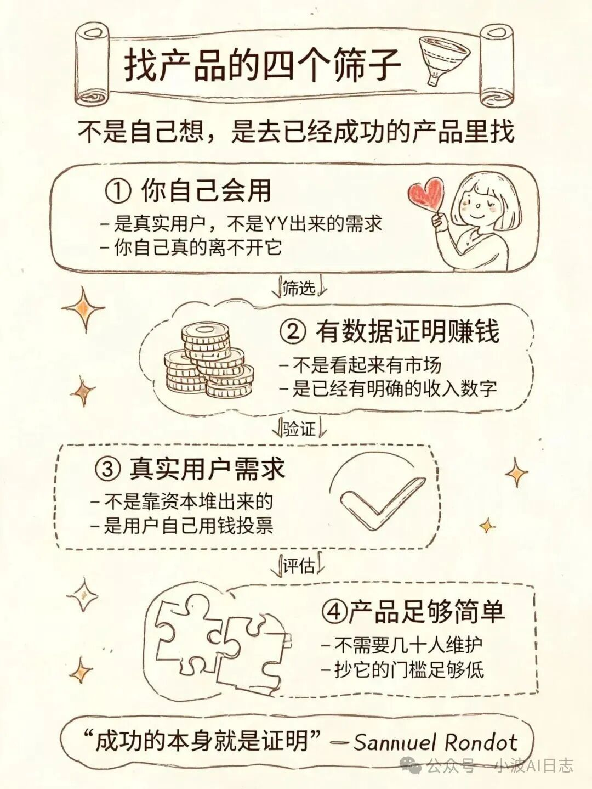
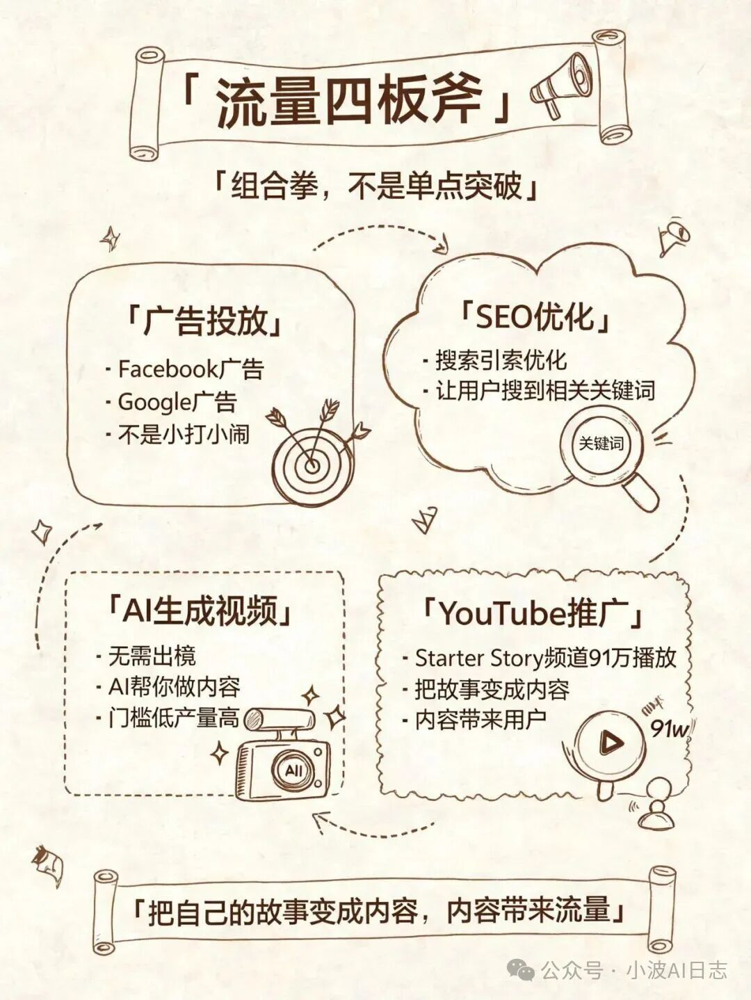
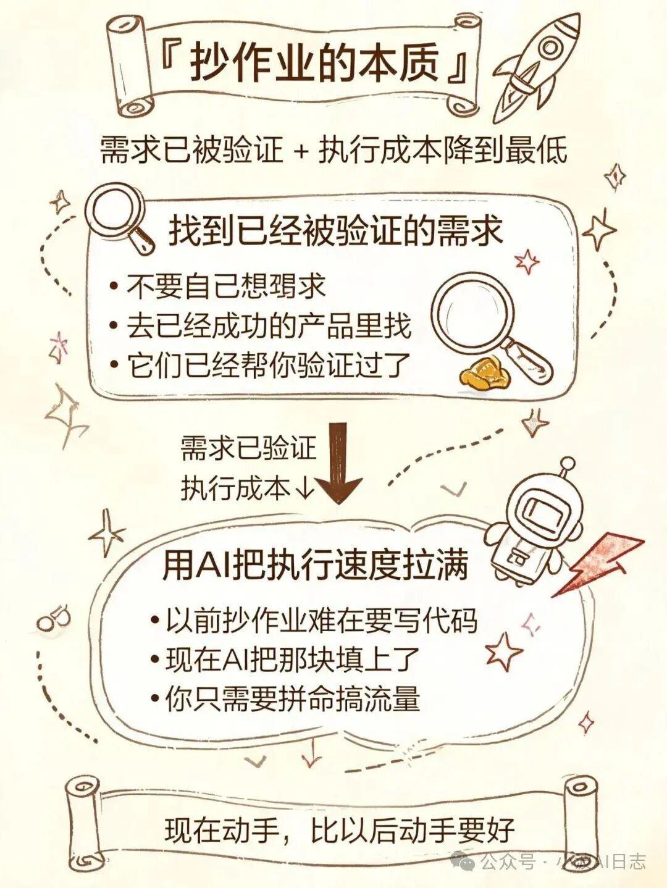

# 不创新只复制：靠"抄作业"月入 3.5 万美金的老外

原创 小波Ai日志 *2026年5月4日 20:30*

前几天刷到一个视频。

主角叫 Samuel Rondot ，法国人，之前是验光师——就是那种给你配眼镜、让你看那个"E"字开口朝哪儿的。

然后他辞职了。自学编程。用 AI 写代码。做了三个 SaaS 产品。每个月大概有 3.5 万美金进账。

3.5 万刀！一个月……

这不是什么融资千万的独角兽故事，也不是"用 AI 做了一个产品然后被收购"的爽文。

就是一个普通人。做着普通的工作。然后，靠着一套"抄作业"的方法论，叠加上 AI 编程的红利，硬生生做起来了。

他自己在视频里是这么概括这套方法的：

> "One, find an app that's working. And two, make it 1% better."

找到已经跑通的产品，然后把它做得再好 1%。就这一句话，解释了他的整个商业模式。

## 一个验光师，怎么想到去"抄作业"

Samuel 之前在法国干验光师。干了多久不知道，反正干了挺久的。

他不是程序员出身。没有 CS 学位。代码是后来自己学的。

学的途径也很简单——看 YouTube 。

然后有一天，他决定不干了。辞职。

接下来就是关键的部分了：他想做产品。但不知道怎么找 idea 。

他的思路很野：

**不要自己想。去已经成功的产品里找** 。

具体怎么找？他在视频里原话说了"Here are my four keys filter"：

> "Number one, I will use it myself."

你自己得是这个产品的真实用户。不是 YY 出来的需求，是你自己真的天天在用。

> "Number two, I can see that it already works."

有数据证明它赚钱。不是"看起来有市场"，是已经有明确的收入数字。

> "And three, they are not spending thousand on marketing, meaning there is a true demand."

这个需求不是靠钱砸出来的，是用户自己用钱投票的。他特别强调：如果一个产品还在大手笔投营销，那需求可能是被钱堆出来的，不是真实的。

> "And four, the product is simple enough to maintain."

产品要足够简单。如果复杂到需要几十个人维护，抄它的门槛就太高了。

这四个条件同时满足，他才动手。

说实话，这个思路挺反直觉的。很多人做产品喜欢说"我要做一个没人做过的"、"我要开辟一个新赛道"。 Samuel 的思路完全相反—— **已经有成功案例了，我为什么还要从零摸索** ？

他的原话是："If it's already successful, I know it's validating."

成功的本身就是证明。证明这个需求真实存在。证明这个市场可以赚钱。你要做的，只是在已经被验证的路上，跑得更快一点。

## 靠 AI 编程，速度起飞

Samuel 能做到这一点，关键原因是 **AI 编程工具的成熟** 。

他在视频里反复提到这个红利：

> "use AI coding tools. And with AI today, you can use so many AI coding tools... It's the fastest way to validate and test the market."

翻译过来就是：以前抄作业这个策略玩不转，是因为你得从头写代码。现在 AI 把这块填上了，你不需要重新发明轮子，只需要把轮子拿过来，改装一下，加上自己的小改进，然后推出去。

**Samuel 的三个产品，就是这么来的** 。

## 他的流量四板斧

产品做出来了，下一步是搞流量。

Samuel 在视频里原话说了他的打法：

> "One start with ads. Two build SEO as soon as there's traction, three use faceless YouTube channel to drive attention on also on Tik Tok and Instagram. And four run an affiliate program to boost virality."

四步，拆开来看：

**第一步：广告投放** 。

Facebook 、 Google 广告。他的第一个产品，流量几乎全部来自 Facebook 广告。他看到那个产品已经在跑、有数据了，才决定投入。

**第二步： SEO** 。

他的原话是：

> "SEO takes time, but once it works, it's almost free traffic and it compounds."

SEO 需要时间，但一旦跑起来，流量是免费的、复利的。他把这形容为"compounds"——像复利一样，越积越多。

**第三步：无需出镜的 AI 视频** 。

他在视频里专门提到一个案例：一个人做了一套工具，专门帮人自动发布"无面孔"的视频到 YouTube 、 TikTok 。一开始他觉得很疯狂，但数字确实很夸张。

Samuel 自己也在用这套打法——faceless YouTube channel 。不是那种露脸拍视频的 YouTuber ，是用 AI 生成内容来做推广。

**第四步：分销（ Affiliate Program ）** 。

他说："And four run an affiliate program to boost virality."

他的三个产品都在跑分销，靠分销伙伴帮他扩散。

视频发在 Starter Story 频道， 91 万播放， 28935 个点赞。这是他整个流量闭环里很重要的一块——把自己的故事变成内容，内容带来流量。

## 抄作业的本质是什么

Samuel 这套玩法的本质，剥开来看，其实就两句话：

**第一：找到已经被验证的需求** 。

他的核心逻辑："If it's already successful, I know it's validating."

不要自己想需求。去已经成功的产品里找。它们已经帮你验证过了。你只需要判断这个需求是否还活着、是否还有空间。

**第二：用 AI 把执行速度拉满** 。

他原话："It's the fastest way to validate and test the market."

以前抄作业难，是因为你得从零开始写代码。现在 AI 把这块填上了。你可以把更多精力放在产品改进和流量获取上，而不是死磕代码。

这两件事加在一起，就是 Samuel 方法论的核心： **需求已经被验证的 + 执行成本降到了最低** 。

剩下的，就是拼命搞流量。

## 窗口期可能真的在收窄

Samuel 说现在的人"非常幸福"，因为 AI 编程提升了作战速度。

这话我信。但我也有一点自己的判断想说：

这个窗口期，可能没有想象中那么长。

说实话，我是有点慌的。不是为别人慌，是为自己——我身边已经有人在动手了，等这波人跑出来，机会就没了。

AI 编程工具越来越好用，越来越多的人会涌入这个赛道。"抄作业"这个策略，一旦涌入了足够多的人，就会变得拥挤。

当你在 Product Hunt 上看到一堆界面相似、功能相近的产品的时候，你就知道"抄作业"的窗口在收窄。

**这时候才入场的人，压力只会越来越大** 。

Samuel 现在能靠这个跑出来，有一个重要原因：他入场足够早。他用这套方法论的时候，市场还没有那么卷。

现在呢？不确定。

但有一点是确定的： **如果你想用 AI 编程做产品，现在动手，比以后动手要好** 。不是说以后没机会，是以后的竞争烈度会更高。

Samuel 说他靠三个产品每月稳定营收 $35k 。这个数字对于一个非 CS 背景、靠 YouTube 自学编程的人来说，已经相当可以了。

他没有融资。没有投资人。没有技术团队。

就他一个人，加上 AI 工具，加上他的流量打法。

这个路径能不能复制？不好说。但他提供的思路——找到已经被验证的产品，用 AI 把执行速度拉满，然后拼命搞流量——对于想用 AI 编程做点什么的人来说，是个可以参考的框架。

剩下的，就是你自己去试了。

关注小波每天20.30带来最热Ai资讯

继续滑动看下一个

小波AI日志

向上滑动看下一个
