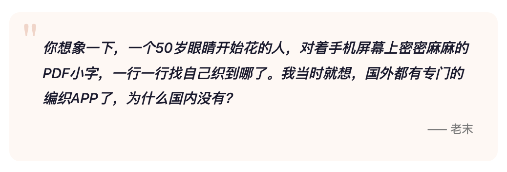
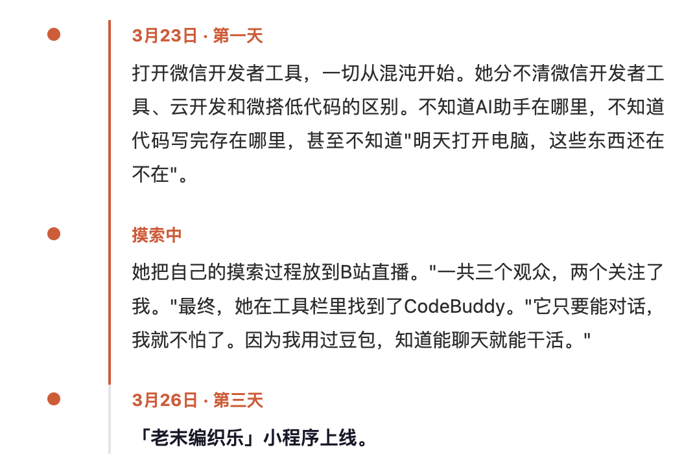
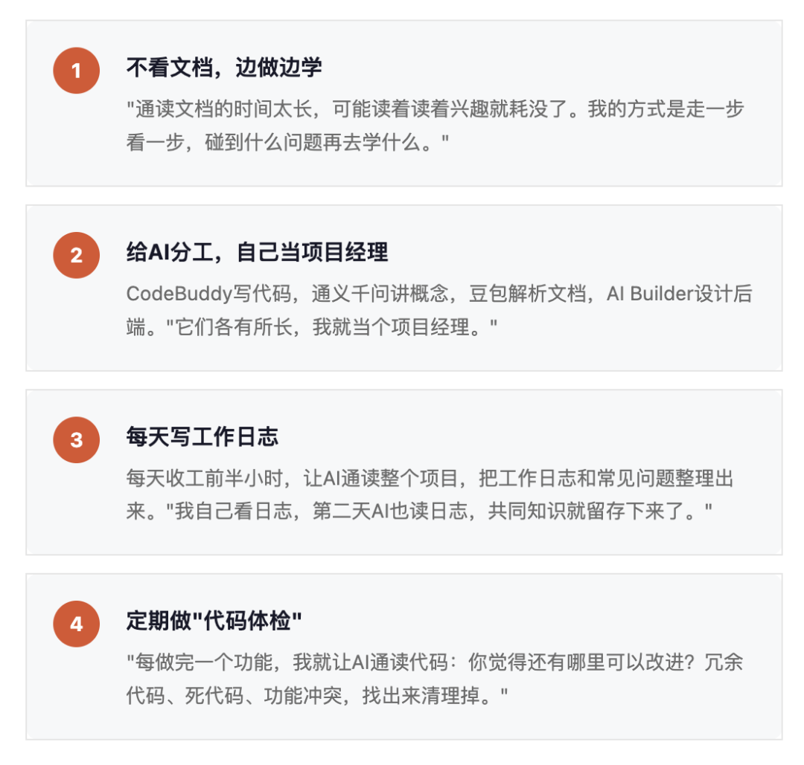
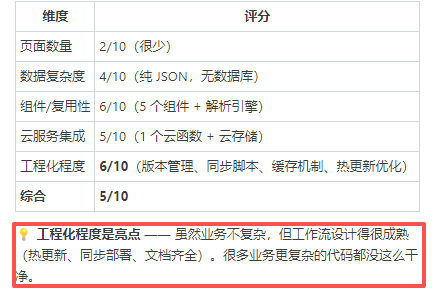
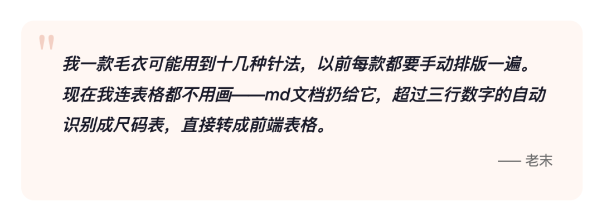
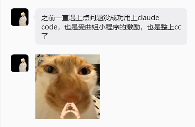
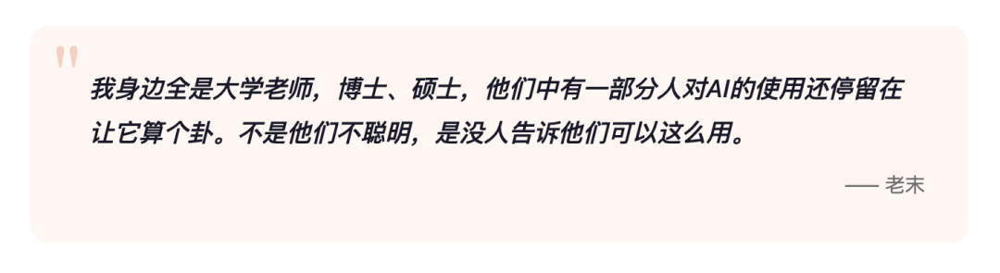
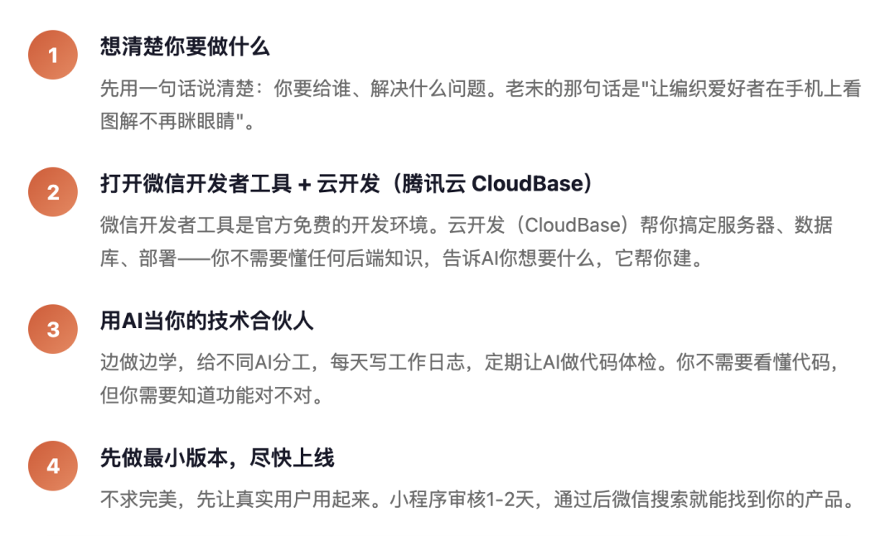

# 51岁，3天做出一个小程序，影响一万人

原创 云开发团队 *2026年4月17日 11:31*

关于这个故事

一位自嘲是51 岁的「朝阳大妈」，从没写过一行代码。因为热爱编织、受够了手机上看PDF图解的痛苦，她决定自己做一个小程序。从打开微信开发工具到小程序上线，只用了3天。这是她的真实经历。

←左右滑动 老末说真人才真实→

## 什么行业都干过，就是没干过代码

老末今年51岁，75年生人，大兴安岭人。

在这之前，她的人生履历里没有任何一行跟代码有关：商场服务员、迪卡侬销售、外企建材业务员、行政助理、小饭桌老板、少儿培训讲师——用她自己的话说，"什么行业都干过"。

疫情期间闲在家里，别人追剧、学烘焙，老末的选择是——考研。

问题是，她连大学都没读过。高中毕业后直接进入社会，一路北漂。决定考研时才发现：得先有本科学历。于是她报了自学考试，一边自考本科一边备考研究生。一志愿报的北京师范大学，差了6分，最终被天津理工大学录取。全日制统考，跟一群二十出头的年轻人坐在同一间教室。英语从小学三年级水平起步，最后考了66分。

2025年毕业，拿到了国际中文教育专业硕士学位。

## 爱好里长出来的需求

老末喜欢编织——不是那种"闲着没事打个围巾"的喜欢，是认真钻研针法、买国外原版图解、在编织圈里泡了好几年的喜欢。

织毛衣需要看图解——一种标注了针法、尺码和编织步骤的技术文档。国内的图解大多翻译自国外网站，做成PDF格式出售，几块钱一份。

这不是一个程序员在找项目做。而是一个深度用户在忍无可忍之后，想自己解决问题。

她太清楚编织爱好者需要什么了——哪些针法最常用、图解哪里最容易看错、尺码换算有多烦人——这些需求洞察，是任何一个不编织的技术团队都不可能凭空想出来的。

她四处搜索，没找到合适的产品。又去问了做开发的朋友，报价"好几万"。

放弃了一段时间。直到她在关注的技术公众号上看到一个说法：零代码基础也能用AI做开发。

"求人不如求己。"

在过去，老末的想法会永远停在"想法"阶段——不是因为她不够坚定，而是因为技术这道门槛太高了。但2026年的工具环境已经变了！

## 3天，从零到上线

男朋友担心她玩AI 上瘾影响身体健康，给了她一个deadline："三天做不出来，就别做了。" 意外的是，她做出来了。

## 她的方法：像带新员工一样用AI

老末的开发方式，专业程序员听了可能觉得"不按套路"，但它确实有效。而且她最强的地方不是是学技术的速度——而是她真正理解用户要什么。

## 最得意的不是界面，是后端

问老末最满意小程序中的什么功能，她的回答出乎意料："后端。"

她在腾讯云CloudBase的数据库里建了一个针法库，把编织中用到的所有针法（约50种）统一编码存储。每次开发新款式时，只需要输入三个字母的针法代码，系统就自动从云端抓取对应的针法说明和图解。

"1是1，但2就等于N了。"

这套"弹药库"的设计逻辑不是来自某个技术教程，而是来自她作为编织爱好者多年积累的分类直觉——哪些针法是基础的、哪些是组合的、怎么编号最好记。AI帮她把脑子里的分类体系变成了代码，但分类体系本身，只有她这样的深度玩家才能设计出来。

· · ·

## 在小红书爆了

老末把开发小程序的过程分享到小红书，意外获得了1万+浏览和 1k +点赞。

评论区让她惊喜：

还有她的计算机专业的学弟，在她的小程序上线后受到的鼓励：

## 给同路人的话

老末现在每天花2-3小时在小程序开发上，节奏从最初的"8小时连轴转"慢慢调整到了可持续的状态。下一步计划是开发小游戏，还有面向文科生的AI使用课程。

她说AI编程给她带来两种愉悦感：一种是从无到有的创造快感——"你什么都不懂，但东西做出来了"；另一种是智力提升的满足——"当你设计出一套自动化规则，那种感觉，是另一个层面的认知升级。"

"百谋不如一勇，干就完了"

"你不用怕犯错，错了就推倒重来。AI不会嘲笑你，你问多小白的问题它都认真回答。老末在CloudBase Builder 上第一句话问的是'能做小程序吗'——最后我真的做出来了。"

## 如果你也想试

老末的故事不是孤例。如果你也有一个「只有自己才能想到」的产品想法，下面是她验证过的路径——不需要任何编程基础，只需要一台电脑和你的想法。

| 你担心的事 | 腾讯云 CloudBase + AI 怎么解决 |
| --- | --- |
| 不会搭服务器 | CloudBase自带，不用你管 |
| 不会写后端代码 | 用中文描述需求，AI帮你写 |
| 不会部署上线 | 开发工具一键上传，自动部署 |
| 数据库不会设计 | 告诉AI你的数据长什么样就行 |
| 没钱买服务器 | CloudBase有免费额度，初期零成本 |

老末的故事说明了一件正在发生的事：工具已经不再是技术瓶颈了。

CloudBase让部署和后端变成了几次点击的事，AI让代码编写变成了用中文说需求的事。当这两道门槛被拉平，真正决定谁能做出好产品的，不再是"你会不会写代码"，而是"你有没有一个真实的、你深刻理解的需求"。

老末有。因为她织了好几年毛衣。

下一个做出好产品的人，可能是一个烘焙爱好者，一个钓鱼发烧友，一个桨板教练，一个宠物美容师——任何一个在自己热爱的领域里泡得足够深的人。

技术从来不是稀缺的
有想法的人才是

在官方用户群里看到老末的时候，她正在兴冲冲跟大家分享她的AI编程心得。希望更多有不同领域的AI Coding你，也能多多分享，欢迎投稿！

CloudBase 一人公司扶持计划持续进行时，点击「阅读原文」报名参加。

云开发最佳实践 · 目录

阅读原文

继续滑动看下一个

腾讯云开发CloudBase

向上滑动看下一个
