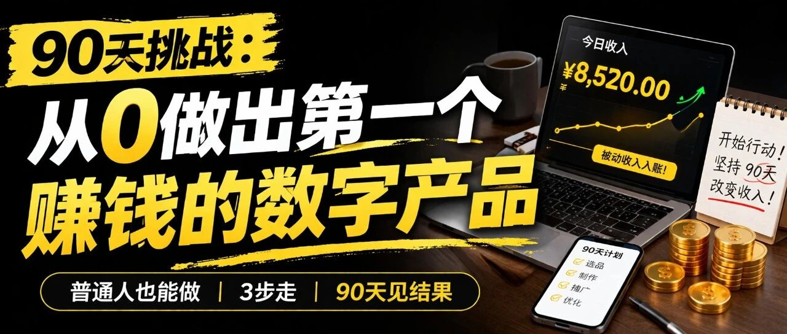
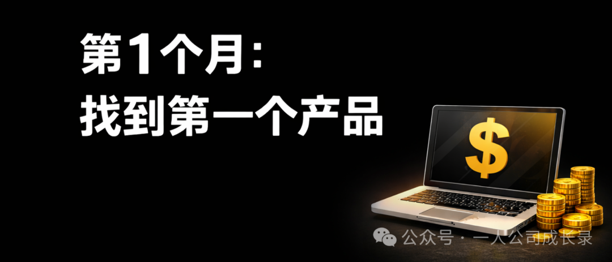
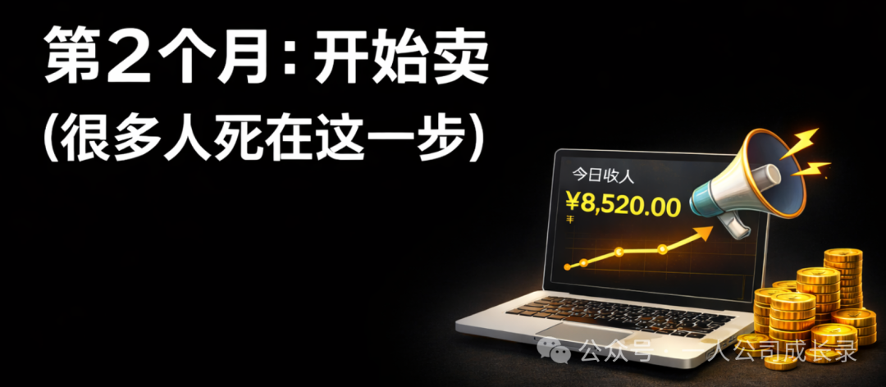
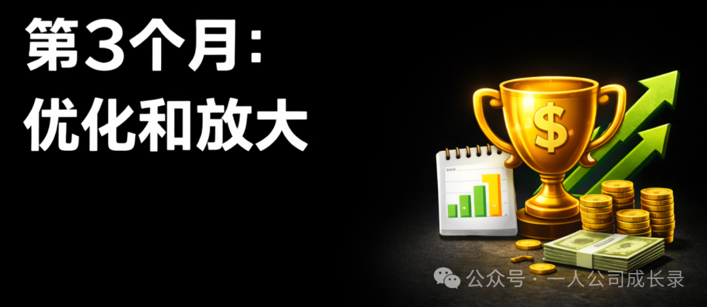

# 90天，从0做出第一个赚钱的数字产品（普通人也能做到）

原创 夜雨微凉 一人公司成长录 *2026年4月4日 16:44*

**如果给你90天，让你认真做一件事，你觉得能不能改变收入？**

很多人其实都试过“做副业”。
但现实是这样的：

做了一个产品 → 发了几条朋友圈 → 一周没卖出去 → 放弃
然后安慰自己：
“市场太卷了，这不适合我。”

问题不是方法不行，是 **你坚持的时间太短了。**

我见过太多人，只要坚持做满90天，事情就开始变了：

你会第一次收到订单提醒
甚至半夜醒来，发现有人付款了
你开始意识到——原来真的可以不靠时间换钱

这，就是数字产品的魅力。

---

## 🧠 为什么是数字产品？

很多人一开始会走这几条路：

### 1️⃣ 做服务（接单/咨询）

确实能赚钱，但本质是：
👉 **继续卖时间**

你能赚多少，取决于你有多少时间
一旦停下来，收入也就停了

---

### 2️⃣ 做电商（卖实物）

听起来很美，但现实是：

- 要压货
- 要发货
- 利润低
- 还可能退货

👉 对新手来说，门槛其实很高

---

### 3️⃣ 做低佣金推广

比如卖实体产品，佣金3%–10%

👉 卖1000块，只赚几十
👉 非常累，还赚不到钱

---

## ✅ 数字产品的优势（重点）

为什么我更推荐数字产品？

因为它几乎是目前 **最轻资产的赚钱方式** ：

- 不需要库存
- 不需要发货
- 利润接近100%
- 可以重复卖
- 可以自动交付

👉 简单说一句：

> 做一次，可以卖无数次

---

## 🎯 那普通人怎么开始？

我给你一条非常清晰的路径： **90天三步走**

---

## 📅 第1个月：找到你的第一个产品

## 很多人卡在这里：

👉 “我没有技能”

其实不是你没有，而是你没意识到：

- 你会写东西
- 你会做PPT
- 你会时间管理
- 你会某个工作流程

这些都可以变成产品。

---

## ✅ 从最简单开始：

不要一上来做课程，先做这些：

- PDF指南
- 模板
- 小工具包
- 15分钟微课程

👉 核心只有一个：

**帮别人解决一个具体问题**

---

## 💡 怎么验证有没有人要？

不要瞎猜，直接去问：

- 你的朋友
- 你的同事
- 你的社交圈

问他们：

👉 最近最困扰你的是什么？
👉 有没有愿意花钱解决的问题？

---

👉 第1个月目标只有一个：

> 做出一个“可以卖的东西”，哪怕很简单

---

## 📅 第2个月：开始卖（很多人死在这一步）

## 产品做好 ≠ 会赚钱

你必须做一件事：

👉 **持续曝光**

---

## ✅ 正确做法：

- 把产品发到你的朋友圈
- 发到社交媒体
- 不断重复讲它的价值

---

很多人犯的错误是：

❌ 发2次就不发了
❌ 不好意思卖

但现实是：

> 你不说，没人知道你在卖

---

👉 这个阶段的目标：

> 拿到前5–10个订单

只要有人愿意付钱，你就已经赢了。

---

## 📅 第3个月：优化和放大

## 当你开始有订单之后，重点就变了：

👉 **不是做更多，而是做更好**

---

## 你要做三件事：

### 1️⃣ 优化产品

问每个用户：

- 哪里有用
- 哪里不够好

不断调整

---

### 2️⃣ 提高客单价

比如：

- 主产品：50元
- 加一个升级版：99元
- 或附加包：19元

👉 同一个客户，多赚一倍

---

### 3️⃣ 让用户帮你卖

给他们佣金，让他们推荐

👉 这一步一旦跑通，就是“自动增长”

---

## ⚠️ 很多人会有的3个顾虑

---

## ❌ 1：市场太卷了

其实：

👉 有竞争 = 有需求

用户不会只买“最便宜的”，
他们会买：

> **最能理解他们的人**

---

## ❌ 2：我不会技术

现在的工具已经很简单了：

- 不需要会写代码
- 不需要建网站

👉 用现成工具就能完成

---

## ❌ 3：我没有粉丝

这是最大的误解。

👉 你不需要很多粉丝
👉 你只需要：

**第一批愿意买的人**

---

## 🚀 最后想说一句

90天不会很快，也不会很慢。

问题不是时间，
是你会不会真的去做。

---

很多人卡在“看懂了”，
但始终没有“开始”。

---

👉 你可以继续刷内容
👉 也可以开始做第一个产品

如果你已经看完这篇文章，其实只需要做一件事：

👉 今天，把你会的东西列出来
👉 选一个，做成最简单的产品

---

不要等完美。

> 先做出来，再优化。

---

**90天后，时间一定会过去。
区别是：你有没有结果。**

继续滑动看下一个

一人公司成长录

向上滑动看下一个

一人公司成长录
